Sigrid extension for Visual Studio Code
=======================================

This extension lets you view and manage findings in [Visual Studio Code](https://code.visualstudio.com).

SIG offers two types of IDE integration:

**The [Sigrid MCP](integration-sigrid-mcp.md) is IDE integration for AI coding assistants.** It lets your AI
coding assistant find quality issues in your code and fix them. It also gives an immediate feedback loop where 
you receive quality feedback as you're working on the code.

**The Visual Studio Code extension is an IDE extension "for humans".** It focuses on viewing and managing Sigrid
findings from within your IDE. In particular, it lets you do the following:

- **Navigate Sigrid findings in your IDE.** This allows for faster and more familiar code navigation than having to
  navigate your code and findings in Sigrid itself.
- **Show Sigrid findings for the code you're currently working on.** This makes it easier to take those findings 
  into consideration and apply [the boy scout rule](https://deviq.com/principles/boy-scout-rule/) when working on
  those files.
- **Triage findings.** Changing a finding's status and adding remarks directly from your IDE makes it faster and
  more convenient when you need quickly triage large numbers of findings.
- **Jump back-and-forth between Sigrid and your IDE.** When needed, you can quickly jump from the finding information
  in your IDE to viewing the finding details in Sigrid.
- **Create Jira or Azure DevOps issues from findings.** Narrow down a large list of findings by risk level or status, or search across all findings using the search bar.

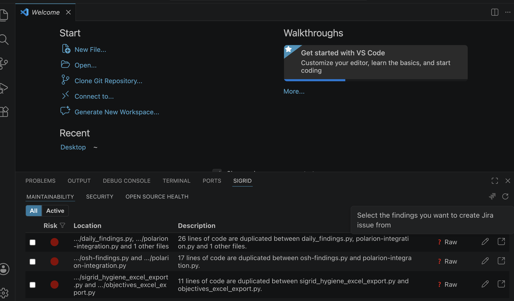

## Installing the extension

You can install the Sigrid extension directly from the Visual Studio Code Marketplace.
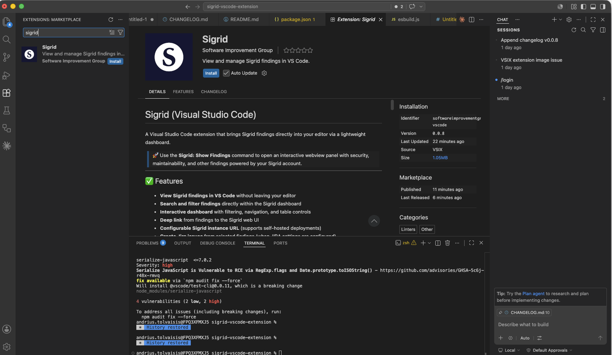

- Open Visual Studio Code.
- Click the **Extensions** icon in the left-hand menu.
- Search for **"Sigrid"** in the search bar.
- Click **Install**.

Alternatively, you can install it directly from the [Sigrid extension page](https://marketplace.visualstudio.com/items?itemName=softwareimprovementgroup.sigrid-vscode) in the Visual Studio Code Marketplace.

## Configuring the extension

Before you can use the extension, you will first need to provide your Sigrid credentials.

- Open the settings menu in Visual Studio Code.
- In the list of settings, select "Extensions".
- In the extensions sub-menu, select "Sigrid".
- Enter your Sigrid customer name and system name.
- You will also need to add your [authentication token](../organization-integration/authentication-tokens.md).
- If you are using on-premise Sigrid, you will also need to enter your on-premise URL. If you are using
  cloud-based Sigrid, this is not needed.

## Using the extension

The Sigrid extension is not visible by default. You can open it using the *"> Sigrid: Show findings"* command.
When opened, the Sigrid extension contains multiple tabs, one for each Sigrid capability.

- Double-clicking on a finding will navigate you to the location of that finding in the code.
- Using the "open" icon in the right-hand side will open the corresponding Sigrid finding detail page in your
  default browser.
- The pencil icon allows you to edit a finding's status and add remarks.

## Filtering and searching findings

When working with a large number of findings it can be hard to focus on what matters most. You can narrow
down the findings list using the filter controls and the search bar at the top of the panel.

**To filter by risk level**, click the filter icon (▽) next to the **Risk** column header. A dropdown appears with the risk levels available in your current findings — for example Very High, High, or Medium. Only options that exist in the active findings table are shown.
Select one or more risk levels to show only findings that match. Deselect to remove the filter.

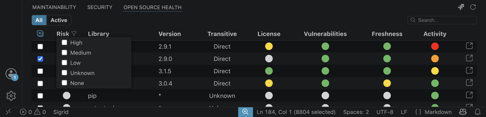

**To filter by status**, click the filter icon (▽) next to the **Status** column header. A dropdown appears
with the available statuses, such as Raw, Accepted, and False Positive.

**To search across all findings**, use the **search bar** in the top-right corner of the panel. The list
updates in real time as you type.You can combine risk, status, and search filters at the same time.

## Creating Jira issues from findings

You can create Jira issues directly from Sigrid findings without leaving Visual Studio Code. This is especially useful if your Jira instance is behind a firewall and cannot be reached from Sigrid directly, because the request is made from your IDE, it uses your own network access.

### Setting up Jira integration

Before you can create issues, you need to configure your Jira credentials. Open VS Code settings (`Cmd+,`
on Mac, `Ctrl+,` on Windows), search for "Sigrid", and scroll down to fill in the following fields:

| Setting | Description | Example |
|---|---|---|
| **Jira Base URL** | The root URL of your Jira instance | `https://jira.example.com` |
| **Jira User** | Your Jira username or email address | `j.smith@example.com` |
| **Jira Token** | Your Jira personal access token | *(keep this private)* |
| **Jira Space Key** | The key of the Jira project where issues will be created | `AAP` |

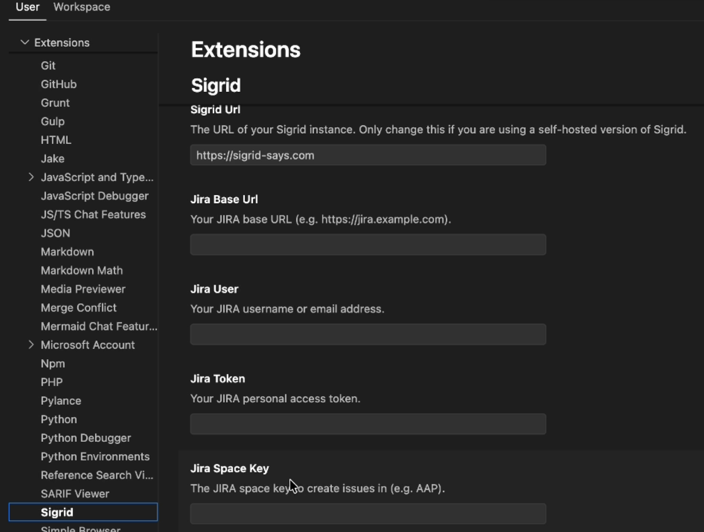

### Creating an issue

In the findings list, **check one or more findings** using the checkboxes on the left of each row.
   You can select findings across different tabs (for example, a mix of Maintainability and Security findings). Once at least one finding is selected, a tooltip appears confirming your selection and the
   **"Create Jira issue"** button becomes active above the list.

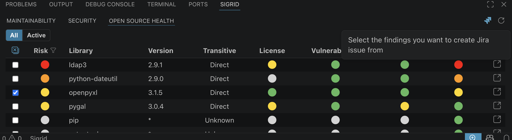

Click the button. A **"Create JIRA Issue"** dialog appears where you can enter a title for the issue.
   The dialog also shows how many findings are selected.

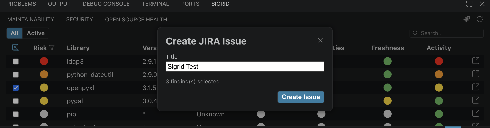

Click **Create Issue**. The extension calls your Jira instance and creates the issue. A confirmation notification appears at the bottom-right of the panel showing the issue ID (for example, *"JIRA issue created: SCRUM-5"*) with an **"Open in Browser"** button to view it directly in Jira.

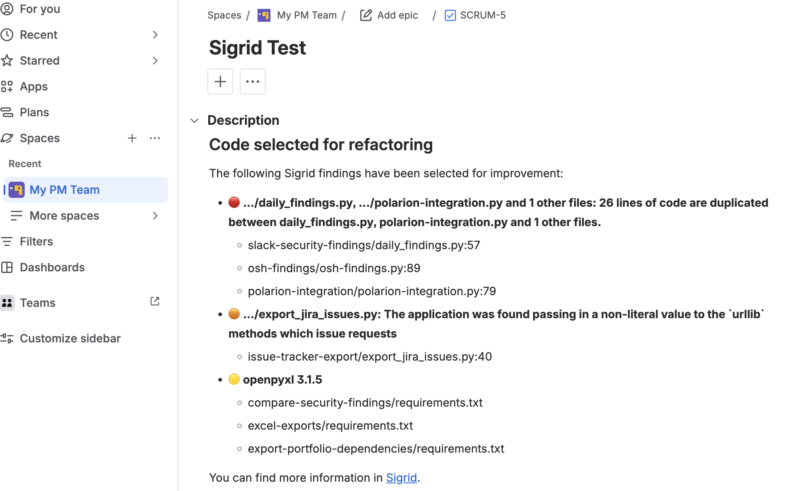

## Creating Azure DevOps work items from findings

As an alternative to Jira, you can create Azure DevOps work items directly from Sigrid findings without leaving Visual Studio Code. As with the Jira integration, the request is made from your own IDE, so this also works if your Azure DevOps organization is behind a firewall and not reachable from Sigrid directly.

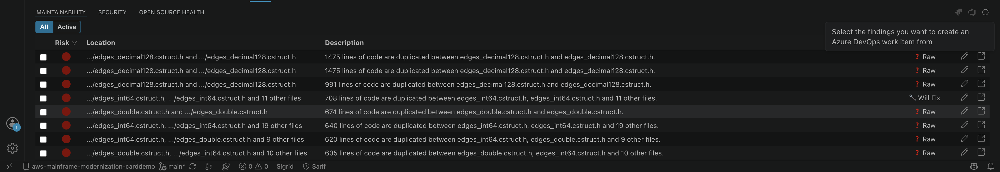

### Setting up Azure DevOps integration

Before you can create work items, you need to configure your Azure DevOps credentials. Open VS Code settings (`Cmd+,` on Mac, `Ctrl+,` on Windows), search for "Sigrid", and scroll down to fill in the following fields:

| Setting | Description | Example |
|---|---|---|
| **Azure DevOps Organization URL** | The URL of your Azure DevOps organization | `https://dev.azure.com/yourorganization` |
| **Azure DevOps Personal Access Token** | A personal access token with **Work Items (Read & write)** scope | *(keep this private)* |
| **Azure DevOps Project Name** | The name of the Azure DevOps project where work items will be created | `SigridTest` |

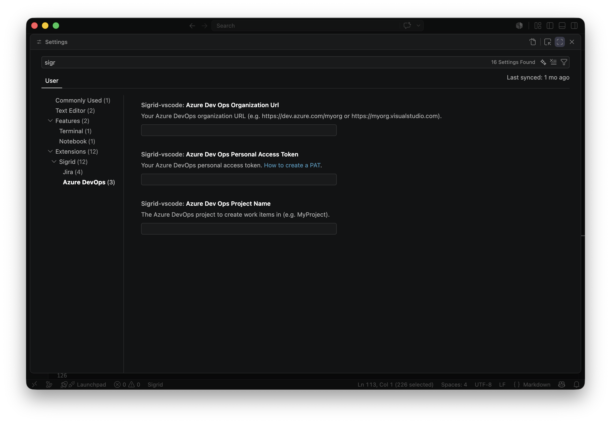

You can generate a personal access token from your Azure DevOps organization under **User settings > Personal access tokens > New Token**.

### Creating a work item

Select one or more findings using the checkboxes in the findings list, the same way you would for a Jira issue. With at least one finding selected, use the **"Create Azure DevOps work item"** button above the list.

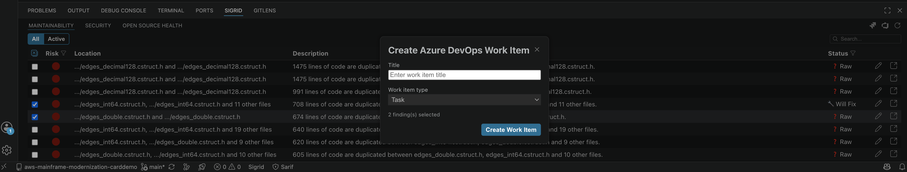

A dialog opens where you can enter a title and choose the **work item type** from a dropdown. The available types depend on the process template your Azure DevOps project uses — for example, a Scrum project offers Task, Bug, Feature, Impediment, and Product Backlog Item. The extension automatically generates a description that lists the selected findings and links back to each finding in Sigrid. Some work item types support an additional **Repro Steps** field; the extension detects whether this field is available for the type you chose and includes it automatically when supported.

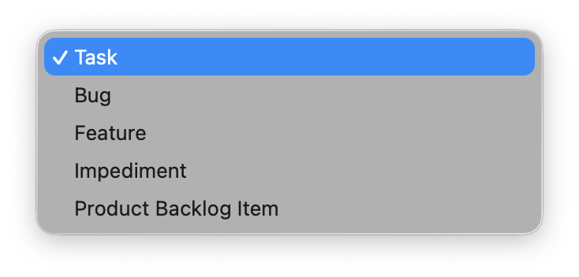

Click **Create**. The extension calls your Azure DevOps organization and creates the work item. A confirmation notification appears showing the work item ID, with a link to open it directly in Azure DevOps.

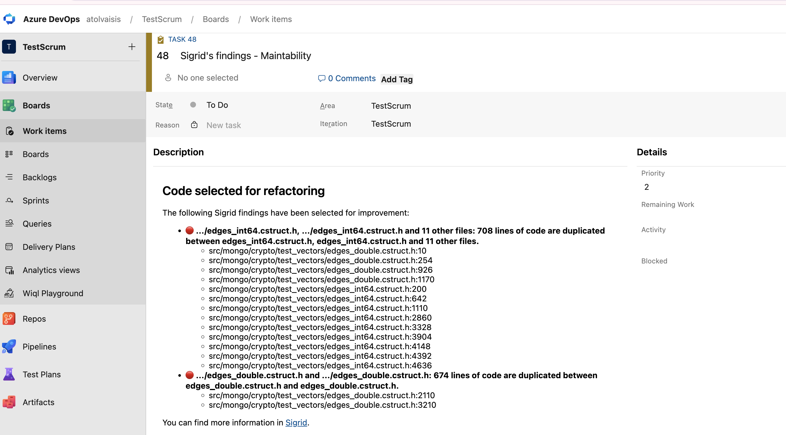

## Contact and support

Feel free to contact [SIG's support team](mailto:support@softwareimprovementgroup.com) for any questions or issues 
you may have after reading this documentation or when using Sigrid.
