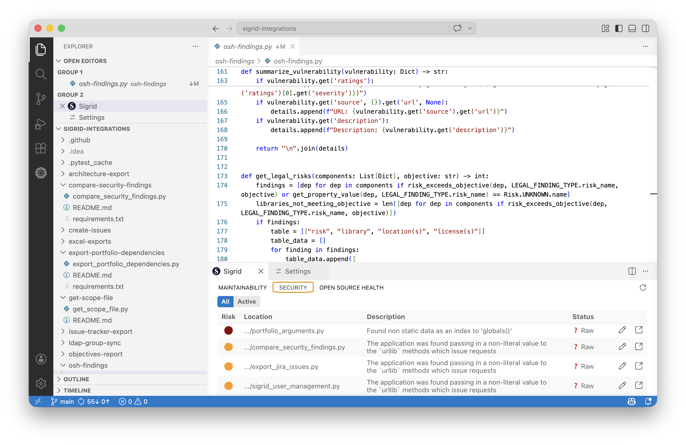
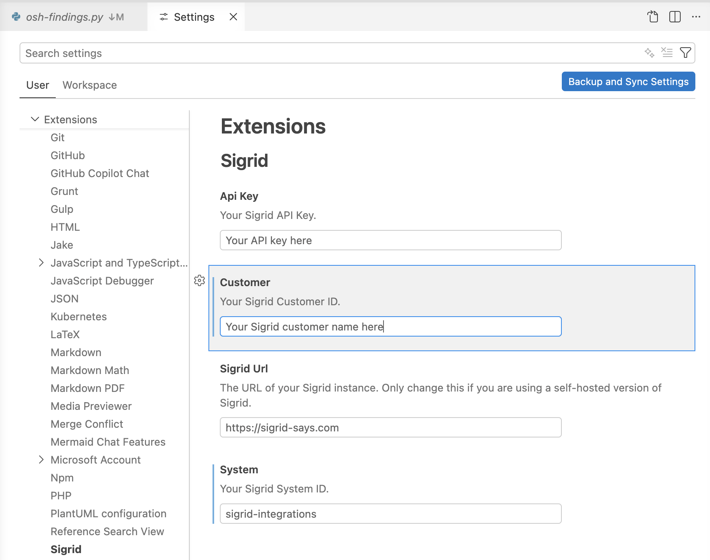
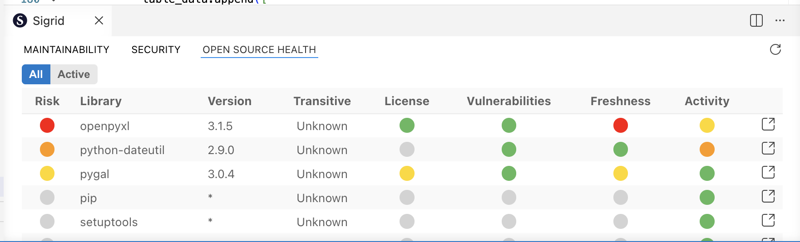

Sigrid extension for Visual Studio Code
=======================================

This extension lets you view and manage findings in [Visual Studio Code](https://code.visualstudio.com).

SIG offers two types of IDE integration:

**The [Sigrid MCP](integration-sigrid-mcp.md) is IDE integration for AI coding assistants.** It lets your AI
coding assistant find quality issues in your code and fix them. It also gives an immediate feedback loop where 
you receive quality feedback as you're working on the code.

**The Visual Studio Code extension is an IDE extension "for humans".** It focuses on viewing and managing Sigrid
findings from within your IDE. In particular, it lets you do the following:

- **Navigate Sigrid findings in your IDE.** This allows for faster and more familiar code navigation than having to
  navigate your code and findings in Sigrid itself.
- **Show Sigrid findings for the code you're currently working on.** This makes it easier to take those findings 
  into consideration and apply [the boy scout rule](https://deviq.com/principles/boy-scout-rule/) when working on
  those files.
- **Triage findings.** Changing a finding's status and adding remarks directly from your IDE makes it faster and
  more convenient when you need quickly triage large numbers of findings.
- **Jump back-and-forth between Sigrid and your IDE.** When needed, you can quickly jump from the finding information
  in your IDE to viewing the finding details in Sigrid.

## Installing the extension

During the Beta phase, you will need to install the extension from GitHub. Once the extension is released, you
will be able to install the extension from the Marketplace.
{: .attention }

- You can find the Beta version of the extension [on GitHub](https://github.com/Software-Improvement-Group/sigrid-vscode-extension).
- Download the latest Beta release from the GitHub project's releases section.
- In Visual Studio Code, select the "Extensions" screen in the left-hand menu.
- Click the "..." button located in the top-right of the menu called "extensions". This button is located above
  the search field marked "search extensions in marketplace".
- Click "install from VSIX".
- Select the file you downloaded from GitHub.

## Configuring the extension

Before you can use the extension, you will first need to provide your Sigrid credentials.

- Open the settings menu in Visual Studio Code.
- In the list of settings, select "Extensions".
- In the extensions sub-menu, select "Sigrid".
- Enter your Sigrid customer namd and system name.
- You will also need to add your [authentication token](../organization-integration/authentication-tokens.md).

## Using the extension

The Sigrid extension is not visible by default. You can open it using the *"> Sigrid: Show findings"* command.
When opened, the Sigrid extension contains multiple tabs, one for each Sigrid capability.

- Double-clicking on a finding will navigate you to the location of that finding in the code.
- Using the "open" icon in the right-hand side will open the corresponding Sigrid finding detail page in your
  default browser.
- The pencil icon allows you to edit a finding's status and add remarks.

## Contact and support

Feel free to contact [SIG's support team](mailto:support@softwareimprovementgroup.com) for any questions or issues 
you may have after reading this documentation or when using Sigrid.
