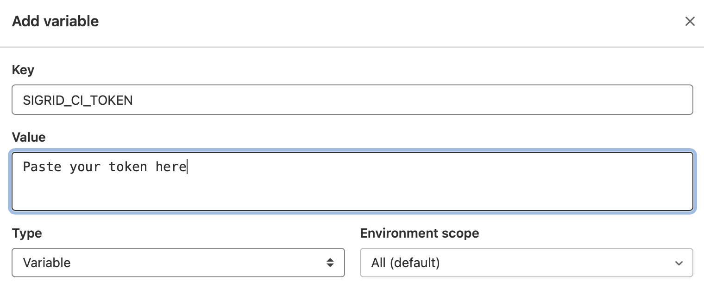

Integrating QSM Sigrid with Mendix on a Gitlab server
==============================================

Please note: `QSM` is the brand name used by Mendix, in this manual we will use `Sigrid`.

## Prerequisites

- You are not using the default Mendix teamserver, but you are using your own Git server for version control of your projects.
- You would like to trigger the Sigrid analysis from within your own pipeline in Git.
- Your runners are able to pull this [public docker image](https://hub.docker.com/r/softwareimprovementgroup/mendixpreprocessor), the image is used to preprocess the Mendix code before uploading it to Sigrid.
- You have a [Sigrid](https://qsm.mendix.com) user account. 
- You have created an [authentication token using Sigrid](authentication-tokens.md).
- You have created a Personal access (PAT) token using [warden.mendix.com](https://warden.mendix.com)

## On-boarding your system to Sigrid

On-boarding is done automatically when you first run Sigrid CI. As long as you have a valid token, and that token is authorized to on-board systems, you will receive the message *system has been on-boarded to Sigrid*. Subsequent runs will then be visible in both your CI environment and [sigrid-says.com](https://sigrid-says.com). 

## Configuration

**Step 1: Configure both the Sigrid credential and the Mendix PAT to environment variables**

Sigrid CI reads your credentials from 2 environment variables called `SIGRID_CI_TOKEN` and `MENDIX_TOKEN`. 
To add these to your GitLab CI pipeline, follow these steps:

- Select "Settings" in your GitLab project's menu
- Select "CI/CD" in the settings menu
- Locate the section named "Variables"
- Click the "Add variable" button
- Add an first environment variable `SIGRID_CI_TOKEN` and use your [Sigrid authentication token](authentication-tokens.md) as the value.
- Add an second environment variable `MENDIX_TOKEN` and use this Mendix app [warden.mendix.com](https://warden.mendix.com) to create a PAT with 'mx:modelrepository:repo:read' access only.




These instructions describe how to configure a single GitLab project, but you can follow the same steps to configure the entire GitLab group, which will make the environment variables available to all projects within that group.

**Step 2: Create pipeline configuration file for Gitlab**

We will create a pipeline that consists of two jobs:

- One job that will publish the main branch to [sigrid-says.com](https://sigrid-says.com) after every commit to main.
- One job to provide feedback on pull requests, which can be used as input for code reviews.


In the root of your repository, create a file `.gitlab-ci.yml` and add the following contents:


```
stages:
 - report

variables:
  SIGRID_CI_CUSTOMER: 'examplecustomername'
  SIGRID_CI_SYSTEM: 'examplesystemname'

sigridci:
  image: 
    name: softwareimprovementgroup/mendixpreprocessor:latest
  variables:
    SIGRID_CI_TARGET_QUALITY: '3.5'
  stage: report
  script: 
    - ""
  allow_failure: true
  tags:
    - run_docker
  except:
    variables:
      - $CI_COMMIT_REF_NAME == $CI_DEFAULT_BRANCH

sigridpublish:
  image: 
    name: softwareimprovementgroup/mendixpreprocessor:latest
  variables:
    SIGRID_CI_PUBLISH: 'publishonly'
  stage: report
  script:
    - ""
  allow_failure: true
  tags:
    - run_docker
  only:
    variables:
      - $CI_COMMIT_REF_NAME == $CI_DEFAULT_BRANCH

```

Note the name of the branch, which is `main` in the example but might be different for your repository. In general, most older projects will use `master` as their main branch, while more recent projects will use `main`. 

Finally, note that you need to perform this step for every project where you wish to use Sigrid CI. Be aware that you can set a project-specific target quality, you don't necessarily have to use the same target for every project.

The output consists of the following:

- A list of refactoring candidates that were introduced in your merge request. This allows you to understand what quality issues you caused, which in turn allows you to fix them quickly. Note that quality is obviously important, but you are not expected to always fix every single issue. As long as you meet the target, it's fine.
- An overview of all ratings, compared against the system as a whole. This allows you to check if your changes improved the system, or accidentally made things worse.
- The final conclusion on whether your changes and merge request meet the quality target.

In addition to the textual output, Sigrid CI also generates a static HTML file that shows the results in a more graphical form. This is similar to test coverage tools, which also tend to produce a HTML report. Use the "download" button in the pipeline details screen to download the report. The information in the HTML report is similar to the command line output, though it includes slightly more detail.


Finally, if you want to have more information on the system as a whole, you can also access [Sigrid](http://sigrid-says.com/), which gives you more information on the overall quality of the system, its architecture, and more.

## Contact and support

Feel free to contact [SIG's support department](mailto:support@softwareimprovementgroup.com) for any questions or issues you may have after reading this document, or when using Sigrid or Sigrid CI. Users in Europe can also contact us by phone at +31 20 314 0953.

