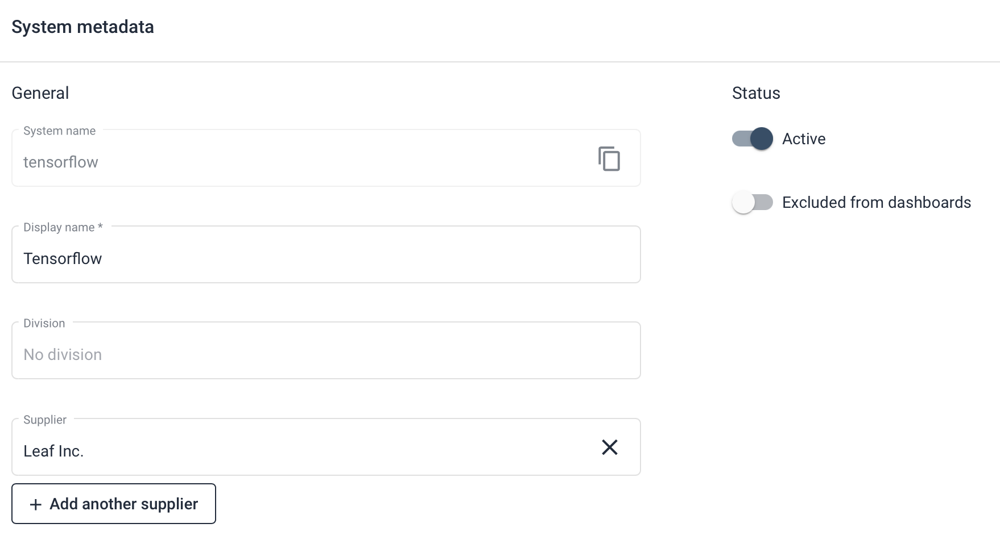

Adding business context to a system using metadata
==================================================

Adding business context to Sigrid makes it easier to interpret the results. For example, a below-market average maintainability rating of 2 stars might seem like a problem, but this depends entirely on the context. If the system is no longer actively maintained and will be decommissioned by the end of the year (i.e., its lifecycle phase is end-of-life, or EOL for short), such a rating might be perfectly acceptable. But if that system is new, uses a modern technology, and is business critical, such a rating would be considered a red flag. In both cases the technical conclusion is identical, it's the context that determines the urgency.

This context information is called *metadata* in Sigrid. Adding metadata can be done in 4 different ways:

### Option 1: Adding metadata in Sigrid

This is by far the simplest approach: in Sigrid, simply go to the system settings option in the menu and select the "metadata" option. 



Note the screenshot only shows part of the metadata page, the full page contains significantly more options than what is displayed here.

### Option 2: Using the Sigrid API to add metadata

The [Sigrid API end point for metadata](../reference/sigrid-api-documentation.md#system-metadata) allows you to add metadata programmatically. This is less accessible than using the Sigrid user interface, but has the advantage that it can run automatically. This is typically used when you need to synchronize metadata from another system to Sigrid, and you want this to run in an automated way.

### Option 3: Adding metadata from a YAML file in your repository

As an alternative to using the API, you can also create a YAML file called `sigrid-metadata.yaml` in the root of your repository. The contents of this file are then used to update the metadata when the analysis runs. This is similar to using the API, but allows you to manage your Sigrid metadata as part of the repository in your version control system.

The following examples shows an example of a `sigrid-metadata.yaml` file:

```
metadata:
  displayName: "MyBank back-end"
  divisionName: "My division"
  teamNames:
    - "My Team"
  supplierNames:
    - "Supplier 1"
    - "Supplier 2"
  lifecyclePhase: EOL
  inProductionSince: 2012
  businessCriticality: HIGH
  targetIndustry: ICD9530
  deploymentType: PUBLIC_FACING
  applicationType: ANALYTICAL
  externalID: ab12345
  isDevelopmentOnly: false
  remark: "Some notes"
```

The [Sigrid API documentation](../reference/sigrid-api-documentation.md#system-metadata) contains descriptions of the various fields. Note that the semantics are the same: only fields present in `sigrid-metadata.yaml` are updated, others are left as-is. For example, the following `sigrid-metadata.yaml` file would _update_ the external ID and remove the current remark:

```
metadata:
  externalID: "ab12345"
  remark: null
```

The contents of the YAML file will be used to update the metadata whenever you publish your system to Sigrid. If you run Sigrid CI *without* publishing, i.e. when you run it for a branch or pull request, the metadata does *not* get updated. This ensures that publishing code and publishing metadata behave in a consistent way.

### Option 4: Adding metadata via Sigrid CI parameters

Metadata can also be configured by passing the metadata values as parameters when running Sigrid CI. This will dynamically generate the YAML file from option 3, but does not require you to commit this YAML file to your repository. 

- For all platforms, you can define environment variables to the Sigrid CI run. The name of the environment variables is the lowercase version of the metadata fields listed above. For example, defining the `applicationType` field in the YAML is equivalent to defining an environment variable named `applicationtype` as a Sigrid CI parameter.
- When using the Sigrid CI GitHub Action published to GitHub Marketplace, you can also provide these fields as input parameters instead of environment variables. The names are again lowercase, so the input parameter would be named `applicationtype`.

Note you can use the YAML file or environment variables, but not both. 

## Contact and support

Feel free to contact [SIG's support department](mailto:support@softwareimprovementgroup.com) for any questions or issues you may have after reading this document, or when using Sigrid or Sigrid CI. Users in Europe can also contact us by phone at +31 20 314 0953.
