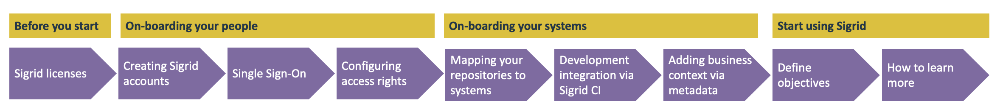

# How to set up Sigrid

### Before you start

- **Sigrid licenses:** Sigrid supports multiple capabilities, such as Security or Architecture Quality. However, you may not have access to all licenses. Depending on your Sigrid license, there may be sections in this documentation that refer to functionality that is not visible in "your" Sigrid. If you're not sure on your Sigrid license, you're always welcome to check with [SIG's support team](mailto:support@softwareimprovementgroup.com).

### On-boarding your people

- **Creating Sigrid accounts:** You can create Sigrid accounts in different ways. You can find more information on what approach is best for your organization in the [user management](usermanagement.md) section.
- **Single Sign-On:** Integrating Sigrid with your identity provider via SSO (Single Sign-On) will allow your people to access Sigrid using their "normal" work email and password. This is more convenient for users, as they don't need to remember a separate password for Sigrid. It is also more secure, as it means Sigrid users will be part of your organization's central user management. Instructions for how to integrate Sigrid with your identity provider can be found in the [user management page](usermanagement.md).
- **Configuring access rights:** You can also use Sigrid's [user management](usermanagement.md) to control what every user is allowed to see. This depends on your organization: some organizations prefer maximum transparency where everyone can see the entire portfolio. Other organizations tend to be more closed, and restrict access to only the systems someone is actually working on. 

### On-boarding your systems

- **Mapping your repositories to systems:** Sigrid splits your software portfolio into *systems*. There is no single answer on what view is "best", this depends on your organization. Generally, developers and architects will prefer a view that directly matches the technical reality, so that Sigrid aligns with their repositories. A more aggregated, high-level view is generally more suited to management since it tends to more closely align to business applications. This therefore requires some discussion between the different stakeholders to determine what Sigrid view would be most suitable for your organization. Find out more on [how Sigrid supports different mappings between your portfolio and systems](systems.md).
- **Uploading your source code to Sigrid:** The best and recommended way is to integrate Sigrid into your development environment using Sigrid CI, as explainined in the next bullet. However, Sigrid also supports alternative channels for [uploading source code](upload-instructions.md).
- **Development integration via Sigrid CI:** Integrating Sigrid into your development environment serves two purposes. First, it will publish your systems to Sigrid after every change, ensuring Sigrid is always-up-to-date and removing the need for manual uploads. Second, it allows you to provide your development teams with direct feedback after each change. Sigrid supports integrations with 10+ different development environments. Use the "Sigrid CI" section in the menu to find instructions and documentation for your environment. You can also find instructions on how to [create authentication tokens](authentication-tokens.md) that will allow you to set up this integration.
- **Adding business context via metadata:** Managing software quality is not only driven by technical goals. The system's business context matters: a legacy system which will be decommissioned next year will have less ambitious goals than a greenfield project. Sigrid allows you to [define metadata](metadata.md) that can be combined with the system's technical context to help you determine it's true health.

### Start using Sigrid

- **Define objectives:** It is unrealistic to target perfection for every single system. Sigrid therefore uses *objectives*. This allows you to define what type of goals are realistic for each system, taking both their business context, technical context, and team into consideration. Find out more in [how to define objectives](../capabilities/objectives.md)
- **How to learn more:** The remainder of this documentation covers Sigrid's various workflows, use cases, and capabilities in more detail. You can use the menu on the left to navigate to explore the documentation.

## Contact and support

Feel free to contact [SIG's support team](mailto:support@softwareimprovementgroup.com) for any questions or issues you may have after reading this documentation or when using Sigrid.
