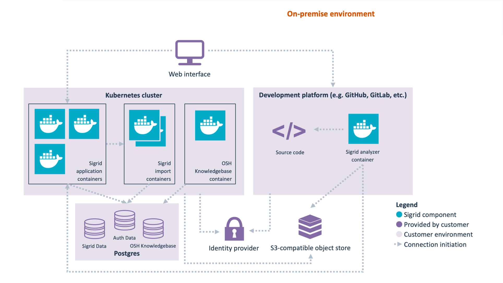
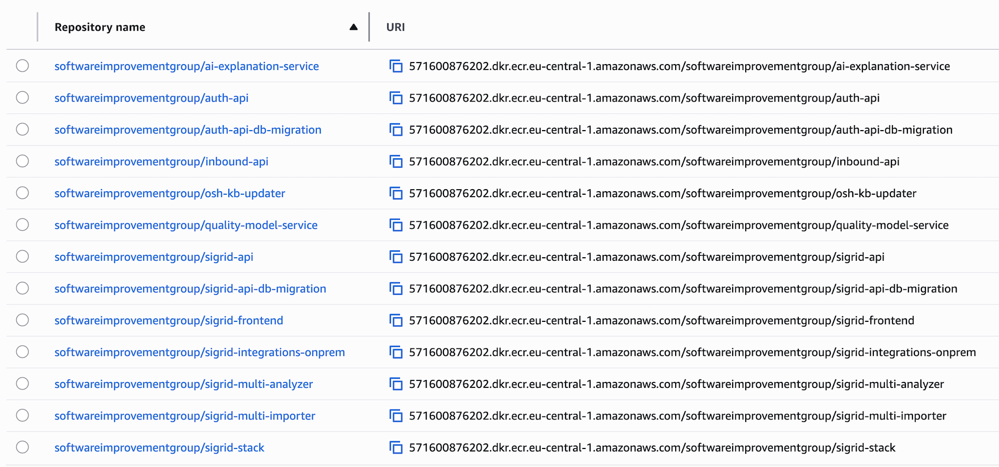

# Sigrid On-Premise Integration

This documentation covers on-premise Sigrid. It is not applicable for cloud-based Sigrid.
{: .attention }

This document covers everything you need to integrate Sigrid On-Premise in your environment. It also covers the functional differences between the SaaS version and the on-premise version, though these differences are relatively minor.

## High-level overview

From a deployment perspective, on-premise Sigrid consists of two "parts":

- **Sigrid** is the Sigrid web application, which you access from your browser.
- **Sigrid-Multi-Analyzer** runs within your development platform (e.g. GitHub). It performs the analyses and then publishes the results to Sigrid.

- Sigrid On-Premise is based on [Docker containers](https://en.wikipedia.org/wiki/Docker_%28software%29). There are two types of containers:
  - Application containers that should be deployed permanently in a [Kubernetes](https://en.wikipedia.org/wiki/Kubernetes) cluster, based on a [Helm chart](https://helm.sh) that is provided by SIG.
  - Analysis containers that run from a build pipeline within your development platform.
- SIG provides the necessary images through a container registry. The section [obtaining Sigrid on-premise](#obtaining-sigrid-on-premise) contains more information on how you can obtain and update these Docker containers.
- Authentication is based on your identity provider, using [OpenID Connect](https://openid.net/developers/how-connect-works/). Alternatively, [SAML](https://en.wikipedia.org/wiki/SAML_2.0) or [LDAP](https://en.wikipedia.org/wiki/Lightweight_Directory_Access_Protocol) are also supported, through [Dex](https://dexidp.io/).
- Analyses are triggered from a build pipeline. The analysis results are then imported into a Postgres database, so they can be viewed in Sigrid.
- Large files are stored in an [S3-compatible object store](https://aws.amazon.com/s3/).

Some Sigrid On-Premise features are *optional*:

- The Open Source Health feature requires enabling the OSH knowledge base updater cronjob on Sigrid (see [here](onpremise-osh-knowledgebase-updater.md)). This service imports vulnerability data from the OSH knowledge base Docker container into Sigrid. The rest of Sigrid remains fully functional even if OSH is not enabled.
- When viewing detailed analysis results, Sigrid displays relevant source code files within Sigrid. For this to work, a web-accessible code storage needs to be available. This integrates with Sigrid via [OAuth](https://oauth.net/2/). For this to work, the identity provider used for Sigrid authentication and for the code storage needs to be the same. For viewing source code within Sigrid, you need to provide a development platform that is integrated with the same identity provider as Sigrid itself. The view source functionality is optional, without this integration the rest of Sigrid is unaffected.

## Prerequisites

Before deploying Sigrid On-Premise, ensure your environment meets the following prerequisites.

### Platform & Infrastructure
- Your infrastructure supports running applications on **Kubernetes**.
- You can run and manage a **PostgreSQL** database service.
  - Sigrid requires PostgreSQL, including a set of standard PostgreSQL extensions.
  - Several Linux distributions distribute PostgreSQL extensions in a separate package, even the extensions listed in the official PostgreSQL documentation. For that reason, we require that you install the PostgreSQL extensions as well; typically by installing a package named `postgresql-contrib` via your package manager.
  - You are able to maintain and update PostgreSQL according to the version policy in this documentation.

### Container & Network Access
- You allow outbound connections to pull Sigrid container images from an AWS ECR registry.
  - Images can be pulled directly or mirrored into your own container registry.
- All required services, including Postgres, the CI/CD platform, identity provider, S3-compatible object store, and container registry, must either be within the same network as the Sigrid deployment or be able to establish reliable inbound and outbound connections with it. This ensures seamless communication and data transfer between components.

### CI/CD Integration
- You use one of the following CI/CD platforms:
  - GitHub
  - GitLab
  - Azure DevOps (cloud version only)
- Your CI/CD environment supports running Docker containers for Sigrid analyses.

### Identity & Access Management
- You have an identity provider supporting one of the following protocols:
  - OpenID Connect
  - SAML
  - LDAP

### Object Storage
- You can provide an **S3-compatible object store**.
  - Sigrid uses this object store as an intermediate storage layer for analysis results.
  - Analysis jobs (running in your CI/CD pipeline) upload their results to this storage.
  - The Sigrid platform then retrieves and imports these results into the PostgreSQL database for processing and visualization.

### Operations & Maintenance
- You are prepared to update Sigrid regularly (at least monthly).
- You can provide remote access (e.g. screen sharing) or share logs for troubleshooting if needed.

### Knowledge & Ownership
- Your platform/support team has working knowledge of:
  - Kubernetes
  - Docker
  - PostgreSQL
  - CI/CD platforms (GitHub, GitLab, or Azure DevOps)
  - Identity protocols (e.g. OpenID Connect)

## Obtaining Sigrid on-premise

The Docker containers that form Sigrid On-Premise are distributed via AWS ECR registry. You will receive an account that allows you to access the container registry. 

 

As explained above, Sigrid consists of several Docker containers. The container `sigrid-multi-analyzer` runs directly in your development platform's continuous integration pipelines, all other containers are deployed to your Kubernetes cluster. These steps are explained in more detail in the following sections.

## Installing and configuring on-premise Sigrid

As shown in the high-level overview, the on-premise version of Sigrid consists of two "blocks": The Sigrid application that is deployed within a Kubernetes cluster, and the Sigrid-Multi-Analyzer Docker container that is integrated within your development platform. 

Instructions for installing and configuring both parts are provided in the following pages:

- [Sigrid on-premise: Helm Chart configuration](onpremise-kubernetes.md)
- [Sigrid on-premise: Analysis configuration](onpremise-analysis.md)

## Updating Sigrid On-Premise to a new version

SIG releases the Sigrid Docker containers based on a [continuous delivery](https://en.wikipedia.org/wiki/Continuous_delivery) process. This means that changes are immediately released once they have successfully passed through the development process. We advise our clients on the best way to develop and operate their software, so we try to adhere to the same best practices that we recommend our clients. 

This does not necessarily mean you need to *immediately* pull the Docker containers after every release. However, you need to pull the latest versions of the Docker containers at least once a month. SIG does not provide support for versions of the Docker containers over a month old. Updating frequently reduces the "delta" between the current version and the new version, thereby reducing update risk. Once a month is merely the *minimum* update frequency, we actually recommend you update as frequently as possible.

Although Sigrid consists of several Docker containers, you will need to update them collectively. It is theoretically possible to update some containers without updating other containers, but this gets complicated very quickly and we don't recommend this way of working to our on-premise clients. So when you update Sigrid on-premise, you will need to update all Docker containers to the same version.

This also means SIG does not back-port any changes to older versions: If you want to access new features or bugfixes, you will need to update the Docker containers to the latest version. 

## Updating your environment

In addition to updating Sigrid itself, you will also need to periodically update your environment in which Sigrid runs. SIG uses the following support policy for infrastructure component versions:

- For Kubernetes, we support the latest 2 major versions. You can track the Kubernetes version history in [this overview](https://kubernetes.io/releases/).
- For Postgres, we also support the latest 2 major versions. You can track the Postgres version history in [this overview](https://www.postgresql.org/support/versioning/).

## Functional Differences and Limitations in Sigrid On-Premise

- Functional Differences:
  - Single-Tenant Architecture: The on-premise Sigrid distribution is single-tenant, which means you cannot create multiple "tenants." All systems and analyses are consolidated into a single portfolio. You can still use Sigrid's user management to assign access permissions to different users for specific systems, and organize users and system access by creating teams.
  - Source Code Publishing: You are required to run the analysis container in a development pipeline (or another Docker-capable environment) to publish your source code to Sigrid. SFTP uploads and manual uploads are not supported. For more details, read [here](onpremise-analysis.md).
  - Multi-Repo Systems: [Multi-repo systems](systems.md#sigrid-view-is-based-on-business-applications) are not supported. You are responsible for publishing source code from your development platform to Sigrid.
  - View Source Feature: The "view source" feature displays the current state of the file in your development platform, which may differ from the version that was analyzed by Sigrid.

- Technology Support Differences:
  - Supported technologies:
    - Outsystems: This technology is not supported.
  - Technology conversion configuration:
    - Mendix: Set the variable `CONVERT` to `mendix` in your CI pipeline job, and use `Mendixflow` as the language when manually defining a scope.
  - Open Source ecosystems support (for Open Source Health):
    - Maven: For most on-premise setups the use of Maven dependency tree files is required to effectively use OSH, for more details see [here](onpremise-osh-analysis.md)
  - Security analyzers:
    - Checkmarx: This security tool is not supported.

- Unavailable Features:
  - AI-based features: The following features are not available in Sigrid On-Premise, as they depend on AI services hosted within SIG infrastructure and are not part of, or accessible from, the on-premise deployment:
    - [Interactive AI Explanations](../reference/ai-explanations.md#genai-explanations)
    - [Sigrid MCP Integrations](../integrations/integration-sigrid-mcp.md)

## Contact and support

Feel free to contact [SIG's support team](mailto:support@softwareimprovementgroup.com) for any questions or issues you may have after reading this documentation or when using Sigrid.
