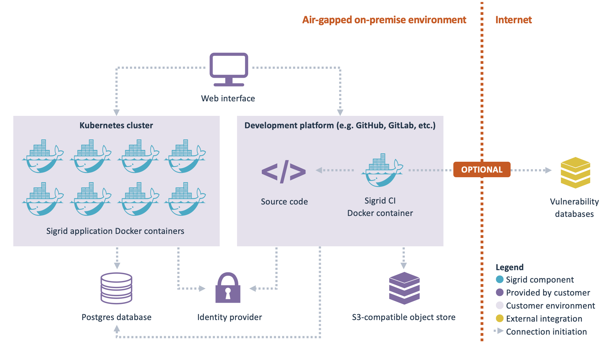

# Sigrid On-Premise integration

This documentation covers on-premise Sigrid. It is not applicable for cloud-based Sigrid.
{: .attention }

This document covers everything you need to integrate Sigrid On-Premise in your environment. It also covers the functional differences between the SaaS version and the on-premise version, though these differences are relatively minor.

<sig-toc></sig-toc>

## High-level overview

From a deployment perspective, on-premise Sigrid consists of two "parts":

- **Sigrid** is the Sigrid web application, which you access from your browser.
- **Sigrid CI** runs within your development platform (e.g. GitHub). It performs the analyses and then publishes the results to Sigrid.

- Sigrid On-Premise is based on [Docker containers](https://en.wikipedia.org/wiki/Docker_%28software%29). There are two types of containers:
  - Application containers that should be deployed permanently in a [Kubernetes](https://en.wikipedia.org/wiki/Kubernetes) cluster, based on a [Helm chart](https://helm.sh) that is provided by SIG.
  - Analysis containers that run from a build pipeline within your development platform. These analysis containers may also be started on Kubernetes, but that is not a requirement. Supported development platforms are listed in [development platform integration](#development-platform-integration).
- SIG provides the necessary images through a container registry. The section [obtaining Sigrid on-premise](#obtaining-sigrid-on-premise) contains more information on how you can obtain and update these Docker containers.
- Authentication is based on your identity provider, using [OpenID Connect](https://openid.net/developers/how-connect-works/). Alternatively, [SAML](https://en.wikipedia.org/wiki/SAML_2.0) or [LDAP](https://en.wikipedia.org/wiki/Lightweight_Directory_Access_Protocol) are also supported, through [Dex](https://dexidp.io/).
- Analyses are triggered from a build pipeline. The analysis results are then imported into a Postgres database, so they can be viewed in Sigrid.
- Large files are stored in an [S3-compatible object store](https://aws.amazon.com/s3/).

Some Sigrid On-Premise features are *optional*:

- The Open Source Health feature requires outbound internet access. Sigrid needs to connect to external sources to check for the latest vulnerability data for open source libraries. If you do not allow outbound internet access, the Open Source Health feature is not available. The rest of Sigrid is unaffected.
- When viewing detailed analysis results, Sigrid displays relevant source code files within Sigrid. For this to work, a web-accessible code storage needs to be available. This integrates with Sigrid via [OAuth](https://oauth.net/2/). For this to work, the identity provider used for Sigrid authentication and for the code storage needs to be the same. For viewing source code within Sigrid, you need to provide a development platform that is integrated with the same identity provider as Sigrid itself. The view source functionality is optional, without this integration the rest of Sigrid is unaffected.

## Requirements

- Your infrastructure needs to support running applications on Kubernetes.
- You need to allow outbound connections to pull the latest Sigrid container images from DockerHub.
  - You are prepared to update Sigrid regularly, at minimum monthly.
- You need to support and manage a Postgres database service.
  - You are prepared to update Postgres regularly, based on the version policy in this documentation.
- You need to have a continuous integration pipeline in one of the following platforms, since Sigrid will integrate with this pipeline: GitHub, GitLab, Azure DevOps.
  - For CI/CD integration, both cloud and server versions of Azure DevOps are supported.
- You need to have an identity provider supporting one of the following protocols, since Sigrid will integrate with this for authentication: OpenID Connect, SAML, LDAP.
- You need to have a web-accessible source code repository available in order to view source code in Sigrid. The following platforms are known to work: GitHub, GitLab, Azure DevOps (Cloud version only).
- You have read this documentation, and your support/platform team has the required technology knowledge (Kubernetes, Docker, Postgres, GitHub/GitLab/Azure DevOps, OpenID Connect) to integrate Sigrid into your environment.
- You allow remote desktop or screen sharing or similar functionality for troubleshooting.
- (Required for Open Source Health feature) You allow outbound internet traffic.

## Obtaining Sigrid on-premise

The Docker containers that form Sigrid On-Premise are distributed via [DockerHub](https://hub.docker.com). You will receive an account that allows you to access the container registry. 

 

As explained above, Sigrid consists of several Docker containers. The container `sigrid-multi-analyzer` runs directly in your development platform's continuous integration pipelines, all other containers are deployed to your Kubernetes cluster. These steps are explained in more detail in the following sections.

## Installing and configuring on-premise Sigrid

As shown in the high-level overview, the on-premise version of Sigrid consists of two "blocks": The Sigrid application that is deployed within a Kubernetes cluster, and the Sigrid CI Docker container that is integrated within your development platform. 

Instructions for installing and configuring both parts are provided in the following pages:

- [Sigrid on-premise: Helm Chart configuration](onpremise-kubernetes.md)
- [Sigrid on-premise: Analysis configuration](onpremise-analysis.md)

## Updating Sigrid On-Premise to a new version

SIG releases the Sigrid Docker containers based on a [continuous delivery](https://en.wikipedia.org/wiki/Continuous_delivery) process. This means that changes are immediately released once they have successfully passed through the development process. We advise our clients on the best way to develop and operate their software, so we try to adhere to the same best practices that we recommend our clients. 

This does not necessarily mean you need to *immediately* pull the Docker containers after every release. However, you need to pull the latest versions of the Docker containers at least once a month. SIG does not provide support for versions of the Docker containers over a month old. Updating frequently reduces the "delta" between the current version and the new version, thereby reducing update risk. Once a month is merely the *minimum* update frequency, we actually recommend you update as frequently as possible.

Although Sigrid consists of several Docker containers, you will need to update them collectively. It is theoretically possible to update some containers without updating other containers, but this gets complicated very quickly and we don't recommend this way of working to our on-premise clients. So when you update Sigrid on-premise, you will need to update all Docker containers to the same version.

This also means SIG does not back-port any changes to older versions: If you want to access new features or bugfixes, you will need to update the Docker containers to the latest version. 

## Updating your environment

In addition to updating Sigrid itself, you will also need to periodicially update your environment in which Sigrid runs. SIG uses the following support policy for infrastructure component versions:

- For Kubernetes, we support the latest 2 major versions. You can track the Kubernetes version history in [this overview](https://kubernetes.io/releases/).
- For Postgres, we also support the latest 2 major versions. You can track the Postgres version history in [this overview](https://www.postgresql.org/support/versioning/).

## Functional/Technical Differences in Sigrid On-Premise

- Single-Tenant Architecture: The on-premise Sigrid distribution is single-tenant, meaning you cannot create your own "tenants." All systems and analyses will be consolidated into your portfolio. However, you can still utilize Sigrid's user management to define access permissions for different users to various systems.
- Source Code Publishing: You are required to use the [development platform integration](#development-platform-integration) to publish your source code to Sigrid. SFTP uploads and manual uploads are not supported.
- Multi-Repo Systems: [Multi-repo systems](systems.md#sigrid-view-is-based-on-business-applications) are not supported. You are responsible for publishing source code from your development platform to Sigrid.
- Scheduling: The on-premise Sigrid distribution does not support scheduling. It is assumed that analyses are performed through your continuous integration pipeline.
- View Source Feature: The "view source" feature will display the *current* state of the file in your development platform, which may differ from the version of the file that was analyzed by Sigrid.
- Technology Support Differences:
  - Mendix: Set the variable `CONVERT` to `mendix` in your CI pipeline job, and use `Mendixflow` as language when defining the scope.
  - Outsystems: This technology is not supported.
- Unavailable Features:
  - Open Source Health - currently work-in-progress
  - Security: Results for the following tools cannot be generated:
    - Checkmarx
    - Astrée
  - Green Code
  - Interactive AI Explanations

## Contact and support

Feel free to contact [SIG's support department](mailto:support@softwareimprovementgroup.com) for any questions or issues you may have after reading this document, or when using Sigrid or Sigrid CI. Users in Europe can also contact us by phone at +31 20 314 0953.
