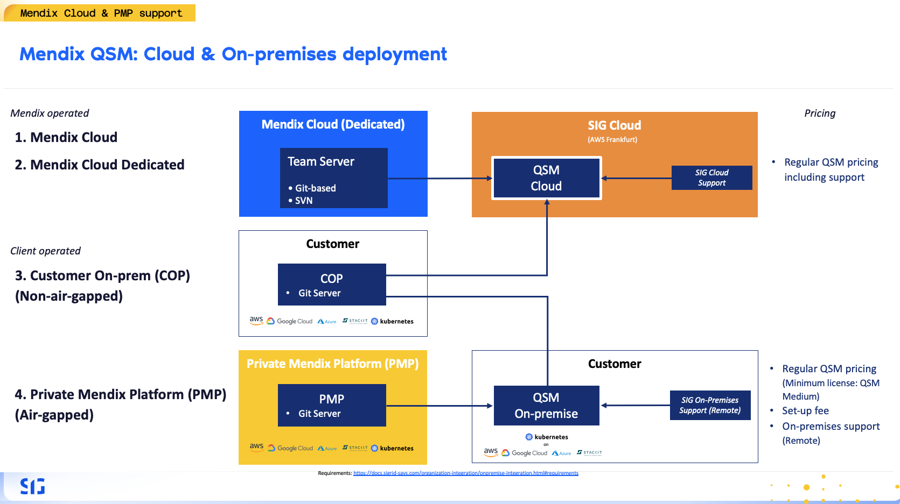

# QSM On-Premise

This documentation covers QSM On-Premise. It is not applicable for cloud-based QSM or Sigrid.
{: .attention }

QSM On-Premise is the on-premise deployment option of Mendix Quality & Security Management (QSM), powered by Sigrid. It allows you to run QSM within your own infrastructure for analyzing Mendix applications.

## QSM On-Premise

QSM On-Premise uses the same platform and deployment model as Sigrid On-Premise.

It is typically used when:
- Data cannot leave your environment
- You operate in restricted or air-gapped setups
- You run Mendix on private infrastructure

For deployment, configuration, and operations, refer to the Sigrid On-Premise documentation.

## When to use QSM On-Premise

The correct deployment model depends on how your Mendix platform is hosted:

1. **Mendix Cloud**  
   → Use QSM Cloud (Sigrid)

2. **Mendix Cloud Dedicated**  
   → Use QSM Cloud (Sigrid)

3. **Mendix Customer On-Premise (COP)**  
   → Use QSM Cloud (Sigrid) if outbound connectivity is allowed  
   → Use QSM On-Premise if required (e.g., restricted environments)

4. **Private Mendix Platform (PMP)**  
   → Use QSM On-Premise  
   → See: https://docs.mendix.com/private-mendix-platform/

## How QSM On-Premise differs from QSM Cloud

QSM On-Premise **does not connect to the Mendix Team Server**. Mendix application artifacts must be stored in a CI/CD platform such as GitLab, GitHub, or Azure DevOps, where analysis is executed.

Unlike QSM Cloud, which connects to the Mendix Team Server for conversion and analysis, QSM On-Premise performs a **local conversion** before analyzing your Mendix application.

To support this, your pipeline must be configured accordingly:
- Set the variable `CONVERT` to `mendix` in your CI pipeline job, and use `Mendixflow` as the language when manually defining a scope.

Aside from these integration and pipeline differences, deployment and operations remain the same as Sigrid On-Premise.

## Contact and support

Feel free to contact [SIG's support team](mailto:support@softwareimprovementgroup.com) for any questions or issues you may have after reading this documentation or when using QSM or Sigrid.