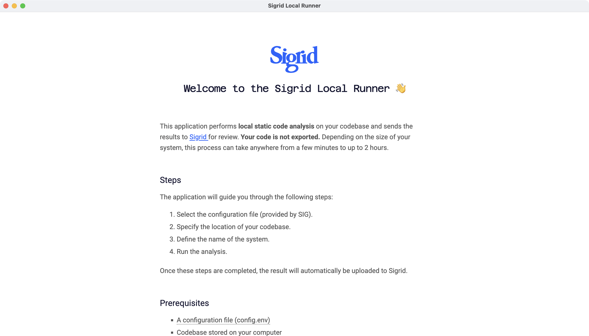
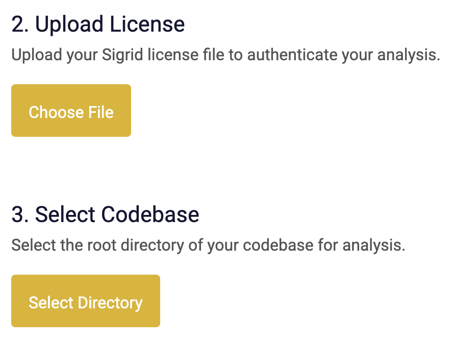
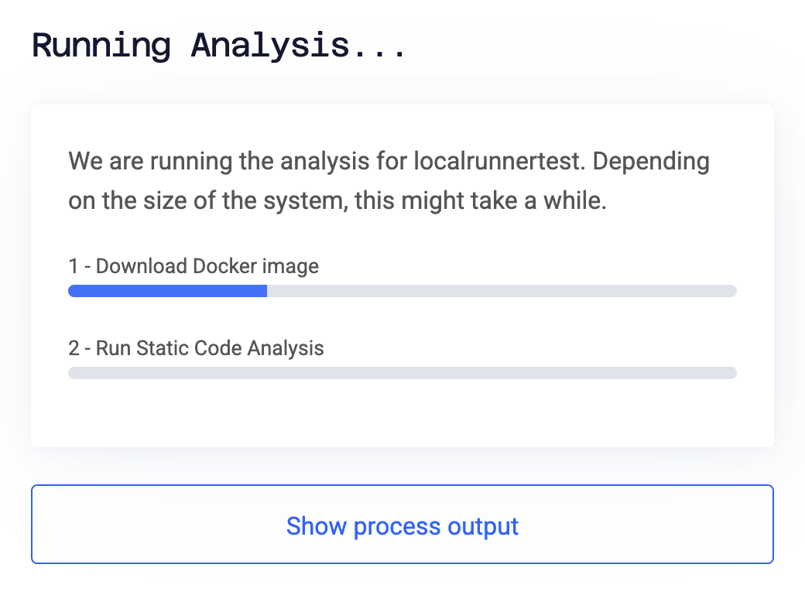

# Sigrid Local

This documentation covers the Sigrid Local, which is only used when you are part of a one-off assessment
where your source code needs to remain on-premise. Sigrid Local cannot be used for Sigrid subscriptions.
{: .attention }

Sigrid Local does the following:

- Analyze your source code. This is done locally, so the source code will never leave your environment.
- Publish the analysis results to Sigrid. Your source code is *not* published to Sigrid.

## Prerequisites

Before you can start using the Sigrid Local, you need the following:

- You need to install [Docker](https://www.docker.com). In most cases, the most convenient to run Docker locally
  is by installing [Docker Desktop](https://docs.docker.com/desktop/). Docker Desktop supports Windows, Mac, and Linux.
- A Sigrid license file. This is provided to you by SIG.
- Download and install the Sigrid Local. A download link is provided to you by SIG. 
  Sigrid Local supports Windows, Mac, and Linux. If you are part of an enterprise IT organization, you might not be
  allowed to download and run applications yourself. In these situations, consult your IT department on how to make
  Sigrid Local available to you.
- You will need local access to your source code that you want to analyze using Sigrid Local.

## Installing Sigrid Local

You will have received two files: A ZIP file containing the Sigrid Local application, and a `.lic` file containing
your license. You then start Sigrid Local like you start any other application, you can leave the license file for
later. 

**If you are using a Mac and you get an error message that "Sigrid Local cannot be opened because the developer
cannot be verified"**

- Open System Settings.
- Go to the "Privacy and Security" tab.
- Scroll down to the "Security" section.
- Find the message that Sigrid Local cannot be opened, and click "Open anyway".

If you are part of an enterprise IT organization, you might not be allowed to do this yourself. Please check
with your IT department on how to make Sigrid Local available to you.

**If you're using Windows, and you get an error message that "Windows protected your PC."**

- Click "More info".
- Click "Run anyway".

If you are part of an enterprise IT organization, you might not be allowed to do this yourself. Please check
with your IT department on how to make Sigrid Local available to you.

## Using Sigrid Local

When you start Sigrid Local, you'll see something that looks like this:

Sigrid Local checks if Docker is running. If you followed the [prerequisites](#prerequisites), you should see
a green box confirming this:

You can now provide Sigrid Local with the license file and the source code directory.

The license file is only valid for a limited time. If you see an error message that your license file has
expired, [notify your support contact](#support) to request a new one.

If you're not seeing any red error messages, you're good to go. You can now click the button to start analyzing
your source code. This might take a while, depending on how large your source code is. 

Optionally, you can click "show process output" to see the log output. This is purely for information purposes.

After the analysis has completed, you will see the following confirmation message. This indicates Sigrid Local
has successfully completed its analysis, and has published the analysis results to Sigrid. That means you're done!

If your analysis results in an error, [notify your support contact](#support) so we can try to help you out.

If you made a mistake, you can use Sigrid Local multiple times. Whenever you use Sigrid Local, the new
analysis results will simply replace the old ones. You can continue to use Sigrid Local for as long as your
Sigrid license file is valid.

## Supported technologies

Sigrid Local is able to analyze over 250 different technologies. For a full overview, see the 
[list of supported technologies](../reference/technology-support.md#list-of-supported-technologies)
and filter the table by "Sigrid Local".

## Support

You can find the name and contact details of your support contact in the same email that contains your Sigrid Local
download link and Sigrid license file.
