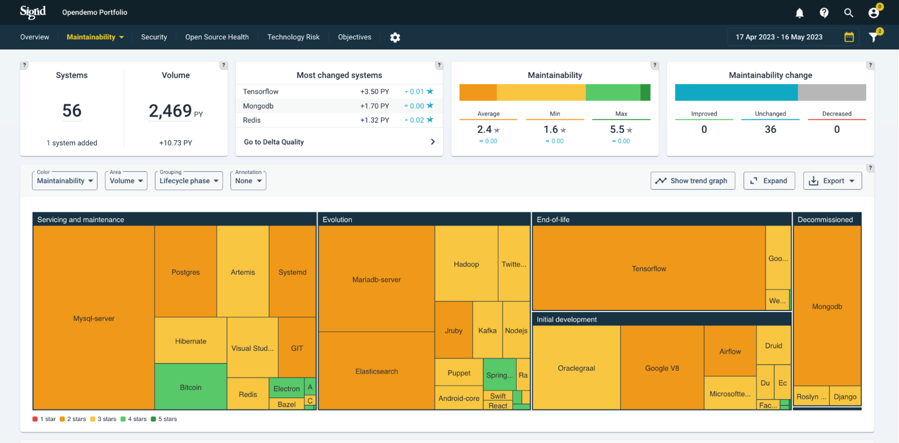
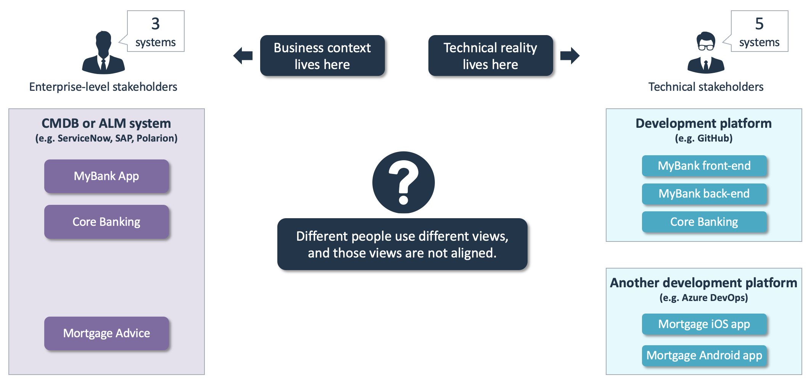
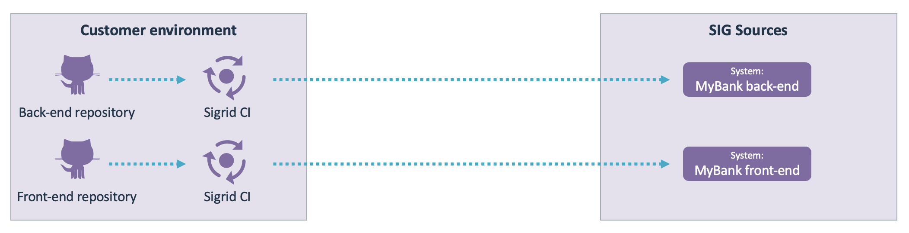
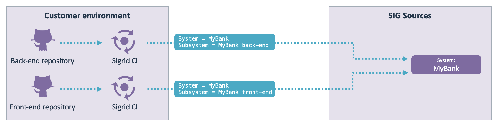

Mapping repositories to Sigrid systems
======================================

Sigrid provides you with an overview of your organization's entire software portfolio. Your portfolio will be split into several systems. In Sigrid's main portfolio dashboard, each system is depicted as a block within a treemap.

So what's a "system"? SIG uses the following definition based on the [ISO 25010 standard](https://www.softwareimprovementgroup.com/wp-content/uploads/SIG-TUViT-Evaluation-Criteria-Trusted-Product-Maintainability-Guidance-for-producers.pdf):

> The system consists of all software needed to achieve the overall functionality of the product. (...) The system owner, which is the organization that holds property rights and that applies for certification, is responsible for defining the exact system boundary during the scoping phase.

So splitting your software portfolio into systems is based on both functional and technical boundaries, and you as the system owner get to decide those boundaries. That definition seems opaque, but that's because every organization uses its own structure and terminology, and often multiple teams *within* an organization use different terms. It is quite common for different stakeholders to have a different view of what the software portfolio looks like, as depicted in the following example:

If you ask people what systems they have, the people on the left would have a different answer than the people on the right. And both would be right, from their own perspective. The perspective on the left is centered around business applications, i.e. more along functional boundaries. The perspective on the right is often centered around repositories, which is what they see in their development platform of choice (e.g. GitHub). 

One of Sigrid's goals is to provide a shared view for all stakeholders. Sure, we could just give everyone their own view, without the need to align the views. But we believe this is not desirable, because without a shared view you also can't agree on a shared goal. So you need to agree on either using the situation on the left as Sigrid's view on your portfolio, or the situation on the right. There is no "best" way, this depends on your organization. Once you have agreed on the best view for your situation, you can use the instructions below for how to get there practically.

## Sigrid view is based on repositories 

This is the most straightforward mapping: every repository in your development platform is mapped directly to a corresponding system in Sigrid. 

Technical stakeholders get information that directly matches their perspective, and findings *within* each repository directly matches what they see in their build pipeline or IDE. 

Business stakeholders can still get a more aggregated view by grouping systems based on team, division, supplier, or functionality. This means the portfolio dashboard starts out as a grouped, aggregated view, but still allows people to drill down to the repository level when necessary. This is therefore the most pragmatic view for most organizations, which is why we use it as the standard example used throughout this Sigrid documentation.

## Sigrid view is based on business applications

Alternatively, you can also base your Sigrid view on a more functional/business perspective. Each system consists of multiple underlying repositories, where each repository can be considered a subsystem within that business application. This is sometimes referred to as a [multi-repo system](https://www.gitkraken.com/blog/git-multi-repo-vs-git-mono-repo).

In this example, the *MyBank front-end* and *MyBank back-end* repositories would be combined into a single system, *myBank*. In this scenario, it is still possible for both repositories to publish their code to Sigrid independently, combining the two repositories happens on the Sigrid side. This behavior can be enabled by using the [subsystem option in the Sigrid CI configuration](../reference/client-script-usage.md). 

This allows you to publish each subsystem as part of their own pipeline, rather than being force to publish all subsystems at the same time. Using subsystems therefore doesn't interrupt the normal workflow for teams working on each subsystem, while still resulting in a shared/combined/aggregated view in Sigrid.

This scenario also means you set your *objectives* on the combined application level, not on the individual repository level. This can help to have a clear shared goal that you're working towards together. However, if you find yourself in a situation where the different repositories would prefer to set their own objectives, it might be a better choice to base your Sigrid view and goals around repositories. 

However, it's important not to go overboard with this approach:

### What granularity is best when combining repositories into business applications?

Merging a few repositories that belong together into a business application is very useful, but if you find yourself merging dozens or even hundreds of repositories you're probably taking things too far. Merging your entire landscape into one giant monolith makes Sigrid's portfolio dashboards a lot less useful, since you will only see the monolith.

This will also have a negative impact on analysis performance, as the analysis needs to merge your repository's code into the multi-repo system. Finally, your changes are compared agains the multi-repo's baseline, not just the baseline for your repository, and the target is defined for the entire multi-repo system. This is generally desirable from a management perspective, but could make the results less actionable for teams since they have less control over the multi-repo system as a whole.

### When should subsystems be published?

Subsystems are intended for a situation where you have different teams working on different repositories, and you want them to publish their changes to Sigrid individually while still having an aggregated/consolidated view in Sigrid itself. This is the default behavior for Sigrid CI, so following this documentation already leads to a situation where every subsystem is published to Sigrid at the appropriate time.

If you find yourself publishing all repositories simultaneously, for example as a scheduled job, you should consider publishing the system as a whole, since there is little added value in using subsystems in such a scenario.

Reversely, there is also little added value in publishing subsystems that have not actually changed, since this option allows you to publish every subsystem after every change anyway.

## Contact and support

Feel free to contact [SIG's support department](mailto:support@softwareimprovementgroup.com) for any questions or issues you may have after reading this document, or when using Sigrid or Sigrid CI. Users in Europe can also contact us by phone at +31 20 314 0953.
