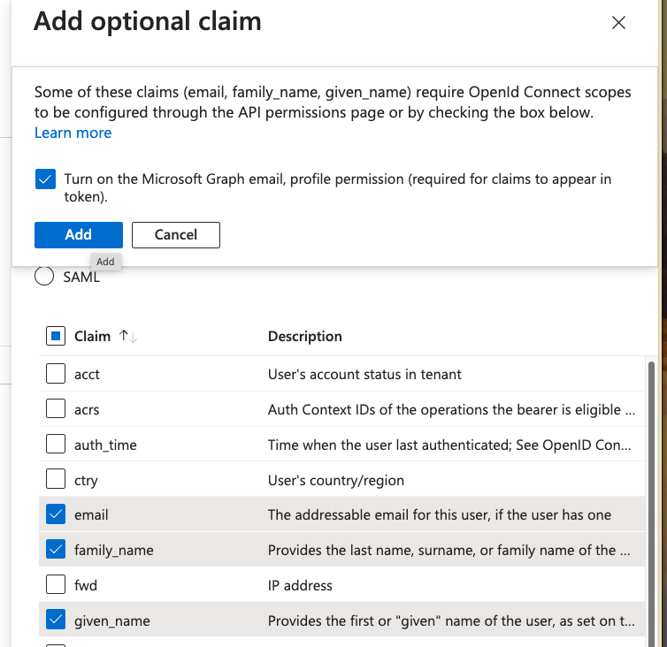

Configuring Sigrid Single Sign-On with Azure/Entra ID via OpenID Connect
===============================================

This page provides a OIDC integration example for Sigrid customers using Azure/Entra ID as their Identity Management Provider.

## Creating an Application for Sigrid SSO
As an Azure/Entra ID administrator, go to App Registrations and 'New Registration'.
Create a single-tenant registration.

### General OIDC Settings
- Application Type: Web
- Sign in Redirect URI: https://auth.sigrid-says.com/oauth2/idpresponse

### Attributes & Claims
- Sigrid needs 3: email, first and last name.

| Claim | Description | Token Type |
| ---------- | ---------- | ---------- |
| email  | The addressable email for this user, if the user has one | ID |
| family_name | Provides the last name, surname, or family name of the user as defined in the user object | ID |
| given_name | Provides the first or "given" name of the user, as set on the user object | ID |

_Please check the box "Turn on the Microsoft Graph email, profile permission (required for claims to appear in token)"_

### Secrets & Certificates
- Go the Client secrets section and click 'New client secret.'
- Provide a description and expiration period.

_Kindly ensure your secret is renewed on time and shared with the Software Improvement Group._

# Contact and support

Feel free to contact [SIG's support team](mailto:support@softwareimprovementgroup.com) for any questions or issues you may have after reading this documentation or when using Sigrid.
