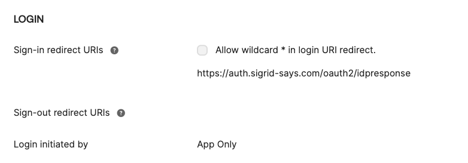
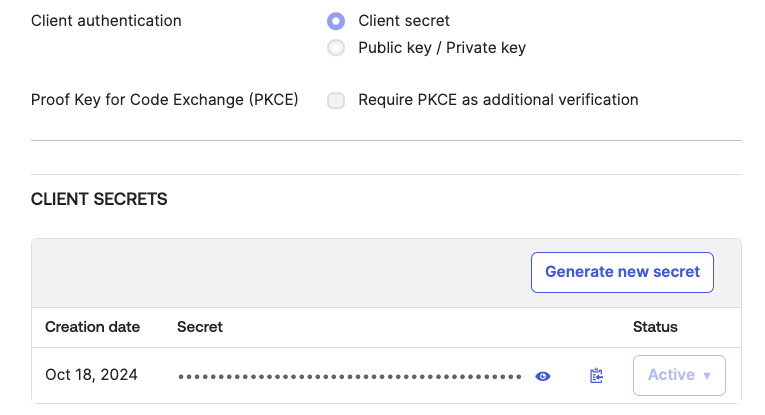

Configuring Sigrid Single Sign-On with Okta ID via OpenID Connect
===============================================

This page provides a OIDC integration example for Sigrid customers using Okta as their Identity Management Provider.

## Creating an Application for Sigrid SSO
As an Okta administrator, create a new app integration using the OIDC sign-in method. Select Web Application as the application type.

### General OIDC Settings
- Application Type: Web
- Sign in Redirect URI: https://auth.sigrid-says.com/oauth2/idpresponse
- Login initiated by App Only

 

### Attributes & Claims / Configure Profile Mapping
- Sigrid needs 3: email, first and last name, Okta includes the required claims by default.

### Client Secrets
- Go the Client secrets section and click 'Generate new secret'.

_Kindly ensure your secret is renewed on time and shared with the Software Improvement Group._

 

## Contact and support

Feel free to contact [SIG's support team](mailto:support@softwareimprovementgroup.com) for any questions or issues you may have after reading this documentation or when using Sigrid.
