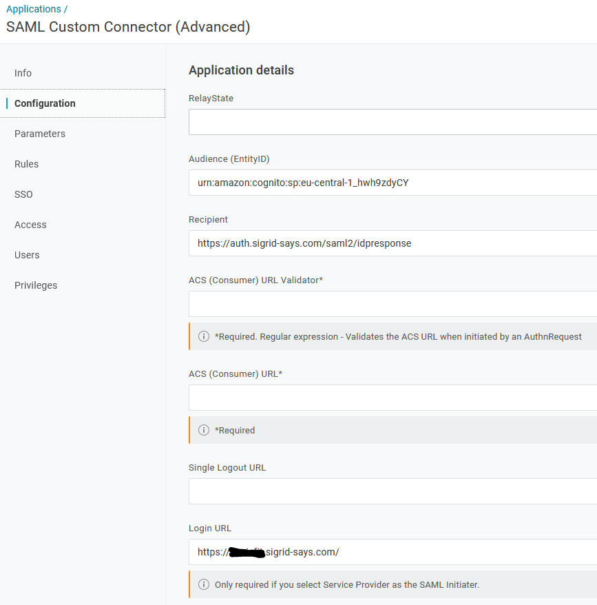

OneLogin SAML Custom Connector (Advanced)
===========================================

This page describes the technical setup for customer using OneLogin as Identity Management Provider.

### Screenshots for OneLogin config

# Contact and support
Feel free to contact [SIG's support department](mailto:support@softwareimprovementgroup.com) for any questions or issues you may have after reading this document, or when using Sigrid or Sigrid CI. Users in Europe can also contact us by phone at +31 20 314 0953.
