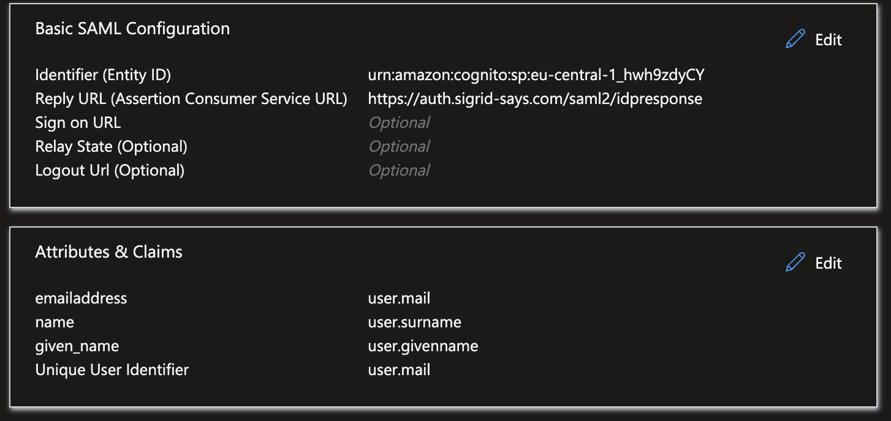

Configuring Sigrid Single Sign-On with Azure/Entra ID via SAML
===============================================

This page provides a SAML integration example for Sigrid customers using Azure/Entra ID as their Identity Management Provider.

## Creating an Application for Sigrid SSO
As an Azure/Entra ID administrator, go to Enterprise Applications and 'Create your own application'.
Configure SAML in the Single Sign-on section.

### General SAML Settings
- Single sign-on URL : https://auth.sigrid-says.com/saml2/idpresponse
- Audience URI : urn:amazon:cognito:sp:eu-central-1_hwh9zdyCY

### Attribute statements
- Sigrid needs 3: email, first and last name.

| Name | Value |
| ----------- | ----------|
| http://schemas.xmlsoap.org/ws/2005/05/identity/claims/emailaddress  | user.mail  |
| http://schemas.xmlsoap.org/ws/2005/05/identity/claims/name   | user.surname  |
| http://schemas.xmlsoap.org/ws/2005/05/identity/claims/given_name   | user.givenname  |

### Saved SAML app

 

# Contact and support
Feel free to contact [SIG's support department](mailto:support@softwareimprovementgroup.com) for any questions or issues you may have after reading this document, or when using Sigrid or Sigrid CI. Users in Europe can also contact us by phone at +31 20 314 0953.
