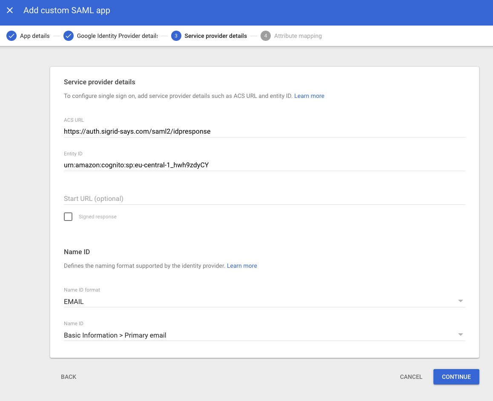

Configuring Sigrid Single Sign-on with Google
===============================================

This page describes the technical setup for Sigrid customers using Google as their Identity Management Provider.

## Creating a Service Provider

Login to the Google admin console and add a serviceprovider called 'Sigrid'.

### Configuration steps

- Login as Google Admin
- select Apps in the menu
- select Web and Mobile apps
- create service provider
- add ACS-URL: https://auth.sigrid-says.com/saml2/idpresponse
- add Entitity-ID: urn:amazon:cognito:sp:eu-central-1_hwh9zdyCY
- select EMAIL as name-ID
- Name-ID contains basic information > Primary email

 

### Share the metadata

- download the Metadata
- send the metatadata.xml file to [Support](mailto:support@softwareimprovementgroup.com)

# Contact and support
Feel free to contact [SIG's support department](mailto:support@softwareimprovementgroup.com) for any questions or issues you may have after reading this document, or when using Sigrid or Sigrid CI. Users in Europe can also contact us by phone at +31 20 314 0953.
