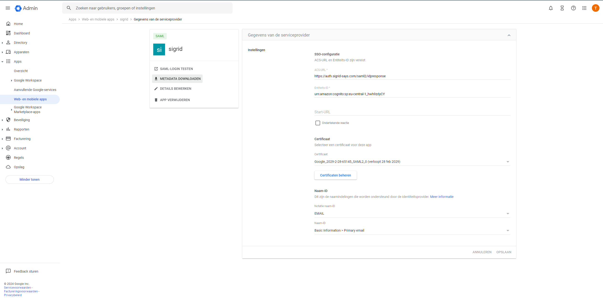

Configuring Sigrid Single Sign-On with Google via SAML
===============================================

This page provides a SAML integration example for Sigrid customers using Google as their Identity Management Provider.

## Creating a Service Provider

Login to the Google admin console and add a serviceprovider called 'Sigrid'.

### Configuration steps

- Login as Google Admin
- Select Apps in the menu
- Select Web and Mobile apps
- Create service provider
- Add ACS-URL: https://auth.sigrid-says.com/saml2/idpresponse
- Add Entitity-ID: urn:amazon:cognito:sp:eu-central-1_hwh9zdyCY
- Select EMAIL as name-ID
- Name-ID contains basic information > Primary email

 
 

### Share the metadata

- Download the Metadata
- Send the metatadata.xml file to [Support](mailto:support@softwareimprovementgroup.com)

## Contact and support

Feel free to contact [SIG's support team](mailto:support@softwareimprovementgroup.com) for any questions or issues you may have after reading this documentation or when using Sigrid.
