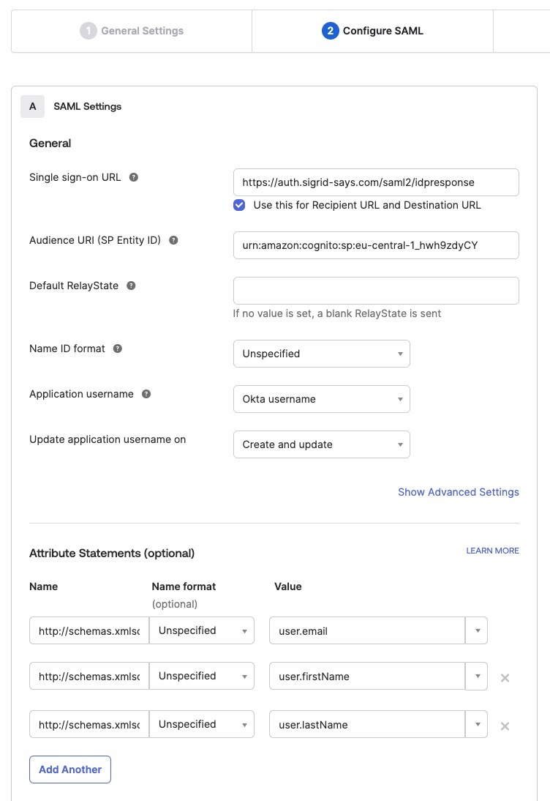
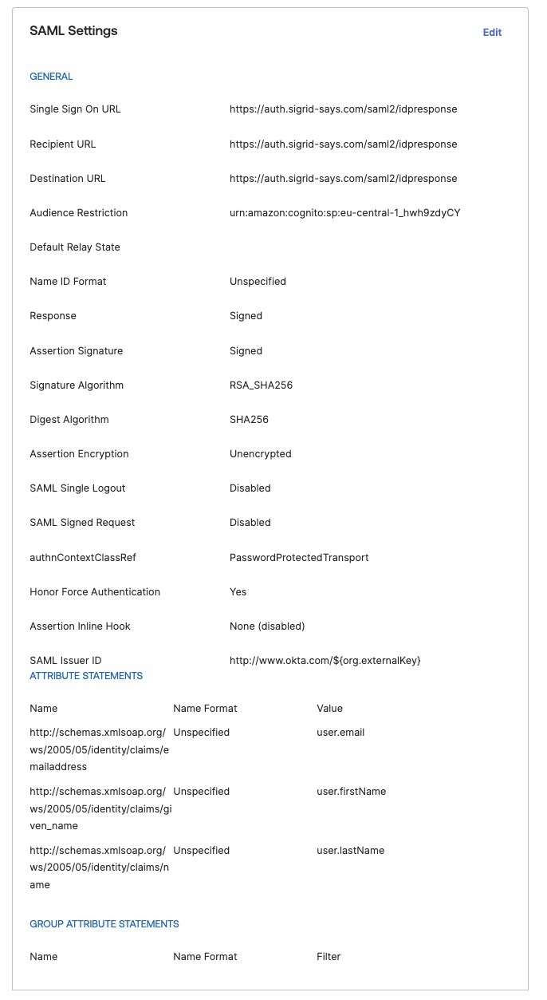
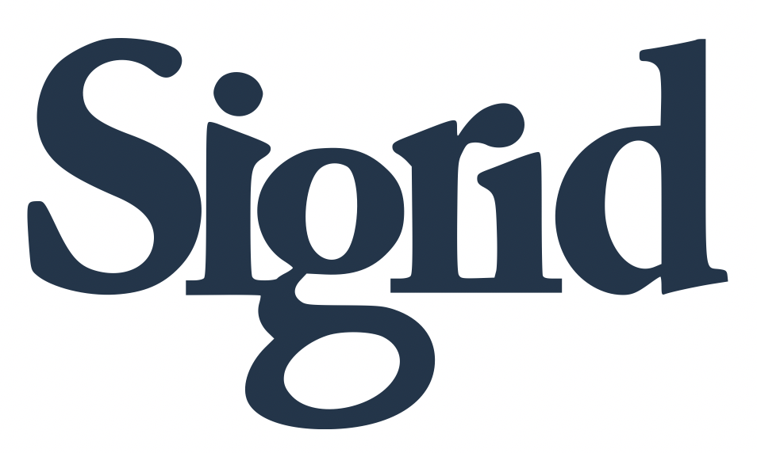

Configuring Sigrid Single Sign-On with Okta via SAML
===============================================

This page provides a SAML integration example for Sigrid customers using Okta as their Identity Management Provider.

## Creating an Application for Sigrid SSO
As an Okta administrator, create a new app integration using the SAML sign-in method.

And for your users we advise to create a [Bookmark app](https://support.okta.com/help/s/article/create-a-bookmark-app?language=en_US) on the Okta homepage.

### General SAML Settings
- Single sign-on URL : https://auth.sigrid-says.com/saml2/idpresponse
- Audience URI : urn:amazon:cognito:sp:eu-central-1_hwh9zdyCY
- Login initiated by App Only

### Attribute statements

- Sigrid needs 3: email, first and last name

| Name | Value |
| ----------- | ----------|
| http://schemas.xmlsoap.org/ws/2005/05/identity/claims/emailaddress  | user.email  |
| http://schemas.xmlsoap.org/ws/2005/05/identity/claims/name   | user.lastName  |
| http://schemas.xmlsoap.org/ws/2005/05/identity/claims/given_name   | user.firstName  |

 

### Saved SAML app

 

### Bookmark app
Sigrid only supports service provider initiated flow, so create a Bookmark app that only redirects to https://<customer>.sigrid-says.com.
As Sigrid logo for your bookmark app you can use these logos

# Contact and support
Feel free to contact [SIG's support department](mailto:support@softwareimprovementgroup.com) for any questions or issues you may have after reading this document, or when using Sigrid or Sigrid CI. Users in Europe can also contact us by phone at +31 20 314 0953.
