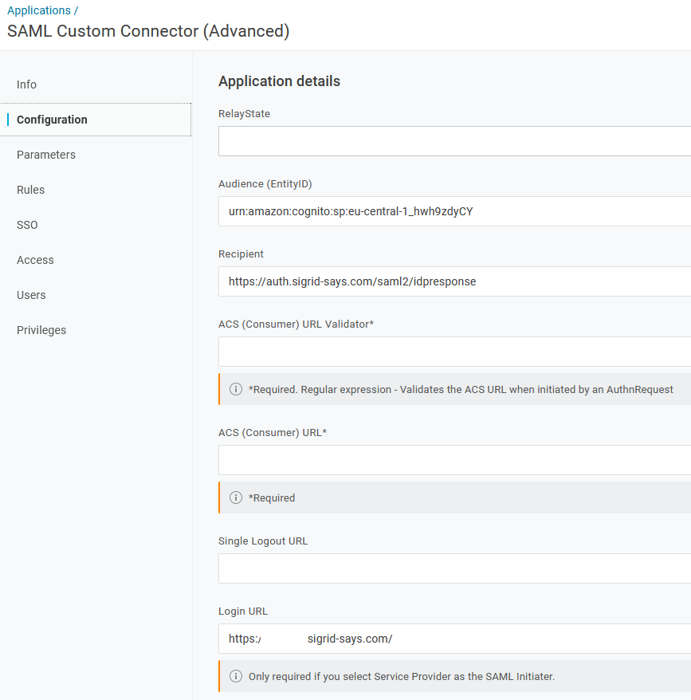
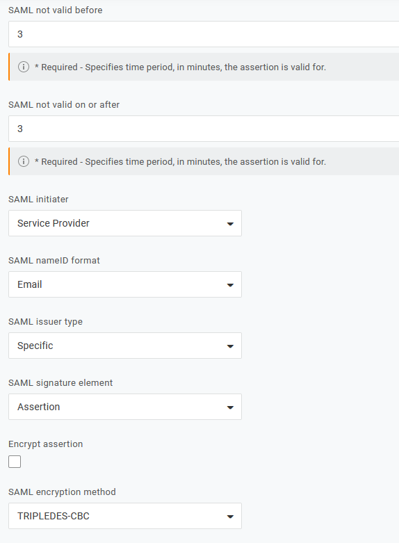
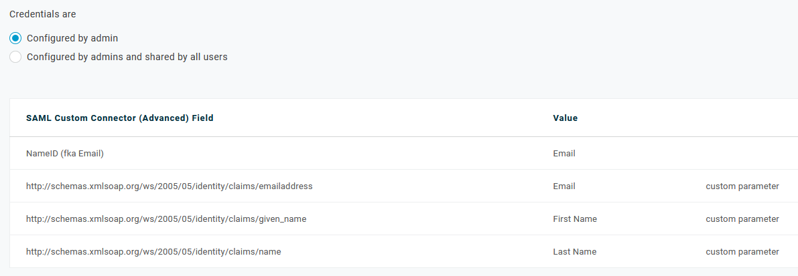
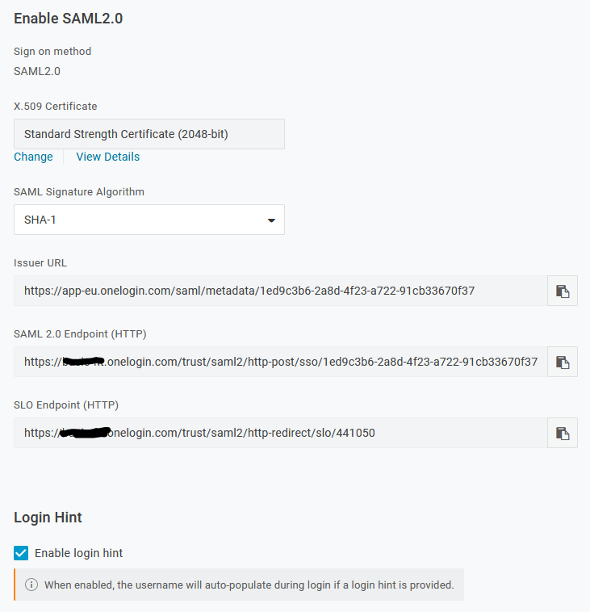

Configuring Sigrid Single Sign-on with OneLogin
===============================================

This page describes an example of the technical setup for Sigrid customers using OneLogin as their Identity Management Provider.

## Creating an Application for Sigrid SSO
As OneLogin administrator, add an Application based on the `SAML Custom Connector (Advanced)` template.

### Configuration

 

### Configuration (cont'd)

### Parameters

### SSO

# Contact and support
Feel free to contact [SIG's support department](mailto:support@softwareimprovementgroup.com) for any questions or issues you may have after reading this document, or when using Sigrid or Sigrid CI. Users in Europe can also contact us by phone at +31 20 314 0953.
