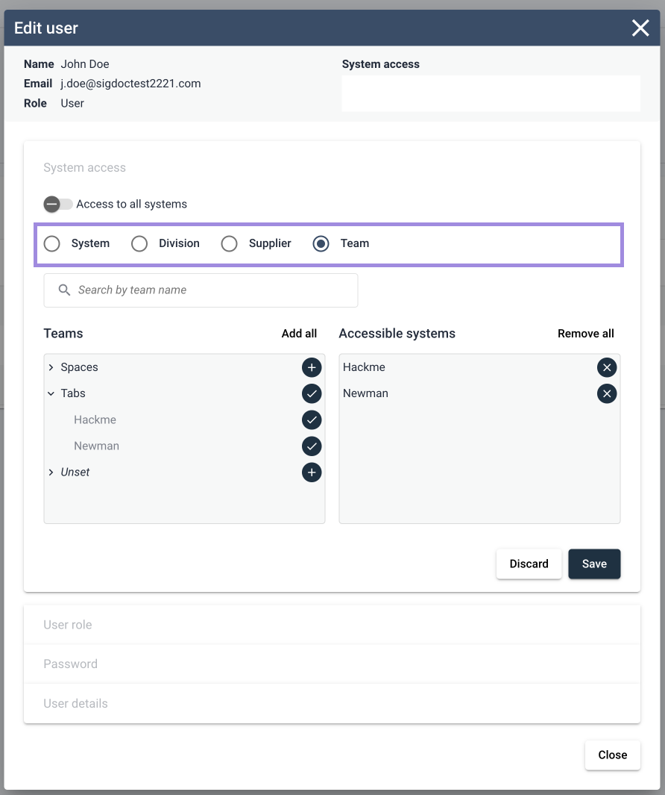
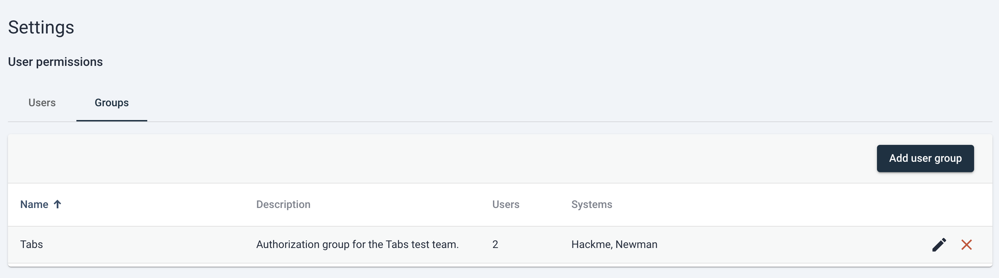
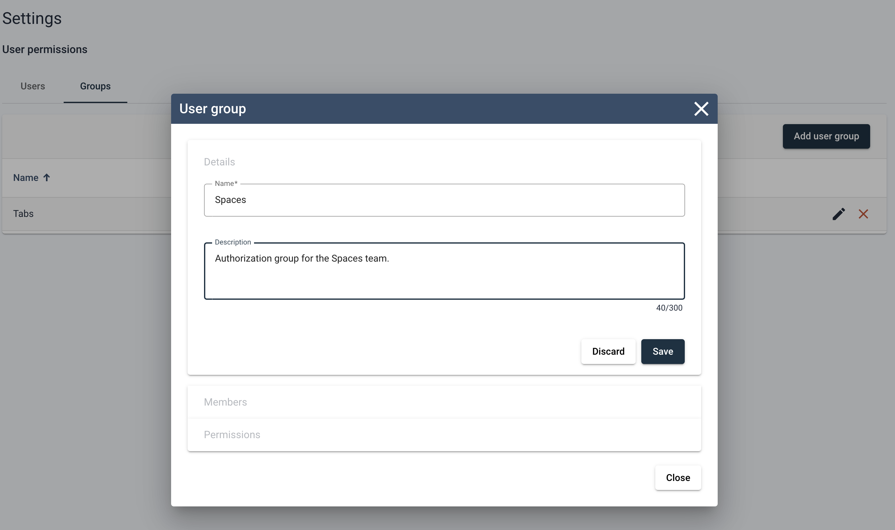
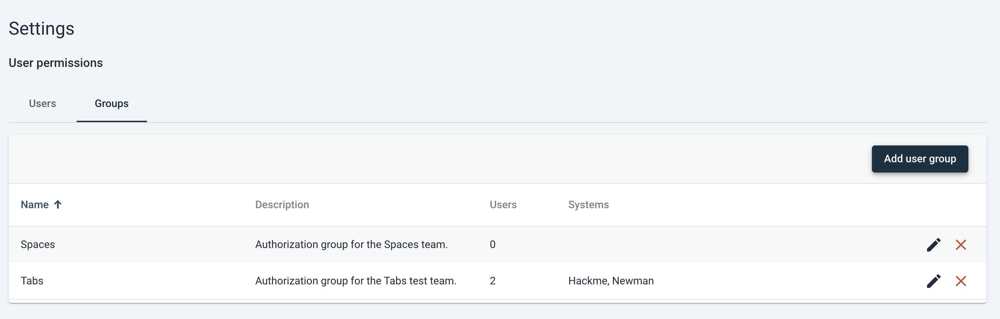
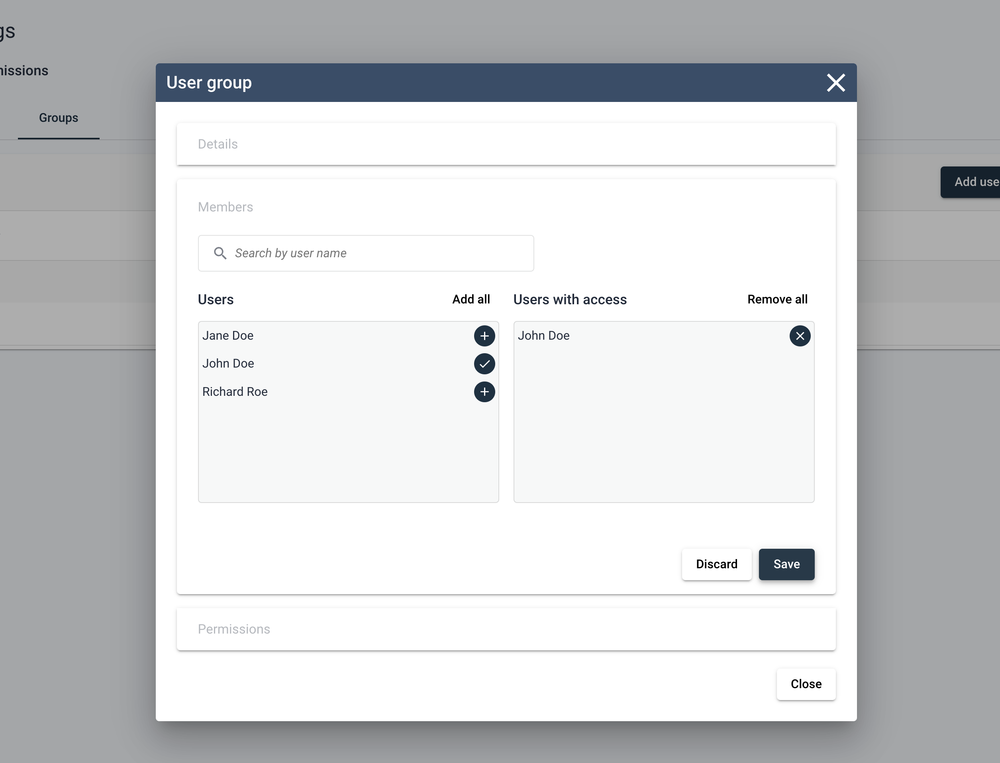
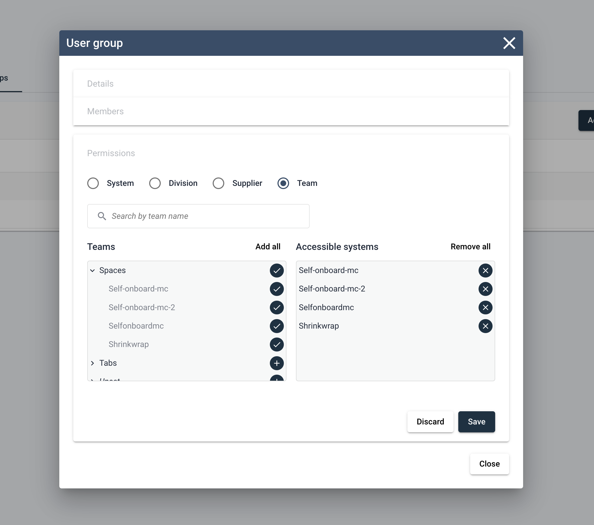

User management in Sigrid
===========================================

This documentation covers cloud-based Sigrid. On-premise Sigrid requires integration with your identity provider, which is explained in the section about [on-premise integration](../organization-integration/onpremise-integration.md).
{: .attention }

When managing user access to Sigrid we need to consider both Authentication (can you enter?) and Authorization (what can you see?). 
- Authentication is the step where users are allowed to enter the platform. After Authenication is successful, 
- Authorization defines which user can access the analysis results of which systems.

Sigrid offers two ways of managing Authentication and one type of Authorization. 

This page describes the options and the technical setup.

# Authentication mechanisms

## 1. Using the Sigrid user management module
With this module, a Sigrid administrator can perform all the basic authentication tasks out of the box.

### Note
- That your users will need to set a password.
- Sigrid support can make the use of MFA (multi-factor authentication) mandatory for your users.
- You will need to actively revoke access for users that have left your company by deleting them from user management.

### Sigrid administrator tasks
- Create users based on their email, first and last name.
- Resend lost and temporary passwords.
- Check the last login and MFA status.
- Do authorization tasks to define who can see what in Sigrid.
- Delete users

### Setup customer side
- No setup is needed.

## 2. Using Single Sign On (SSO) with an Identity Provider (IdP)
When Sigrid is linked to your organization's SSO Identity Provider, the user provisioning in Sigrid is done automatically upon login. By default, new users don't see any systems and analysis results yet.
Sigrid supports both SAML or OpenID Connect protocols via a service-provider initiated authentication flow.

### Notes
- With the service-provider initiated authentication flow, users first navigate to `https://<customer>.sigrid-says.com`. They get redirected to their organization's Identity Provider, login there, and then get redirected back to Sigrid.
- SSO improves the ease of use for your colleagues because there is no Sigrid password to remember. 
- SSO improves security because users are created and deleted centrally in your organization.
- Sigrid follows the password policy of your organization.
- SSO integration with Sigrid is **not allowed** when your Identity Provider allows public, self-service sign-up. In other words, all users in your Identity Provider must be associated directly with your organization.

### Sigrid administrator tasks
- Check the last login
- Perform authorization tasks to define who can see what in Sigrid

### Setup on client side

#### SAML Configuration
Create an Enterprise application 'app' in your IdP with the following details: 
- Audience or Identifier (Entity) ID: urn:amazon:cognito:sp:eu-central-1_hwh9zdyCY
- Reply URL: https://auth.sigrid-says.com/saml2/idpresponse

Attributes & Claims:

| Your user | Sigrid expects the long url as SAML attribute name |
| ---------- | ---------- |
| user email | `http://schemas.xmlsoap.org/ws/2005/05/identity/claims/emailaddress` |
| user last name | `http://schemas.xmlsoap.org/ws/2005/05/identity/claims/name` |
| user first name | `http://schemas.xmlsoap.org/ws/2005/05/identity/claims/given_name` |

_Note: if your IdP requires to set an unique user identifier, please choose emailaddress_

Other Settings:
- Signature Algorithm: RSA_SHA256
- Digest Algorithm: SHA256
- Assertion Encryption: unencrypted (privacy is provided by using HTTPS)
- SAML Single Logout: disabled

Assign groups of users to your Authentication app.

#### OpenID Connect Configuration
Create an Enterprise application 'app' in your IdP with the following details:
- Application Type: Web
- Sign in Redirect URI: https://auth.sigrid-says.com/oauth2/idpresponse

Attributes & Claims:
- Okta includes the required claims by default, while Azure/Entra ID does not.
Please check your IdP’s documentation to see if the required claim is included by default or if it needs to be explicitly added.

| Claim | Description | Token Type |
| ---------- | ---------- | ---------- |
| email  | The addressable email for this user, if the user has one | ID |
| family_name | Provides the last name, surname, or family name of the user as defined in the user object | ID |
| given_name | Provides the first or "given" name of the user, as set on the user object | ID |

_Note: For Azure/Entra ID, please check the box "Turn on the Microsoft Graph email, profile permission (required for claims to appear in token)"_

Certificates & Secrets:
- Generate a secret

Other Settings:
- Default

Assign groups of users to your Authentication app.

### Info to provide to SIG
Please Provide SIG with the following.

##### SAML Configuration
The 'App federation MetadataURL' of your authentication app.
The information will include your app's identifier, redirectURL etc.

| IdP | App federation MetadataURL |
| ---------- | ---------- |
| Azure/Entra ID | `https://login.microsoftonline.com/<tenant_id>/federationmetadata/2007-06/federationmetadata.xml` |
| Okta  | `https://<myOktaOrg>.okta.com/app/<client_id>/sso/saml/metadata` |

##### OpenID Connect Configuration
The Application's `client_id`, `client_secret` and the `well-known URI`.
The information in the well-known URI will include your app's issuer, authorization_endpoint etc.

| IdP | Example well-known URI |
| ---------- | ---------- |
| Azure/Entra ID | `https://login.microsoftonline.com/<tenant_id>/v2.0/.well-known/openid-configuration` |
| Okta  | `https://<myOktaOrg>.okta.com/.well-known/openid-configuration` |

### SAML Examples
Please see the separate pages for SAML examples.

- [SAML Azure/Entra ID](usermanagement-example-saml-entraid.md)
- [SAML Google](usermanagement-example-saml-google.md)
- [SAML Okta](usermanagement-example-saml-okta.md)
- [SAML OneLogin](usermanagement-example-saml-onelogin.md)

### OIDC Examples
Please see the separate pages for OIDC examples.

- [OIDC Azure/Entra ID](usermanagement-example-oidc-entraid.md)
- [OIDC Okta](usermanagement-example-oidc-okta.md)

### Deliverables
SIG will set up Single Sign-On (SSO) for you, providing you with a unique, customer-specific URL for Sigrid.
https://customername.sigrid-says.com

# Authorization in Sigrid
While Sigrid requires minimal adminstration to gather insights in your software's quality, there are a number of tasks that must be performed to ensure your organization gets the most out of their Sigrid experience. Most important of which is the management of other user's access to system details, findings and source code within Sigrid. The following section describes the functions in place to provide this control to users.

### Types of users
Sigrid utilizes role-based authorization with three roles assignable to users: 
- **Normal users:** Default Sigrid users. Can view all details of systems they've been granted access to, as well as view and edit related findings.
- **Administrators:** Power users that have the ability to edit all details of all users within the portfolio, have access to all systems, and can set portfolio wide objectives that affect all systems in a given portfolio.
- **Maintainers:** These users are localized administrators. Maintainers can perform administrative actions on systems they have explicit access to, but not over the entire portfolio.

While normal users have the typical rights to access 1 to all systems in the Sigrid portfolio, Administrator and Maintainer users have additional edit capabilities over other users within the portfolio and are considered admin-level users in Sigrid. Only Administrator users have access to the entirety of the systems within their portfolio by default.

Often organizations require a degree of control to prevent improper disclosure of sensitive information between users and teams. In order to achieve this control, Sigrid offers several admin-level roles that can be assigned to normal users, granting them access to new actions within the platform.

Tasks unique to Admin-level users beyond User Management include:
- [Setting and using Sigrid Objectives](../capabilities/objectives.md)
- [Adding business context to a system using metadata](metadata.md)

#### Administrators vs Maintainers

Once portfolios hit a certain size, it can become difficult for a single admin of a large organization to perform user management effectively by themsleves. When faced with multiple systems and multiple development teams, often it is the case a single administrator user is unaware of who exactly should be granted access to which systems. Likewise, having multiple Administrators within a single Sigrid instance is typically not advised as these are permitted to access every system, finding and source code for all systems in the portfolio, which can be a point of concern for organizations that wish to restrict access based on their own internal organizational structure.

In order to mitigate this pain and allow for some delegation of this work, we have introduced a new user type that behaves as a localized administrator to handle administrative tasks for only those systems relevant to their scope of the portfolio. These local administrators, which we refer to as Maintainers, are able to partially take over the tasks of authorizing users access to systems in the portfolio, as well as configuring system-related details that enhance the ability to track quality improvements and/or setting quality goals to achieve.

Maintainer users have the very similar rights as Administrators in performing administrative tasks, *but only on the subset of systems* the Maintainer has been granted explicit access to by the Administrator. Naturally this means if no system has been made accessible to the Maintainer, this user effectively can not perform any administrative tasks in Sigrid - their ability to perform tasks such as setting of metadata, defining system level objectives, or authorizing users to systems is tied directly to their own authorized access.

Similarly, while Maintainers enjoy additional admin-level permissions on those systems that are accessible to them, there are still limitations on specific actions that are reserved for Administrator users only. This includes the following: 
- Maintainer users cannot authorize themselves for new systems
- Maintainer users cannot modify or create portfolio-level objectives
- Maintainer users cannot change the role for any user, themselves included
- Maintainer users cannot grant or revoke the 'access to all systems' permission
- Maintainer users cannot update access rights for Administrator users, nor are they able to adjust the system access rights of other users for systems they themselves do not have access to
- Maintainer users cannot update user details or security settings
- Maintainer users cannot create or delete users or authorization groups

### Authorized Actions based on User Type

For a full breakdown of tasks able to be performed by each user type, please refer to the following authorized actions table. *Note:* These actions refer to both manual actions within the Sigrid web interface as well as actions allowed [via the Sigrid API](../integrations/sigrid-api-documentation.md#managing-user-permissions-via-API):

| Action | Normal User | Maintainer | Administrator |
| :--- | :---: | :---: | :---: |
| **Portfolio Overview**
| View Dashboard | ✅ | ✅ | ✅✅ |
| View Systems | ✅ | ✅ | ✅✅ |
| **Capability Specific Overviews**
| View Dashboards | ✅ | ✅ | ✅✅ |
| View Ratings | ✅ | ✅ | ✅✅ |
| Favorite Systems | ✅ | ✅ | ✅✅ |
| **Findings and Refactoring Candidates**
| View Findings | ✅ | ✅ | ✅✅ |
| Edit Findings | ✅ | ✅ | ✅✅ |
| View Finding Audit Trails | ✅ | ✅ | ✅✅ |
| Create Manual Findings | | ✅ | ✅✅ |
| **Source Code**
| View Source Code | ✅ | ✅ | ✅✅ |
| **Meta-data**
| View metadata | ✅ | ✅ | ✅✅ |
| Configure metadata | | ✅ | ✅✅ |
| **Objectives**
| View objectives | ✅ | ✅ | ✅✅ |
| Configure system-level objectives | | ✅ | ✅✅ |
| Configure portfolio-level objectives | | | ✅✅ |
| **User Management**
| View Users | ✅ | ✅ | ✅✅ |
| Create / Delete Users | | | ✅✅ |
| Edit User Permissions | | ✅ | ✅✅ |
| Edit User Details (other than self) | | | ✅✅ |
| View User Status Details | | | ✅✅ |
| Edit User Role | | | ✅✅ |
| Reset User Password / MFA | | | ✅✅ |
| Create / Delete Authorization Groups | | | ✅✅ |
| Edit Authorization Group Permissions | | ✅ | ✅✅ |
| Edit Authorization Group Members | | ✅(1) | ✅✅ |
| Edit Authorization Group Details | | ✅(1) | ✅✅ |

✅ **Limited Scope:** User is only able to perform this action on systems that are explicitly accessible to the user  
✅✅ **Global Scope**: User is able to perform this action across any system in the portfolio  
(1) Only for Groups the Maintainer is a member of

### System level access

Generally speaking, users are authorized to perform actions based on the scope of systems they have been granted access to via Sigrid's User Management module. Administrators always have access to every system within their portfolio, so naturally they can perform all actions specified in the above table across every system present within their portfolio. Conversely, Normal and Maintainer users can only perform authorized actions on systems they have been explicitly granted access to and are granted no system access by default.

Administrator and Maintainer users can specify on system level the access any user in the portfolio has - Maintainers are able to authorize users based on their own system access while administrators are able to grant access for any system within the portfolio. Once access has been granted to a user, they will be able to view all Sigrid content for the selected system. 

#### Bulk assigning system access
When creating or editing a user, it is possible to assign system access in bulk via several new system access controls. These system access controls are based on the metadata supplied for systems, allowing a user to receive access to all systems labeled with Division, Team or Supplier metadata.

Upon selection of one of the filters, the user will be presented with a list of system groups based on the assigned metadata. From here you have the ability to add a group as a whole, or expand the group to add specific systems to the user's access.
Important to note is that these bulk assignments are not currently "sticky" for the user, in the sense that if you assign access to a system group to a user, only those systems currently present in the system group will be accessible to the user. If a new system is then added to this group, the user will need to reassign the group as a whole to the user.

This is helpful when trying to assign a logical grouping of systems for a new user, without having to identify and add the systems one by one.

For more information on assigning metadata to systems, please see the separate [Metadata page](metadata.md)

__Note:__ Bulk assignment of system access can be done both when assigning permissions to a single user, as well as when defining permissions for authorization groups.

### Authorization groups
Administrators and maintainers also have the ability to specify system access in bulk for groups of users, by creating an authorization group entity by which users can be added to this group along with a permission set. All users added to a defined authorization group will inherit access rights to systems authorized for the group. 

#### Creating groups in User Management

You can find the user group table on the User Management page by switching to the "Groups" tab above the User Permissions table.

Creating a new user group is simple and follows a very similar process for assigning permissions to users. From the "Groups" tab, simply click the "Add user group" button and this will trigger a new dialog to appear.

From here you can input a descriptive name for the new authorization group as well as a description of the responsibility of this group.

Upon saving of the group details, the authorization group is created. At this state the group will have no users or system access, but the group entity does exist and will populate the User Groups table.

At this point the user is free to delete the group (done via clicking the red "X" icon to the right of the entry in the table) edit the group (via clicking on the pencil icon to the right of the entry in the table).

Switching to the Members section in the edit group dialog, the user can freely allocate group membership to other users within the portfolio. Important to note is that users will only be added to the group when clicking "save", closing the dialog without saving will result in users not being added to the group.

The final step for the group is to grant system access, which is done via the Permissions section in the Edit User Group dialog. Here you'll find a very familiar process as adding system access for users, the main controls are the same.

System assignment can be done one-by-one, or in bulk using the metadata based bulk assignments. Any system added to the group will be accessible by all group members for the lifetime of the group or until the user is removed from the group. 

Naturally, any change in the permissions of a group will be reflected in the permissions of all users present in the group. Some key things to keep in mind when assigning permissions via authorization groups are the following:
- Inherited access rights to systems are in addition to any current rights the a user may have, it does not overwrite existing authorization rights of the user.
- Users can be part of multiple groups, and will inherit all access rights of any groups they are a part of. Again, inheritance of one group's access rights does not overwrite the inheritance another group's access rights, these access rights are simply combined in total. Any overlap in access will simply see the user retain access right to the overlapped system.
- Inherited access rights are not possible to be revoked piece-wise, to remove inherited system access from a group requires the user to be removed from said group.
- System level access for the group is defined in the same manner as it is for an individual, and includes the same ability to bulk assign systems to a group via the use of the access control filters for teams. suppliers or divisions.

### User Management via Sigrid API

Apart from the web-based user interface of Sigrid, users and authorization groups can be managed via several endpoints available in the Sigrid API. Please see [how to manage user permission](../integrations/sigrid-api-documentation.md#managing-user-permissions-via-API) via API for more information.

### Passwords
The administrator can help users by resending a forgotten password or the initial temporary password.
When a user has confirmed their password, they can request a new password themselves.

# Contact and support
Feel free to contact [SIG's support department](mailto:support@softwareimprovementgroup.com) for any questions or issues you may have after reading this document, or when using Sigrid or Sigrid CI. Users in Europe can also contact us by phone at +31 20 314 0953.
