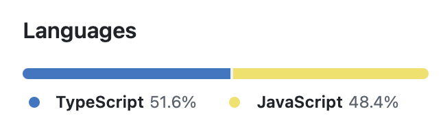
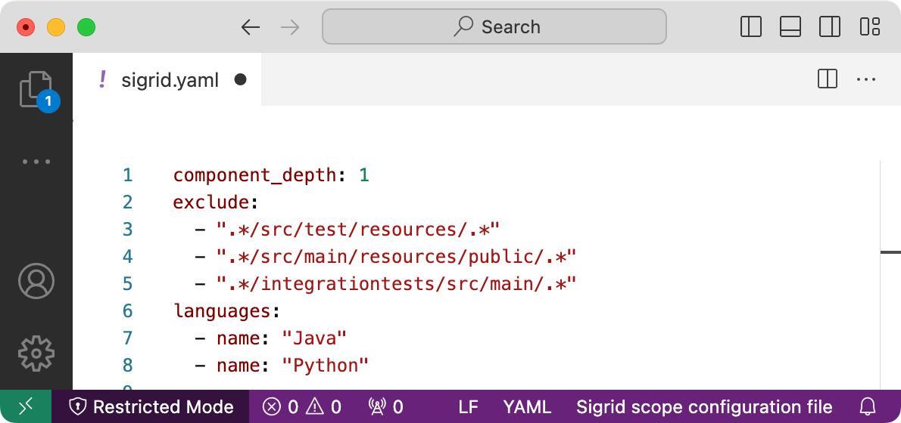
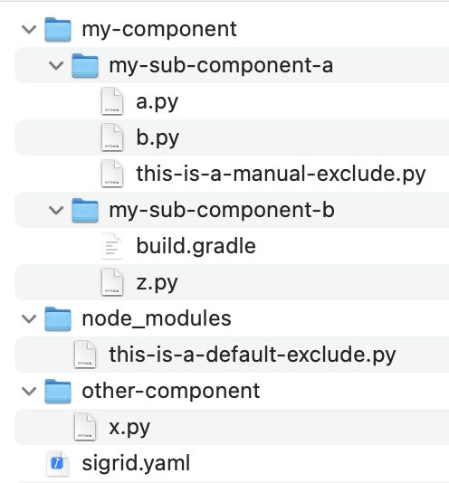
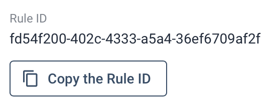

Analysis scope configuration
============================

You can change Sigrid's configuration for your project, to make Sigrid's feedback as useful and actionable as possible. We call this configuration "the scope", and customizing the configuration for your system is sometimes referred to as "scoping".

## Starting with your Sigrid configuration

You configure Sigrid by creating a file called `sigrid.yaml` in the root of your repository. When you publish your repository to Sigrid, it will pick up the `sigrid.yaml` file. 

The `sigrid.yaml` file supports a lot of options to configure and customize Sigrid. And we mean *a lot* of options, as you can see from the length of this page!

The following example shows a minimal `sigrid.yaml` file that should help you to get started:

    languages:
      - name: TypeScript
      - name: JavaScript
      
So what do these options actually do?

- The `languages` option lists all technologies in your system. You can find the list of supported technology names in the first column of [the technology support list](technology-support.md#list-of-supported-technologies).

If you're not sure what technologies you repository is using, and you're using a development platform like GitHub or GitLab, you can find this information on your repository's dashboard page. For example, this GitHub repository would result in the list of technologies used in the example above:

Of course, you can always extend this simple example by adding additional configuration. The remainder of this page describes the various configuration options and how to use them.

## Editing scope files

Since scope files are part of your repository, you can edit them using your preferred text editor. Sigrid scope configuration files are registered with [SchemaStore.org](https://schemastore.org), which means you get IDE features like content assist and error detection while you're editing the file. 

- In [Visual Studio Code](https://code.visualstudio.com), support is automatically provided if you have installed the [YAML Language Support extension](https://marketplace.visualstudio.com/items?itemName=redhat.vscode-yaml). If you open a file called `sigrid.yaml`, Visual Studio Code will automatically identify the file as a Sigrid configuration file, as seen in the bottom right of the screenshot below.

- In [JetBrains IDEs](https://www.jetbrains.com), which include IntelliJ IDEA, WebStorm, and PyCharm, you can get editor support by selecting *Sigrid scope configuration file* in the bottom right of the editor window. After you have done this the first time, the IDE will automatically provide editor support when you open other `sigrid.yaml` files in the future.

## Excluding files and directories

Sigrid will exclude common patterns by default. For example, directories like `build`, `dist`, and `target` typically contain build output and are not part of the source code. Directories like `node_modules` contain open source libraries and are not part of the application's own source code. Those directories are therefore ignored during the analysis. If you want to see a full list of files/directories that are automatically excluded by Sigrid, you can find [the list of default excludes on GitHub](https://github.com/Software-Improvement-Group/sigridci/blob/main/resources/default-excludes.txt).

It is possible to extend this list with project-specific files and directories that should also be excluded. The `exclude` section in the YAML file contains a list of regular expressions for paths to ignore. For example, `.*[.]out[.]js` will exclude all files with a name ending in `.out.js` from the analysis. Adding `.*/simulator/.*` will exclude everything in a path that contains the directory `/simulator/`.

Note that it is not necessary to exclude files and directories that would not be analyzed anyway.

Adding files and direcories to the top-level `exclude` option will *not* exclude those files and directories from the 
security scan. See [excluding files and directories from security scanning](#excluding-files-and-directories-from-security-scanning)
if you want to *also* exclude files/directories for security.
{: .warning }

Exclude patterns are defined using regular expressions, as explained in the next section.

### Defining include and exclude patterns

Various options across the scope configuration file allow you to define `include` and `exclude` patterns. At first glance, many people expect these patterns to behave like [Glob patterns](https://en.wikipedia.org/wiki/Glob_%28programming%29) (for example `*.py`), but Sigrid actually uses [regular expressions](https://en.wikipedia.org/wiki/Regular_expression) instead. The reason for this is fairly straightforward: regular expressions are more flexible, which is relevant considering the large number of technologies and conventions that Sigrid needs to support.

The following example specifies a component that includes all `.js` and `.jsx` files with a path that includes the `frontend` directory, except files ending with `.spec.jsx`:

    components:
    - name: "Our new React website"
      include:
      - ".*/frontend/.*[.]jsx?"
      exclude:
      - ".*[.]spec[.]jsx?" #excluding all `spec.js` files from this component, wherever they are; alternatively, limiting to files within a `/frontend/` directory tree, `.*/frontend/.*[.]spec[.]js`
          
When you specify both `include` and `exclude` patterns, the exclude patterns take precedence. In this example, the file `frontend/home.jsx` would be included, but the file `frontend/example.spec.jsx` would be excluded. This is much easier and more maintainable than trying `.*(?<![.]spec)[.]jsx?` under `include`, even though that would work.

Since we know that spec.js files are meant to be test files, what you probably want in this case is to make this distinction according to its context: 

    components:
    - name: "Our new React website"
      include:
        - ".*/frontend/.*[.]jsx?"
      exclude:
        - ".*[.]spec[.]jsx?"

As a convention, all `include` and `exclude` patterns always start with `.*/`. It is tempting to always define patterns relative to the root of the codebase, but it is important to realize that what is considered the "root" is flexible in Sigrid. Depending on how you [map your repositories to systems](../organization-integration/systems.md), the root of your repository might not match the root of the Sigrid system that contains your repository. Starting all patterns `.*/` will avoid confusion in such situations.

In rare cases, you might see files ending up in a Remainder component, even though your YAML file seems correct. This might be due to non-printable characters (e.g. zero-width spaces). You can use an IDE or text editor to double-check if your project uses non-printable characters in file names.
{: .attention }

### Tips and caveats when using regular expressions to define patterns

- The full file path must always be matched instead of (part of) a filename. This generally requires some wildcards.
- All patterns are case-sensitive. This is relevant in case you are specifically searching for naming in camelCase or PascalCase. It is then useful to search for files like `SomeTest.java`.
- You are entering patterns within YAML. YAML uses backslashes for escape characters. So if you want to use backslashes inside of your regular expressions, for example `\S+` (i.e. "one or more non-whitespace characters"), you will need to escape the backslash: `\\S+`.
- If you want to express a literal dot `.`, use `[.]`. This means: 1 character in a group where only `.` is permitted.
- Since the commonly used `.*` is greedy, with deep directory structures it may happen that your search term appears in other places than you want, e.g. deeper level directories. Being as specific as possible helps you catch the right folders and files. Commonly, you might be looking for specific file names, while those same search terms should not appear in directory names. For example, you may search for files with *Build* in the name, but avoiding */Build/* directories, since those may contain generated or compiled code. To find filenames specifically, or whenever you want to avoid a deeper level directory, a useful pattern is `[^/]*` or `[^/]+`. This pattern consumes characters as long as it does not find a `/`. When used as `/[^/]*[.]java` it will ensure to catch a filename ending with `.java`. You could also have defined a character set that excludes the folder separator *"/"* with a set like `.*/[\\w-][.]java`, but this is prone to omissions.  
- Abide by the developer wisdom that solving a problem with a regular expression leads you to have 2 problems. Regular expressions are powerful and may even be fun, but try to match your needs with the simplest possible pattern. Matching "positive" patterns, including the `exclude` option, is far easier than trying with e.g. negative lookaheads `(?!..)`, because catching a full file path is difficult with its non-capturing behavior. There are cases where patterns may work such as `((?![unwanted string]).)+`, but these cases are hard to get right and debug. Also, negative lookbehinds (`?<!`) are not recommended ([rather use an `exclude` pattern as above](#defining-include-and-exclude-patterns)), because they require a known character length and position. 

## Defining technologies

The `languages` section lists all languages that you want Sigrid to analyze:

    languages:
      - name: Csharp
      - name: Java
      - name: Python
      - name: Typescript

Refer to the first column in the [list of supported technologies](technology-support.md) for an overview of all supported technologies and the names that can be used.

### Overriding automatic technology and test code detection

When you add a technology to your scope file, Sigrid will try to locate the corresponding files based on file and directory name conventions. This includes automatic detection of test code. For example, Java-based projects typically use `src/main/java` for production code and `src/test/java` for test code.

This automatic detection is usually sufficient for the majority of projects. However, if you are using less common frameworks or a custom naming convention, you will need to tell Sigrid where it can find the test code. Like other parts of the scope file, this is done using regular expressions:

    languages:
      - name: Java
        production:
        test:
          include:
            - ".*/our-smoke-tests/.*[.]java"

This example will classify all Java code in the `our-smoke-tests` directory as test code. The patterns for test code take precedence over the patterns for production code.   

If you choose to manually override the technology detection, be aware that every file must match a single technology. If you define overlapping patterns where multiple technologies "claim" the same file, the first matching technology will be used.
{: .warning }

## Defining components

By default, Sigrid will automatically detect your system's component structure based on SIG's knowledge base. Those components and sub-components will then be used across Sigrid.

In some cases, you might want to customize the component structure. For example, you might be using a project-specific component structure, or you might be using technologies for which the component structure is not yet part of SIG's knowledge base. In these situations, you can manually define your components in the `sigrid.yaml` file.

There are multiple options for defining your components manually. We will use a simple test project to explain how each option works.

### Automatic component detection

You don't have to do anything or add configuration to make Sigrid use automatic component detection. This is what Sigrid does out-of-the-box. In other words: Automatic component detection will be used by default. 

If you're using mainstream technologies, we recommend you use Sigrid's automatic component detection so that you don't need to manually configure everything. Also, it will ensure your Sigrid component structure remains up-to-date, even when your project changes over time. In contrast, if you configure your components manually, you will also need to update the configuration whenever your component structure changes.
{: .attention }

### Manually define components using directory depth

`component_depth: <number>` will turn all directories at the specified depth into components. In the example,  `component_depth: 1` would result in two components: `my-component` and `other-component`. The `node_modules` directory will *not* turn into a component, as this directory contains [NPM libraries](https://www.npmjs.com) and is therefore automatically excluded by Sigrid. In general, Sigrid will automatically exclude files that are not relevant, so you only need to define components for "your" code.

### Manually define components using base directories

The `component_base_dirs` option allows you to define a list of directories, and all subdirectories *within* those directories will then be used as components. Components should be written literally, **without** regular expression patterns (e.g. `\\s` for an empty space). Starting- and ending forward slashes `/` should be omitted. Let's try this on the example project:

    component_base_dirs:
      - "my-component"
      - ""
      
This will give you 3 components: `my-sub-component-a`, `my-sub-component-b`, and `other-component`. As you can see, this option is more powerful than `directory_depth` and allows you to create more advanced component structures like the asymmetrical structure in the example. The example also shows the downside: It's more complicated.

If you use the special name `"Root files"`, all files located in the root of the system will be grouped into one top-level component. This is the same behavior that is used by the [automatic component detection](#automatic-component-detection).

### Manually define components by listing file and directory patterns

If the previous options are still not powerful enough, the last option is to define a completely custom component structure:

    components:
      - name: North
        include:
          - ".*/my-sub-component-a/.*"
          - ".*/my-sub-component-b/.*"
        exclude:
          - ".*/b[.]py"
      - name: South
        include:
          - ".*/other-component/.*"
          - ".*/b[.]py"
          
As you can see, this allows you to manually define every single component. Each component can include certain directories and/or files, both of which can be specified using regular expressions.

This option is extremely flexible, but it's also extremely maintenance intensive. Using this option means you will need to update your Sigrid configuration whenever you make changes to your project structure. Also, because you're listing individual files and directories, Sigrid will not be able to automatically detect sub-components when using this option. We therefore recommend you only use this option if you have extremely specific needs that cannot be addressed by any of the other options.
{: .warning }

## Configuring the SIG Maintainability Model version

By default, your configuration will use the latest version of the [SIG Maintainability Model](https://www.softwareimprovementgroup.com/software-analysis/), which is based on the [ISO 25010 standard for software product quality](https://www.iso.org/standard/35733.html).

You can customize this by adding a `model` entry to your configuration. For example, adding `model: "2020"` will analyze your system using the 2020 of the SIG Maintainability Model. You can use this option to ensure your system is analyzed using a specific version of the model. However, in most cases you'll want to use the latest version, as the SIG Maintainability Model is recalibrated on a yearly basis to reflect industry best practices.

## Open Source Health

Open Source Health allows you to scan all open sources libraries used by your system, and identify risks such as security vulnerabilities or heavily outdated libraries.

Open Source Health will run automatically if you have the corresponding Sigrid license. You can *optionally* add the following section to your scope configuration file to configure the analysis. 

    dependencychecker:
      blocklist:
      - ".*companyname.*"
      transitive: false
      exclude:
        - ".*/scripts/.*"
        
The `dependencychecker` section supports the following options:

| Option name  | Required? | Description                                                                                                                                                                           |
|--------------|-----------|---------------------------------------------------------------------------------------------------------------------------------------------------------------------------------------|
| `enabled`    | No        | By default, the Open Source Health analysis will run automatically if you have the corresponding Sigrid license. You can set this option to false to expliciyly disable the analysis. |
| `blocklist`  | No        | See [defining a blocklist](#defining-a-blocklist).                                                                                                                                    |
| `transitive` | No        | When true, also scans the dependencies of your dependencies. Defaults to false.                                                                                                       |
| `exclude`    | No        | See [exclude Open Source Health risks](#exclude-open-source-health-risks).                                                                                                            |
| `model`      | No        | SIG Open Source Health model version that should be used for the analysis, defaults to latest.                                                                                        |
| `source`     | No        | See [configuring SBOM import](#configuring-sbom-import).                                                                                                                              |

### Defining a blocklist

Sigrid will normally scan all open source libraries it can find in your codebase. If you want to exclude certain internal libraries from scanning, you can define a "blocklist". Any library with a name matching the blocklist will *not* be scanned by Sigrid.

    dependencychecker:
      blocklist:
        - ".*companyname.*"

In this example, any open source library with "companyname" anywhere in the name will not be scanned by Sigrid. The blocklist supports regular expressions, making it easier to exclude libraries in bulk.

### Exclude Open Source Health risks

In certain situations you can decide to [exclude Open Source Health risks](../capabilities/system-open-source-health.md#excluding-risks). This is done using the `exclude` option, which can be used in multiple different ways:

    dependencychecker:
      blocklist:
        - ".*companyname.*"
      exclude:
        - ".*/scripts/.*" # Shorthand notation, same as the "path" option below.
        - path: ".*/tools/.*" # Excludes all libraries found in files matching the specified path.
        - vulnerability: "CVE-2024-12345" # Excludes all vulnerabilities with the specified identifier.
        - license: "iTextSharp" # Excludes license risks for the specified library.
        - activity: "com.github.tomas-langer:chalk" # Excludes activity risks for the specified library.

Libraries and/or findings that are excluded using this option will not count towards the Open Source Health star rating, and will not be marked as risks in Sigrid.

The options for excluding paths, license risk, and activity risk all support regular expressions. The option to exclude vulnerabilities intentionally does *not* support regular expressions, as we believe there is no reasonable use case to start bulk-excluding vulnerabilities.

### Configuring SBOM import

By default, Sigrid will scan your code base for open source libraries. Optionally, Sigrid can *also* [import open source libraries from SBOM files](../integrations/integration-sbom.md). 

The open source libraries found in the SBOM are normally *added* to the open source libraries found by Sigrid. If you want Sigrid to *only* consider open source libraries found in the SBOM, you can use the following configuration option.

    dependencychecker:
      blocklist:
        - ".*companyname.*"
      source: sbom

Again, you only need this option if you are importing your own SBOM files, *and* you want Sigrid to only use those SBOM files for Open Source Health. Sigrid will still scan for *unmanaged* dependencies when you upload an SBOM. Consequently, you may not only see the libraries from your SBOM, but also the ones discovered by Sigrid as unmanaged dependencies.

## Security

Security will run automatically if you have the corresponding Sigrid license. You can *optionally* add the following section to your scope configuration file to configure the analysis.

### Third Party Findings

Sigrid uses a combination of its own security checks and security checks performed by third party tools. It then combines the results, benchmarks them, and reports on the overall results. As an example, the following configuration options are available to include or exclude certain code and/or security analyzers:

    thirdpartyfindings:
      exclude:
        - ".*/scripts/.*[.]sh"
      disabled_analyzers:
        - "Google ErrorProne"
        - "SemGrep"
      enabled_analyzers:
        - "VMWare CSA"

This `thirdpartyfindings` section in the scope file supports the following options:

| Option name              | Required? | Description                                                                                                                                                                          |
|--------------------------|-----------|--------------------------------------------------------------------------------------------------------------------------------------------------------------------------------------|
| `enabled`                | No        | By default, the security analysis will run automatically if you have the corresponding Sigrid license. You can set this option to false to expliciyly disable the security analysis. |
| `exclude`                | No        | See [excluding files and directories from security scanning](#excluding-files-and-directories-from-security-scanning).                                                               |
| `disabled_rules`         | No        | List of rule IDs that should be ignored during analysis.                                                                                                                             |
| `disabled_analyzers`     | No        | List of specific scanning tools that should be ignored during analysis.                                                                                                              |
| `enabled_analyzers`      | No        | List of specific scanning tools to enable (if not enabled by default).                                                                                                               |

### Excluding files and directories from security scanning

You can use the `exclude` option to exclude certain files and directories from the security scan.

    thirdpartyfindings:
      exclude:
        - ".*/stub/.*"

Like other include/exclude patterns in Sigrid, these options are defined using
[refular expressions](#defining-include-and-exclude-patterns).
The example above will therefore exclude all files in the directory `stub`.

### Excluding security rules

The `disabled_rules` and `disabled_analyzers` both allow you to customize which security rules are used during the analysis. The `disabled_rules` option allows you to disable individual rules, if you consider them too "noisy" or not applicable for your system. 

If you want to exclude a certain rule and add it to the `disabled_rules` list, you can find the corresponding rule ID in Sigrid's finding page:

The `disabled_analyzers` option is simular, but allows you to disable *all* rules produced by a specific analysis tool. You can see the list of enabled analyzers in your Sigrid security overview, if you [group by finding and then by origin](../capabilities/system-security.md#different-possible-grouping-of-security-findings). For the list of all supported analyzers, see [the technology support section](technology-support.md#supported-security-analyzers).

## Architecture Quality

Architecture Quality is available by default. However, you can still use the various scope file options to customize your analysis. The options related to architecture live in the `architecture` section in the scope file.

    architecture:
      # options go here
      
<iframe width="560" height="315" src="https://www.youtube.com/embed/0p3ADGyg9nI?si=jKJ72GbFpTqZ7fbK" title="YouTube video player" frameborder="0" allow="accelerometer; autoplay; clipboard-write; encrypted-media; gyroscope; picture-in-picture; web-share" allowfullscreen></iframe>

The `architecture` section of the scope file supports the following options:

| Option                     | Required | Description                                                                                                                                  |
|----------------------------|----------|----------------------------------------------------------------------------------------------------------------------------------------------|
| `model`                    | No       | SIG Architecture Quality Model that should be used for the analysis, defaults to latest.                                                     |
| `exclude`                  | No       | See [Excluding files and directories for Architecture Quality](#excluding-files-and-directories-for-architecture-quality).                   |
| `add_dependencies`         | No       | See [Manually specifying architecture dependencies](#manually-specifying-architecture-dependencies).                                         |
| `remove_dependencies`      | No       | See [Manually specifying architecture dependencies](#manually-removing-architecture-dependencies).                                           |
| `undesirable_dependencies` | No       | See [Highlighting undesirable dependencies](#highlighting-undesirable-dependencies).                                                         |
| `add_system_elements`      | No       | See [Manually specifying architecture elements](#manually-specifying-architecture-elements).                                                 |
| `grouping`                 | No       | See [Grouping and annotating components in Architecture Quality](#grouping-and-annotating-components-in-architecture-quality).               |
| `component_roles`          | No       | See [Labeling components to communicate their role in the architecture](#labeling-components-to-communicate-their-role-in-the-architecture). |
| `history_period_months`    | No       | See [Analyzing your repository history](#analyzing-your-repository-history).                                                                 |
| `history_start`            | No       | See [Analyzing your repository history](#analyzing-your-repository-history).                                                                 |
| `history_end`              | No       | See [Analyzing your repository history](#analyzing-your-repository-history).                                                                 |

### Analyzing your repository history
      
Architecture Quality analyzes both your source code and the repository history. See the [frequently asked questions for architecture quality](../capabilities/faq-architecture.md) for more information on how the repository history is analyzed.

When you publish your repository history to Sigrid, it is automatically picked up by the Architecture Quality analysis without needing further configuration. By default, Sigrid will analyze the repository history for the last year. If you want to change this to a different period, you can manually specify the time period that should be analyzed:

    architecture:
      history_period_months: 6
      
This example will change the default period of 12 months, and instead analyze only analyze the last 6 months of history. If you want to go even further, it is also possible to define an exact start date:

    architecture:
      history_start: "2023-01-01"

### Manually removing architecture dependencies

Sigrid's dependency detection is based on statis analysis and heuristics. This means that, unfortunately, Sigrid will occasionally detect depenencies that aren't really there. It is possible to override the analysis and remove these dependencies in the configuration:

    architecture:
      remove_dependencies:
        - source: "frontend"
          target: "backend"

This will remove all dependencies from the component called "frontend" to the component called "backend". This works for both dependencies between top-level components and dependencies between sub-components. Also, the `source` and `target` options support regular expressions, so you can easily remove all dependencies matching a certain pattern.

When dependencies are removed, they are removed across Sigrid: They will no longer show in the architecture view, they will no longer show in the the Code Explorer, and they will no longer counts towards the ratings.
      
### Manually specifying architecture dependencies

Although Sigrid supports hundreds of technologies, there is always the possibility that Sigrid doesn't automatically detect the dependencies for your particular framework. It is therefore possible to manually define additional dependencies, which will be added on top of the automatic dependency detection:

    architecture:
      add_dependencies:
        - source: backend
          target: frontend
          type: code_call
            
The names for the `source` and `target` fields are the same you see in Sigrid's user interface. The `type` field indicates the type of dependency that should be added, for example a code call versus an interface call. The list of supported dependency types can be found in the [Architecture Quality documentation](aq-json-export-format.md).
        
### Excluding files and directories for Architecture Quality

The `architecture` section in the configuration has its own `exclude` option, which can be used to exclude certain files and directories from the Architecture Quality analysis.

    architecture:
      exclude:
        - ".*/index[.]ts"
        
The list of exclude patterns works in the same way as the global, top-level `exclude` option. The difference is the global option excludes files and directories from *all* Sigrid capabilities, and the architecture `exclude` option excludes them from Architecture Quality but not from other Sigrid capabilities. See the [pattern section](#defining-include-and-exclude-patterns) for more information on writing these patterns.

### Highlighting undesirable dependencies

Architecture Quality allows you to [mark certain dependencies as undesirable](../capabilities/architecture-quality.md#highlighting-undesirable-dependencies). You can configure which dependencies should be considered undesirable:

    architecture:
      undesirable_dependencies:
        - source: "backend"
          target: "legacy"
            
This example will mark all dependencies from the "backend" component to the "legacy" component as "undesirable". The `source` and `target` options support regular expressions, for situations where you want to mark all dependencies matching a certain pattern as undesirable. 

It is possible to combine the `undesirale_dependencies` with the [grouping option](#grouping-and-annotating-components-in-architecture-quality). This allows for some power user workflows: where you first define groups based on your target architecture, and then define how those groups should communicate with each other.

You can also use additional options to be more specific about *which type* of dependencies are undesirable:

    architecture:
      undesirable_dependencies:
        - source: "backend"
          target: "legacy"
          bidirectional: true
          type: code_call

Adding `bidirectional: true` means the dependencies are undesirable in both directions. This is basically a shorthand notation so that you do not have to configure both `A -> B` and `B -> A` separately. The `type` option can be used to only consider certain types of dependencies. In the example, since one type has been defined, code dependencies are undesirable but other types (such as interface dependencies) are still allowed. The list of supported dependency types can be found in the [Architecture Quality documentation](aq-json-export-format.md).

### Manually specifying architecture elements

The term "system element" is used for all information that is depicted as "blocks" in the Architecture Quality view. Common examples are components, files, or databases. Normally, this detection of system elements is based on Sigrid's code analysis. However, it is possible to extend the list of system elements in the configuration. This is intended for situations where the architecture view would become considerably more clear by adding some context, but this context cannot be detected automatically.

    add_system_elements:
      - name: accounts
        type: code_component
      
The following example adds a component called "accounts" to the architecture view. Refer to the [Architecture Quality documentation](aq-json-export-format.md) for an overview of all supported sytem element types. This same option can also be used to manually add [architecture observations](aq-json-export-format.md#architecture-observations) that are then visualized in Sigrid.

### Grouping and annotating components in Architecture Quality

You can define architecture groups and annotations, and these annotations are then [displayed on top of the architecture visualization](../capabilities/architecture-quality.md#grouping-and-annotating-components). As with the other customization options, this is done in the configuration:

    architecture:
      grouping:
        - name: "Title of my architecture group"
          include:
            - some_component
            - other_component
          annotation: "Slightly longer text that adds more context beyond just the name."
        
The contents of the `include` option refer to the component names you see in Architecture Quality. You can either use the exact component names, or you can use regular expressions. For example, using `target: backend.*` will match all components that have a name starting with "backend". Note you are matching the component name, not the files *within* the component.

### Labeling components to communicate their role in the architecture

You can designate architecture roles to components via the `component_roles` secton, allowing users to [indicate intentional architectural design decisions and have Sigrid's quality scoring reflect this](../capabilities/architecture-quality.md#labeling-components-to-communicate-their-role-in-the-architecture). 

At the time, one role is able to be assigned to a component, `Utility. This label is inherited by all child artifacts/sub-components found within the specified parent component. With this role in place, those labeled components (and their child/sub-components!) will not be evaluated for the Component Coupling and Component Adjacency system property ratings under the Architecture Quality module. As with the other customization options, this is done in the configuration:

    architecture:
      component_roles:
        - role: utility
          include:
            - ".*core-.*"

## Enabling experimental analysis features

If you add `experimental: true` to your scope file, you opt in for enabling experimental analysis features before they become generally available. The exact list of which features are considered "experimental" is constantly in flux, and is therefore not explicitly included in this documentation. You can enable this option if you prefer to use new features immediately. 

## Configuring multi-repo systems

Sigrid allows you to create ["multi-repo systems"](../sigridci-integration/development-workflows.md#combining-multiple-repositories-into-a-single-Sigrid-system) that are the combination of multiple repositories in your development environment. In this situation, each individual repository within the system is referred to as a "subsystem". Such a view is more high-level than looking at individual repositories, and is sometimes a better fit if you want to align on Sigrid findings with stakeholders from outside the development organization.

Since multi-repo systems are used to create a *shared* view, they also require shared [objectives](../capabilities/objectives.md) and a shared configuration. The latter creates an obvious problem: if the configuration file is normally located in the root of the repository, how does that work when there are multiple repositories?

In such a situation, you can use [Sigrid CI](client-script-usage.md) to manage the shared configuration:

- Publishing with `--system mybank --subsystem mybank-backend` will publish the code for the subsystem "mybank-backend" within the system "mybank".
- Publishing with `--system mybank --subsystem mybank-frontend` will publish the code for the subsystem "mybank-frontend" within the system "mybank".
- Publishing with `--system mybank --subsystem root` allows you to publish code to the root of the system "mybank", i.e. files that are not bound to a specific system. This includes the configuration file `sigrid.yaml`, so this can be used to update `sigrid.yaml` programmatically.

## Managing the scope configuration file separate from your repository

We recommend you add `sigrid.yaml` to your repository, so that it is automatically in sync with the source code and part of versions control. However, is it possible to retrieve and/or update the scope configuration file *without* making the `sigrid.yaml` file part of your repository.

- If you want to *retrieve* the scope configuration file used by Sigrid, you can use the [Sigrid API](../integrations/sigrid-api-documentation.md). You can also use the [example code on GitHub](https://github.com/Software-Improvement-Group/sigrid-integrations/tree/main/get-scope-file) for this.
- If you want to *update* the scope configuration file, independently of your source code, you can still use [Sigrid CI](client-script-usage.md). You can also use the [example code on GitHub](https://github.com/Software-Improvement-Group/sigrid-integrations/tree/main/get-scope-file) for this.

## Removing the scope configuration file

Once you have decided to create a scope configuration file to customize your Sigrid configuration, there is no way to go back. If you try to delete the `sigrid.yaml` file from your repository, you will receive an error message when trying to run Sigrid CI.
          
## Sigrid metadata

`sigrid.yaml` is used for *analysis* configuration. It is also possible to configure Sigrid *metadata*. See the [Sigrid metadata](../organization-integration/metadata.md) section for the various ways you can update this metadata.

## Contact and support

Feel free to contact [SIG's support team](mailto:support@softwareimprovementgroup.com) for any questions or issues you may have after reading this documentation or when using Sigrid.
