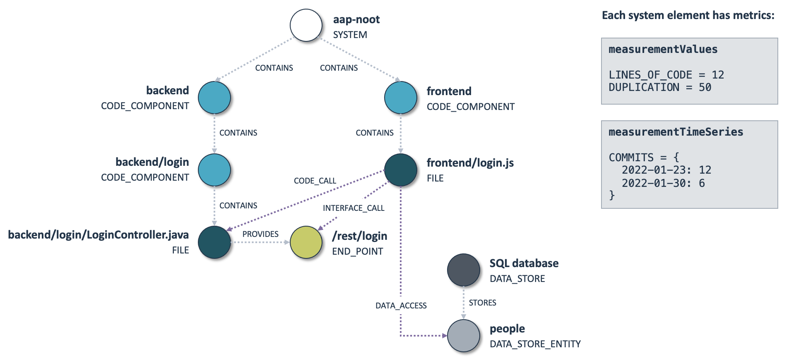

Architecture Quality JSON format
================================

In most cases, you can use Sigrid's [Architecture Quality](../capabilities/architecture-quality.md) capability
without any need to think about its internal structure. However, power users may need this information when
integrating their existing systems with Sigrid's Architecture Quality. This is usually for one of the following
reasons:

- You want to customize the Architecture Quality [configuration](analysis-scope-configuration.md).
- You want to extract Architecture Quality data using the [Sigrid API](../integrations/sigrid-api-documentation.md), to integrate
  this data with one of your own systems.
  
In those situations, you will need to process the "raw" architecture graph beyond Sigrid's user interface. This
page explains the internal structure of this data.

## The architecture graph

The architecture is represented by a graph structure, and the JSON file containing the analysis results is basically
the JSON representation of the graph. In this graph, system elements are nodes and dependencies between those system 
elements are edges. Note that *all* relations between system elements are represented by those edges, including 
parent/child relations. This is explained in more detail in the sections below.



Each system element has two types of measurement results:

- `measurementValues` refers to metrics based on the system element's current state.
- `measurementTimeSeries` refers to metrics based on the system element's change history. Time series are aggregated
  by interval, e.g. per week or per month. Retaining the full change history for each system element would lead to
  an unmanagable amount of data, so this aggregation is necessary to ensure adequate performance. 

## Example JSON file

The example shows a JSON file for a very small system. Note that is a different example than the one shown in the 
picture in the previous section.

```
{
  "partner": "sig",
  "customer": "examplecustomername",
  "system": "examplesystemname",
  "metadata": {
    "scopeFile": "...",
    "analysisDate": "2019-03-01 10:20:58",
    "modelVersion": "1.3",
    "historyInterval": "WEEK",
    "historyStartDate": "2023-02-04 12:34:56",
    "historyEndDate": "2023-08-14 12:34:56",
    "historyCommitCount": 123
  },
  "snapshot": {
    "date": "2019-03-01 10:20:58"
  },
  "systemElements": [
    {
      "id" : "fc570496-c70a-11e8-a8d5-f2801f1b9fd1",
      "name": "nl.sig:aap",
      "shortName": "aap",
      "type": "CODE_COMPONENT",
      "measurementValues": {
        "LINES_OF_CODE": 123
      },
      "measurementTimeSeries": {
        "CHURN": {
          "dataPoints": {
            "2021-01-03": 100,
            "2021-01-10": 200
          },
          "averageValue": 150
        }
      },
      "observations": ["USER_INTERFACE_WEB"],
      "technology": {
        "name": "Java",
        "type": "CODE",
        "contextName": "java"
      }
    }
  ],
  "dependencies": [
    {
      "sourceElementId": "fc570496-c70a-11e8-a8d5-f2801f1b9fd1",
      "targetElementId": "fc570496-c70a-11e8-a8d5-f2801f1b9fd2",
      "type": "CODE_CALL",
      "count": 2
    }
  ]
}
```
## Field explanations

**Note:** The documentation covers all supported fields. The actual JSON output might include additional fields that are not listed below. Any fields not covered by this documentation should be considered experimental.

| Field                               | Description                                                                                                    |
|-------------------------------------|----------------------------------------------------------------------------------------------------------------|
| partner                             | Used as part of the system ID (partner/customer/system).                                                       |
| customer                            | Used as part of the system ID (partner/customer/system).                                                       |
| system                              | Used as part of the system ID (partner/customer/system).                                                       |
| metadata.scopeFile                  | The textual contents of the YAML scope configuration file.                                                     |
| metadata.analysisDate               | The analysis date/time in ISO 8601. Note this date could be different from the snapshot that was analyzed.     |
| metadata.modelVersion               | Architecture Quality Model version used for the analysis.                                                      |
| metadata.historyInterval            | Time series interval used for repository history analysis, either `WEEK` or `MONTH`.                           | 
| metadata.historyStartDate           | Used for repository history analysis in ISO 8601, absent if history is not available.                          |
| metadata.historyEndDate             | Used for repository history analysis in ISO 8601, absent if history is not available.                          |
| metadata.historyCommitCount         | Number of commits used for the repository history analysis, absent if history is not available.                |
| snapshot.date                       | Date/time in ISO 8601 format, corresponding to the version of the code that was analyzed.                      |                       
| systemElement.id                    | ID based on the system element's fingerprint. System elements will retain the same ID across subsequent scans. |
| systemElement.name                  | Full/long name. Not unqiue.                                                                                    |
| systemElement.shortName [4]         | Short/display name. Not unique. Optional field, use `name` when not specified                                  |
| systemElement.type                  | See the [list of system element types](#system-element-types) below.                                           |
| systemElement.measurementValues     | Maps metric names to numerical metric values, for metrics based on source code analysis.                       |
| systemElement.measurementTimeSeries | Maps metric names to time series, for metrics based on change history.                                         |
| systemElement.observationType       | See the list of [architecture observations](#architecture-observations) below. Optional field. [1]             |
| systemElement.technology            | Indicates this is a technology-specific system element. Optional field. [2]                                    |
| systemElement.annotation            | Text description that provides information for system elements. Optional field, defined in configuration. [3]  |
| dependency.id                       | ID based on the dependency's fingerprint. Dependencies will retain the same ID across subsequent scans.        |
| dependency.sourceElementId          | Refers to one of the entries in `systemElements`.                                                              |
| dependency.targetElementId          | Refers to one of the entries in `systemElements`.                                                              |
| dependency.type                     | See the [list of dependency types](#dependency-types) below.                                                   |
| dependency.description              | Optional field. Text description of that the dependency is.                                                    |
| dependency.count                    | Describes the number of dependencies. Optional, assume 1 when not specified.                                   |
| dependency.undesirable              | Dependency is considered undesirable as specified in the scope file. Optional field, defaults to false.        |
| technology.name                     | Technology display name, for example "C++".                                                                    |
| technology.contextName              | Technology ID, for example "cpp".                                                                              |

Notes:

1. Only available for system elements of type `OBSERVATION`.  
2. Only available for system elements of type `FILE`.
3. Only available for system elements of type `GROUPING`.
4. For components, the `shortName` field is intended to be used as the display name.

## System element types

| Type              | Description                                                                                              |
|-------------------|----------------------------------------------------------------------------------------------------------|
| CODE_COMPONENT    | Component in the architecture's development view. Large systems can have multiple levels.                |
| DATA_STORE        | Database or equivalent.                                                                                  |
| DATA_STORE_ENTITY | Entity within a data store (i.e. table in a SQL database).                                               |
| END_POINT         | Exposed part of an interface.                                                                            |
| FILE              | File in scope as part of the analysis.                                                                   |
| GROUPING          | Logical grouping defined in configuration. Used only for interpretation, doesn't influence the analysis. |
| MIDDLEWARE        | Interfaces with the system, but does not contain source code itself.                                     |
| OBSERVATION       | Architecture observation. See the list of [architecture observations](#architecture-observations) below. | 
| SYSTEM            | Root element. Only one element with this type will be included in the results.                           |

The terminology for "system" is somewhat ambiguous. This term is sometimes used to describe individual repositories,
and sometimes used to describe the entire product. In the context of this JSON file the root system element simply
refers to the scope at which the analysis was performed, regardless of whether this describes a single repository or
a multi-repo system.

Files in the root of a component are grouped into a "virtual component", since this allows for better readability in 
Architecture Quality compared to depicting every single file individually. These virtual components have 
`{path}$Files` as their full name, and `Files` as their short name. The same logic is applied to files that exist
in the root of the component.

### Dependency types

Dependency types are considated into three "families":

- **Hierarchy dependencies** indicate parent/child relations between system elements. The graph supports multiple 
  aggregation hierarchies, so a system element can have multiple parents. However, it can only have a single parent of
  the same type. Having multiple aggregation hierarchies allows us to provide multiple architecture views, in
  particular to separate the development view from the runtime view. 
- **Call dependencies** are conventional code/interface/data dependencies, where a change in the callee necessitates
  a change in the caller.
- **Hidden dependencies** are relations between system elements that do not "physically" exist in the source code,
  but that indicate parallel evolution over time. Links between architecture observations and system elements are
  also considered hidden dependencies.

| Type             | Type family          | Description                                                          |
|------------------|----------------------|----------------------------------------------------------------------|
| CONTAINS         | Hierarchy dependency | Parent/child relation in the static architecture.                    |
| GROUPS           | Hierarchy dependency | System element is part of a `GROUPING` defined in the configuration. |
| PROVIDES         | Hierarchy dependency | Indicates the code exposes an interface.                             |
| STORES           | Hierarchy dependency | Parent/child relation in the data architecture.                      |
| CODE_CALL        | Call dependency      | Static dependency within the same process.                           |
| DATA_ACCESS      | Call dependency      | Dependency from the static architecture to data.                     |
| INTERFACE_CALL   | Call dependency      | Dynamic dependency                                                   |
| CO_EVOLUTION     | Hidden dependency    | Parallel commit history between system elements. [1]                 |
| DUPLICATION      | Hidden dependency    | Duplicated blocks of code between system elements. [1]               |
| OBSERVATION_LINK | Hidden dependency    | Connects system elements to architecture observations.               |

[1] Duplication and co-evolution don't really differentiate between "source" and "target", such dependencies are
    pretty much bidirectional. For these types, dependencies from A to B should therefore be considered to
    dependencies from B to A.

### Architecture observations

| Observation            | Description                                                   | Visualized? |
|------------------------|---------------------------------------------------------------|-------------|
| COMMAND_LINE_INTERFACE | Can be called from the command line (i.e. `main` or similar). | No          |
| CONTAINER              | Deployed in a (Docker) container.                             | Yes         |
| EXTERNAL_SYSTEM        | Represents a system that is external to Sigrid.               | Yes         |
| STATEFUL               | Deployed as a stateful long-running component.                | No          |
| USER_INTERFACE_DESKTOP | Exposes a desktop interface (e.g. Java Swing).                | Yes         |
| USER_INTERFACE_MOBILE  | Deployed as a mobile application (i.e. iOS or Android).       | Yes         |
| USER_INTERFACE_WEB     | Exposes a web/browser interface.                              | Yes         |
| WEB_APP                | Deployed as a web back-end.                                   | No          |
