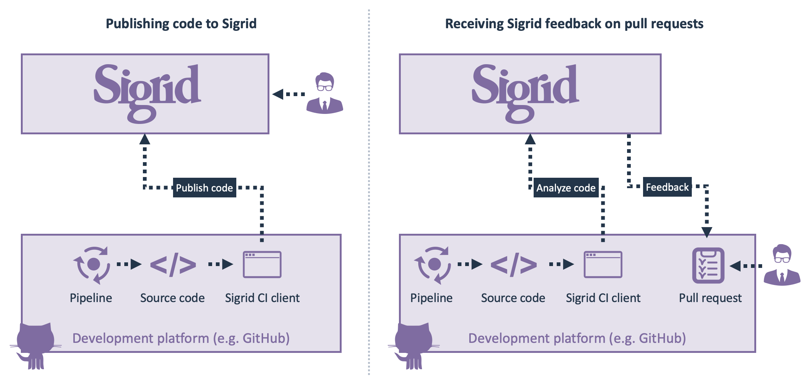

Using the Sigrid CI client scripts
==================================

Sigrid CI consists of a number of Python-based client scripts, that interact with Sigrid to support two different kinds of development process integration:

- To *publish* your code to Sigrid after every change. Publishing makes results available at https://sigrid-says.com for users who have access to the system.
- To *provide feedback* on your changes, which can be used when reviewing pull requests. Results are visible in your development environment (e.g. GitHub, Azure DevOps, GitLab), but are not published and are hence not visible at [sigrid-says.com](https://sigrid-says.com).

The [general Sigrid CI documentation](../sigridci-integration/development-workflows.html) contains instructions on how and when to use these scripts available within various development platforms. There are multiple options for making the Sigrid CI client scripts available to the pipeline, which are explained in the instructions for each respective development platform.

## Environment requirements

- Docker
- If you are *not* using Docker
  - Python 3.7 or higher
  - Git
  - To support custom runners and on-premise installations, the Sigrid CI client script intentionally does not require any [PIP](https://pypi.org/project/pip/) dependencies.

## Command line options

The script takes a limited number of mandatory arguments. However, Sigrid CI's behavior can be configured and customized using a large number of optional arguments that can be used to align Sigrid CI's behavior to your development team's workflow. The following arguments are available:

| Argument                      | Required | Example value       | Description                                                                                                                       |
|-------------------------------|----------|---------------------|-----------------------------------------------------------------------------------------------------------------------------------|
| `--customer`                  | Yes      | examplecustomername | Name of your organization's Sigrid account. Contact SIG support if you are not sure about this. [1]                               |
| `--system`                    | Yes      | examplesystemname   | Name of your system in Sigrid. Contact SIG support if you are not sure about this. [2]                                            |
| `--subsystem `                | No       | frontend            | Used to map between repository directory structure versus the one known by Sigrid. [5]                                            |
| `--source`                    | No       | .                   | Path of your project's source code. Use "." for current directory.                                                                |
| `--capability`                | No       | maintainability     | Comma-separated list of Sigrid capabilities (`maintainability,osh`). Default is maintainability.                                  |
| `--publish`                   | No       | N/A                 | Automatically publishes analysis results to Sigrid. [1]                                                                           |
| `--publishonly`               | No       | N/A                 | Publishes analysis results to Sigrid, but *does not* provide feedback in the CI environment itself. [3]                           |
| `--exclude`                   | No       | /build/,.png        | Comma-separated list of file and/or directory names that should be excluded from the upload. [4, 7]                               |
| `--include`                   | No       | /build/,.png        | Comma-separated list of file and/or directory names that should be included in the upload. [6, 7]                                 |
| `--showupload`                | No       | N/A                 | Logs the contents of the upload before submitting it to Sigrid.                                                                   |
| `--convert`                   | No       | beinformed          | Used for some technologies. See [technology conversion configuration](technology-support.md#technology-conversion-configuration). |
| `--out`                       | No       | /tmp                | Output directory for Sigrid CI feedback, default is `sigrid-ci-output`.                                                           |
| `--ignore-missing-scope-file` | No       | N/A                 | Don't fail if the `sigrid.yaml` scope file is missing (e.g. if it's provided through a different repository).                     |

Notes:

1. Customer names can only contain lowercase letters and numbers.
2. System names can only contain lowercase letters, numbers, and hyphens.
3. Typically, you would use the `--publish` option when committing to the main/master branch, and you would *not* use it for pull requests. See below for more information.  
4. These files and directories are excluded *on top of* Sigrid's default excludes. By default, Sigrid excludes things like third party libraries (e.g. `/node_modules/` for NPM libraries, build output (e.g. `/target/` for Maven builds), and generated code. 
5. See the section below for more details and its limitations.
6. Include can be used to narrow down the upload to specific folders and/or files. In addition, exclude can be used to exclude files and folders from the included folders.
7. Folders should always be surrounded by '/' characters

## What is the difference between `--publish` and `--publishonly`?

Sigrid CI can run in different "modes", depending on your [development process and workflow](../sigridci-integration/development-workflows.md). The following table shows what happens depending on the values of these options:

|                                  | **Publish to Sigrid** | **Do not publish to Sigrid** |
|----------------------------------|-----------------------|------------------------------|
| **Feedback on new/changed code** | `--publish`           | (normal)                     |
| **No feedback**                  | `--publishonly`       | (does not make sense)        |

So when to use these options:

- If you want feedback on your new/changed code, *without* publishing your code to Sigrid, run the script without the publish options. This is suitable for a workflow with pull requests, as you can use it to receive feedback on your pull request.
- If you want to publish your code to Sigrid, *and* you want Sigrid CI to give your feedback on your new/changed code, use the `--publish` option. This is suitable for people who use a workflow without pull requests where everyone is making changes to the main/master branch.
- If you want to publish your code to Sigrid, but do *not* want feedback on your new/changed code, use the `--publishonly` option.
  - This is suitable for merge commits to the main/master branch. In that situation, you do not need feedback, since you *already had* your feedback in the pull request and there is no reason to receive the same feedback again when merging your changes. 
  - Moreover, this publishes your code to Sigrid in a fire-and-forget fashion, which is faster since the script will not wait for the analysis to complete and will immediately exit. This is suitable for the main/master branch scenario described above, but can also be used in other situations where the fire-and-forget behavior is preferred.

## Letting Sigrid CI fail your pipeline

Sigrid CI returns a different exit code depending on whether you achieved or failed your
[quality objectives](#defining-quality-objectives). If you want to use Sigrid CI as a mandatory quality gate, 
you can use this exit code to fail your pipeline.

We actually recommend you do *not* fail your pipeline in this way. Ideally, you would use Sigrid CI feedback as input
for your code reviewer, with the final decision being up to the reviewer. Any form of automated quality check will
eventually produce results that are unfair, so we prefer leaving the final decision up to people. If you want to use
Sigrid CI in this way, you can make Sigrid CI a warning rather than an error. This is the default behavior that we
use in the configuration examples across the documentation.

However, we concede there are situations and organizations where people do want the pipeline to fail. You can use
the Sigrid CI exit code for this, and you can even make this behavior more nuanced based on the specific exit code:

- Exit code 0: All quality checks passed.
- Exit code 1: An error occurred while running Sigrid CI.
- Exit code 2: You failed your quality objective for Maintainability.
- Exit code 4: You failed your quality objective for Open Source Health.
- Exit code 8: You failed your quality objective for Open Source Health.

These exit codes "stack", so an exit code of 6 means you failed your quality objectives for both Maintainability
and Open Source Health.

## Defining quality objectives

Sigrid CI compares the quality of the new/changed code against the configured target quality level. The target is always relative to the thousands of other systems in the SIG benchmark. This means you do not need to fix every single minor issue, as long as the overall quality is OK you are still allowed to proceed.

By default, Sigrid CI will use the maintainability target you have defined for your system in Sigrid. This is the same target that is depicted in the "system objectives" list you see in Sigrid. See below:

If you do not set any objective, Sigrid CI will use a default target of 3.5 stars. This is the lower threshold of the better-than-average 4-star range. Four-star code quality is the level that SIG recommends for systems with modern technologies in active development.

## Using subsystems to combine repositories

Refer to the [documentation on mapping repositories to systems](../organization-integration/systems.md) for more information on when to combine multiple repositories into a single system in Sigrid.

The `--subsystem` option can be used to map multiple repositories to the same Sigrid system. The `--subsystem` parameter effectively moves the repository to a directory within the system that you defined as `--system`. An exception to the processing of `--subsystem` is when you add `--subsystem root`. This is reserved for files that you want to end up in the system's root directory. This is especially relevant when you are adding a `sigrid.yaml` file to a system that is combining repositories. Then you would use `--subsystem root` to make sure that the `sigrid.yaml` is published to the root of the system (thus, it is not interpreted as a subsystem called `root`, in which case it would have ended up as a separate directory). `Sigrid.yaml` files that are published inside a `--subsystem`, such as `--subsystem frontend` will be ignored.

Please add the `--subsystem` parameter to both the PR as the `--publish` or `--publishonly` runs if you use one of these 2 options.

If Sigrid CI runs for multiple subsystems of the same system in parallel the results might be inconsistent.
For example, you might get feedback on another component because you appear to be making changes.
This is because a parallel run changed the baseline since the start of your analysis.

To reduce the likelihood of inconsistencies, keep in mind the following guidelines:
- If you want to publish all repositories simultaneously, (e.g. on a schedule), combine them on your side and send the aggregate as a regular system.
- If the repositories of the system are very active and sees many merges (which result in parallel publishes) it is safer to use `--publishonly` than `--publish`.

If subsystems need to be removed from the system this can be done via the [Sigrid API](../integrations/sigrid-api-documentation.md#removing-subsystems)

## Connecting Sigrid CI using a proxy

If your environment requires a proxy to connect to the internet, you can configure Sigrid CI to use this proxy.
You define an environment variable `SIGRID_CI_PROXY_URL`, which will then be picked up by Sigrid CI. 
The value of this environment variable should be the complete proxy URL, so including the protocol, and also including user information if required. 

## Contact and support

Feel free to contact [SIG's support team](mailto:support@softwareimprovementgroup.com) for any questions or issues you may have after reading this document, or when using Sigrid or Sigrid CI. Users in Europe can also contact us by phone at +31 20 314 0953.
