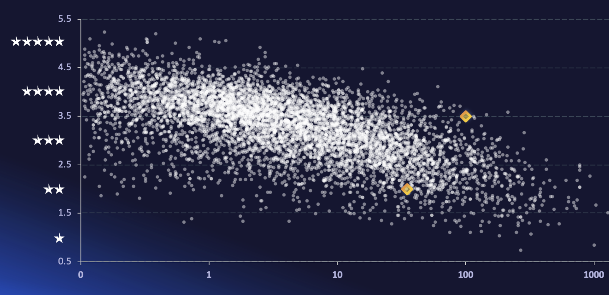
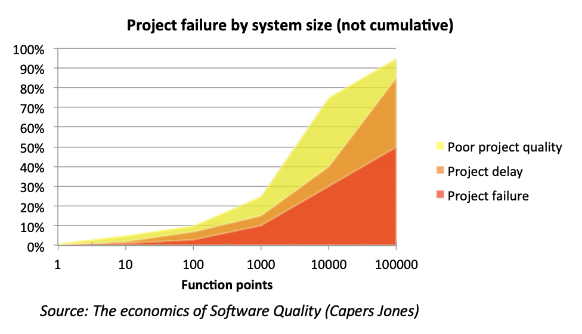
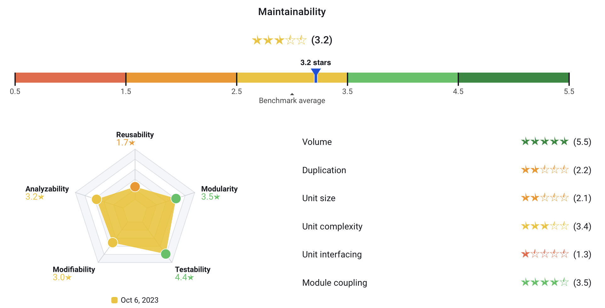

Key changes in the 2026 SIG quality models
==========================================

Every year, SIG updates its quality models to reflect industry trends. SIG's quality models reflect current
best practices, but best practices may change over time. Therefore, the quality models are updated every year,
based on the 30,000 systems in the SIG benchmark.

Model changes consist of three categories:

- **Recalibrate metrics:** All metrics in the model are based on benchmark data. The systems in the SIG benchmark
  evolve over time, so the metrics are recalibrated yearly to reflect the current state.
- **Add/change/remove metrics based on industry trends:** What was important in the past might not be important
  in the future. We want to keep the number of metrics in each quality model manageable, it's not a goal to have
  100 different metrics and overload people with information. Therefore, we don't just add new metrics, we also
  actively remove metrics if we believe they no longer reflect key issues.
- **Improve metric actionability based on modern best practices:** The goal of the quality models isn't just to
  measure, it's also to help people to improve their software. This makes it important to connect each metric
  to actionable insights.

This page contains an overview of key changes in the 2026 SIG quality models, which are used across Sigrid.

**The 2026 models have not yet been released.** The purpose of this page is to inform you of upcoming changes.
This page only covers key changes since the 2025 model. If you want to know more about the SIG quality models,
you can find a full overview of each model in the [quality model documentation](../sig-quality-models.md).
{: .attention }

## Changes in the 2026 SIG maintainability model

**The Volume system property has been removed from the maintainability model.** The volume system property 
has been part of the maintainability model since its introduction in 2008. The original reason for including it is
that system volume is an indicator for project size, and project size is in turn an indicator for project risk.

In fact, system volume continues to be a good indicator of project risk. So why remove it from the maintainability 
model? That relates to what we want to achieve with Sigrid. The maintainability model is used for assessment, but
it's no longer *only* used for assessment. It's now also, and arguably more importantly, used for continuous software
portfolio governance. The "continuous" part makes actionability a lot more important. Therefore, there are basically
two reasons for removing the Volume system property:

- Volume is not actionable for development teams. Sure, system volume is an indicator for project risk, but it is
  rarely possible to make a system incrementally smaller without also affecting its functional scope. This leads to
  a situation where Sigrid indicates a volume risk, but there is essentially nothing within the control of the 
  development teams that they can do to alleviate that risk.
- What is considered "a large system" is going to change significantly over the coming years due to the advent of
  AI coding assistants. In fact, code volume is no longer considered a reliable indicator of the amount of work
  that went into a system. The amount of AI-generated code has grown exponentially over the last few years, and we
  expect this trend to continue in 2026 and beyond. Removing the Volume system property ensures the maintainability
  model is also able to give actionable advice for AI-generated code.

This change is about Volume no longer counting towards the maintainability rating. This does **not** mean that
volume information will be removed from Sigrid altogether. You will still be able to see portfolio and system 
volume (in person years) across Sigrid. It will just not affect the maintainability rating anymore.
{: .faq }

Along with removing the Volume system property, we also changed **how system properties are aggregated to the
overall rating**. We used a "normal" mean in previous versions of the model, but we are switching the
[geometric mean](https://en.wikipedia.org/wiki/Geometric_mean). What this means in practice: Previously,
a single high rating for a single system property would "pull up" the overall rating. The following screenshot
shows this in action:

The overall rating of 3.2 stars seems extremely generous. Firstly, the system is small, so it's automatically
receiving a 5-star Volume rating. This will change with the removal of the Volume system property, which will make
the maintainability model more strict for (very) small systems and more lenient for large systems.

However, even with the removal of Volume, you still get an effect where a single high rating (like Module Coupling
in this example) pulls the overall rating towards 3 stars. This is a known effect referred to as
[regression towards the mean](https://en.wikipedia.org/wiki/Regression_toward_the_mean). Changing the aggregation
will lead to overall ratings that are more in line with the general pattern
of *all* system properties.

## Changes in the 2026 SIG architecture model

The **Knowledge Distribution** metric has been split into two metrics that both originate in SIG research, 
each of which describes a different "part" of knowledge distribution: 

- **Knowledge Awareness** tells you who owns a component and how concentrated that ownership is.
- **Team Stability** tells you whether those owners are consistently showing up over time.

Together, these metrics give you the full picture on knowledge distribution. Both metrics are explained in more
detail below.

### Knowledge Awareness

Knowledge Awareness measures how well knowledge about a component is distributed across the people who work on it. 
Every week, a developer who contributes to a component builds up a share of ownership over it. But ownership from 
two years ago is not the same as ownership from last month, so Knowledge Awareness applies decay to contribution history, 
giving more weight to recent work and less to older activity. The result is a picture of who genuinely understands 
each component today, and how concentrated or shared that understanding is.

The score is based on the Gini coefficient, which measures inequality of contributions across developers. 
A low score means knowledge is healthy and spread across a core team. A high score means it has concentrated into 
too few people, or even a single developer, creating a risk that is easy to overlook until it is too late. As a 
rule of thumb: one developer holding close to 100% of a component's ownership is a single point of failure. 
Roughly equal shares across several developers is the ideal.

When a component scores poorly, the right response is to actively spread context through pair programming, 
shared code reviews, and documentation. The goal is not just to have more contributors, but to have contributors 
who genuinely understand the component and keep that understanding current.

### Team Stability

If knowledge and contributions are unstable, we assume that the people who truly own a component are drifting away 
from it, and that the architectural knowledge needed to safely change, extend, or hand it over is quietly at risk 
of being lost.

This matters because software systems are sustained not only by their code, but by the continuity of the people 
who build and maintain them. When key contributors become unreliable or disappear, teams lose the context that 
can't be recovered from reading the code alone: the why behind decisions, the what that breaks when you touch 
something, the how that only comes from having worked on it for a long time. That loss can show up as slow delivery, 
unexpected defects, and maintenance that takes longer than it should.

Team Stability measures how consistently the core developers who own a component remain active contributors over time.
It complements Knowledge Awareness (Knowledge Distribution? placeholder), which tells you who owns a component today, 
Team Stability tells you whether those contributors are showing up reliably and predictably. A high score means 
ownership is steady and the component is in reliable hands. A low score means ownership is erratic, fading, or 
concentrated in people who are becoming less engaged.

To calculate it, we take each developer's weekly contribution share from for a component over the past year 
from Knowledge Awareness, and measure how volatile that pattern is using the Gini coefficient. Those volatility 
scores are weighted by each developer's ownership share, so instability from a core contributor has more impact 
than instability from a peripheral one. The result is a score between 0 and 1, where higher means steadier.

A high score means core contributors are showing up consistently and knowledge is active and the component is 
maintainable. A low score means contributions are fragmented or unpredictable, increasing the risk of knowledge loss, 
slower delivery, and harder maintenance when the component needs to change.

When you identify components with low Team Stability, based on the context, effective responses are to assign a 
clear backup owner, require reviews from other contributors to spread context, and document the parts of the component.

## Changes in the 2026 SIG Open Source Health model

The Open Source Health model recalibration for 2026 returns a benchmark set which yields stricter thresholds, 
especially with respect to the license property. Practitioners should expect a slight rating deterioration when 
the new 2026 model is released. Speculating, one explanation could be that the market is starting to adopt healthy 
third-party management, where having visibility and comparison with the market motivates practitioners to act on 
findings.

Coming to the details, the 2026 license property will rate a 4-star system one having at most two low-risk 
dependencies. In the 2025 release, a 4-star rating for this property was a system having at most three dependencies 
associated with low-risk licenses.

For other properties, the recalibration yields stricter thresholds, but results for individual metrics do not 
distance themselves excessively when compared with the 2025 release.

## Contact and support

Feel free to contact [SIG's support team](mailto:support@softwareimprovementgroup.com) for any questions or issues 
you may have after reading this documentation or when using Sigrid.
