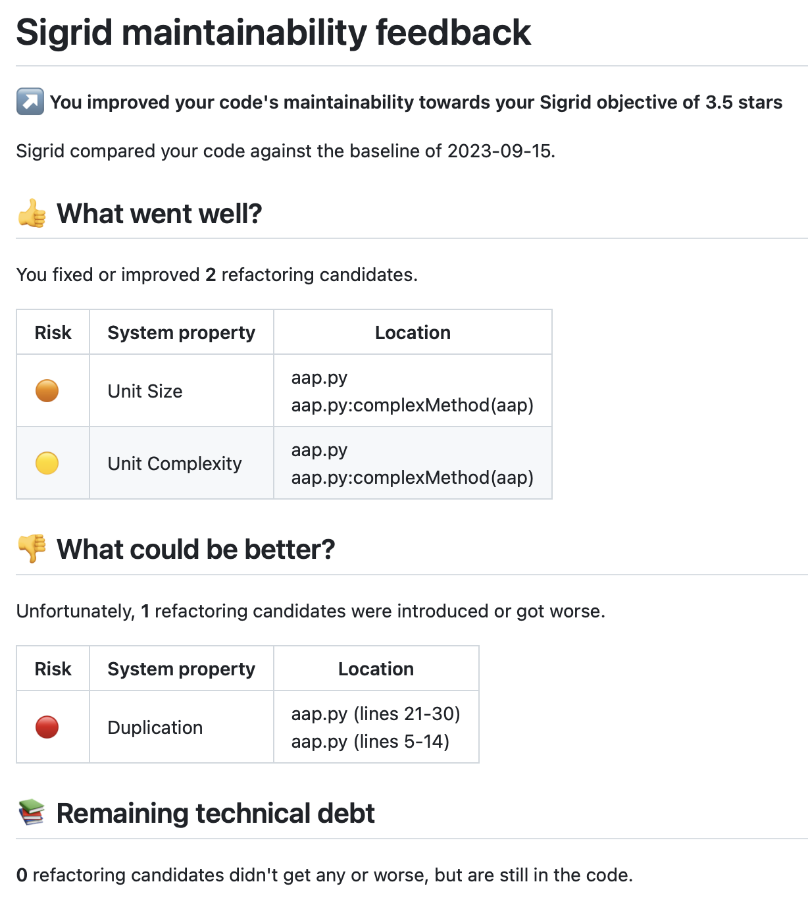

Sigrid release notes
====================

SIG uses [continuous delivery](https://en.wikipedia.org/wiki/Continuous_delivery), meaning that every change to Sigrid or the underlying analysis is released once our development pipeline has completed. On average, we release somewhere between 10 and 20 times per day. This page therefore doesn't list every single change, since that would quickly lead to an excessively long list of small changes. Instead, this page lists Sigrid and analysis changes that we consider noteworthy for the typical Sigrid user.

### January 13, 2025

- **Maintainability - System Overview:** We have updated the churn metrics in the system overview to reflect the number of files that have been added/changed/removed rather than raw Lines of Code to ensure consistency with the churn information shown in Delta Quality.
- **Maintainability - System Overview:** The Risk Profile bar chart option now includes percentage counts for each risk category when hovering over a bar. These percentage counts are also included in the .CSV export when viewing Risk Profiles.
- **Delta Quality - Files list:** It is now possible to filter the added/changed/removed files lists based on the utilized technology and/or system component that the file resides. This allows the file table for each context to be truncated for a specific scope to assist in analysis and triage of specific areas of the code base that have undergone churn.
- **Delta Quality - Files List:** We have fixed an issue where sorting on column headers did not work properly for the Removed Code files table.
- **Code Explorer:** Findings are now sortable via the column headers in the findings table. User can now sort by either descending/ascending values when clicking on a column header.
- **Refactoring Candidates:** We have added a dedicated count for the number of occurrences a code clone is found across the system for all Duplication Refactoring Candidates. Occurence count can be found within the finding details for a specific refactoring candidate. This change also adds a new sortable column for Duplication Refactoring Candidates in Code Explorer.
- **Objectives Overview:** Sigrid now provides better explanations for the various objective types and how they can relate to business goals.
- **Objectives - Capability Pages:** Objective Overviews are now available on the portfolio overview for OSH and Security. These tables present a count of which systems within your portfolio have their capability specific objectives met / not met / not set, as well as the count of systems that have yet to be scanned and their objective status is unable to be determined.

### December 23, 2024

- Happy holidays from everyone at SIG! If you check the user icon in Sigrid's menu bar, you might find something appropriate for the season.
- **Sigrid CI:** You can now define [proxy settings for Sigrid CI](client-script-usage.md).
- **Technology support:** Added support for the [Styled Components](https://styled-components.com) framework. 

### December 16, 2024

- **Delta Quality:** The details list for new/changed/deleted code now includes a volume indicator. This allows you to identify which files were changed the most during that time period.
- **System maintainability dashboard**: The risk profile charts now have a legend that explains what the red/orange/yellow/green risk categories mean, making both the charts and the dashboard in general easier to interpret.
- **Refactoring candidates:** Duplication refactoring candidates now show both the total amount of *duplicated* code, and the amount of *redundant code*. The latter indicates the number of copies, i.e. is the duplicated across 2 files or across 100 files. This information can assist in prioritization when deciding which of these issues to fix first.
- **Refactoring candidates:** Duplication refactoring candidates now include a component filter, allowing you to focus on duplicates in specific components.
- **Technology support:** A beta version of the new Mendix microflow/nanoflow is now available. Sigrid will now visualize microflows/nanoflows in a more graphical way, which is more familiar to Mendix developers. The [Code Explorer documentation](../capabilities/system-code-explorer.md#navigating-low-code-technologies) contains screenshots and more information. Contact SIG if you want to be involved in beta-testing this new analysis before it becomes generally available.
- **Technology support:** Added support for the [Svelte framework](https://svelte.dev). See the [technology support documentation](technology-support.md#technology-conversion-configuration) for instructions on how you can publish your Svelte project to Sigrid.

### December 2, 2024

- **New/Changed Code Quality:** The detail page now includes a search field, so you can more easily locate specific files.
- **Refactoring Candidates:** The refactoring candidates page for Component Entanglement now provides additional details on the number of findings in each category.
- **Code Explorer:** The tree map in the Code Explorer can now toggle between per-directory and per-component. This gives power users more detailed analysis features to work with.
- **Sigrid API:** Added an [example script](https://github.com/Software-Improvement-Group/sigridci/tree/main/examples/get-scope-file) that shows how to extract the [scope configuration file](analysis-scope-configuration.md) using the API.
- **Configuration:** The [configuration option to remove dependencies](analysis-scope-configuration.md#manually-removing-architecture-dependencies) now works universally across Sigrid. This option already existed before, but it was limited to the architecture view. The option has now been extended to that it works everywhere.

### November 18, 2024

- **Maintainability dashboard:** Test code volume (in person years) is now available as a metric across Sigrid.
- **Code Explorer:** It is now possible to export the list of findings. This is helpful when you want to further process findings outside Sigrid.
- **Code Explorer:** You now have the option to use either the directory structure or the component structure for the tree map in the center of the Code Explorer. This is mainly for power users that want to change views to get different insights when analyzing results.
- **Sigrid API:** The maintainability end points now also return the volume of the system, in both person years and in lines of code.

### November 4, 2024

- **Objectives:** The portfolio objectives dashboard now allows you to drag-and-drop objectives to indicate precedence.
- **Code Explorer:** All files in the system are now shown by the Code Explorer. Previously, only files in scope for the maintainability rating were shown.
- **Maintainability:** Introduced a new sytem-level maintainability dashboard, that includes several new visualization.
- **Sigrid CI:** Tweaked pull request feedback to avoid it becoming excessively long when changing files that contain a lot of technical debt.

### October 21, 2024

- **Open Source Health:** Removed dependencies are now depicted as "grayed out" in the list of open source dependencies. This helps to avoid confusion, as people might inadvertently think those dependencies are still in use.
- **Architecture Quality:** Selecting a component now provides an AI-generated summary with Sigrid's architecture findings for that component. You can access the summary using the AI button located at the right-side of the page.
- **Technology Support:** Improved support for [Gradle/Kotlin](https://gradle.org/kotlin/).

### October 7, 2024

- **Objectives:** The drill-down page, where you can see objective progress for all systems in your portfolio, now also shows a delta indicator. This is in addition to the overall delta indicator displayed in the portfolio objectives dashboard. This helps you to identify systems where things aren't progressing as expected, or reversely, which systems have improved the most.
- **Security:** Sigrid now offers the *Sigrid Security for Embedded Systems* license. As the name implies, this focuses specifically on software used in embedded systems. It adds support for additional security standards, and introduces rules to check compliance against those standards. Most of the focus is on C and C++, since those technologies remain the lingua franca for embedded systems.
- **Open Source Health:** Added support for [NuGet lock files](https://devblogs.microsoft.com/nuget/enable-repeatable-package-restores-using-a-lock-file/). You can [configure Sigrid to show transitive dependencies](analysis-scope-configuration.md#open-source-health). If you enable this option, Sigrid will scan your NuGet lock files for those transitive dependencies, and display them in Sigrid alongside your direct dependencies.
- **Sigrid CI:** Improved validation for the [scope configuration file](analysis-scope-configuration.md). You will now get more and more detailed feedback, and because you get thise feedback *before* you code is ever sent to Sigrid, this leads to a faster feedback loop to detect and fix configuration errors.
- **Configuration:** You can now change your organization's display name using the "metadata" in the menu. This option is only available to Sigrid administrators.

### September 23, 2024

- **Scope configuration:** Sigrid now supports automatic component detection, which is based on the SIG knowledge base. Manually defining components is still possible if you want to override the default configuration, or if you're using a project-specific component structure. Refer to the [updated documentation](analysis-scope-configuration.md#defining-components) for an overview of when and how to use the various options.
- **Sigrid CI:** Validation of [scope configuration files](analysis-scope-configuration.md) has been improved. You will now receive more feedback on configuration errors. If you use Sigrid CI, you will get this feedback immediately, before Sigrid starts the analysis and before your code is even published. This faster feedback loop is helpful to spot and fix configuration errors in a timely fashion.

### September 9, 2024

- **Objectives:** The objectives dashboard now includes filter options, which allow you to track objectives status and trend for certain teams, certain business criticiality, etc. This helps you to create custom dashboards or reports for certain sections of your portfolio.
- **Sigrid CI:** The Sigrid CI feedback now shows both the maintainability of the system as a whole, *and* the maintainability of the files you changed... before you changed them. This makes it easier to see if you managed to improve those files during your changes. This fits with Sigrid CI's goal of incremental improvement: As long as you keep improving your code *towards* your objective, you will get there eventually.
- **Architecture Quality:** The user interface for Architecture Quality's pinning/hiding components, saved views, and the summary have all been improved. These changes combined make it easier to navugate the architecture view.

### August 26, 2024

- **Maintainability:** The SIG Maintainability Model 2024 has been released. SIG models are recalibrated yearly, to reflect current industry trends and best practices. You can find an overview of the new model version in the updated [Guidance for Producers](https://softwareimprovementgroup.com/wp-content/uploads/SIG-TUViT-Evaluation-Criteria-Trusted-Product-Maintainability-Guidance-for-producers.pdf) document.
- **Architecture Quality:** SIG's Architecture Quality Model is *also* benchmarked, and is now also recalibrated on a yearly basis. You can find documentation for the new model in the [Guidance for Producers](https://www.softwareimprovementgroup.com/wp-content/uploads/Guidance-for-producers-Architecture-Quality-Model.pdf).
- **Objectives:** The objectives dashboard now shows both portfolio objectives and system objectives in a single unified view. This makes it easier to track objective compliance across your portfolio, without having to navigate across multiple pages.
- **Sigrid CI:** The Sigrid CI feedback for GitLab has been improved to be more in line with the feedback for GitHub and Azure DevOps, it is now more visual and requires less clicks to access. Refer to the [integration instructions for GitLab](../sigridci-integration/gitlab.md) for how to enable this for your pipeline.

### August 12, 2024

- **Security:** It is now possible to disable/exclude specific rules in the configuration. Refer to the [security configuration](analysis-scope-configuration.md#third-party-findings) for more information.
- **Security:** Secure software requires security awareness as part of your organizational culture. Adding links to people's daily workflow can help to keep security top-of-mind. You can use the [Sigrid API](../integrations/sigrid-api-documentation.md) for this. One example of such a workflow is [Slack](https://slack.com), which tends to be used heavily by development teams. We have added an example of [daily Slack alerts based on Sigrid security findings](https://github.com/Software-Improvement-Group/sigridci/tree/main/examples/slack-security-findings), which you can use and/or customize.
- **Open Source Health:** It is now possible to exclude certain risks from Sigrid's Open Source Health analysis. See the [Open Source Health documentation](../capabilities/system-open-source-health.md#excluding-risks) for *when* to use this options, and the [configuration options](analysis-scope-configuration.md#exclude-open-source-health-risks) for *how* to use these options.
- **Architecture Quality:** Architecture Quality now supports [saved views](../capabilities/architecture-quality.md#saving-architectural-views), which allows you to create and save specific views from the architecture explorer for later review or documentation purposes.
- **Technology support:** Added support for the [NGRX framework](https://ngrx.io). This support is now part of the existing TypeScript analysis, so no configuration changes are needed.

### July 15, 2024

- **Objectives dashboard:** The dashboard now shows progress over time for all objectives. The time period for this comparison can be selected using the calendar in the top-right, in the same way as other trend graphs across Sigrid.
- **Architecture Quality:** Added the option to pin components to the view. This allows you to create customized views, which is helpful when you want to focus on or emphasize certain components. The [architecture quality documentation](../capabilities/architecture-quality.md#pinning-and-hiding-architecture-components) contains more information on when and how you can use this feature.
- **Technology support:** Added support for the JDE technology, formerly known as [JD Edwards EnterpriseOne](https://www.oracle.com/nl/applications/jd-edwards-enterpriseone/). Refer to the [technology support list](technology-support.md) for details.

### July 1, 2024

- **Architecture Quality:** You can now hide components in the architecture diagram. This can help to simplify the diagram when working with large and/or complicated architectures.
- **Sigrid API:** It is now possible to [remove sub-systems](../integrations/sigrid-api-documentation.md#removing-subsystems) using  the API.

### June 17, 2024

- **Sigrid CI:** Pull request comments are now also available for Azure DevOps, in addition to GitHub. This makes the Sigrid CI feedback easier to process, since it's more visual and requires less clicks. See the [Sigrid CI instructions for Azure DevOps](../sigridci-integration/azure-devops.md) for how to enable this in your pipeline.
- **Technology support:** Improved dependency detection for Visual Basic .NET.

### June 3, 2024

- **Documentation:** The workflows section now provides [guidelines on how organizations should set themselves up to achieve high-quality software](../workflows/best-practices-organization.md).
- **Open Source Health:** Open Source Health now uses benchmarked star ratings, similar to Maintainability and Architecture Quality. This makes it easier to interpret whether you are doing well relative to the market. You can find out more on how to use Open Source Health in your organization [here](../workflows/best-practices-osh.md), and more about the Open Source Health star ratings [here](quality-model-documents/open-source-health.md).
- **User management:** The list of user roles has been extended with the new Maintainer role, which now exists alongside the existing User and Administrator role. You can find out more on user roles [here](../organization-integration/usermanagement.md#authorized-actions-based-on-user-type).
- **Sigrid CI:** The documentation has been extended for using [Sigrid CI in combination with Mendix QSM on Azure DevOps](../sigridci-integration/mendix-azure.md).

### May 21, 2024

- **Technology support:** Dependency detection for Go has been improved.
- **Open Source Health:** For NPM libraries, Sigrid now supports libraries that changed license at some point in time. Previously, Sigrid would report on the library's *current* license, but this has been changed to report the license of the library version that is actually being used.
- **Sigrid API:** The API has been extended with end points to retrieve the status of both portfolio and system objectives, including the current and previous status of those objectives. Refer to the [API documentation](../integrations/sigrid-api-documentation.md) for more information.

### May 6, 2024

- **Sigrid API:** The API has been extended with a new end point to obtain the full architecture graph used for Sigrid's [Architecture Quality page](../capabilities/architecture-quality.md). This is on top of the end point to retrieve the Architecture Quality *ratings*, which already existed. Refer to the [Sigrid API documentation](../integrations/sigrid-api-documentation#architecture-quality-data) for details.
- **Architecture Quality:** Further customization options have been added. It was already possible to customize the architecture view by adding or removing dependencies in the configuration. This has been extended to also allow the addition of system elements, such as components, databases, or middleware. See the [Architecture Quality configuration documentation](analysis-scope-configuration.md#manually-specifying-architecture-elements) for details.

### April 22, 2024

- **AI augmentation:** Sigrid now provides AI explanations for findings. The AI explanations cover 5 Sigrid capabilities (Maintainability, Security, Reliability, Performance Efficiency, Cloud Readiness) and more than 30 different technologies. Find out more on [how Sigrid uses AI](ai-explanations.md). 
- **Sigrid CI:** If you have deactivated a system, Sigrid CI will no longer run. This was done to prevent "zombie systems", where Sigrid CI is still in the pipeline despite the system no longer appearing in the Sigrid dashboard. 

### March 24, 2024

- **Technology support:** Improved support for Mendix, we allow branch names including spaces to be onboarded.
- **Technology support:** Improved support for Rust unit detection, dependency detection, and test code identification.

### March 11, 2024

- **Objectives:** The Portfolio Objectives page now allows you to drill-down, which helps you to determine which teams and systems are compliant versus non-compliant. 
- **User management:** It is now possible to use the Sigrid API for Sigrid user management. This allows for more automation and integration options. The [Sigrid API documentation](../integrations/sigrid-api-documentation.md) contains more information.
- **Technology support:** Improved support for Rust, including better automatic detection of test code.
- **Technology support:** Open Source Health now supports [Cargo](https://crates.io), which is typically used in combination with `crates.io` for dependency management in Rust systems.
- **Open Source Health:** Sigrid now supports CycloneDX SBOM version 1.5. Find out more about [importing your SBOM into Sigrid](../integrations/integration-sbom.md ).
- **Architecture Quality:** When using database technologies, stored procedures and tables are now handled differently in the architecture visualization. Previously, they looked the same visually. Separating stored procedure calls from data access, and using different colors, makes it easier to understand the system's architecture.

### February 26, 2024

- **On-premise:** The documentation for Sigrid On-Premise is now also available from this documentation. This was previously covered by a series of PDF documents, but having all Sigrid documentation in a central location makes it easier to navigate.
- **User management:** Added support for user groups. This makes it significantly easier to manage Sigrid access for portfolios with large numbers of systems and/or large numbers of people. You can find more information on how to use user groups in [the extended user management documentation](../organization-integration/usermanagement.md).
- **User management:** It is now possible to change the default access rights for Single Sign-On Users. You can choose between no access (which is the default) or access to all systems. The latter is both more suitable and more convenient for organizations that have a culture of transparency, where everyone can see the entire Sigrid portfolio. This is an organization-level setting, so contact SIG support to discuss how to change this setting if you're interested.
- **Technology support:** Improved Kotlin dependency detection. This removes incorrectly detected dependencies to constructors.
- **Open Source Health:** Improved support for Maven properties.
- **Open Source Health:** The [SIG Open Source Health quality model](quality-model-documents/open-source-health.md) is now documented.

### February 12, 2024

- **Sigrid CI:** The output directory where Sigrid CI saves feedback is now a configurable. See the [options reference](client-script-usage.md) for details.
- **Open Source Health:** The Sigrid user interface now shows whether dependencies are direct or transitive (currently only for Maven and NPM). This is helpful when using the [transitive option for Open Source Health](analysis-scope-configuration.md#open-source-health), as it allows you to quickly determine a dependency's origin.
- **User management:** It is now possible to force MFA (Multi Factor Authentication) for Sigrid users. Contact SIG support for guidance on how to best introduce this option for existing Sigrid accounts. 

### January 29, 2024

- **Sigrid CI:** Sigrid CI now supports 41 additional technologies. The [technology support list](technology-support.md) has been updated to reflect the updated support.
- **Sigrid API:** You can now also use the API to retrieve Architecture Quality ratings. Refer to the [API documentation](../integrations/sigrid-api-documentation.md#architecture-quality-ratings) for more information.

### January 15, 2024

- **Objectives:** It is now possible to set portfolio objectives that consider technology, business context, lifecycle phase, and deployment type. This allows you to use Sigrid to define policies. For example, security requirements tend to be more strict for public-facing systems than for internal systems. Similarly, objectives tend to be more lenient for legacy systems, since they are approaching the end of their life cycle. You can use portfolio objectives to consider these aspects, so you can define objectives for your landscape without having to define them for every single system individually.
- **User management:** Sigrid now also supports Single Sign-On integration based on [OpenID Connect](https://auth0.com/docs/authenticate/protocols/openid-connect-protocol). This support is added in addition to the existing SAML-based integration support.
- **User management:** Your Sigrid administrators now have the ability to reset their users' MFA (multi factor authentication). Previously this could only be done by SIG support.
- **Technology support:** Updated support for various TypeScript frameworks. The number of TypeScript frameworks is pretty much infinite, so please reach out if you believe SIG does not adequately support your preferred framework.
- **Technology support:** Added support for new versions of [Poetry](https://python-poetry.org).
- **Technology support:** Added support for the Baan 4GL programming language.

### November 20, 2023

- **Dashboard:** It is now possible to view progress towards your portfolio objectives in two ways: Via the overall Sigrid portfolio dashboard (which already existed), and via the newly added "objectives" page. The latter gives you a more high-level overview of your overall objectives, without diving into the specifics regarding teams or systems. You can find more information in the [portfolio objectives documentation](..//capabilities/portfolio-objectives.md).
- **Open Source Health:** Sigrid is now able to import SBOM (Software Bill Of Materials) produced by other tools. The [SBOM standard](https://en.wikipedia.org/wiki/Software_supply_chain) is emerging as the de-facto standard for software supply chains. Sigrid was already able to *export* SBOM information, but it is now also able to *import* SBOMs. Instructions are available on how to [import SBOMs into Sigrid](../integrations/integration-sbom/md).

### November 6, 2023

- **Architecture Quality:** Architecture Quality is now part of the Sigrid base license! Don't miss our [Ask Me Anything](https://www.softwareimprovementgroup.com/events/sigrid-ask-me-anything/) session on November 23, which we'll use to answer questions about this new capability.
- **Architecture Quality:** Architecture Quality now includes an optional tree view. This can be used as a secondary way of navigating your architecture, in addition to the main architecture visualization. 
- **Architecture Quality:** Architecture Quality now has a search option. This allows you to quickly find system elements within your architecture, such as components, files, end points, or databases.

- **Architecture Quality:** The metric detail panel now includes the option to export the measurement results to Excel.
- **Open Source Health:** Sigrid can now identify the [Reciprocal Public License](https://opensource.org/license/rpl-1-5/). For commercial organizations using open source software, this license is seen as high risk due to its requirements.

### October 23, 2023

- **On-boarding:** It is now possible for all users to on-board additional systems to Sigrid. However, you might not be able to access the analysis results for your system in Sigrid until you have been given permission by your Sigrid administrator.
- **Technology support:** Added support for the [Elixir](https://elixir-lang.org) programming language.
- **Maintainability:** The maintainability overview page now shows system volume in lines of code, in addition to the system volume in person years that was already displayed. Person years is easier to interpret by non-technical users, but technical users asked to *also* show the lines of code as they find it easier to interpret this number.
- **Architecture Quality:** The [configuration options](analysis-scope-configuration.html#architecture-quality) for `grouping` now support regular expressions for more advanced/powerful configuration.

### October 9, 2023

- **Sigrid CI:** The Sigrid CI output for GitHub has been significantly improved:
  - First, Sigrid CI will now pass as long as your code improved *towards* your quality objectives. Previously, you had to *meet* your quality objectives for every single change. The old behavior can lead to frustration when you're maintaining legacy code and are trying to improve it: you can make significant improvements, but Sigrid CI would nevertheless fail your changes for not improving them *enough*. In retrospect this behavior is a bit too strict, especially in situations where the legacy code has significant technical debt but the quality objectives are very ambitious. The new behavior is much more encouraging in this type of situation, and the focus on incremental improvement also combines very well with an agile mindset.
  - We also changed the structure of the Sigrid CI feedback. The feedback now follows the structure of an agile retrospective; we first focus on what went well, then on what could be better. This means more focus on the actual changes, and less focus on previously existing technical debt. We have discussed and validated this with many developers and they found this way of communicating feedback to be more fair.
  - Finally, Sigrid CI feedback can now be displayed directly in the GitHub pull request, removing the need for additional clicks.
  - Refer to the [GitHub integration documentation](../sigridci-integration/github-actions.md) for more information on how to integrate the new output in your pipeline.
  - These improvements are initially provided for the Sigrid CI GitHub integration since it's the most used. Over the coming months, we will work towards bringing similar improvements to Sigrid CI integrations for other development platforms, prioritizing by usage.
  

- **Technology support:** We have improved dependency detection for Kotlin. This means you might notice more dependencies for your Kotlin systems in Maintainability, Architecture Quality, and Code Explorer.
- **Architecture Quality:** The terminology for the Knowledge Distribution metric has been changed, to make it more clear what is actually measured and how these numbers should be interpreted.

### September 25, 2023

- **Security:** Added "External Integrations" category. Moved [OSH](../capabilities/osh-upload-instructions.md) and [REST API](../integrations/sigrid-api-documentation.md) pages there. Added [SAST (static analysis tooling)](../integrations/integration-security.md) explanation page. Specifically added separate pages for integration with [Checkmarx](../integrations/integration-security-checkmarx.md) and [Fortify](../integrations/integration-security-fortify.md).
- **Security:** Large additions in the [system security page](../capabilities/system-security.md), e.g. [filtering security results](../capabilities/system-security.md#filtering-results-for-false-positives-starting-with-open-source-vulnerabilities) and [prioritizing findings](../capabilities/system-security.md#prioritizing-security-findings). Also, a new section clarifying [the way that CVSS scores are calculated in Sigrid](../capabilities/system-security.md#context-and-meaning-of-cvss-security-metrics-from-asset-to-risk) and how they can be interpreted.
- **Security:** Clarified and added [third party findings options](../reference/analysis-scope-configuration.md#third-party-findings) in the scoping configuration page. Clarifications in the [technology support page](../reference/technology-support.md), e.g. added a [third party findings analyzer technology support table](../reference/technology-support.md#supported-security-analyzers).
- **Architecture Quality:** New [architecture quality](../capabilities/architecture-quality.md) options added, e.g. [grouping and annotating components](../capabilities/architecture-quality.md#grouping-and-annotating-components).
- **Documentation:** Fixed unclarities in the [self-service configuration](analysis-scope-configuration.md) page regarding component definitions and mapping test code when components are defined manually.

### August 28, 2023

- **Architecture Quality:** Sigrid can now identify and visualize dependencies that are considered undesirable. You can specify these dependencies in the [Sigrid configuration](analysis-scope-configuration.md#architecture-quality).
- **Configuration:** The React versus JavaScript configuration has been simplified, so that Sigrid's React analysis is now a superset of the JavaScript analysis. If you are using [self-service configuration](analysis-scope-configuration.md) these improvements are applied automatically, and there is no need to manually update the configuration.
  - Note: In case you formerly had both React and JavaScript in scope of Sigrid measurements and they were configured as separate technologies, then now you only the code together as part of JavaScript technology. This may have two effects for your maintainability metrics:
    - JavaScript volume in Person Months may have somewhat grown because different productivity factors between React and JavaScript are now equalized. The impact depends on the volume ratio React:JavaScript.
    - Call dependencies between React and JavaScript are now more accurate. Therefore you may seem more dependencies and this may result in a (slightly) lower module coupling score.   
- **Command line options:** `--include` is added to the command line options of `sigridci.py`. `--exclude` already allowed you to remove specific folders / files from the upload. With the addition of `--include` you can now narrow down the uploaded folders / files even more by specifying the set of folders / files to include.

### August 9, 2023

- **Objectives:** It is now possible to define objectives for *all* Sigrid capabilities, not just for Maintainability and Open Source Health. To do this, navigate to your system's dashboard, locate your objectives, and hit the edit button.
- **Technology support:** Added support for the [Dart](https://dart.dev) programming language, which is commonly used for creating apps in Google's [Flutter](https://flutter.dev) framework.

### July 31, 2023

- **Scope configuration:** The `sigrid.yaml` configuration file format has been registered with [SchemaStore.org](https://www.schemastore.org/json/). This means that IDEs such as [Visual Studio Code](https://code.visualstudio.com) or [JetBrains IDEs](https://www.jetbrains.com) will now provide content assist and indicate errors when you edit Sigrid configuration files. This both gives a productivity boost and reduces errors, since you can act on thise feedback right away when editing these files.
- **User management:** It is now possible to copy another user's permissions when creating a new users. This is generally more convenient than having to create existing permissions for the new user.
- **Documentation:** In this documentation, every section now has a "link" icon. Clicking this icon will copy the link to that particular section to your clipboard. This allows you to quickly share or store deeplinks to the documentation.

### July 24, 2023

- **Scope configuration:** It is now possible to use [self-service scope configuration](analysis-scope-configuration.md) in combination with [multi-repo systems](../sigridci-integration/development-workflows.md#combining-multiple-repositories-into-a-single-sigrid-system). Previously you could use one of these features or the other, but not both. Refer to [the configuration documentation](analysis-scope-configuration#configuring-multi-repo-systems) on how to manage this configuration.
- **Open Source Health:** Sigrid can now scan Maven dependency report files in addition to POM files. Refer to the [Open Source Health documentation](../capabilities/osh-upload-instructions) for more information on how and when this can be used.
- **Technology support:** Sigrid now supports [X++ for Dynamics 365](https://learn.microsoft.com/en-us/dynamics365/fin-ops-core/dev-itpro/dev-ref/xpp-language-reference).

### July 3, 2023

- **Open Source Health:** The [Python Poetry](https://python-poetry.org) dependency management tool is now supported by Sigrid. Refer to the [Open Source Health upload instructions](../capabilities/osh-upload-instructions) for more information.
- **Open Source Health:** When using Yarn, multiple versions for the same dependency would sometimes be reported. This has been changed so that only the version defined in `package.json` is reported by Sigrid.
- **User management:** Non-administrator users can now use the User Management page to see who "their" administrator is, which is helpful if they were not quite sure who to contact on their side (which is sometimes the case for very large portfolios).
- **Sigrid API:** It is now possible to [deactivate systems via the Sigrid API](../integrations/sigrid-api-documentation.md). Previously, this could only be done via the user interface.

### June 5, 2023

- **Architecture Quality:** Sigrid's Architecture Quality now matches technology support for maintainability, meaning that all 300+ technologies are now supported. You can find more information in our [technology support](technology-support.md) page.
- **On-boarding:** If Sigrid cannot detect the technologies during on-boarding, it would previously silently fail. This detection has been improved, so that these systems still appear in Sigrid.

### May 16, 2023

- **Security:** Sigrid now links to opencre.org, which is a content linking platform founded and built with a team at OWASP. Based on a Sigrid security finding, the user is taken to more information about the risk, about how to fix it, how to test for it, how to configure test tools, etc.
- **Code Explorer:** The Code Explorer is now always visible, even if there are no findings in the system. This is because many people use the Code Explorer to navigate the codebase, and this navigation is useful even without looking at findings.

### May 9, 2023

- **Portfolio dashboard:** System information has been added to the new dashboard, adding some more detail on top of the basic information displayed at the top of the page.
- **User management:** Sigrid users can now reset their own password. Previously, they had to ask either their administrator or someone at SIG support.

### May 2, 2023

- **Metadata:** In addition to the existing "division" and "supplier" metadata, a new "team" field has been introduced. This is useful for our largest clients, as this allows them to provide a team dashboard. 
- **Upload Unpacker:** Self-service on-boarding is now also supported for clients that use SFTP uploads. Previously, self-service was only possible for clients using Sigrid CI. This will help to further streamline our on-boarding process for clients that are unable to use Sigrid CI due to technical limitations or security restrictions on their side.

### April 24, 2023

- **Sigrid API:** The new Sigrid goals can also be retrieved using the API.
- **Siemens Polarion integration:** We now support SBOM integration between Sigrid and Siemens Polarion. This applies to both the components/libraries/dependencies and the associated vulnerabilities. 

### April 17, 2023

- **Portfolio/system dashboard:** The dashboards now display an indicator to show whether systems are using Sigrid CI. This information is also added to the filtering options, so you can easily determine which systems in your portfolio aren't using Sigrid CI yet.
- **Portfolio/system dashboard:** Similar to the above, an icon is shown if you use self-service scoping for the system (as opposed to using the standard configuration or a SIG-managed configuration).

## Contact and support

Feel free to contact [SIG's support department](mailto:support@softwareimprovementgroup.com) for any questions or issues you may have after reading this document, or when using Sigrid or Sigrid CI. Users in Europe can also contact us by phone at +31 20 314 0953.
