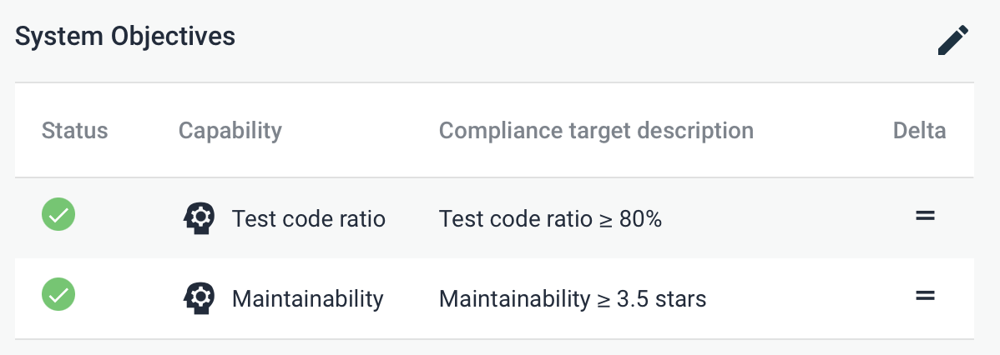

Sigrid API documentation
========================

In addition to [Sigrid CI](../README.md), Sigrid also provides a more general-purpose REST API that you can use to obtain analysis results from Sigrid. This allows you to integrate data from Sigrid into your workflow. 

## General usage

- The Sigrid API base URL is `https://sigrid-says.com/rest/analysis-results/api/v1`. 
- Authentication for the Sigrid API uses the same [authentication tokens](authentication-tokens.md) that are used by Sigrid CI. Your token's permissions are based on your user account, so the token can access the same systems that you can. 
- You need to pass the authentication token to each request in the HTTP header `Authorization: Bearer {SIGRID_CI_TOKEN}`.
- All end points will return HTTP status 401 if the token is invalid, or if the token is not authorized to access the portfolio and/or system.
- All end points return JSON and therefore return a Content-Type of `application/json`.

The following example shows how to call the Sigrid API using `curl`:

```
curl -H 'Authorization: Bearer {SIGRID_CI_TOKEN}' https://sigrid-says.com/rest/analysis-results/api/v1/maintainability/{customer}
```

In the example, `{customer}` refers to your companies Sigrid account name, and `{SIGRID_CI_TOKEN}` refers to your authentication token.

## Available end points

### Maintainability ratings

Maintainability ratings for a given customer are available via three endpoints:
- `GET https://sigrid-says.com/rest/analysis-results/api/v1/maintainability/{customer}`: system-level maintainability ratings for all systems of the given customer the current user has access to.
- `GET https://sigrid-says.com/rest/analysis-results/api/v1/maintainability/{customer}/{system}`: system-level maintainability ratings for the given system of the given customer.
- `GET https://sigrid-says.com/rest/analysis-results/api/v1/maintainability/{customer}/{system}/components`: component-level maintainability ratings for the given system of the given customer.

The parameter `{customer}` refers to your Sigrid account name. 

Example response:

```json
{
    "customer": "my-sigrid-account-name",
    "systems": [
        {
            "system": "my-system-name",
            "customer": "my-sigrid-account-name",
            "maintainability": 5.24,
            "maintainabilityDate": "2022-02-08",
            "allRatings": [
                {
                    "maintainability": 4.96,
                    "maintainabilityDate": "2022-02-06"
                }
            ]
        }
    ]
}
```

The top-level `maintainability` and `maintainabilityDate` refer to the *current* state of each system. The `allRatings` array contains a list of all *historic* measurements, which can be used for reporting or trend information.

### Security findings

`GET https://sigrid-says.com/rest/analysis-results/api/v1/security-findings/{customer}/{system}`

Returns all security findings for the specified system. The parameters `{customer}` and `{system}` refer to your Sigrid account name and system ID respectively. 

Example response:

```json
[
    {
        "id": "00000000-0000-0000-0000-0000005d9c1e",
        "href": "https://sigrid-says.com/my-sigrid-account/my-system/-/sigrid-security/00000000-0000-0000-0000-0000005d9c1e",
        "firstSeenAnalysisDate": "2019-09-18",
        "lastSeenAnalysisDate": "2019-09-18",
        "firstSeenSnapshotDate": "2019-05-04",
        "lastSeenSnapshotDate": "2019-05-04",
        "filePath": "helloworld.py",
        "startLine": 12,
        "endLine": 23,
        "component": "frontend",
        "type": "",
        "cweId": "CWE-12345",
        "severity": "LOW",
        "impact": "LOW",
        "exploitability": "LOW",
        "severityScore": 2.0,
        "impactScore": 1.2,
        "exploitabilityScore": 0.8,
        "status": "FALSE_POSITIVE",
        "remark": "Test test test",
        "toolName": null,
        "isManualFinding": true,
        "isSeverityOverridden": true,
        "weaknessIds": [
            "CWE-12345"
        ]
    }
]
```

### Vulnerable libraries in Open Source Health

A list of all third-party libraries used is available for a given system, or for all systems for a customer, using the following endpoints:
- `GET https://sigrid-says.com/rest/analysis-results/api/v1/osh-findings/{customer}?vulnerable=<choose one of true or false according to the explanation below>`: get all third-party libraries for all systems the current user has access to for the given customer.
- `GET https://sigrid-says.com/rest/analysis-results/api/v1/osh-findings/{customer}/{system}?vulnerable=<choose one of true or false according to the explanation below>`: get all third-party libraries for the given system and customer.

The path parameters `{customer}` and `{system}` refer to your Sigrid account name and system ID respectively. The `vulnerable` URL query parameter is optional and defaults to `false`. The meaning is as follows:
- `?vulnerable=false` or no query parameter: the endpoint returns the full list of third-party libraries detected by Sigrid for the given customer/system(s), including lists of known vulnerabilities per library if any. 
- `?vulnerable=true`: the endpoint returns only those third-party libraries detected by Sigrid for the given customer/system(s) that have at least one known vulnerability. 

The response format is based on the CycloneDX format for an [SBOM (software bill of materials)](https://en.wikipedia.org/wiki/Software_bill_of_materials). 

Example response for a single system:

```json
{
    "bomFormat": "CycloneDX",
    "specVersion": "1.4",
    "version": 1,
    "metadata": {
        "timestamp": "2022-03-17T09:58:34Z",
        "tools": [
            {
                "vendor": "Software Improvement Group",
                "name": "Sigrid",
                "externalReferences": [
                    {
                        "type": "other",
                        "url": "https://sigrid-says.com/my-sigrid-account-name/my-system-id/-/open-source-health"
                    }
                ]
            }
        ]
    },
    "components": [
        {
            "group": "",
            "name": "yui",
            "version": "2.8.0r4",
            "purl": "pkg:npm/yui@2.8.0r4",
            "type": "library",
            "bom-ref": "pkg:npm/yui@2.8.0r4"
        }
    ],
    "vulnerabilities": [
        {
            "bom-ref": "pkg:npm/yui@2.8.0r4",
            "id": "CVE-2010-4710",
            "ratings": [
                {
                    "score": 4.3,
                    "severity": "medium",
                    "method": "CVSSv3"
                }
            ],
            "description": "Cross-site Scripting"
        }
    ]
}
```
The endpoint that returns third-party vulnerabilities for all systems for the given customer returns an array of SBOMs, one for each system as follows:
```
{
    "customer" : "sig",
    "exportDate" : "2022-07-12",
    "systems" : [ {
        "customerName" : "sig",
        "systemName" : "bch",
        "sbom" : {
            ...                   // Same as the response format in the single-system case
        }
    ]
}
```

More information on the SBOM format and the various fields is available from the [CycloneDX SBOM specification](https://github.com/CycloneDX/specification).

### System metadata

System metadata can be viewed and updated using the following three endpoints:
- `GET https://sigrid-says.com/rest/analysis-results/api/v1/system-metadata/{customer}/{system}`: get metadata of the given system of the given customer.
- `GET https://sigrid-says.com/rest/analysis-results/api/v1/system-metadata/{customer}`: get metadata of all systems of the given customer.
- `PATCH https://sigrid-says.com/rest/analysis-results/api/v1/system-metadata/{customer}/{system}`: update metadata of the given system of the given customer.

The path parameters `{customer}` and `{system}` refer to your Sigrid account name and system ID respectively.

The response format of both system-level endpoints (`GET` and `PATCH`) is as follows:
```json
{
  "displayName" : "User-friendly system name",
  "divisionName" : "Division name",
  "teamNames" : [ "My Team" ],
  "supplierNames" : [ "Supplier 1", "Supplier 2" ],
  "lifecyclePhase" : "EOL",
  "inProductionSince" : 2012,
  "businessCriticality" : "HIGH",
  "targetIndustry" : "ICD9530",
  "deploymentType" : "PUBLIC_FACING",
  "applicationType" : "ANALYTICAL",
  "remark" : "A remark",
  "externalID" : "ab12345",
  "isDevelopmentOnly" : false
}
```

The response format of the customer-level endpoint (`GET https://sigrid-says.com/rest/analysis-results/api/v1/system-metadata/{customer}`) is as follows:
```json
[
  {
    "customerName": "foo",
    "systemName": "bar",
    "displayName" : "User-friendly system name",
    "divisionName" : "Division name",
    "teamNames" : [ "My Team" ],
    "supplierNames" : [ "Supplier 1", "Supplier 2" ],
    "lifecyclePhase" : "EOL",
    "inProductionSince" : 2012,
    "businessCriticality" : "HIGH",
    "targetIndustry" : "ICD9530",
    "deploymentType" : "PUBLIC_FACING",
    "applicationType" : "ANALYTICAL",
    "remark" : "A remark",
    "externalID" : "ab12345",
    "isDevelopmentOnly" : false
  }
]
```

All properties can be null except for `supplierNames` and `teamNames` (which are always an array, but possibly empty), and `isDevelopmentOnly` (which is always true or false).

For the `PATCH` endpoint, please take the following into account:
- Only users with admin rights are allowed to change metadata.
- A `PATCH` endpoint requires a body as well as a `Content-Type` header. This is best illustrated with the example below.
- The `Content-Type` header needs to be set to `application/merge-patch+json` or `application/json`. The former is the official one, the latter behaves exactly the same. 

```shell
$ curl 'https://sigrid-says.com/rest/analysis-results/api/v1/system-metadata/{customer}/{system}' -X PATCH \
    -H 'Content-Type: application/merge-patch+json' \
    -H 'Authorization: Bearer {SIGRID_CI_TOKEN}' \
    -d '{
  "supplierNames" : [ "Supplier 1" ],
  "remark" : null,
}'
```

This example request _replaces_ the list of supplier names with the list consisting of one single supplier name (`Supplier 1`). It also _removes_ the remark. Next to this, it
leaves all metadata as-is. For instance, if the external ID before executing this request is `ab12345`, after this request it still is. 

The metadata fields are described by the following table. Note that the setting for `deploymentType` is used to assess impact of security findings.

|Path|Type|Description|
|----|----|-----------|
|`displayName`|`String`|The display name of the system. Must be between 0 and 60 characters. Can contain blanks: true|
|`divisionName`|`String`|The name of the division this system belongs to. Must be between 0 and 60 characters. Can contain blanks: true|
|`supplierNames`|`Array`|Array of the names of the suppliers for this system|
|`inProductionSince`|`Number`|The year the system went into production. Cannot be later than the current year, must be at least 1960|
|`businessCriticality`|`String`|Importance of the system in terms of the effects of it not being available on the user's business. Must match any of the following values (case-sensitive): CRITICAL, HIGH, MEDIUM, LOW|
|`lifecyclePhase`|`String`|The phase of its lifecycle the system is in. Must be an industry identifier from the table of lifecycle phase identifiers below (case-sensitive)|
|`targetIndustry`|`String`|The industry in which the system is normally used. Must be an industry identifier from the table of target industry identifiers below (case-sensitive)|
|`deploymentType`|`String`|The way in which the system is typically deployed. Must be an industry identifier from the table of deployment types below (case-sensitive)|
|`applicationType`|`String`|The type of the system. Must be an industry identifier from the table of application types below (case-sensitive)|
|`isDevelopmentOnly`|`Boolean`|If true, the system is not shown as part of customer's portfolio, in the UI this is known as the "Excluded from dashboards" toggle|
|`remark`|`String`|Remark(s) about the system as (possibly empty) free-format text. Must be between 0 and 300 characters. Can contain blanks: true|
|`externalID`|`String`|Allow customers to record an external identifier for a system. free-format text. Must be between 0 and 60 characters. Can contain blanks: true|

The lifecycle phase identifiers have the following meaning:

|`lifecyclePhase` identifier|System lifecycle phase|
|---------------------------|----------------------|
|INITIAL|Initial development (pre-production)|
|EVOLUTION|Evolution (post-production)|
|MAINTENANCE|Servicing and maintenance|
|EOL|End-of-life (in production but minimal maintenance)|
|DECOMMISSIONED|Decommissioned / Phased out (no longer in production)|

The target industry phase identifiers have the following meaning:

|`targetIndustry` identifier|Industry|
|----------|--------|
|ICD0500|Oil & Gas|
|ICD1750|Industrial Metals & Mining|
|ICD2350|Construction & Materials|
|ICD2710|Aerospace & Defense|
|ICD2730|Electronic & Electrical Equipment|
|ICD2750|Industrial Engineering|
|ICD2770|Industrial Transportation|
|ICD2790|Support Services|
|ICD2797|Industrial Suppliers|
|ICD3350|Automobiles & Part|
|ICD3500|Food & Beverage|
|ICD3700|Personal & Household Goods|
|ICD4500|Health Care|
|ICD5300|Retail|
|ICD5500|Media|
|ICD5700|Travel & Leisure|
|ICD6500|Telecommunications|
|ICD7500|Energy|
|ICD7577|Water|
|ICD8300|Banking|
|ICD8500|Insurance|
|ICD8630|Real Estate Investment & Services|
|ICD8700|Financial Services|
|ICD9530|Software & Computer Services|
|ICD9570|Technology hardware & equipment|
|SIG2200|Legal Services|
|SIG1200|Research|
|SIG1000|Government|
|SIG1100|Education|

The deployment type identifiers have the following meaning:

|`deploymentType` identifier|Deployment Type|
|---------------------------|---------------|
|PUBLIC_FACING|A system that is accessible by users through the public internet|
|CONNECTED|A system that interacts with a public-facing system via the network. The system is not accessible via the public internet|
|INTERNAL|A system that can only be reached by users via VPN or the company intranet. The system has no interaction with public-facing systems|
|PHYSICAL|A system that can only be reached by users with access to a physical location. The system cannot be reached from an internal network and has no interaction with public-facing systems|

The possible application types are as follows:

|`applicationType` identifier|
|----------------------------|
|PROCESS_CONTROLLER|
|TRANSACTION_PROCESSING|
|RESOURCE_MANAGEMENT|
|CASE_MANAGEMENT|
|DESIGN_ENGINEERING_DEVELOPMENT|
|ANALYTICAL|
|AUTHENTICATION_AND_PORTALS|
|COMMUNICATION|
|FUNCTIONAL_APPLICATIONS|
|KNOWLEDGE_AND_DOCUMENT_MANAGEMENT|
|PERSONAL_PRODUCTIVITY_APPLICATIONS|

### Systems goals

Sigrid allows you to define quality objectives for a system. This helps to set some realistic and feasible expectations per system, considering both the system's business context and its current technical state: business-critical systems using modern technologies require more ambitious targets than legacy systems.



Once you have defined quality objectives in Sigrid, you can [use these targets in Sigrid CI](client-script-usage.md#defining-quality-targets). You can also retrieve a system's objectives and corresponding targets via the API:

    GET https://sigrid-says.com/rest/analysis-results/api/v1/objectives/{customer}/{system}/config
    
This end point will return the following response structure:

    {
      "MAINTAINABILITY": 4.0,
      "NEW_CODE_QUALITY": 3.5,
      "OSH_MAX_SEVERITY": "LOW",
      "TEST_CODE_RATIO": 0.8
    }

## Contact and support

Feel free to contact [SIG's support department](mailto:support@softwareimprovementgroup.com) for any questions or issues you may have after reading this document, or when using Sigrid or Sigrid CI. Users in Europe can also contact us by phone at +31 20 314 0953.
