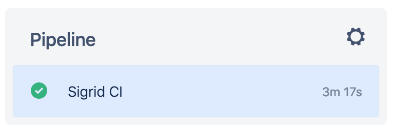
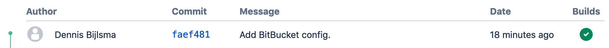
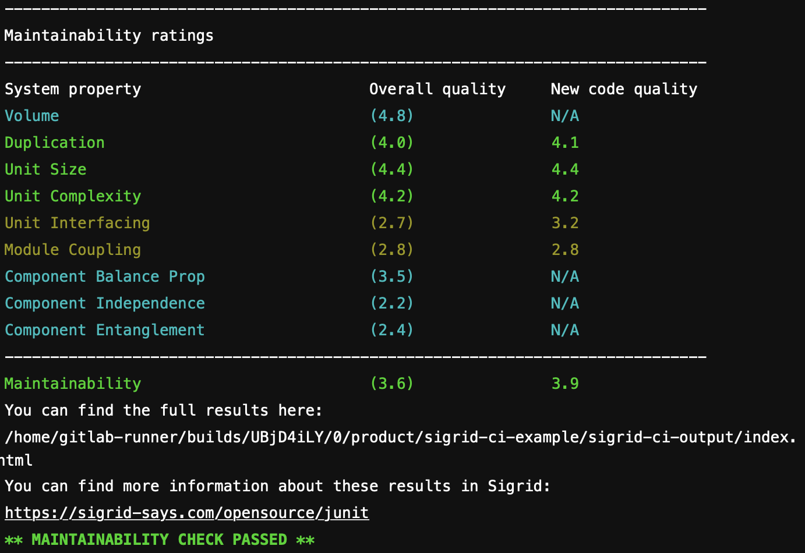

Integrating Sigrid CI with BitBucket Pipelines
==============================================

## Prerequisites

- You have a [Sigrid](https://sigrid-says.com) user account. 
- You have created an [authentication token for using Sigrid CI](../organization-integration/authentication-tokens.md).

## On-boarding your system to Sigrid

On-boarding is done automatically when you first run Sigrid CI. As long as you have a valid token, you will receive the message *system has been on-boarded to Sigrid*. Subsequent runs will then be visible in both your CI environment and [sigrid-says.com](https://sigrid-says.com). 

## Configuration

### Step 1: Configure Sigrid credentials to environment variables

Sigrid CI reads your Sigrid account credentials from an environment variable called `SIGRID_CI_TOKEN`. You can make these environment variables available to BitBucket Pipelines by creating "secrets" in your repository:

- Open "Repository settings" in your project menu
- Select "Repository variables" located in the section "Pipelines"
- Create a secret named `SIGRID_CI_TOKEN` and use your [Sigrid authentication token](../organization-integration/authentication-tokens.md) as the value.


### Step 2: Create a BitBucket Pipeline for Sigrid CI

Sigrid CI consists of a number of Python-based client scripts, that interact with Sigrid in order to analyze your project's source code and provide feedback based on the results. These client scripts need to be available to the CI environment, in order to call the scripts *from* the CI pipeline. You can configure your Pipeline to both download the Sigrid CI client scripts and then run Sigrid CI. 

We will create two pipelines:

- The first will publish the main/master branch to [sigrid-says.com](https://sigrid-says.com) after every commit. 
- The second will provide pull request integration: it will compare the contents of the pull request against the main/master branch.

#### Alternative 2a: Docker-based run

The recommended approach is to run Sigrid CI using the [Docker image](https://hub.docker.com/r/softwareimprovementgroup/sigridci) published by SIG. In your BitBucket repository, create a file `bitbucket-pipelines.yml`. You can then configure both pipelines in the same configuration file:

```
image: softwareimprovementgroup/sigridci

pipelines:
  branches:
    master:
      - step:
          name: Publish to Sigrid
          script:
            - "sigridci.py --customer <example_customer_name> --system <example_system_name> --source . --publish"
  pull-requests:
    '**':
      - step:
          name: Sigrid CI
          script:
            - "sigridci.py --customer <example_customer_name> --system <example_system_name> --source ."
```

Note the branch name `master` in the example. This should refer to your primary branch. In most projects this is called either `master` or `main`, but the default project name could be different for your project.

#### Alternative 2b: Download Sigrid CI client script

If you are unable to use Docker, for example because you are using local runners, you can still use Sigrid CI by downloading the Sigrid CI client script directly from GitHub:

```
image: softwareimprovementgroup/sigridci

pipelines:
  branches:
    master:
      - step:
          name: Publish to Sigrid
          script:
            - "git clone https://github.com/Software-Improvement-Group/sigridci.git sigridci"
            - "./sigridci/sigridci/sigridci.py --customer <example_customer_name> --system <example_system_name> --source . --publish"
  pull-requests:
    '**':
      - step:
          name: Sigrid CI
          script:
            - "git clone https://github.com/Software-Improvement-Group/sigridci.git sigridci"
            - "./sigridci/sigridci/sigridci.py --customer <example_customer_name> --system <example_system_name> --source ."
```

**Security note:** Some projects might not allow this as part of their security policy. In those cases, you can simply download the `sigridci` directory in this repository, and make it available to your runners (either by placing the scripts in a known location, or packaging them into a Docker container). 

Refer to the [BitBucket Pipelines documentation](https://support.atlassian.com/bitbucket-cloud/docs/get-started-with-bitbucket-pipelines/) for more information on when and how these steps will be performed. The [bitbucket-pipelines.yml documentation](https://support.atlassian.com/bitbucket-cloud/docs/configure-bitbucket-pipelinesyml/) describes the file format used for the configuration file.

### Step 3: Analysis configuration

The Sigrid CI client script supports a number of arguments that you can use to configure your Sigrid CI run. The scripts and its command line interface are explained in [using the Sigrid CI client script](../reference/client-script-usage.md).

Sigrid will try to automatically detect the technologies you use, the component structure, and files/directories that should be excluded from the analysis. You can override the default configuration by creating a file called `sigrid.yaml` and adding it to the root of your repository. You can read more about the various options for custom configuration in the [configuration file documentation](../reference/analysis-scope-configuration.md).

## Usage

Once Sigrid CI has been enabled, you can access it from the list of pipeline runs by accessing "Pipelines" from your repository's menu:




The check will succeed if the code quality meets the specified target, and will fail otherwise. In addition to this central overview, you can also find the Sigrid CI indicator next to all commits:



You can access the results by clicking on the pipeline's success/failure indicator. Sigrid CI provides multiple levels of feedback. The first and fastest type of feedback is directly produced in the CI output, as shown in the following screenshot:



The output consists of the following:

- A list of refactoring candidates that were introduced in your merge request. This allows you to understand what quality issues you caused, which in turn allows you to fix them quickly. Note that quality is obviously important, but you are not expected to always fix every single issue. As long as you meet the target, it's fine.
- An overview of all ratings, compared against the system as a whole. This allows you to check if your changes improved the system, or accidentally made things worse.
- The final conclusion on whether your changes and merge request meet the quality target.

The end of the textual output provides a link to the Sigrid landing page. You can open this URL in order to use Sigrid for interpreting your analysis results.


Whether you should use the text output or the Sigrid page is largely down to personal preference: the text output is faster to acces and more concise, while Sigrid allows you to view results in a more visual and interactive way. 

## Contact and support

Feel free to contact [SIG's support department](mailto:support@softwareimprovementgroup.com) for any questions or issues you may have after reading this document, or when using Sigrid or Sigrid CI. Users in Europe can also contact us by phone at +31 20 314 0953.
