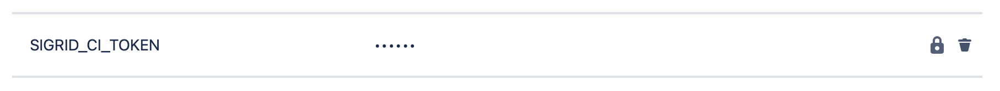
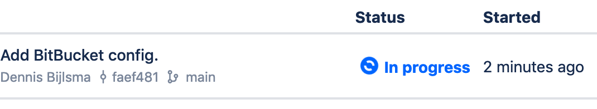
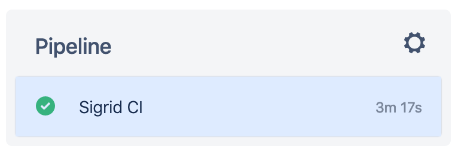
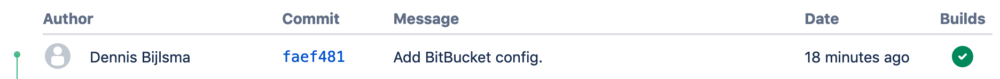
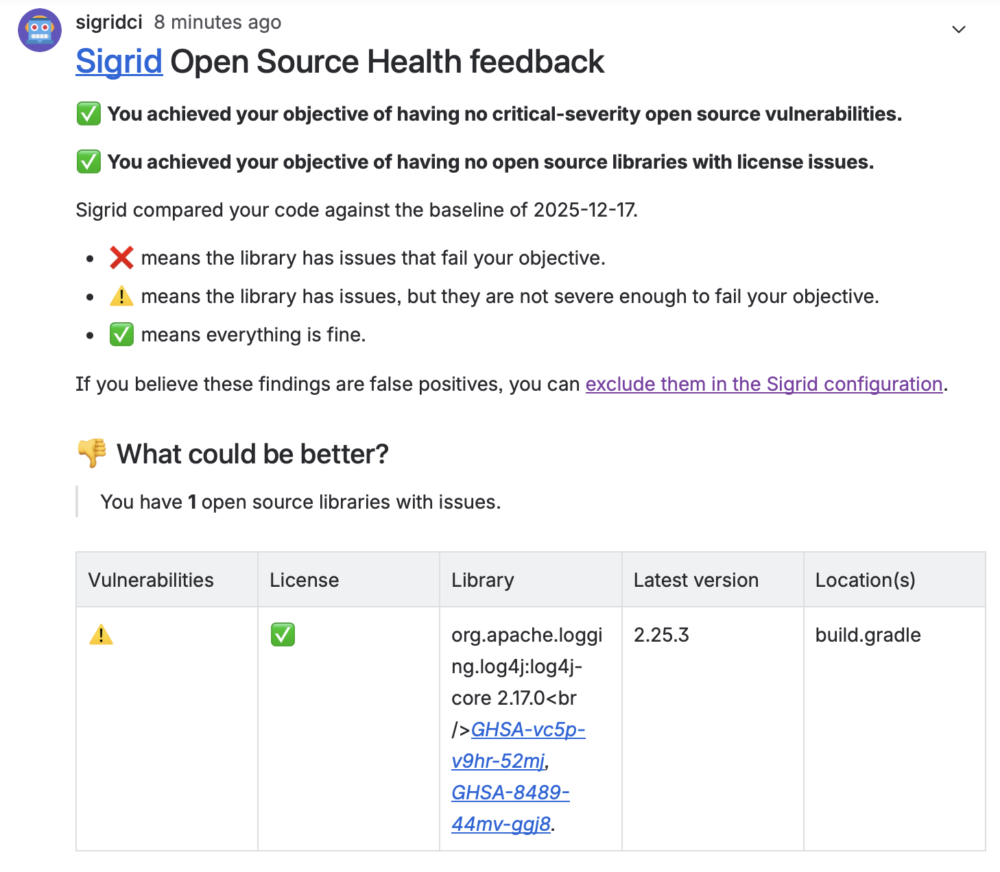

Integrating Sigrid CI with BitBucket Pipelines
==============================================

This documentation covers cloud-based Sigrid. On-premise Sigrid does not support BitBucket, supported platforms are listed in the section about [on-premise analysis configuration](../organization-integration/onpremise-analysis.md).
{: .attention }

## Prerequisites

- You have a [Sigrid](https://sigrid-says.com) user account. 
- You have created an [authentication token for using Sigrid CI](../organization-integration/authentication-tokens.md).
- [Python 3.7 or higher](https://www.python.org) needs to be available in the CI environment if you do not use the [Docker image](https://hub.docker.com/r/softwareimprovementgroup/sigridci) published by SIG. The client scripts for Sigrid CI are based on Python.

## On-boarding your system to Sigrid

On-boarding is done automatically when you first run Sigrid CI. As long as you have a valid token, you will receive the message *system has been on-boarded to Sigrid*. Subsequent runs will then be visible in both your CI environment and [sigrid-says.com](https://sigrid-says.com). 

## Configuration

### Step 1: Configure Sigrid credentials to environment variables

Sigrid CI reads your Sigrid account credentials from an environment variable called `SIGRID_CI_TOKEN`. You can make these environment variables available to BitBucket Pipelines by creating "secrets" in your repository:

- Open "Repository settings" in your project menu.
- Navigate to the "Pipelines" section.
- Navigate to "Repository variables".
- Create a secret named `SIGRID_CI_TOKEN` and use your [Sigrid authentication token](../organization-integration/authentication-tokens.md) as the value.



The following steps only apply to BitBucket Cloud, they do *not* apply to BitBucket Server. 
{: .attention }

If you want to receive Sigrid feedback as pull request comments, you will also need to allow Sigrid to post those comments.
BitBucket supports two different types of tokens: *API tokens* that are associated with a person, and *access tokens* that are associated with a repository. Sigrid requires the latter.

You can create an access token by following the steps in the [BitBucket documentation](https://support.atlassian.com/bitbucket-cloud/docs/create-a-repository-access-token/).
The access token needs to have *write* permission on pull requests, since it will be posting comments. It does not require other permissions.
You then need to make this access token available to Sigrid in your pipeline:

- Open "Repository settings" in your project menu.
- Navigate to the "Pipelines" section.
- Navigate to "Repository variables".
- Create a secret named `SIGRIDCI_BITBUCKET_COMMENT_TOKEN` and add your BitBucket access token.

### Step 2: Create a BitBucket Pipeline for Sigrid CI

Sigrid CI consists of a number of Python-based client scripts, that interact with Sigrid in order to analyze your project's source code and provide feedback based on the results. These client scripts need to be available to the CI environment, in order to call the scripts *from* the CI pipeline. You can configure your Pipeline to both download the Sigrid CI client scripts and then run Sigrid CI. 

We will create two pipelines:

- The first will publish the main/master branch to [sigrid-says.com](https://sigrid-says.com) after every commit. 
- The second will provide pull request integration: it will compare the contents of the pull request against the main/master branch.

#### Alternative 2a: Use the Sigrid CI Docker image

The recommended approach is to run Sigrid CI using the [Docker image](https://hub.docker.com/r/softwareimprovementgroup/sigridci) published by SIG. In your BitBucket repository, create a file `bitbucket-pipelines.yml`. You can then configure both pipelines in the same configuration file:

```
image: softwareimprovementgroup/sigridci

pipelines:
  branches:
    master:
      - step:
          name: Publish to Sigrid
          script:
            - "sigridci.py --customer <example_customer_name> --system <example_system_name> --source . --publish"
  pull-requests:
    '**':
      - step:
          name: Sigrid CI
          script:
            - "sigridci.py --customer <example_customer_name> --system <example_system_name> --source .
```

Note the branch name `master` in the example. This should refer to your primary branch. In most projects this is called either `master` or `main`, but the default project name could be different for your project.

#### Alternative 2b: Use a different Docker image

BitBucket Pipelines requires you define an image. However, this doesn't nessacarily have to be the Sigrid CI image. You can also use a different image, which then downloads the Sigrid CI client script directly from GitHub:

```
# This can also be your own image, or any other image that contains Python.
image: python:3.13-alpine

pipelines:
  branches:
    master:
      - step:
          name: Publish to Sigrid
          script:
            - "git clone https://github.com/Software-Improvement-Group/sigridci.git sigridci"
            - "./sigridci/sigridci/sigridci.py --customer <example_customer_name> --system <example_system_name> --source . --publish"
  pull-requests:
    '**':
      - step:
          name: Sigrid CI
          script:
            - "git clone https://github.com/Software-Improvement-Group/sigridci.git sigridci"
            - "./sigridci/sigridci/sigridci.py --customer <example_customer_name> --system <example_system_name> --source ."
```

**Security note:** Some projects might not allow this as part of their security policy. In those cases, you can simply download the `sigridci` directory in this repository, and make it available to your runners (either by placing the scripts in a known location, or packaging them into a Docker container). 

Refer to the [BitBucket Pipelines documentation](https://support.atlassian.com/bitbucket-cloud/docs/get-started-with-bitbucket-pipelines/) for more information on when and how these steps will be performed. The [bitbucket-pipelines.yml documentation](https://support.atlassian.com/bitbucket-cloud/docs/configure-bitbucket-pipelinesyml/) describes the file format used for the configuration file.

### Step 3: Analysis configuration

The Sigrid CI client script supports a number of arguments that you can use to configure your Sigrid CI run. The scripts and its command line interface are explained in [using the Sigrid CI client script](../reference/client-script-usage.md).

Sigrid will try to automatically detect the technologies you use, the component structure, and files/directories that should be excluded from the analysis. You can override the default configuration by creating a file called `sigrid.yaml` and adding it to the root of your repository. You can read more about the various options for custom configuration in the [configuration file documentation](../reference/analysis-scope-configuration.md).

## Usage

Once Sigrid CI has been enabled, you can access it from the list of pipeline runs by accessing "Pipelines" from your repository's menu:





The check will succeed if the code quality meets the specified target, and will fail otherwise. In addition to this central overview, you can also find the Sigrid CI indicator next to all commits:



If you've followed these instructions, you will receive feedback from Sigrid on your merge request:



The feedback consists of the following:

- A list of refactoring candidates that were introduced in your merge request. This allows you to understand what quality issues you caused, which in turn allows you to fix them quickly. Note that quality is obviously important, but you are not expected to always fix every single issue. As long as you meet the target, it's fine.
- An overview of all ratings, compared against the system as a whole. This allows you to check if your changes improved the system, or accidentally made things worse.
- The final conclusion on whether your changes and merge request meet the quality target.

## Contact and support

Feel free to contact [SIG's support team](mailto:support@softwareimprovementgroup.com) for any questions or issues you may have after reading this documentation or when using Sigrid.
