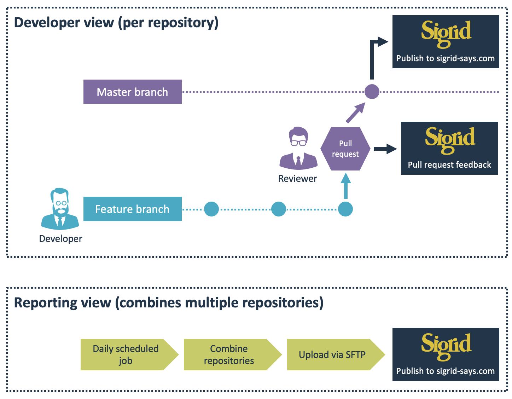

# Using Sigrid CI as part of your development workflow

Sigrid CI provides development teams with software quality feedback at various points in their Continuous Integration process. However, not every team uses the same workflow. This page describes a number of common development and Continuous Integration workflows, and shows how you can best integrate Sigrid CI.

## Sigrid CI &amp; feature branch workflow

**How it works:** Developers make changes in feature branches. When a feature branch is considered ready to be integrated, a *pull request* is created. The pull request is then reviewed by a different developer, who typically uses a combination of manual code review and tool-based checks that are executed as part of the Continuous Integration pipeline.

This is the most common development workflow, both for commercial software development projects and for open source development on platforms like GitHub. 

**How to use Sigrid CI:** In this workflow, the pull request is the logical moment to receive software quality feedback, since this feedback can then be used while the pull request is being reviewed. This enables the reviewer to either request the developer to make changes before the pull request is accepted, or create a follow-up ticket to fix the discovered issues at a later time.

After accepting the pull request, changes are merged to the master branch. After the merge, the master branch is then published to Sigrid to ensure the results at [sigrid-says.com](https://sigrid-says.com) reflect the codebase's current state.

## Sigrid CI &amp; centralized workflow

**How it works:** Every team member commits directly to the master branch. This workflow used to be very common when [Subversion](https://subversion.apache.org) was the dominant version control system, but has been replaced by the *feature branch workflow* in recent years. The downside of the centralized workflow is that every commit immediately affects all team members, since everyone is working in the same branch. This makes it impossible to perform reviews *before* changes are merged.

However, this workflow is still appropriate for smaller teams and projects, or for projects that have just started. In such scenarios the speed of this workflow outweighs the lack of an explicit review and quality control process.

**How to use Sigrid CI:** There are no pull requests, so Sigrid CI's pull request integration cannot be used. However, Sigrid CI can still provide feedback on the quality of the changes after every commit, by publishing the codebase to Sigrid directly after the commit has been made. This ensures that every developer receives feedback immediately after his/her change.

## Sigrid CI &amp; development branch workflow

**How it works:** This is a variant of the *centralized workflow*, but uses two branches: a stable master branch, and a separate development branch where all changes are made. Like the *feature branch workflow*, there is an explicit code review step before changes are merged from the development branch to the master branch. Unlike the feature branch workflow, all developers work in the same branch and are affected by each other's changes.

**How to use Sigrid CI:** Teams may or may not use pull requests in this scenario, but they do perform code reviews before changes are merged. If the team does *not* use pull requests, Sigrid CI can be used to receive feedback on all changes made to the development branch. This feedback can be used as input to the reviewer. If the team *does* use pull requests, the workflow is the same as described in *feature branch workflow*.

## Sigrid CI &amp; multi-branch workflow

**How it works:** In some cases there is no single "main" version of a project, but the development team maintains multiple versions in parallel. For example, a vendor might maintain separate versions for each of their clients. 

**How to use Sigrid CI:** Sigrid does not natively support multiple parallel streams for the same project, since less than 1 percent of our clients use this model. Sigrid assumes a single "baseline" version of the system, which does not exist in this type of workflow. 

However, it is still possible to use Sigrid in such a project: every parallel branch would be a separate system in Sigrid, which allows people to receive feedback for "their" branch. This also means that all branches will be visible as separate systems in the Sigrid dashboard on [sigrid-says.com](https://sigrid-says.com), since they are monitored separately. This in turn allows developers working on different branches to receive Sigrid CI feedback for pull requests targeting their branch.

## Sigrid CI &amp; Git submodule workflow

**How it works:** This workflow does not relate to a particular branching model, but nevertheless influences the development process and how to integrate Sigrid CI. [Git submodules](https://git-scm.com/book/nl/v2/Git-Tools-Submodules) allow a Git repository to include references to other Git repositories. The references act as a pointer, so the submodules retain their own Git commit history that is independent from the parent repository.

**How to use Sigrid CI:** You can use Sigrid CI for projects that use Git submodules. That said, you want to make sure that teams only receive feedback on code they maintain. In the example above, that means the team working on repository B needs to configure Sigrid CI to exclude all code in the Git submodule, since that code is owned by the team that works on repository A.

## Combining multiple repositories into a single Sigrid system

**How it works:** In certain situations, it might be desirable to combine multiple repositories into a single system in Sigrid. This is generally done for reporting purposes: in some projects reporting on every individual repository can seem excessively detailed, and providing a single conclusion simplifies things. 

**How to use Sigrid CI:** Sigrid CI operates on the repository level. This makes sense, as Sigrid CI is integrated into the repository's continuous integration pipeline. However, this leads to a situation where different stakeholders require different views on the source code. 

- For the development teams, use Sigrid CI to provide repository-level feedback as explained in [this documentation](../capabilities/faq.md#we-have-a-multi-repo-project-can-i-still-use-sigrid-ci).
- For reporting purposes, SIG also supports [periodic SFTP uploads](https://www.softwareimprovementgroup.com/wp-content/uploads/Automatic-source-code-upload-instruction-for-Sigrid-systems.pdf). This is less suitable for developers as a daily feedback loop is considered too slow, but for reporting purposes a daily feedback loop is perfectly reasonable.

## Contact and support

Feel free to contact [SIG's support department](mailto:support@softwareimprovementgroup.com) for any questions or issues you may have after reading this document, or when using Sigrid or Sigrid CI. Users in Europe can also contact us by phone at +31 20 314 0953.
