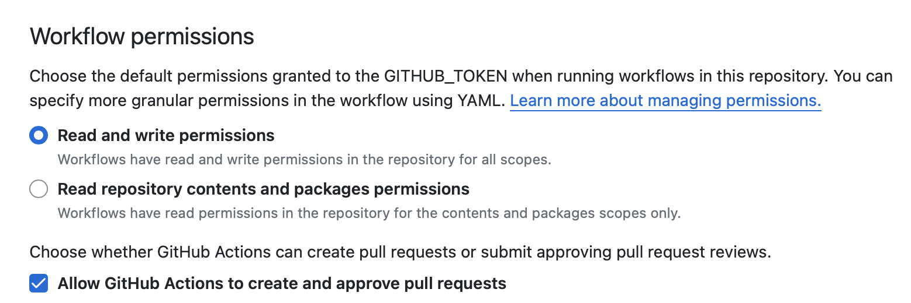

Integrating Sigrid CI with GitHub Actions
=========================================

## Prerequisites

- You have a [Sigrid](https://sigrid-says.com) user account. 
- You have created an [authentication token for using Sigrid CI](../organization-integration/authentication-tokens.md).

## On-boarding your system to Sigrid

On-boarding is done automatically when you first run Sigrid CI. As long as you have a valid token, you will receive the message *system has been on-boarded to Sigrid*. Subsequent runs will then be visible in both your CI environment and [sigrid-says.com](https://sigrid-says.com). 

## Configuration

### Step 1: Configure Sigrid credentials to environment variables

Sigrid CI reads your Sigrid account credentials from an environment variable called `SIGRID_CI_TOKEN`. You can make this environment variable available to GitHub Actions by creating "secrets" in your GitHub repository:

- Open your project settings in GitHub
- Select "Secrets" in the menu on the left
- Select "Actions" in the sub-menu that appears below "Secrets"
- Use the "New repository secret" button
- Create a secret named `SIGRID_CI_TOKEN` and use your [Sigrid authentication token](../organization-integration/authentication-tokens.md) as value


Your repository secret should now look like this:


This example explained how to add secrets for a single repository. However, if you have a GitHub organization with many repositories it can be cumbersome to repeat these steps for every repository. You can solve this by adding secrets to your GitHub organization. The process is the same as explained above, though you should access the "secrets" menu for your GitHub organization instead of the "secrets" page for the repository.


The organization-level secret.

### Step 2: Configure GitHub Actions

Depending on your organization's GitHub permissions, you might need to allow GitHub Actions to post comments on your pull requests. Sigrid CI will use these comments to give you feedback directly in your pull request, so that you can read the feedback without the need for further clicks. This setting is located in your GitHub settings, under "Actions / General".



### Step 3: Create a GitHub Actions workflow for Sigrid CI

Sigrid CI consists of a number of Python-based client scripts, that interact with Sigrid in order to analyze your project's source code and provide feedback based on the results. These client scripts need to be available to the CI environment, in order to call the scripts *from* the CI pipeline. You can configure your GitHub Actions to both download the Sigrid CI client scripts and then run Sigrid CI. 

We will create two GitHub Action workflows: the first will publish the main/master branch to [sigrid-says.com](https://sigrid-says.com) after every commit. 

#### Alternative 3a: Download Sigrid CI client script

The simplest way to run Sigrid CI is to download client script directly from GitHub. If a direct GitHub connection is not possible, for example for security reasons, you can also download the `sigridci` directory in this repository and make it available to your runners (either by placing the scripts in a known location, or packaging them into a Docker container). 

First, create `.github/workflows/sigrid-publish.yml` to publish snapshots of your project to Sigrid after every commit to the main/master branch:


```
name: sigrid-publish
on:
  push:
    branches:
      - "main"

jobs:
  sigridci:
    runs-on: ubuntu-latest
    steps:
      - name: Check out repository
        uses: actions/checkout@v4
        with:
          fetch-depth: 0
      - name: Download Sigrid CI
        run: "git clone https://github.com/Software-Improvement-Group/sigridci.git sigridci"
      - name: "Run Sigrid CI" 
        env:
          SIGRID_CI_TOKEN: "${{ secrets.SIGRID_CI_TOKEN }}"
        run: "./sigridci/sigridci/sigridci.py --customer <example_customer_name> --system <example_system_name> --source . --publish" 
```


Next, create `.github/workflows/sigrid-pullrequest.yml` to receive feedback on your pull requests:


```
name: sigrid-pullrequest
on: [pull_request]

jobs:
  sigridci:
    runs-on: ubuntu-latest
    steps:
      - name: Check out repository
        uses: actions/checkout@v4
        with:
          fetch-depth: 0
      - name: Download Sigrid CI
        run: "git clone https://github.com/Software-Improvement-Group/sigridci.git sigridci"
      - name: "Run Sigrid CI" 
        env:
          SIGRID_CI_TOKEN: "${{ secrets.SIGRID_CI_TOKEN }}"
        run: "./sigridci/sigridci/sigridci.py --customer <example_customer_name> --system <example_system_name> --source ."
      - name: "Save Sigrid CI results"
        if: always()
        uses: actions/upload-artifact@v4
        with:
          path: "sigrid-ci-output/**"
          retention-days: 7
          if-no-files-found: ignore
      - name: "Sigrid pull request feedback"
        uses: mshick/add-pr-comment@v2
        if: always()
        with:
          message-id: sigrid
          message-path: sigrid-ci-output/feedback.md
```


#### Alternative 3b: GitHub Marketplace

It is also possible to run Sigrid CI using the [GitHub Marketplace action](https://github.com/marketplace/actions/sigrid-ci) published by SIG.

To use the Marketplace action, create a file `.github/workflows/sigrid-publish.yml` in your repository and give it the following contents:


```
name: Publish to Sigrid
on:
  push:
    branches:
      - main

jobs:
  sigridci:
    runs-on: ubuntu-latest
    steps:
      - name: Check out repository
        uses: actions/checkout@v4
        with:
          fetch-depth: 0
      - name: Sigrid CI
        uses: Software-Improvement-Group/sigridci@main
        with:
          customer: examplecustomername
          system: examplesystemname
          publishonly: true
        env:
          SIGRID_CI_TOKEN: "${{ secrets.SIGRID_CI_TOKEN }}"
```


Note the name of the branch, which is `main` in the example but might be different for your repository. In general, most older GitHub projects will use `master` as their main branch, while more recent GitHub projects will use `main`. 

Next, we create a separate workflow for the pull request integration. This will compare the contents of the pull request against the main/master branch from the previous step. In your GitHub repository, create a file `.github/workflows/sigrid-pullrequest.yml` and give it the following contents:


```
name: Sigrid pull request feedback
on: [pull_request]

jobs:
  sigridci:
    runs-on: ubuntu-latest
    steps:
      - name: Check out repository
        uses: actions/checkout@v4
        with:
          fetch-depth: 0
      - name: Sigrid CI
        uses: Software-Improvement-Group/sigridci@main
        with:
          customer: examplecustomername
          system: examplesystemname
        env:
          SIGRID_CI_TOKEN: "${{ secrets.SIGRID_CI_TOKEN }}"
      - name: "Sigrid pull request feedback"
        uses: mshick/add-pr-comment@v2
        if: always()
        with:
          message-id: sigrid
          message-path: sigrid-ci-output/feedback.md
```


This example assumes you're using the repository-level secrets. If you want to use the organization-level secrets instead, you can change the following lines:


```
SIGRID_CI_TOKEN: "${{ secrets.SIGRID_CI_ORG_TOKEN }}"
```


### Step 4: Analysis configuration

The relevant command that starts Sigrid CI is the call to the `sigridci.py` script, which starts the Sigrid CI analysis. The scripts supports a number of arguments that you can use to configure your Sigrid CI run. The scripts and its command line interface are explained in [using the Sigrid CI client script](../reference/client-script-usage.md).

Sigrid will try to automatically detect the technologies you use, the component structure, and files/directories that should be excluded from the analysis. You can override the default configuration by creating a file called `sigrid.yaml` and adding it to the root of your repository. You can read more about the various options for custom configuration in the [configuration file documentation](../reference/analysis-scope-configuration.md).

The example YAML file will trigger a Sigrid CI analysis on every pull request. It is also possible to limit Sigrid CI to specific branches, or trigger Sigrid CI after every push. The [GitHub Actions documentation](https://docs.github.com/en/actions/reference/workflow-syntax-for-github-actions) explains how to configure those scenarios in the YAML file.

## Usage

To view all Sigrid CI results, check the "Actions" tab in your GitHub repository. Select "Sigrid CI" from the available actions in the menu on the left. This will give you a central overview of all Sigrid CI analyses:


The check will succeed if the code quality meets the specified target, and will fail otherwise. In addition to this central overview, you can also find the Sigrid CI indicator next to all commits:


Clicking the small indicator will show a pop-up with some more information:


Select "Details" to see the output from the Sigrid CI check:

Sigrid CI provides feedback directly in your pull request:


The end of the textual output provides a link to Sigrid, which you can follow to use Sigrid for interpreting your analysis results.

### Adding a Sigrid CI badge to your repository

Once you have used Sigrid CI for the first time, GitHub allows you to create a badge showing the current status. You can create the badge using the following steps:

- Click on "Actions" in your repository
- Select Sigrid CI in the menu on the left
- Use the "..." menu on the top right
- Select "Create status badge"


- Copy the Markdown code, and add it to your repository's README file


Your Sigrid CI badge will now appear in your project's home page.


## Contact and support

Feel free to contact [SIG's support department](mailto:support@softwareimprovementgroup.com) for any questions or issues you may have after reading this document, or when using Sigrid or Sigrid CI. Users in Europe can also contact us by phone at +31 20 314 0953.
