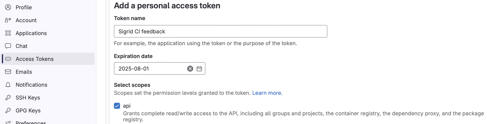
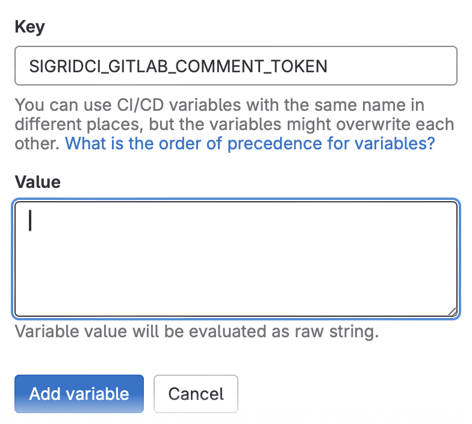
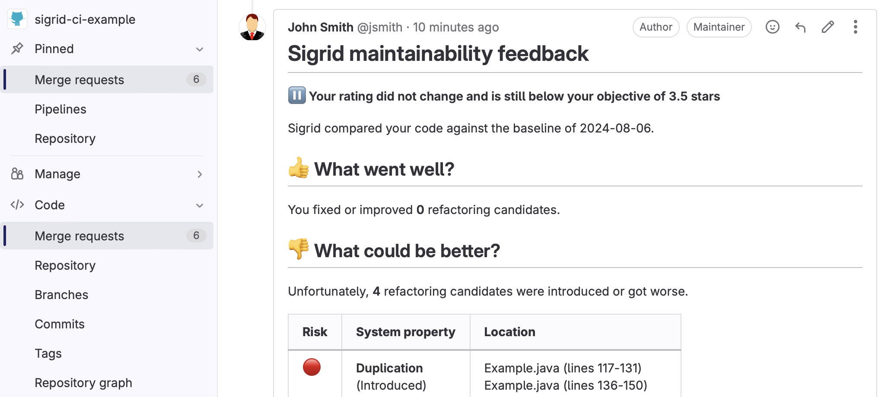

Integrating Sigrid CI with GitLab
=================================

This documentation covers cloud-based Sigrid. For on-premise Sigrid, refer to the section about [on-premise analysis configuration](../organization-integration/onpremise-analysis.md).
{: .attention }

## Prerequisites

- You have a [Sigrid](https://sigrid-says.com) user account. 
- You have created an [authentication token for using Sigrid CI](../organization-integration/authentication-tokens.md).
- [Python 3.7 or higher](https://www.python.org) needs to be available in the CI environment if you do not use the [Docker image](https://hub.docker.com/r/softwareimprovementgroup/sigridci) published by SIG. The client scripts for Sigrid CI are based on Python.

## On-boarding your system to Sigrid

On-boarding a system is done automatically when you first run Sigrid CI for that system. As long as you have a valid token, you will receive the message *system has been on-boarded to Sigrid*. Subsequent runs will then be visible in both your CI environment and [sigrid-says.com](https://sigrid-says.com). 

## Configuration

### Step 1: Configure Sigrid credentials to environment variables

Sigrid CI reads your Sigrid account credentials from an environment variable called `SIGRID_CI_TOKEN`. To add it to your GitLab CI pipeline, follow these steps:

- Select "Settings" in your GitLab project's menu
- Select "CI/CD" in the settings menu
- Locate the section named "Variables"
- Click the "Add variable" button
- Add an environment variable `SIGRID_CI_TOKEN` and use your [Sigrid authentication token](../organization-integration/authentication-tokens.md) as the value.


These instructions describe how to configure a single GitLab project, but you can follow the same steps to configure the entire GitLab group, which will make the environment variables available to all projects within that group.

Next, create a token that is allowed to post merge request comments. Sigrid CI will use this token to share feedback directly within your merge request.

- Access your GitLab settings.
- Select the Access Token menu.
- Create a new token that has permission to access the API. Sigrid CI needs permission to use the API in order to post comments.



You now need to make this API token available to your pipeline. You can either do this in your project settings if you only want to provide access to a single project, or in the group settings if you want to use the same token for all projects and repositories in that group.



In your project and/or group settings, navigate to "CI/CD settings" and then pick "variables". Next, add a variable called `SIGRIDCI_GITLAB_COMMENT_TOKEN`, and use the value from the previous step. Once you've added the token as a variable, it will automatically be picked up by Sigrid CI.

*Note: We realize it's a bit cumbersome having to create the token and add it to a variable. There is a [GitLab feature request](https://gitlab.com/gitlab-org/gitlab/-/issues/464591) that would allow integrations like Sigrid CI to post comments without needing their own special token. Once this is implemented in a future version of GitLab, Sigrid CI will be updated to no longer require manual creation of this token.* 

### Step 2: Add Sigrid CI to your project's CI pipeline

Next, you need to edit your project's CI configuration, in order to add Sigrid CI as an extra step. There are two alternatives: use SIG's Docker image (alternative 2.a below), or download and run the Sigrid CI Python script directly on your Gitlab runners (alternative 2.b below).

Both alternatives configure two additional build steps:

- The `sigridci` job provides Sigrid feedback for pull request. This step is configured to run for every branch *except* the main/master branch.
- The `sigridpublish` job publishes project snapshots to [sigrid-says.com](https://sigrid-says.com). This step only runs for the main/master branch.

The relevant command that starts Sigrid CI is the call to the `sigridci.py` script, which starts the Sigrid CI analysis. The scripts supports a number of arguments that you can use to configure your Sigrid CI run. The scripts and its command line interface are explained in [using the Sigrid CI client script](../reference/client-script-usage.md).

Note that you need to perform this step for every project where you wish to use Sigrid CI. Be aware that you can set a project-specific target quality, you don't necessarily have to use the same target for every project.

#### Alternative 2a: Use SIG's public Docker image

The recommended approach is to run Sigrid CI using the [Docker image](https://hub.docker.com/r/softwareimprovementgroup/sigridci) published by SIG. This requires using either the Docker or Kubernetes executor to be available on your GitLab runners.

Open `.gitlab-ci.yml` in your project's root directory and add the following:

```
stages:  
- report

sigridci:
  stage: report
  image:
    name: softwareimprovementgroup/sigridci
  script:
    - sigridci.py --customer <example_customer_name> --system <example_system_name> --source . 
  allow_failure: true
  artifacts:
    paths:
      - "sigrid-ci-output/*"
    reports:
      junit: "sigrid-ci-output/sigridci-junit-format-report.xml"
    expire_in: 1 week
    when: always
  rules:
    - if: $CI_PIPELINE_SOURCE == "merge_request_event"
    
sigridpublish:
  stage: report
  image:
    name: softwareimprovementgroup/sigridci
  script:
    - sigridci.py --customer <example_customer_name> --system <example_system_name> --source . --publish
  allow_failure: true
  artifacts:
    paths:
      - "sigrid-ci-output/*"
    expire_in: 1 week
    when: always
  rules:
    - if: $CI_COMMIT_BRANCH == $CI_DEFAULT_BRANCH
```

**Security note:** This example pulls the latest version of SIG's Sigrid CI Docker image directly from Docker Hub. That might be acceptable for many projects. However, some projects might not allow this as part of their security policy. In those cases, we recommend to either use alternative 2.b below, or clone SIG's Docker image to your own image repository.

#### Alternative 2b: Download SIG's Sigrid CI Python script

Alternative 2b does not use a Docker image. Instead, the Sigrid CI GitLab jobs download SIG's Sigrid CI Python script directly from GitHub and runs it on your GitLab runner. This requires Github.com to be accessible from your CI environment and Python 3.7 to be available on your GitLab runners.

Sigrid CI consists of a number of Python-based client scripts, that interact with Sigrid in order to analyze your project's source code and provide feedback based on the results. These client scripts need to be available to your GitLab runners, in order to call the scripts *from* the CI pipeline. 

Open `.gitlab-ci.yml` in your project's root directory and add the following:

```
stages:  
- report

sigridci:
  stage: report
  script:
    - git clone https://github.com/Software-Improvement-Group/sigridci.git sigridci
    - ./sigridci/sigridci/sigridci.py --customer <example_customer_name> --system <example_system_name> --source .
  allow_failure: true
  artifacts:
    paths:
      - "sigrid-ci-output/*"
    reports:
      junit: "sigrid-ci-output/sigridci-junit-format-report.xml"
    expire_in: 1 week
    when: always
  rules:
    - if: $CI_PIPELINE_SOURCE == "merge_request_event"
    
sigridpublish:
  stage: report
  script:
    - git clone https://github.com/Software-Improvement-Group/sigridci.git sigridci
    - ./sigridci/sigridci/sigridci.py --customer <example_customer_name> --system <example_system_name> --source . --publish
  allow_failure: true
  artifacts:
    paths:
      - "sigrid-ci-output/*"
    expire_in: 1 week
    when: always
  rules:
    - if: $CI_COMMIT_BRANCH == $CI_DEFAULT_BRANCH
```

**Security note:** This example downloads the Sigrid CI client scripts directly from GitHub. That might be acceptable for some projects, and is in fact increasingly common. However, some projects might not allow this as part of their security policy. In those cases, you can simply download the `sigridci` directory in this repository, and make it available to your runners (either by placing the scripts in a known location, or packaging them into a Docker container). 

### Step 3: Analysis configuration

Sigrid will try to automatically detect the technologies you use, the component structure, and files/directories that should be excluded from the analysis. You can override the default configuration by creating a file called `sigrid.yaml` and adding it to the root of your repository. You can read more about the various options for custom configuration in the [configuration file documentation](../reference/analysis-scope-configuration.md).

## Usage

Once you have configured the integration, Sigrid CI will show up as a new step in your GitLab CI pipeline. The step will succeed if the code quality meets the specified target, and will fail otherwise. 


If you've followed these instructions, you will receive feedback from Sigrid on your merge request:



The feedback consists of the following:

- A list of refactoring candidates that were introduced in your merge request. This allows you to understand what quality issues you caused, which in turn allows you to fix them quickly. Note that quality is obviously important, but you are not expected to always fix every single issue. As long as you meet the target, it's fine.
- An overview of all ratings, compared against the system as a whole. This allows you to check if your changes improved the system, or accidentally made things worse.
- The final conclusion on whether your changes and merge request meet the quality target.

Sigrid CI output is *also* included in GitLab's CI/CD pipeline page, which contains a *Tests* tab. The *View details* button will show the same list of refactoring candidates that is shown in the aforementioned textual output and HTML report.

## Contact and support

Feel free to contact [SIG's support department](mailto:support@softwareimprovementgroup.com) for any questions or issues you may have after reading this document, or when using Sigrid or Sigrid CI. Users in Europe can also contact us by phone at +31 20 314 0953.
