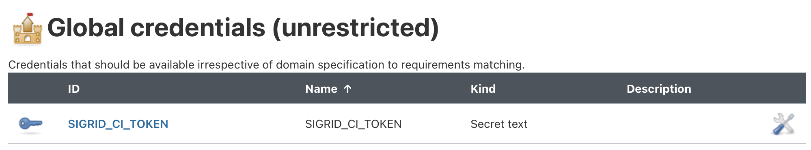
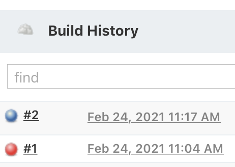
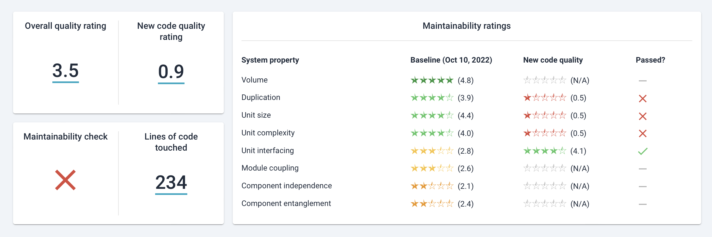

Integrating Sigrid CI into your Jenkins pipeline
================================================

This documentation covers cloud-based Sigrid. On-premise Sigrid does not support Jenkins, supported platforms are listed in the section about [on-premise analysis configuration](../organization-integration/onpremise-analysis.md).
{: .attention }

## Prerequisites

- You have a [Sigrid](https://sigrid-says.com) user account. 
- You have created an [authentication token for using Sigrid CI](../organization-integration/authentication-tokens.md).
- [Python 3.7 or higher](https://www.python.org) needs to be available in the CI environment.

### Some notes about the output directory
- The Sigrid CI container writes several files in its output directory, which defaults to the container working directory. It writes these files as a non-privileged user configured in our Dockerfile (currently: user `sigridci`). If you bind-mount a host volume to the output directory, ensure that this container user has write permission for the mounted directory, which typically means you need to make this directory world-writeable on the host.

## On-boarding your system to Sigrid

On-boarding is done automatically when you first run Sigrid CI. As long as you have a valid token, you will receive the message *system has been on-boarded to Sigrid*. Subsequent runs will then be visible in both your CI environment and [sigrid-says.com](https://sigrid-says.com).

## Configuration

### Step 1: Configure Sigrid credential to environment variable

Sigrid CI reads your Sigrid credential from one environment variable, called `SIGRID_CI_TOKEN`. You need to make this environment variable available Jenkins. To do this, navigate to the "Credentials" settings in your Jenkins setting page. Then select "Add credentials" with the type "secret text". You can then use this page to add `SIGRID_CI_TOKEN`:


After saving, the secret should be visible in the list:



This example assumes a default configuration for Jenkins. Your configuration might be different, refer to the [Jenkins documentation](https://www.jenkins.io/doc/book/pipeline/jenkinsfile/#secret-text) for more information on how to make secrets available to Jenkins pipelines.

### Step 2: Add Sigrid CI to your Jenkins configuration

In the root of your repository, add a file named `Jenkinsfile`. Adding a Sigrid CI step will provide feedback on the quality of the new and changed code within Jenkins, as well as publishing a project snapshot to [sigrid-says.com](https://sigrid-says.com).

#### Alternative 2a: Docker-based run

The recommended approach is to run Sigrid CI using the [Docker image](https://hub.docker.com/r/softwareimprovementgroup/sigridci) published by SIG. Add the following to your `Jenkinsfile`:

```
pipeline {
    agent {
        docker {
            image 'softwareimprovementgroup/sigridci'
        }
    }
    
    environment {
        SIGRID_CI_TOKEN = credentials('SIGRID_CI_TOKEN')
        PYTHONIOENCODING = 'utf8'
    }

    stages {
        stage('build') {
            steps {
                sh 'sigridci.py --customer <example_customer_name> --system <example_system_name> --source . --publish'
            }
        }
    }
}
```

#### Alternative 2b: Download Sigrid CI client script

The previous example uses a Docker image to run the pipeline. While recommended, using Docker is *not* a requirement for using Sigrid CI. It is also possible to use Sigrid CI with a local agent, which is shown in the following example:

```
pipeline {
    agent any

    environment {
        SIGRID_CI_TOKEN = credentials('SIGRID_CI_TOKEN')
        PYTHONIOENCODING = 'utf8'
        SIGRID_CI_GITHUB = 'https://github.com/Software-Improvement-Group/sigridci.git'
        SIGRID_CI_DIR = 'sigridci'
    }

    stages {
        stage('build') {
            steps {
                sh 'git clone --depth 1 $SIGRID_CI_GITHUB $SIGRID_CI_DIR || git -C $SIGRID_CI_DIR pull'
                sh './$SIGRID_CI_DIR/sigridci/sigridci.py --customer <example_customer_name> --system <example_system_name> --source . --publish'
            }
        }
    }
}
```

**Security note:** This example downloads the Sigrid CI client scripts directly from GitHub. That might be acceptable for some projects, and is in fact increasingly common. However, some projects might not allow this as part of their security policy. In those cases, you can simply download the `sigridci` directory in this repository, and make it available to your runners (either by placing the scripts in a known location, or packaging them into a Docker container). 

In this example we're assuming you don't have a Jenkins configuration yet, hence we create it from scratch. If you already have an existing Jenkins configuration, simply add the contents of the example to your configuration.

Sigrid CI consists of a number of Python-based client scripts, that interact with Sigrid in order to analyze your project's source code and provide feedback based on the results. These client scripts need to be available to the CI environment, in order to call the scripts *from* the CI pipeline. 

The relevant command that starts Sigrid CI is the call to the `sigridci.py` script, which starts the Sigrid CI analysis. The scripts supports a number of arguments that you can use to configure your Sigrid CI run. The scripts and its command line interface are explained in [using the Sigrid CI client script](../reference/client-script-usage.md).

### Step 3: Configure your Jenkins pipeline

Create a new pipeline in Jenkins by selecting "New item" in the menu. Select the type "pipeline" from the list of options presented to you, and enter a name for your new build pipeline.


Next, navigate to the section "Pipeline", and select the option "Pipeline script from SCM". This will make Jenkins use the `Jenkinsfile` configuration you created earlier. This means you only need to enter the location and credentials for your repository, and Jenkins will then pick up the rest of the configuration from the `Jenkinsfile`.


Again, these instructions assume that you needed to create a new Jenkins pipeline from scratch. If you already had an existing pipeline, simply add the required steps to it.

The Sigrid CI output uses color to communicate whether the ratings meet the target: system properties that meet the target are shown in green, while ratings below the target are shown in red. Jenkins does not support colored text by default, meaning this information is lost. Using the [Jenkins ANSI color plugin](https://plugins.jenkins.io/ansicolor/) will allow Jenkins to show colored text.

### Step 4: Analysis configuration

Sigrid will try to automatically detect the technologies you use, the component structure, and files/directories that should be excluded from the analysis. You can override the default configuration by creating a file called `sigrid.yaml` and adding it to the root of your repository. You can read more about the various options for custom configuration in the [configuration file documentation](../reference/analysis-scope-configuration.md).

## Usage

You can schedule your Jenkins pipeline to indicate *when* it should run: the typical strategy is to run it automatically after every commit, but you can also schedule it to run periodically. You can also start your pipeline manually using the "Build now" button.


Once you have configured the integration, Sigrid CI will show up as a new step in your CI pipeline. The step will succeed if the code quality meets the specified target, and will fail otherwise.. Your can access the build status from the "build history" section in the menu:



Clicking on the build output will provide more information. Sigrid CI provides multiple levels of feedback. The first and fastest type of feedback is directly produced in the CI output, as shown in the following screenshot:


The output consists of the following:

- A list of refactoring candidates that were introduced in your merge request. This allows you to understand what quality issues you caused, which in turn allows you to fix them quickly. Note that quality is obviously important, but you are not expected to always fix every single issue. As long as you meet the target, it's fine.
- An overview of all ratings, compared against the system as a whole. This allows you to check if your changes improved the system, or accidentally made things worse.
- The final conclusion on whether your changes and merge request meet the quality target.

The end of the textual output provides a link to the Sigrid landing page. You can open this URL in order to use Sigrid for interpreting your analysis results.



Whether you should use the text output or the Sigrid page is largely down to personal preference: the text output is faster to acces and more concise, while Sigrid allows you to view results in a more visual and interactive way. 

## Contact and support

Feel free to contact [SIG's support department](mailto:support@softwareimprovementgroup.com) for any questions or issues you may have after reading this document, or when using Sigrid or Sigrid CI. Users in Europe can also contact us by phone at +31 20 314 0953.
