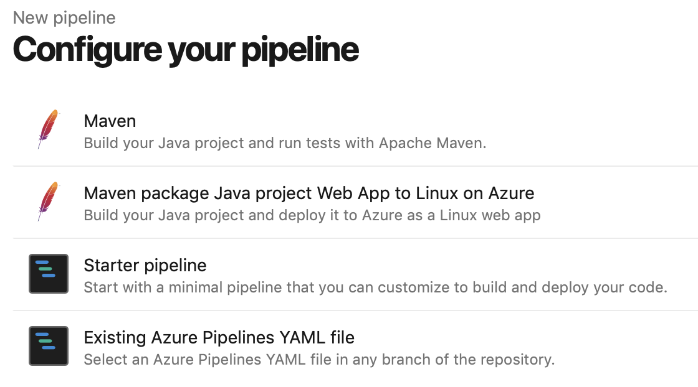
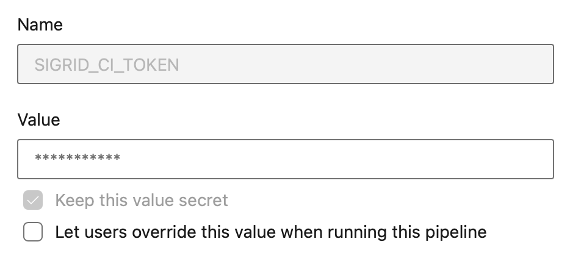
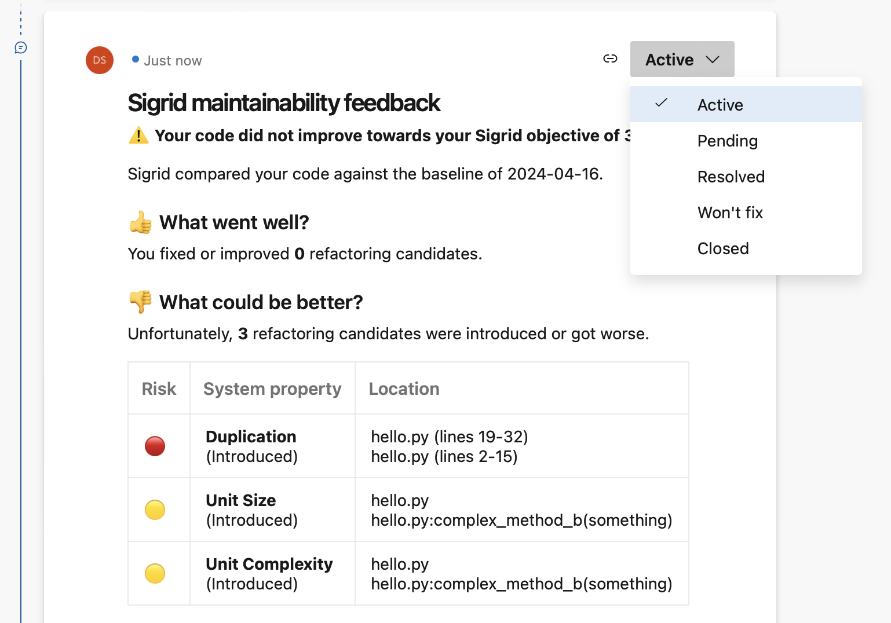

Integrating Sigrid CI with Mendix QSM on Azure Devops
========================================================

Please note: `QSM` is the brand name used by Mendix, in this manual we will use `Sigrid`.

This documentation covers cloud-based Sigrid. For on-premise Sigrid, refer to the section about [on-premise analysis configuration](../organization-integration/onpremise-analysis.md).
{: .attention }

## Prerequisites

- You are not using the default Mendix teamserver, but you are using your own Git server for version control of your projects.
- You would like to trigger the Sigrid analysis from within your own pipeline in Git.
- Your runners are able to pull this [public docker image](https://hub.docker.com/r/softwareimprovementgroup/mendixpreprocessor), the image is used to preprocess the Mendix code before uploading it to Sigrid.
- You have a [Sigrid](https://qsm.mendix.com) user account. 
- You have created an [authentication token using Sigrid](../organization-integration/authentication-tokens.md).
- You have created a Personal access (PAT) token using the [Mendix user settings](https://user-settings.mendix.com/link/developersettings)

This documentation contains instructions for Docker-based runners (recommended) and Linux-based runners. Windows-based runners are not supported.
{: .attention }

## On-boarding your system to Sigrid

On-boarding is done automatically when you first run Sigrid CI. As long as you have a valid token, you will receive the message *system has been on-boarded to Sigrid*. Subsequent runs will then be visible in both your CI environment and [sigrid-says.com](https://sigrid-says.com). 

## Configuration

### Step 1: Create pipeline configuration file for Azure Devops**

We will create a pipeline that consists of two jobs:

- One job that will publish the main branch to [sigrid-says.com](https://sigrid-says.com) after every commit to main.
- One job to provide feedback on pull requests, which can be used as input for code reviews.

The recommended approach is to run Sigrid CI using the [Docker image](https://hub.docker.com/r/softwareimprovementgroup/mendixpreprocessor) published by SIG. In the root of your repository, create a file `azure-devops-pipeline.yaml` and add the following contents:

```yaml
stages:
  - stage: Report
    jobs:
      - job: SigridCI
        pool:
          vmImage: ubuntu-latest
        container: 
          image: softwareimprovementgroup/mendixpreprocessor:latest
          options: --user root
        continueOnError: true
        condition: "ne(variables['Build.SourceBranch'], 'refs/heads/main')"
        steps:
          - bash: "/usr/local/bin/entrypoint.sh"
            env:
              MENDIX_TOKEN: $(MENDIX_TOKEN)
              MENDIX_SOURCE_DIR: $(System.DefaultWorkingDirectory)
              SIGRID_CI_TOKEN: $(SIGRID_CI_TOKEN)
              SIGRID_CI_CUSTOMER: <example_customer_name>
              SIGRID_CI_SYSTEM: <example_system_name>
            continueOnError: true
      - job: SigridPublish
        pool:
          vmImage: ubuntu-latest
        container: 
          image: softwareimprovementgroup/mendixpreprocessor:latest
          options: --user root
        continueOnError: true
        condition: "eq(variables['Build.SourceBranch'], 'refs/heads/main')"
        steps:
          - bash: "/usr/local/bin/entrypoint.sh"
            env:
              MENDIX_TOKEN: $(MENDIX_TOKEN)
              MENDIX_SOURCE_DIR: $(System.DefaultWorkingDirectory)
              SIGRID_CI_TOKEN: $(SIGRID_CI_TOKEN)
              SIGRID_CI_CUSTOMER: <example_customer_name>
              SIGRID_CI_SYSTEM: <example_system_name>
              SIGRID_CI_PUBLISH: 'publishonly'
            continueOnError: true
```

Note the name of the branch, which is `main` in the example but might be different for your repository. In general, most older projects will use `master` as their main branch, while more recent projects will use `main`. 

The docker image allows a few optional environment variables to be set, that are equivalent to [client script options](../reference/client-script-usage.md#command-line-options) of the full Sigrid CI script.
Optional variables are:
- `SIGRID_CI_TARGET_QUALITY`: Equivalent to `--target-quality`
- `INCLUDE`: Equivalent to `--include`
- `EXCLUDE`: Equivalent to `--exclude`

**Security note:** The `options: --user root` statement was added deliberately. Based on [Microsoft's documentation](https://learn.microsoft.com/en-us/azure/devops/pipelines/process/container-phases?view=azure-devops&tabs=yaml#linux-based-containers), we understand that Linux-based Docker images used in Azure DevOps need to run as root (fifth requirement).

Commit and push this file to the repository, so that Azure DevOps can use this configuration file for your pipeline. If you already have an existing pipeline configuration, simply add these steps to it.

Finally, note that you need to perform this step for every project where you wish to use Sigrid CI.

### Step 2: Create your Azure DevOps pipeline

In Azure DevOps, access the section "Pipelines" from the main menu. In this example we assume you are using a YAML file to configure your pipeline:



Select the YAML file you created in the previous step:


This will display the contents of the YAML file in the next screen. The final step is to add your account credentials to the pipeline. Click "Variables" in the top right corner. Create a secret named `SIGRID_CI_TOKEN` and use your [Sigrid authentication token](../organization-integration/authentication-tokens.md) as the value.



Add a second secret `MENDIX_TOKEN` and use the [Mendix user settings](https://user-settings.mendix.com/link/developersettings) to create a PAT with 'mx:modelrepository:repo:read' access only.

From this point, Sigrid CI will run as part of the pipeline. When the pipeline is triggered depends on the configuration: by default it will run after every commit, but you can also trigger it periodically or run it manually.


## Usage

To obtain feedback on your commit, click on the "Sigrid CI" step in the pipeline results screen shown above. 


The check will succeed if the code quality meets the specified target, and will fail otherwise. In addition to the simple success/failure indicator, Sigrid CI provides multiple levels of feedback. The first and fastest type of feedback is directly produced in the CI output, as shown in the following screenshot:



The output consists of the following:

- A list of refactoring candidates that were introduced in your merge request. This allows you to understand what quality issues you caused, which in turn allows you to fix them quickly. Note that quality is obviously important, but you are not expected to always fix every single issue. As long as you meet the target, it's fine.
- An overview of all ratings, compared against the system as a whole. This allows you to check if your changes improved the system, or accidentally made things worse.
- The final conclusion on whether your changes and merge request meet the quality target.

## Contact and support

Feel free to contact [SIG's support team](mailto:support@softwareimprovementgroup.com) for any questions or issues you may have after reading this documentation or when using Sigrid.
