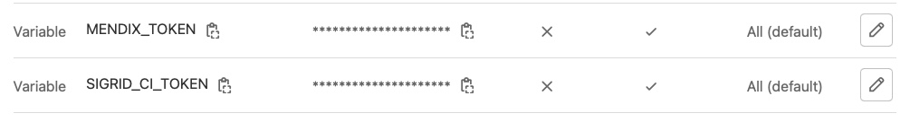

Integrating Sigrid CI with Mendix QSM on a GitHub server
========================================================

Please note: `QSM` is the brand name used by Mendix, in this manual we will use `Sigrid`.

This documentation covers cloud-based Sigrid. For on-premise Sigrid, refer to the section about [on-premise analysis configuration](../organization-integration/onpremise-analysis.md).
{: .attention }

## Prerequisites

- You are not using the default Mendix teamserver, but you are using your own Git server for version control of your projects.
- You would like to trigger the Sigrid analysis from within your own pipeline in Git.
- Your runners are able to pull this [public docker image](https://hub.docker.com/r/softwareimprovementgroup/mendixpreprocessor), the image is used to preprocess the Mendix code before uploading it to Sigrid.
- You have a [Sigrid](https://qsm.mendix.com) user account. 
- You have created an [authentication token using Sigrid](../organization-integration/authentication-tokens.md).
- You have created a Personal access (PAT) token using the [Mendix user settings](https://user-settings.mendix.com/link/developersettings)

## On-boarding your system to Sigrid

On-boarding is done automatically when you first run Sigrid CI. As long as you have a valid token, you will receive the message *system has been on-boarded to Sigrid*. Subsequent runs will then be visible in both your CI environment and [sigrid-says.com](https://sigrid-says.com). 

## Configuration

**Step 1: Configure both the Sigrid credential and the Mendix PAT to environment variables**

Sigrid CI reads your credentials from 2 environment variables called `SIGRID_CI_TOKEN` and `MENDIX_TOKEN`. 
To add these to your GitHub repository, follow these steps:

- Open your project settings in GitHub
- Select "Secrets" in the menu on the left
- Select "Actions" in the sub-menu that appears below "Secrets"
- Use the "New repository secret" button
- Add an first environment variable `SIGRID_CI_TOKEN` and use your [Sigrid authentication token](../organization-integration/authentication-tokens.md) as the value.
- Add an second environment variable `MENDIX_TOKEN` and use the [Mendix user settings](https://user-settings.mendix.com/link/developersettings) to create a PAT with 'mx:modelrepository:repo:read' access only.




Your repository secret should now look like this:


This example explained how to add secrets for a single repository. However, if you have a GitHub organization with many repositories it can be cumbersome to repeat these steps for every repository. You can solve this by adding secrets to your GitHub organization. The process is the same as explained above, though you should access the "secrets" menu for your GitHub organization instead of the "secrets" page for the repository.


The organization-level secret.

**Create a GitHub Actions workflow for Sigrid CI**

We will create a pipeline that consists of two jobs:

- One job that will publish the main branch to [sigrid-says.com](https://sigrid-says.com) after every commit to main.
- One job to provide feedback on pull requests, which can be used as input for code reviews.


We will create two GitHub Action workflows: the first will publish the main/master branch to [sigrid-says.com](https://sigrid-says.com) after every commit. In your GitHub repository, create a file `.github/workflows/sigrid-publish.yml` and give it the following contents:


```
name: sigrid-publish
on:
  push:
    branches:
      - "main"
jobs:
  SigridCI-for-QSM:
    runs-on: ubuntu-latest
    container: softwareimprovementgroup/mendixpreprocessor:latest
    env:
      MENDIX_TOKEN: "${{ secrets.MENDIX_TOKEN }}"
      SIGRID_CI_CUSTOMER: '<example_customer_name>'
      SIGRID_CI_SYSTEM: '<example_system_name>'
      SIGRID_CI_PUBLISH: 'publish'
      SIGRID_CI_TOKEN: "${{ secrets.SIGRID_CI_TOKEN }}"
    steps:
      - name: Check out repository
        uses: actions/checkout@v3
      - run: |
          /usr/local/bin/entrypoint.sh

```


The docker image allows a few optional environment variables to be set, that are equivalent to [client script options](../reference/client-script-usage.md#command-line-options) of the full Sigrid CI script.
Optional variables are:
- `SIGRID_CI_TARGET_QUALITY`: Equivalent to `--target-quality`
- `INCLUDE`: Equivalent to `--include`
- `EXCLUDE`: Equivalent to `--exclude`

Note the name of the branch, which is `main` in the example but might be different for your repository. In general, most older projects will use `master` as their main branch, while more recent projects will use `main`. 

Next, we create a separate workflow for the pull request integration. This will compare the contents of the pull request against the main/master branch from the previous step. In your GitHub repository, create a file `.github/workflows/sigrid-pullrequest.yml` and give it the following contents:


```
name: sigrid-pullrequest
on: [pull_request]
jobs:
  SigridCI-for-QSM:
    runs-on: ubuntu-latest
    container: softwareimprovementgroup/mendixpreprocessor:latest
    env:
      CI_PROJECT_DIR: "."
      MENDIX_TOKEN: "${{ secrets.MENDIX_TOKEN }}"
      SIGRID_CI_CUSTOMER: '<example_customer_name>'
      SIGRID_CI_SYSTEM: '<example_system_name>'
      SIGRID_CI_TOKEN: "${{ secrets.SIGRID_CI_TOKEN }}"
    steps:
      - name: Check out repository
        uses: actions/checkout@v3
      - run: |
          /usr/local/bin/entrypoint.sh
```


This example assumes you're using the repository-level secrets. If you want to use the organization-level secrets instead, you can change the following lines:


```
SIGRID_CI_TOKEN: "${{ secrets.SIGRID_CI_ORG_TOKEN }}"
MENDIX_TOKEN: "${{ secrets.MENDIX_ORG_TOKEN }}"
```


Finally, note that you need to perform this step for every project where you wish to use Sigrid CI.

The output consists of the following:

- A list of refactoring candidates that were introduced in your merge request. This allows you to understand what quality issues you caused, which in turn allows you to fix them quickly. Note that quality is obviously important, but you are not expected to always fix every single issue. As long as you meet the target, it's fine.
- An overview of all ratings, compared against the system as a whole. This allows you to check if your changes improved the system, or accidentally made things worse.
- The final conclusion on whether your changes and merge request meet the quality target.

## Contact and support

Feel free to contact [SIG's support department](mailto:support@softwareimprovementgroup.com) for any questions or issues you may have after reading this document, or when using Sigrid or Sigrid CI. Users in Europe can also contact us by phone at +31 20 314 0953.

