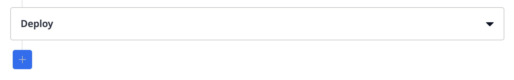
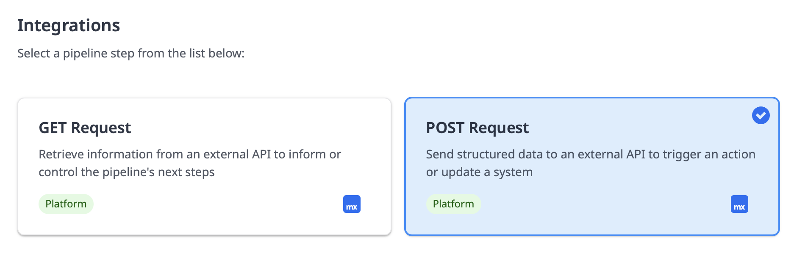

Integrating Sigrid CI with Mendix Pipelines
===========================================

Please note: `QSM` is the brand name used by Mendix, in this documentation we will refer to the product as `Sigrid`.
{: .attention }

This document describes integrating Sigrid with [Mendix Pipelines](https://docs.mendix.com/developerportal/deploy/mendix-pipelines/), 
which is a continuous integration pipeline built into the Mendix Platform.

## Prerequisites

- You are using Mendix Pipelines for your project.
- You would like to trigger the Sigrid analysis from within Mendix Pipelines.
- You have a [Sigrid](https://qsm.mendix.com) user account.
- You have created an [authentication token using Sigrid](../organization-integration/authentication-tokens.md).
- You have created a Personal access (PAT) token using the [Mendix user settings](https://user-settings.mendix.com/link/developersettings)

## On-boarding your system to Sigrid

You can only use this integration if your app has been on-boarded to Sigrid. If you haven't done so already, you can 
on-board your app using [the Mendix support app](mendix-teamserver.md#default-onboarding-via-the-dedicated-mendix-support-app)
or [using the Sigrid API](mendix-teamserver.md#scripted-onboarding-via-a-post-command-to-the-sigrid-api).

## Configuring the integration in Mendix Pipelines

- Open Mendix Pipelines for your app.
- If you do not have a pipeline yet, click the "design pipeline" button to create it. If you already have a pipeline,
  click the "edit pipeline" button. Either way, you will end up in the edit pipeline screen.
- Use the plus button to add a step to your pipeline.

- In the screen that appears, select the "integrations" tab.
- In this tab, select the "POST request" option.
- Click the button to start configuring your step.

Use the form in the POST request step to configure the integration:

- Base URL: `https://sigrid-says.com/rest/inboundresults/qsm`
- Additional URL path: `zz`
- Header 1 key: `Authorization`
- Header 1 value: `Bearer <your Sigrid token>`
- Click "save and activate"

## Contact and support

Feel free to contact [SIG's support team](mailto:support@softwareimprovementgroup.com) for any questions or issues you 
may have after reading this documentation or when using Sigrid.
