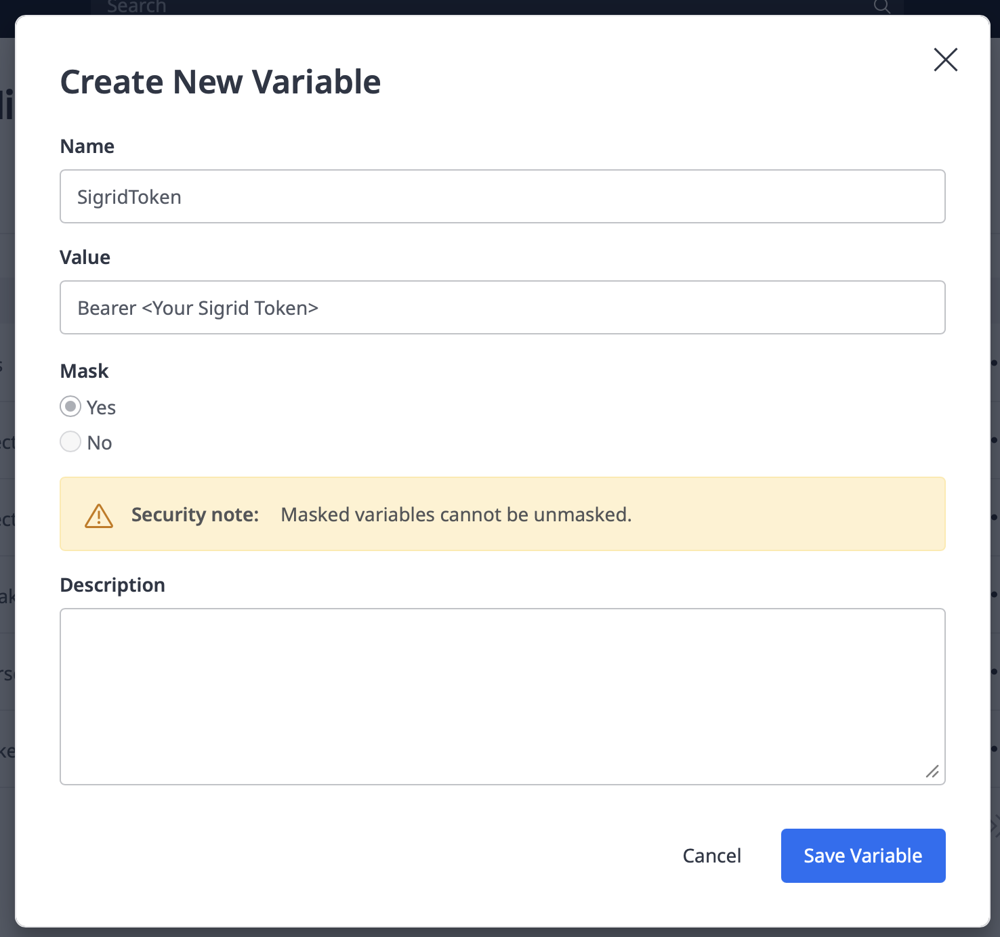
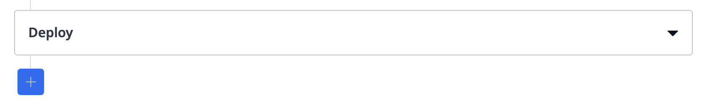
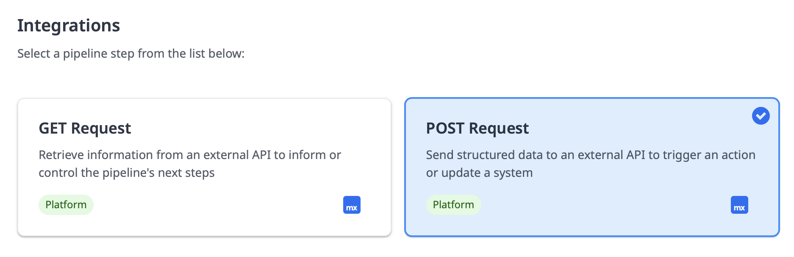
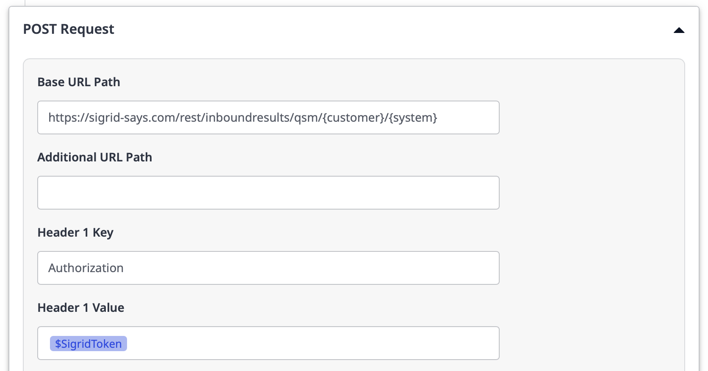

Integrating Sigrid CI with Mendix Pipelines
========================================

Please note: `QSM` is the brand name used by Mendix. In this documentation we refer to the product as `Sigrid`.
{: .attention }

[Mendix Pipelines](https://docs.mendix.com/developerportal/deploy/mendix-pipelines/) is a continuous integration pipeline built into the Mendix Platform. This document describes how to add a step to your pipeline that triggers a Sigrid analysis of your app.

## Prerequisites

- Your app has already been on-boarded to Sigrid. See [on-boarding your app](#on-boarding-your-app-to-sigrid) below.
- You have a [Sigrid](https://qsm.mendix.com) user account.
- You have created a [Sigrid authentication token](../organization-integration/authentication-tokens.md) that is valid for your customer.
- You know your Sigrid customer name and system name. See [finding your customer name and system name](#finding-your-customer-name-and-system-name) below.
- You have configured a Personal Access Token (PAT) and an API Key in your [Mendix user settings](https://user-settings.mendix.com/link/developersettings). Mendix Pipelines requires these to run; they are not used by the Sigrid integration itself.

## On-boarding your app to Sigrid

This integration triggers a scan of an app that Sigrid already knows about. It cannot on-board a new app. If you have not on-boarded your app yet, do that first, using either:

- [the Mendix support app](mendix-teamserver.md#default-onboarding-via-the-dedicated-mendix-support-app), or
- [the Sigrid API](mendix-teamserver.md#scripted-onboarding-via-a-post-command-to-the-sigrid-api).

## Finding your customer name and system name

Log in to Sigrid and open the system you want to scan. The address bar shows:

```
https://sigrid-says.com/{customer}/{system}/-/overview
```

For example, `https://sigrid-says.com/aap/noot/-/overview` means your customer name is `aap` and your system name is `noot`.

Use these values exactly as they appear in the URL.

Please note: for systems on-boarded from a specific Team Server branch, the system name is a concatenation of the app name, the word `branch`, and the branch name, with unsupported characters replaced or removed. On-boarding app `noot` from branch `mies` gives the system name `noot-branch-mies`. Reading the name from the URL saves you from constructing it yourself.

## Step 1: Store your Sigrid token as a pipeline variable

Storing the token as a variable keeps it out of your pipeline configuration, where it would otherwise be visible to anyone who can view the pipeline.

1. Open Mendix Pipelines for your app through **Deployment** → **Pipelines**.
2. Open the **Variables** page and click **Create new variable**.
3. Give the variable a name of your choice, for example `SigridToken`.
4. Set the value to `Bearer` followed by a space and your Sigrid token, for example `Bearer sIgr1D...`.
5. Set **Mask** to yes, so the value stays hidden.



Please note: the word `Bearer` must be part of the variable value. Mendix Pipelines cannot combine a variable with other text, so writing `Bearer $SigridToken` in the header field does not work.

## Step 2: Add a POST request step to your pipeline

- If you do not have a pipeline yet, click **Design pipeline** and choose **Empty pipeline**. If you already have one, click **Edit pipeline** on the **Designs** page. Either way, you end up in the edit pipeline screen.
- Use the plus button to add a step to your pipeline.



- In the screen that appears, select the **Integrations** tab.
- Select the **POST request** option.
- Click the button to start configuring your step.



## Step 3: Configure the POST request step



Fill in the form as follows:

| Field | Value |
|-------|-------|
| **Base URL Path** | `https://sigrid-says.com/rest/inboundresults/qsm/{customer}/{system}` |
| **Header 1 Key** | `Authorization` |
| **Header 1 Value** | `$SigridToken`, or whatever you named your variable in step 1 |

Then click **Save and activate**.

## Verifying the integration

Run your pipeline. A successful POST request step means the scan has been triggered, not that it has finished. Once the analysis completes, open your system in Sigrid and check that the analysis date reflects the current run.

## Contact and support

Feel free to contact [SIG's support team](mailto:support@softwareimprovementgroup.com) for any questions or issues you may have after reading this documentation or when using Sigrid.
