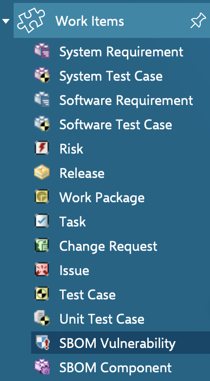

Integrating Sigrid CI with Siemens Polarion
===========================================

## Prerequisites

- On the Polarion side:
  - You have a [Siemens Polarion](https://polarion.plm.automation.siemens.com) account and project.
  - You have a [Polarion API token](https://industry-solutions.polarion.com/polarion/rest/v1/).
- On the Sigrid side:
  - You have a [Sigrid](https://sigrid-says.com) user account. 
  - You have created an [authentication token for using Sigrid CI](../authentication-tokens.md).

## Enable Sigrid CI for your project

You will first need to add Sigrid CI to your project's pipeline, so that your code is automatically published to Sigrid after every commit. Sigrid CI supports [multiple development platforms](../README.md), so you can follow the instructions for your platform. Once Sigrid CI is enabled in your pipeline, your project will be automatically on-boarded to Sigrid when you run it for the first time. Once you have done this you should be able to see your project when you check [sigrid-says.com](https://sigrid-says.com).


## Adding the Polarion integration to your Sigrid configuration

You will need to create a [scope configuration file](../reference/analysis-scope-configuration.md) for your system and add it to your repository. You might have already done this previously when you on-boarded your project to Sigrid. Open your `sigrid.yaml` configuration file. The file might look something like this:

```
component_depth: 1

languages:
  - "python"

dependencychecker:
  blacklist:
    - "NONE"
```

You will be adding a `polarion` section to this file. This will enable the integration between Sigrid and Polarion, which means that *both* Sigrid and Polarion will be updated whenever you publish your source code. This section supports the following options:

| Option                | Required | Description                                                                  |
|-----------------------|----------|------------------------------------------------------------------------------|
| `project`             | Yes      | Your Polarion project ID.                                                    |
| `url`                 | Yes      | The base URL of your Polarion instance.                                      |
| `system_work_item_id` | No       | Optional parent work item ID. Sigrid's work items will be nested below this. |

After adding these options, you configuration file might look something like this:

```
component_depth: 1

languages:
  - "python"

dependencychecker:
  blacklist:
    - "NONE"
    
polarion:
  project: test
  url: "https://my-polarion.my-company.com"
```

Since your updated configuration file is part of your repository, it will be picked up automatically the next time you publish your source code to Sigrid.

In Polarion, you can access Sigrid's Open Source Health data from the "work items" menu. Sigrid will create or update work items with the type SBOM Component and SBOM Vulnerability.



The detail page for these work items will provide you with the combination of all data resulting from Sigrid's analysis, plus all life cycle management and workflow options provided by Polarion.


## Contact and support

Feel free to contact [SIG's support department](mailto:support@softwareimprovementgroup.com) for any questions or issues you may have after reading this document, or when using Sigrid or Sigrid CI. Users in Europe can also contact us by phone at +31 20 314 0953.
