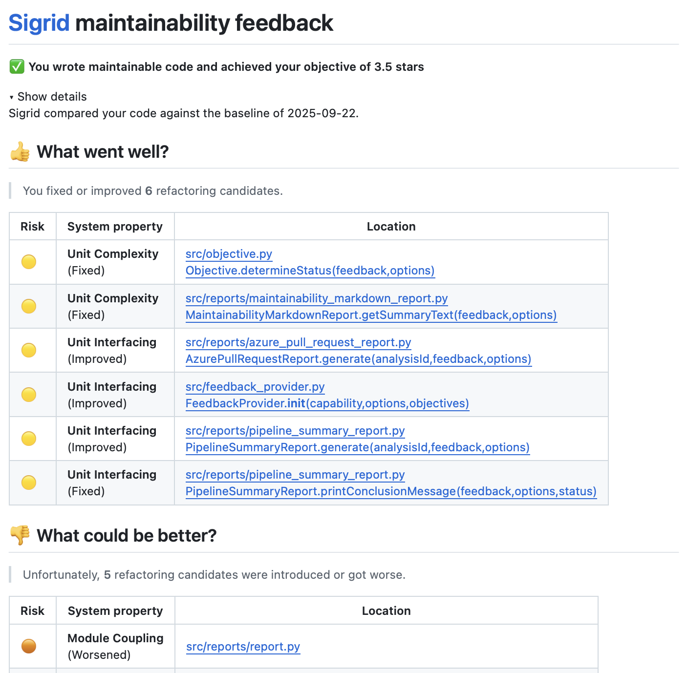
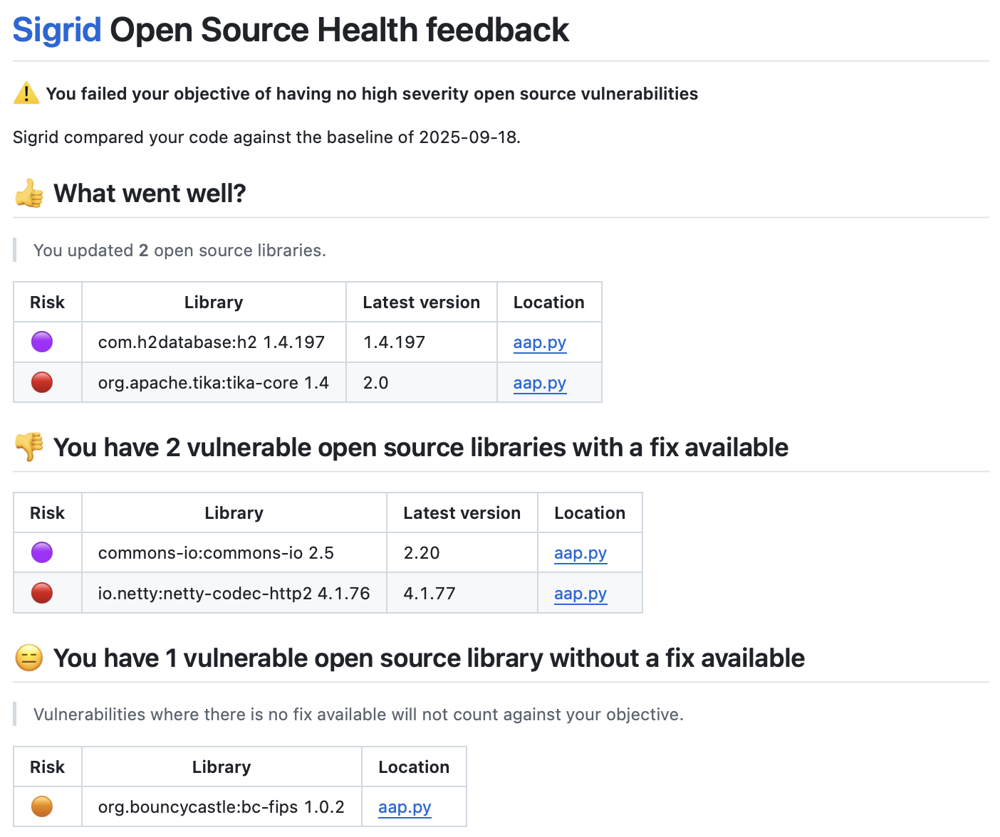

# Using Sigrid CI

This page is about interacting with Sigrid CI from a user perspective. If you're looking for instructions on how to
integrate Sigrid CI in your development platform, locate the *"Sigrid CI: Pipeline integration"* in the menu. See the
[option reference](../reference/client-script-usage.md) if you want to know which configuration options are available. 
{: .attention }

Sigrid CI does two things:

1. Sigrid CI **publishes code to Sigrid**. This integration makes it easier to keep your Sigrid up-to-date, since
   changes to your code are automatically reflected in Sigrid.
2. Sigrid CI **provides feedback on your changes**. This allows development teams to consume this feedback as part
   of the normal development process.

In a typical development process, step 1 would take place whenever you merge something into your main/master branch,
and step 2 would apply to your [pull requests](https://www.atlassian.com/git/tutorials/making-a-pull-request).
If you're using a different process, this documentation contains guidelines on where and how Sigrid CI can be used
in [different development processes](development-workflows.md).

The remainder of this page is about **how** Sigrid CI gives feedback.

## How does Sigrid CI give feedback?

Sigrid CI gives you feedback on different quality aspects. You can find more information on our feedback for
[Maintainability](#maintainability-feedback) and [Open Source Health](#open-source-health-feedback) in the sections
below. However, there are also some shared principles we apply across Sigrid CI:

- **Focus on objectives:** All Sigrid CI feedback relates your changes to the
  [objectives](../capabilities/portfolio-objectives.md) you've defined in Sigrid. Objectives provide *context*.
  It's not reasonable to expect the same level of quality for a legacy system as for a brand new mission-critical
  system. Objectives allow you to provide this context, so that every system gets a target that is both reasonable
  and achievable. Using objectives also means there is a common thread between what you see in your pipeline versus
  what you see in the [management dashboard](../capabilities/management-dashboard.md), which helps to make different
  stakeholders in the IT organization have a shared perspective.
- **Strive for good, not for perfection:** It's not realistic to expect teams, who often already have a high workload,
  to be able to fix every single issue right away. This is another area where defining objectives help you to set a
  baseline on what you consider good-enough quality.
- **Don't forget about positive feedback:** Sigrid CI feedback is split into categories that should be familiar to
  anyone who has participated in an [agile retrospective](https://www.atlassian.com/agile/scrum/retrospectives):
  *What went well* and *What could be better*. We intentionally start with the positive feedback, to put the emphasis
  on how people improved technical debt. This helps to create a culture of quality awareness, and helps to point out
  that we see and appreciate people's efforts, and that we don't just want to flood them with endless lists of stuff
  they need to work on.

### Maintainability feedback

Maintainability feedback follows the [feedback structure](#how-do-you-deal-with-feedback-from-sigrid-ci) introduced
in the previous section. When it comes to your objective, Sigrid CI will let you pass as long as you're moving
*towards* your objective. As long as you keep making incremental improvements in the right direction, you'll get
there eventually. This approach means Sigrid CI is generally "nicer" than tools that require you to fix every single
issue right away.

The reason Sigrid CI is "nice" is to encourage refactoring during normal development. Let's say you're working on
a normal, functional ticket. You find the file you're changing is full of technical debt. Ideally, you would try
to perform some minor refactorings while implementing your ticket. Obviously, we don't expect you to fix *everything*,
that would not be reasonable. The behavior we're going for is known as 
[the boy scout rule](https://deviq.com/principles/boy-scout-rule), where you should leave your code (or your campsite)
cleaner than you found it. 

### Open Source Health feedback (Beta)

Sigrid CI gives feedback on security vulnerabilities in open source libraries. Sigrid also checks other aspects of
using open source libraries, such as licenses and freshness, but those are not part of Sigrid CI. So why is this
different? In practice, people find updating open source libraries to address security vulnerabilities much more
urgent than those other aspects. Obviously, you should still manage those other aspects, as explained in our
[guidelines for healthy use of open source libraries](../workflows/best-practices-osh.md), but addressing 
vulnerabilities is something that typically needs to be addressed immediately.

Sigrid CI does not require you to update every single open source library to address every single vulnerability.
Which vulnerabilities are allowed versus not allowed is decided based on your
[objectives](../capabilities/portfolio-objectives.md). This means you can use a different objectives dependent on
the (type of) system. For example, you can decide to prevent high or critical severity vulnerabilities in public-facing 
systems, but only prevent critical vulnerabilities for internal systems.

Unlike the [feedback for maintainability](#maintainability-feedback), you really do need to address every single
vulnerability that's blocking your objective. This is because of a difference in urgency between maintainability
and security: Maintainability is more of a "chronic" problem, while security threats are "acute" and really do need
to be mitigated right away.

Sigrid CI separates vulnerable open source libraries into two categories:

- **Vulnerable libraries for which a fix is available:** These have a straightforward mitigation: Update the open
  source library, ideally to the latest version, but at minimum to a version that is no longer vulnerable.
- **Vulnerable libraries for which no fix is available:** These cases are more difficult to manage, since there
  is no obvious solution or mitigation. These cases typically require more discussion on the exact details of the
  vulnerability and possible follow-up actions. This is explained in more detail, also from a process perspective,
  in our [guidelines on using open source](../workflows/best-practices-osh.md#how-to-remediate-vulnerabilities).

#### Adding Open Source Health feedback to an existing Sigrid CI configuration

- **All platforms:** You need to add the option `--capability maintainability,osh` to the Sigrid CI step in your
  pipeline configuration. 
- **GitHub:** In addition to the above, you need one extra step: In your pipeline configuration, look for the
  line `message-path: sigrid-ci-output/feedback.md`, and change this to `message-path: sigrid-ci-output/*feedback.md`.
  Adding the asterisk allows you to get feedback on *all* Sigrid capabilities, not just maintainability.

## How do you deal with feedback from Sigrid CI?

Feedback from Sigrid CI is intended to be used in the context of a
[pull request](https://www.atlassian.com/git/tutorials/making-a-pull-request). Pull requests typically involve
two participants, the author and the reviewer, and both can use this feedback. When working on the pull request,
the author can use the feedback to make some corrections before asking for a review. When the pull request enters
the [code review](https://about.gitlab.com/topics/version-control/what-is-code-review/), the reviewer can use the
feedback as part of his or her review.

### Should you block your pipeline?

If you ask us: No. Any form of automated feedback will occasionally lead to results that are unfair, and Sigrid is
no  different. As explained above, we ideally want Sigrid CI feedback be used as input for a code review, with the
reviewer making the final call on whether to approve the review.

Still, we concede there are situations and organizations where you really do want to make Sigrid CI a mandatory check.
Therefore, we do provide the option to fail the pipeline if Sigrid objectives are not met. You can configure this
to make the pipeline fail on *any* Sigrid objective, but you can also make this behavior more nuanced by failing the
pipeline on certain types of objectives. The latter is configured using exit codes,
[as explained here](../reference/client-script-usage.md#letting-sigrid-ci-fail-your-pipeline).

## Contact and support

Feel free to contact [SIG's support department](mailto:support@softwareimprovementgroup.com) for any questions or 
issues you may have after reading this document, or when using Sigrid or Sigrid CI. Users in Europe can also contact 
us by phone at +31 20 314 0953.
