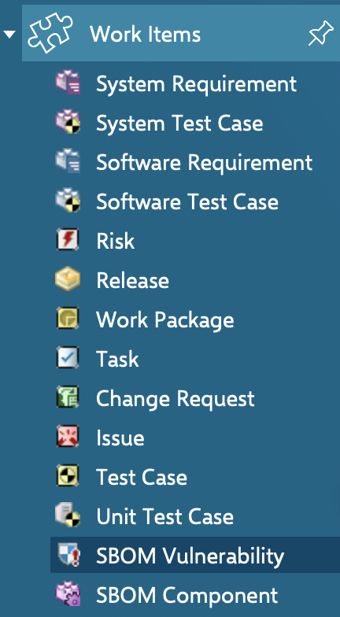
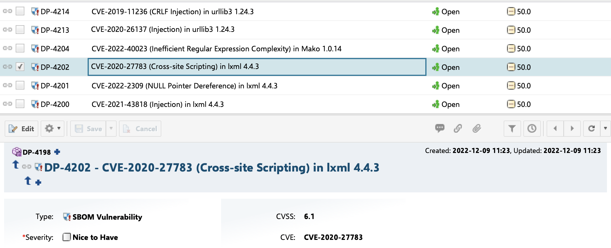

User management in Sigrid
===========================================

When managing user access to Sigrid we need to consider both Authentication (can you enter?) and Authorisation (what can you can see?). 
- Authentication is the step where users are allowed to enter the platform. After Authenication is succesful, 
- Authorisation defines which user can access which analysis results.

Sigrid offers 2 ways of managing Authentication and 1 type of Authenication . This page describes the options and the technical setup.


# Authentication mechanisms

## 1. Using the Sigrid user management module

With this module a Sigrid administrator can perform all the basic authentication tasks out of the box. 

### Note:
- Your users will need to set a password and optionally MFA (multi factor authentication)
- you will need to actively revoke access for people that no longer work for you.

### Sigrid administrator tasks:
- create and delete users based on email, first and lastname.
- resend lost and temporary passwords.
- check last login and MFA status.
- do authorisation tasks to define 'who can see what' in Sigrid.

### Setup
- no setup is needed.


## 2. Using Single Sign On (SSO) with an Identity Management Providor (IdP)

When Sigrid is linked to your SSO the user provisioning is done by the IdP. Sigrid supports SAML or OpenID Connect protocols.

### Note:
This improves ease of use because of the Single Sign On and improves security because users are created and deleted centrally in your organisation and Sigrid follows the password policy

### Sigrid administrator tasks:
- check last login
- do Authorisation tasks to define 'who can see what' in Sigrid

### Setup client side
- create Authentication app in your IdP with the following 
- url: https://auth.sigrid-says.com/saml2/idpresponse
- audience: urn.amazon:cognito:sp:eu-central-1_hwh9zdCY
- Signature Algorithm: RSA_SHA256
- Digest Algorithm: SHA256
- Assertion Encryption: unencrypted (privacy is provided by using https)
- Saml Single Logout: disabled
- Attribute statements:
user.email http://schemas.xmlsoap.org/ws/2005/05/identity/claims/emailaddress
user.firstName http://schemas.xmlsoap.org/ws/2005/05/identity/claims/given_name
user.lastName http://schemas.xmlsoap.org/ws/2005/05/identity/claims/name
- assign groups of users to your Authentication app

### Setup steps on SIG side
- provide SIG the appid of your SAML app. Examples are
metadata URL: https://sig.okta.com/app/<randomidentifier>/sso/saml/metadata

- your will recieve a client specific url to enter Sigrid like
https://customername.sigrid-says.com


# Authorisation in Sigrid

```

You will be adding a `polarion` section to this file. This will enable the integration between Sigrid and Polarion, which means that *both* Sigrid and Polarion will be updated whenever you publish your source code. This section supports the following options:

| Option                | Required | Description                                                                  |
|-----------------------|----------|------------------------------------------------------------------------------|
| `project`             | Yes      | Your Polarion project ID.                                                    |
| `url`                 | Yes      | The base URL of your Polarion instance.                                      |
| `system_work_item_id` | No       | Optional parent work item ID. Sigrid's work items will be nested below this. |

After adding these options, you configuration file might look something like this:

```
component_depth: 1

languages:
  - "python"

dependencychecker:
  blacklist:
    - "NONE"
    
polarion:
  project: test
  url: "https://my-polarion.my-company.com"
```

Since your updated configuration file is part of your repository, it will be picked up automatically the next time you publish your source code to Sigrid.

In Polarion, you can access Sigrid's Open Source Health data from the "work items" menu. Sigrid will create or update work items with the type SBOM Component and SBOM Vulnerability.



The detail page for these work items will provide you with the combination of all data resulting from Sigrid's analysis, plus all life cycle management and workflow options provided by Polarion.



## Contact and support

Feel free to contact [SIG's support department](mailto:support@softwareimprovementgroup.com) for any questions or issues you may have after reading this document, or when using Sigrid or Sigrid CI. Users in Europe can also contact us by phone at +31 20 314 0953.
