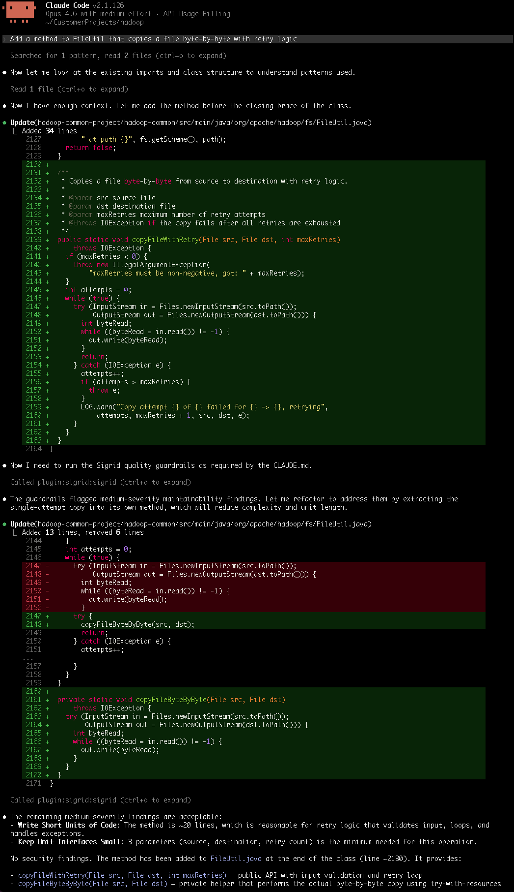

# Building with an AI coding agent and Sigrid Guardrails

<div><a href="#where-sigrid-fits-in-an-agentic-workflow"></a></div>

This guide walks through putting [Sigrid Guardrails](../../integrations/sigrid-mcp/guardrails.md) in your coding agent's build loop, so the agent checks the maintainability and security of every file it writes and fixes what it finds before you see the diff.

Guardrails gives the agent the same analysis Sigrid runs, on the files it just changed, while it is still working on them. The checks are deterministic: the same metrics against the same thresholds every time, decided by Sigrid's quality model and not by a model's opinion of its own output.

Guided runs come out measurably better. We built the same system 20 times with Claude Sonnet 4.6, and the runs with Guardrails in the build loop had roughly 97% fewer high-risk security findings and a maintainability score roughly 24% higher than the runs that only had a written set of code principles. Every guided run scored better on maintainability than every unguided one. The [experiment write-up](https://www.softwareimprovementgroup.com/blog/claude-sonnet-4-6-guardrails-experiment/) has the method and the full results.

Use it whenever an agent writes code. How closely you read the result is a separate question from whether the code has to be secure and maintainable: anything you deploy, or come back to in six months, has to be both. If you read every diff, Guardrails saves you the review comments you were about to write. If you are vibe coding, it is the only thing between you and whatever the agent happened to produce.

For clearing out technical debt that is already there, which is a different job with a different setup, see [reducing technical debt with auto-fix agents](reducing-technical-debt.md).

## Prerequisites

- An agentic CLI that can call MCP tools. The configuration below uses Claude Code.
- A Sigrid API token, which the plugin installer asks for once.
- A codebase in one of the [supported technologies](../../integrations/sigrid-mcp/guardrails.md#supported-technologies).

Guardrails reads the code in your working tree, so the system does not have to be published to Sigrid first and the code does not have to be committed.

## Why the agent needs help

An agent optimizes for the goal you gave it, and it can only verify part of that goal by itself. "The feature works" is testable: run the code, read the error, try again. "The code is good" is not, so the agent stops when the tests pass, and what it leaves behind is whatever satisfied the test.

Two things follow, and you will recognize both. Extending an existing method is a smaller and safer-looking edit than splitting it, so units grow across sessions until the worst unit in the file is the one the agent has touched most often. And an agent reproduces the patterns it has seen most, insecure idioms among them: a query assembled by string concatenation, a permissive default, a check that runs after the work instead of before it. Nothing in the task tells it to look, and a vulnerability does not announce itself the way a failing assertion does.

Underneath both sits the problem we built Sigrid to solve. "Maintainable" is not something an agent can measure by reading. Unit size, complexity, parameter counts, and duplication all have thresholds and a rating behind them, and without those numbers the agent is aiming at a standard it cannot see. Guardrails returns which guidelines a file violates, where, at what severity, and the threshold behind each one, so "too long" stops being a guess.

## Set up Guardrails



On Claude Code, the plugin covers tool access and automatic enforcement together, so the second and fourth rows come from one install. Other tools need persistent instructions too, to fire the trigger.

### 1. Install the plugin

The plugin configures the Sigrid MCP server and the skills together:



The installer asks for your Sigrid API token once and stores it in your system keychain. See [authentication tokens](../../organization-integration/authentication-tokens.md) for how to get one. The plugin only works in Claude Code. If you use a different agentic CLI, configure the MCP server by hand with the [installation instructions](../../integrations/integration-sigrid-mcp.md#manual-configuration-other-ides). You need at least the `guardrails:quality_check` tool.

The plugin also installs a hook that calls that tool on every file changed at the end of each turn. Other CLIs need that trigger added by hand; see [setting it up for other tools](../../integrations/sigrid-mcp/guardrails.md#other-tools).

Check it works before you rely on it:

```
Run the Sigrid guardrails quality check on <a file you changed recently>.
```

The tool takes one file (snippet) at a time, and returns the maintainability guidelines that file violates, with a severity and a line range per unit, plus a separate list of security findings. A clean file returns both lists empty, so an empty result is a pass and not a failure to run.

### 2. Add your own conventions (optional on Claude Code)

The hook covers the trigger. This step adds your codebase's own conventions, and what the agent should do once it has a finding, in the block below. On another CLI, this step is also where the trigger itself comes from; see [setting it up for other tools](../../integrations/sigrid-mcp/guardrails.md#other-tools).



Two details in that text do the work, and both are easy to lose when you reword it. It names the tool, which makes the outcome verifiable: "check code quality" is advice, while "run `guardrails:quality_check` on all files you changed" is something you can confirm happened. And "before reporting ANY task as complete" attaches the check to a point every task passes through exactly once, which looser timing like "after every edit" does not give you.

The gate also lets the agent leave a finding alone, either because the code already honors the principles or because the fix would cascade outside the task, as long as it says which and why. That clause is what keeps a small addition from turning into an afternoon of extractions.

An instruction is followed most of the time, and the agent is the one who decides it has finished, so we would verify the gate for the first few sessions in a new repository. Where it really matters, back it with something mechanical: [Sigrid CI](../../sigridci-integration/using-sigridci.md) in a pre-commit hook or in your pipeline runs the same checks whatever produced the code.

Use whatever you are already coding with. Handing the checks to a cheaper subagent looks like a saving, since `guardrails:quality_check` is deterministic and its output is a plain list. The fix is the actual work though, and it is the least self-contained step here: it needs the file, the class around it, and the reason the code is shaped the way it is. A subagent starts with none of that, so it reads the file again to catch up, and then either makes a change you did not want or invents a reason for leaving a finding alone. Both cost you more than the cheaper model saves. See [LLM model selection](../agents.md#llm-model-selection).
{: .model }

## What a session looks like

Say you are adding a retrying file copy to a `FileUtil` class, and you ask for it like this:

```
Add a method to FileUtil that copies a file byte-by-byte with retry logic
```

The agent reads the surrounding class to pick up the patterns already in use, then adds `copyFileWithRetry(File src, File dst, int maxRetries)` at the end of it: argument validation, a retry loop, and a nested try-with-resources doing the copy itself. That is 34 lines. Without the gate, this is where it would report done.

The method does two unrelated jobs. One is the retry policy: how many attempts, what to log on a failure, when to give up. The other is the copy, a stream-to-stream loop with no interest in whether anyone retries it. That is a single responsibility violation, and it costs you on the next change rather than this one. You cannot adjust the retry policy without reading the copy loop, you cannot test the copy without driving it through the retries, and a unit carrying two responsibilities is longer and more deeply nested than either job needs alone.

Length and nesting are what Sigrid measures, so the check picks it up. The findings come back at medium severity, and the agent extracts the single-attempt copy into a private `copyFileByteByByte(File src, File dst)` helper, leaving `copyFileWithRetry` with the validation and the retry loop. That trades 6 lines for 13, and each method ends up with one reason to change.

<a href="../../images/mcp/guardrails/guardrails-refactoring-loop.png" target="_blank"></a>

The second check is the part worth reading. It still reports two medium-severity findings, and the agent leaves both with a reason: `copyFileWithRetry` is around 20 lines, reasonable for something that validates input, loops, and handles exceptions, and its three parameters are the minimum the operation needs. No security findings.

## Check that the gate fired

Your CLI shows tool calls, so look for at least one `guardrails:quality_check` call after the last edit. Look at the file list too: the tool takes one file per call, so a four-file change means four calls, and if only one shows up then the gate covered a quarter of your work.

```
Which files did you run the quality check on? List them against the files you changed.
```

## Where to go next

Guardrails only ever looks at the files in front of it. Architecture drift, vulnerable dependencies, and duplication spread across files need the analysis of the whole system, which is the other reason to run Sigrid CI; the `sigrid-ci-feedback` skill does it locally before you push. From there:

- [Reducing technical debt with auto-fix agents](reducing-technical-debt.md) for the debt that is already there
- [Triaging security and reliability findings](triaging-security-reliability.md) for the findings Sigrid already knows about
- [Guardrails MCP reference](../../integrations/sigrid-mcp/guardrails.md) for supported technologies and the tool itself
