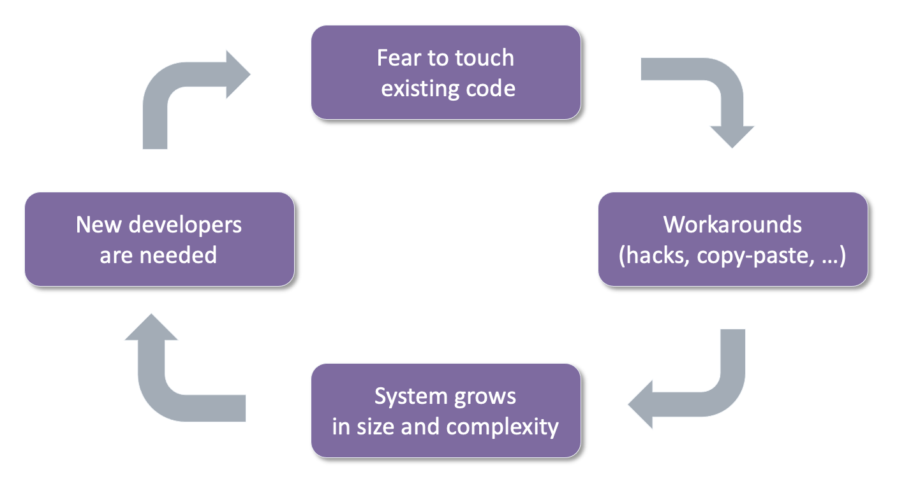
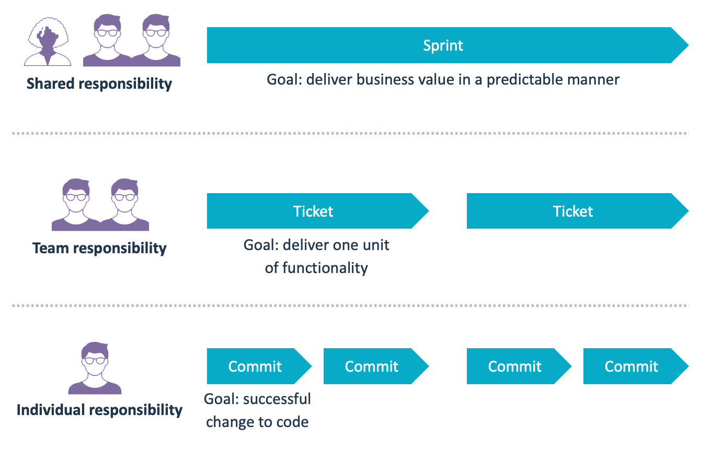
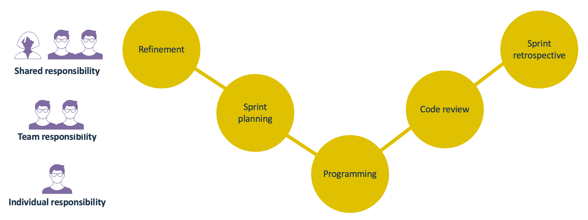
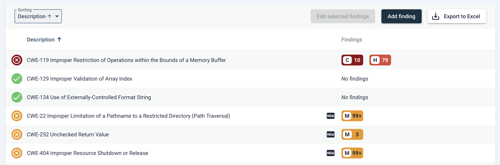
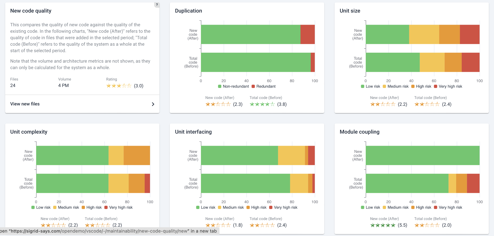

# Using Sigrid as part of an agile development process

Sigrid supports all development process methodologies. That said, most organizations are either already using an [agile development process (Wikipedia)](https://en.wikipedia.org/wiki/Agile_software_development), or are currently in the process of migrating towards such a way of working. Working agile is therefore both the most mainstream and most desirable way of doing software development. 

This page explains how Sigrid fits into a [Scrum](https://en.wikipedia.org/wiki/Scrum_(software_development)) development process, which is the most popular and widely used flavor of agile. Many of thes best practices outlined in this article can also be used when using other agile project management methodologies, such as [Kanban](https://en.wikipedia.org/wiki/Kanban). Especially for agile development, it is key to use the aspects of the prescribed methodology that best fit your needs: it is rare to have an orthodox implementation of e.g. formal Scrum practices. Generally though, most people will agree with-, and follow in some form, the principles of the [Agile manifesto](https://agilemanifesto.org/).

## In an agile process, different roles still have different needs

In Scrum, [developers (link to workflow)](developer.md) and [product owners (link to workflow)](product-owner.md) need to collaborate to prioritize the sprint backlog. This can be challenging because priorities can be rather different between the roles. Or at least, priorities are *perceived* differently. 

- **Product owners** generally see prioritization from the customer's perspective. Therefore, adding **visible** functionality tends to be seen something that brings most customer value, and is therefore top of mind ([also, see our Product Owner workflow page](product-owner.md)). 
- **Developers** generally put additional emphasis on non-functionals, for the obvious reason they need to work with the code on a daily basis (([also, see our developer workflow page](developer.md)). 
- **Architects** architects do often in fact have hands-on involvement with achieving technical goals [see our architect workflow page](architect.md). This can be true even if nobody has "architect" as a job title. It might then be  called "emerging architect", where a senior engineer (or sometimes even the product owner) takes care of the duties normally associated with an architect. The scope of the architect matters, of course. A software architect will be interested more in a system parts' coherence/consistency than an enterprise architect who will take a broader view within an organization. Given this backgrounds, [setting measurable objectives](../capabilities/objectives.md) can help you see how you are moving towards a goal.

These descriptions are clearly stereotypes. Though in many organizations there is some truth to them, things are usually a lot less black-and-white. In Scrum, developers are *also* responsible for delivering customer value. So people in each role have their own particular professional interest and emphasis, but they are not contradictory. Friction is normal though, that is part of a natural process of prioritization. 

Just like developers cannot neglect functional progress, product owners cannot completely ignore non-functionals, as this also will eventually lead to issues that customers do notice. 

### Technical debt
On the technical side, the different roles can generally agree that technical debt is undesirable. As in the physical world, deferred maintenance tends to cause more trouble than preventive measures. With *software's defining property as a never-finished product*, technical debt has compounding effects. See also [our general discussion on software quality and technical debt](../getting-started/approach.md#what-is-good-quality-software). Technical debt slows down development, which may be visible to customers, which may seduce developers to introduce "dirty" workarounds, which complicates code, which has a higher chance of introducing bugs, etc. Such a (only slightly) dramatized vicious cycle is depicted below. 

A problem with degrading technical quality is that it will eventually reduce stability. People make mistakes because the consequences of certain changes are unclear. Understanding those will cost more time, as does spent time on correcting the mistakes, or even fixing production issues. The only way to avoid this vicious cycle of technical debt is by also making software quality agile, rather than something that needs to be managed independently from the normal process.

## Where does Sigrid fit in Scrum rituals?

Recurring sessions in an agile/Scrum process are usually referred to as "rituals" or "ceremonies". These sessions are centered around each sprint, and intentionally repeat in a predictable fashion. During the sprint, work is broken down into "tickets" or "issues". 

This structure is effectively a series of feedback loops between people:

- The sprint is a shared responsibility for the entire team, including the Product Owner.
- Each ticket is the responsibility of the people working on it. In nearly all organizations a ticket involves a minimum of two people: at least one person that implements the ticket, and at least one person who reviews it. 
- While working on a ticket, the actual development work on the lowest level consists of a series of commits made by a developer.

A sprint obviously consists of more than just implementing things. However, if you look at the sprint rituals you will find they tend to connect to the same responsibilities:

So how can we use Sigrid during these sessions to ensure every sprint brings you closer to your software quality objectives?

## Using Sigrid during refinement and planning

### Triage security and Open Source Health findings

Fully preventing security findings from ever appearing is impossible. Instead, a good security process means you focus on *discovering*, *triaging*, and *fixing* these findings quickly. For an elaborations on managing application security with Sigrid, see [our system security page](../capabilities/system-security.md).

Developers often find it hard to adequately assess security findings. Moreover, triaging security findings is a form of risk assessment, so it is best to not make those decisions on a purely individual basis. Making the security triage process part of your refinement sessions rosolves this. The refinement session is ultimately about determining what work needs to be done. In that regard triaging security findings can be seen as a form of refinement. 

Sigrid allows you to focus on *new* security findings. As a team, you can discuss each finding and then make a decision on whether you want to fix the finding or accept the risk. If you do this every sprint, the (delta) list of findings will be relatively small, so you will not be stuck with a large backlog of security findings. Staying on top of this helps you to keep the security triage process relatively lightweight. 

The same process applies to findings in [Open Source Health (see documentation page)](../capabilities/system-open-source-health.md). You need to decide if libraries need to be updated during the upcoming sprint, either because vulnerabilities have been found or because the team agrees you are falling too far behind the latest version. 

There is a balance to this. Updating to every new version immediately after it has been released is usually not worth it. It may generally be OK if a library is a little behind the latest version, as long as you do not fall *too far* behind. What is "too far" is something you should define beforehand, in terms of e.g. date differences or version numbers (assuming semantic versioning). The situation is  different if a library contains security vulnerabilities. In that case you will probably need to update/plan its update with far higher priority.

### For maintainability, focus on technical debt that is affecting you right now 

Maintainability findings tend to be more of a long-term problem. They are not urgent in the way that security findings and *Open Source Health* issues can be urgent. For this reason, it is not necessary to review every single maintainability finding as part of the sprint. Instead, you can focus on how to incorporate the removal of technical debt as part of your normal sprint work. For a discussion of a typical analysis approach, [see the system maintainability page](../capabilities/system-maintainability.md), or specifically, [dealing with refactoring candidates](../capabilities/system-maintainability.md#dealing-with-refactoring-candidates) and [investigating maintainability findings](../capabilities/system-maintainability.md#investigating-system-maintainability-rating-state-and--changes).

However, simply sorting all maintainability findings by severity will likely not help you to focus on the issues that matter most. Maintainability is only relevant when people are **actually maintaining the code**. If nobody has changed a file for the past years, it is probably not worth the effort to start fixing technical debt within that file. However, maybe *it ought to have been changed*, but nobody dared to because of the code's complexity. This is a real possibility.

Therefore, try to identity technical debt that exists in the areas of the code *that you were planning to change anyway*. This way, you will be combining functional work on the code with removing technical debt in that same area of the code. Your team will immediately benefit from those maintainability improvements, since you are actively working on those parts of the code. And you will also save yourself from having to context-switch between working on functional tickets and then fixing technical debt in completely unrelated areas. This is an interpretation of the Boy-Scout rule [see a related discussion in the FAQ](../capabilities/faq#why-am-i-being-penalized-for-problems-that-were-already-there). Fixing technical debt can be done in two ways. The simplest form is to simply clean up technical debt while working on the code. This is by far the most lightweight and practical form. However, some organizations tend to require more formal planning, and want to define technical debt during the sprint refinement/planning. In both cases, you can use Sigrid's *Code Explorer* [(see specific discussion on the *Code Explorer* page)](../capabilities/system-code-explorer.md) to identify technical debt in the areas of the code you were planning to change. If you want to formalize this, you can use the planning export option to generate a list of technical debt to incorporate into your issue tracking system. 

## Using Sigrid during code review

Agile teams rely on [CI, or Continuous Integration (Wikipedia)](https://en.wikipedia.org/wiki/Continuous_integration) to facilitate their process. Every change is reviewed, and once this [code review (Wikipedia)](https://en.wikipedia.org/wiki/Code_review) has approved the change is is merged into the main/master branch. This makes the code review the process' main *agile quality gate*.

During code reviews, the Definition-of-Done for software quality is often quite subjective and abstract. Using [Sigrid's objectives](../capabilities/objectives.md) helps to agree on a shared goal within the team, and then relate code review feedback towards that goal.

Sigrid also [integrates with your continuous integration pipeline (see development workflows)](../sigridci-integration/development-workflows.md). Sigrid compares the new/adjusted code against your goal. The feedback focuses on making your code *good enough* in regards to your team code quality objectives. This avoids extensive discussions about minor issues. This in turn also means you do not have to fix *every* "trivial" finding. This has motivational value as well.

## Using Sigrid during the sprint retrospective

For all quality aspects, relate your progress to your [objectives (see documentation page)](../capabilities/objectives.md). Try to keep in mind that perfection is not the goal, just like not all technical debt nessarily needs solving [(see discussion in our approach page)](../getting-started/approach.md#what-is-good-quality-software). You are simply trying to meet your shared goals. Or, if you have not made your goals yet, you just want to make sure you end the sprint in a better position than you started. 

For [Security](../capabilities/system-security.md) and [Open Source Health](../capabilities/system-open-source-health.md), evaluating your results is reasonably straightforward: make sure you have actually addressed the findings you set out to fix in your sprint planning. 

For maintainability, the results can be bit harder to evaluate. As explained above, maintainability is more nuanced than Security or Open Source Health. Next to following our discussion on [investigating maintainability findings](../capabilities/system-maintainability.md#investigating-system-maintainability-rating-state-and--changes), comparing current with past code quality is helpful. This is the purpose of Sigrid's [Delta Quality page (i.e. new/changed code quality)](../capabilities/system-delta-quality.md). This page compares the *new* and *changed* code you produced during the sprint, and compared them against the *old* code before the code adjustment. 

Even if you did not make your goal, the *Delta Quality* page still visualizes whether your sprint has improved your code quality. If you find you did *not* improve your code, you can deep-dive into the actual files that were changed, so you can discuss with your team what happened and how (and whether) you should do better next sprint.

## Contact and support

Feel free to contact [SIG's support department](mailto:support@softwareimprovementgroup.com) for any questions or issues you may have after reading this document, or when using Sigrid or Sigrid CI. Users in Europe can also contact us by phone at +31 20 314 0953.
