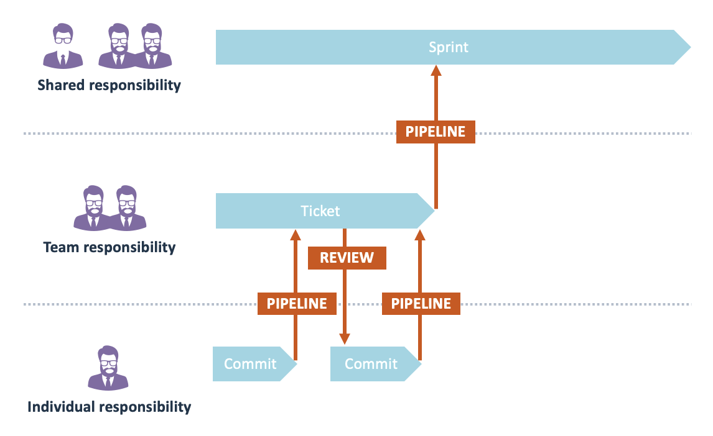

# Using Sigrid as part of an agile development process

Many organizations using Sigrid are either already using an [agile development process](https://en.wikipedia.org/wiki/Agile_software_development), or are currently in the process of migrating towards such a way of working. Sigrid does not *force* you to use any specific development process, but we do believe working agile produces the best results.

This page explains how Sigrid fits into a [Scrum](https://en.wikipedia.org/wiki/Scrum_(software_development) development process, which is the most popular and widely used version flavor of agile. Many of thes best practices outlined in this article can also be used when using other agile project management methodologies, such as [Kanban](https://en.wikipedia.org/wiki/Kanban).

## In an agile process, different roles still have different needs

In Scrum, [developers](developer.html) and [product owners](product-owner.html) need to collaborate to prioritize the sprint backlog. This can be challenging because priorities can be slightly different, or at least *perceived* differently.

- **Product owners** generally see prioritization from the customer perspective: adding functionality tends to be seen something that brings most customer value, and is therefore top of mind. 
- **Developers** generally put additional emphasis on non-functionals, for the obvious reason they need to work with the code on a daily basis. 
- **Architects** have an interesting role in this process, as they are not "officially" part of the team. However, in many organization architects do in fact have [hands-on involvement with achieving technical goals](architect.html). This can be true even if nobody has "architect" as a job title! This is often called "emerging architect", where a senior engineer (or sometimes even the product owner!) takes care of the duties normally associated with an architect.

These descriptions are clearly stereotypes. Though in many organizations there is some truth to them, things are usually a lot less black-and-white. In Scrum, developers are *also* responsible for delivering customer value. If people are over-focusing on non-functional quality and neglecting functional progress, this will eventually lead to problems. Reversely, product owners cannot completely ignore non-functionals, as this will eventually lead to issues that customers do notice. 

The problem with degrading technical quality is that it will eventually reduce stability. People make mistakes because the consequences of certain changes are not clear. Most of these mistakes will be caught by the development and test process, but this leads to additional time being spent on correcting the mistakes, reducing productivity. Moreover, some mistakes will inevitably *not* be caught, leading to issues in production.

Once this has been going on for some period of time, people tend to get scared. They become over-defensive to avoid causing issues in production, reducing both speed and agility. This will cause technical debt to increase even more, as people will prefer workarounds rather than fixing problem structurally, as they are afraid making structural changes will break something.

The only way to address this is by also making software quality agile. Ensuring quality and non-functionals should be part of every sprint and every ticket, so that it becomes a regular part of the process rather than an afterthought that needs to be managed independently. 

## Where does Sigrid fit in Scrum rituals?

Recurring sessions in an agile/Scrum process are usually referred to as "rituals" or "ceremonies". These sessions are centered around each sprint, and intentionally repeat in a predictable fashion. During the sprint, work is broken down into "tickets" or "issues". 

This structure is effectively a series of feedback loops between people:

- The sprint is a shared responsibility for the entire team, including the Product Owner.
- Each ticket is the responsibility of the people working on it. In nearly all organizations a ticket involves a minimum of two people: at least one person that implements the ticket, and at least one ticket that reviews it. 
- While working on a ticket, the actual development work on the lowest level consists of a series of commits made by a developer.

The red arrows in the diagram below depict how the different feedback loops and responsibilities are connected. 

A sprint obviously consists of more than just implementing things. However, if you look at the sprint rituals you'll find they tend to connect to the same responsibilities:

So how can we use Sigrid during these sessions to ensure every sprint brings you closer to your software quality objectives?

### Using Sigrid during refinement/planning

**Triage security and OSH findings**

Fully preventing security findings from ever appearing is impossible. Instead, a good security process means you focus on *discovering*, *triaging*, and *fixing* these findings quickly. 

People often find it hard to adequately assess security findings. Moreover, triaging security findings is a form of risk assessment, so it's best to not make those decisions on a purely individual basis. Making the security triage process part of your refinement sessions solves this. The refinement session is ultimately about determining what work needs to be done, so in that regard triaging security findings can be seen as a form of refinement. 

Sigrid allows you to focus only on *new* security findings. As a team, you can discuss each finding and then make a decision on whether you want to fix the finding or accept the risk. Because you do this every sprint, the list of findings will be relatively small, so you won't be stuck with a huge back catalog of security findings. Staying on top of this helps you to keep the security triage process relatively lightweight. 

The same process applies to findings in [Open Source Health](../capabilities/system-open-source-health.md). You need to decide if libraries need to be updated during the upcoming sprint, either because vulnerabilities have been found or because the team agrees you're falling too far behind the latest version. 

Also make sure that you don't go too far. Updating to every new version immediately after it has been released is usually not worth it. It's OK if you're a little behind the latest version, as long as you don't fall *too far* behind. The situation is obviously different if your current version contains security vulnerabilities, in that case you will likely need to plan updates with far higher priority.

**For maintainability, focus on technical debt that is affecting you right now** 

Maintainability findings tend to be more of a long-term problem, they are not urgent in the way security and Open Source Health issues can be urgent. For this reason, it is not necessary to review every single maintainability finding as part of the sprint. Instead, you can focus on how to incorporate the removal of technical debt as part of your normal sprint work. 

However, simply sorting all maintainability findings by severity will likely not help you to focus on the issues that matter most. Maintainability is only relevant when people are actually maintaining the code. If you have not changed a file for the past year, it's probably not worth the effort to start fixing technical debt within that file. 

Therefore, try to identity debt that exists in the areas of the code *that you were planning to change anyway*. This way, you will be combining functional work on the code with removing technical debt in that same area of the code. Your team will immediately benefit from those maintainability improvements, since you are actively working on those parts of the code. And you will also save yourself from having to context-switch between working on functional tickets and then fixing technical debt in completely unrelated areas. 

Fixing technical debt can be done in two ways. The simplest form is to simply clean up technical debt while working on the code. This is by far the most lightweight and practical form. However, some organizations tend to be a bit more formal, and want to define technical debt during the sprint refinement/planning. In both cases, you can use Sigrid's Code Explorer to identify technical debt in the areas of the code you were planning to change. If you want to formalize this, you can use the planning export option to generate a list of technical debt to incorporate into your issue tracking system. 

### Using Sigrid during code review

Sigrid CI allows you to use [feedback from Sigrid as part of your code review](../sigridci-integration/development-workflows.md). As shown in the picture with feedback loops, the pipeline is where you go from individual responsibility to shared responsibility, making it the logical place for both the code review and for Sigrid. Sigrid CI compares the new/code against your goal. This means the feedback is focused at making your code *good enough* (where "good enough" is defined by your shared goal), rather than trying to make your code perfect with zero findings. This also means you don't have to fix every single finding, which tends to be more motivating and pragmatic for the person receiving this feedback.

### Using Sigrid during the sprint retrospective

For all quality aspects, relate your progress to your [objectives](../capabilities/objectives.md). Try to keep in mind perfection is not the goal, you're simply trying to meet your shared goals. Or, if you haven't made your goals yet, you just want to make sure you end the sprint in a better position than you started. 

For Security and Open Source Health, evaluating your results is reasonably straightforward: make sure you have actually addressed the findings you set out to fix in your sprint planning. 

For maintainability, the results can be bit harder to evaluate. As explained above, maintainability is more nuanced than Security or Open Source Health. It is therefore not necessary to fix every single maintainability finding. But then how do you determine whether your team made the right decisions during the sprint?

This is where Sigrid's [new/changed code quality page](../capabilities/system-delta-quality.md) can help. This page compares the *new* and *changed* code you produced during the sprint, and compared them against the *old* code that existed before the sprint started. 

Even when you did not make your goal, this page still provides a visual way to show whether your sprint improved your code. If you find you did *not* improve your code, you can deep-dive into the actual files that were changed, so you can discuss with your team what went wrong and how you can do better next sprint.

## Contact and support

Feel free to contact [SIG's support department](mailto:support@softwareimprovementgroup.com) for any questions or issues you may have after reading this document, or when using Sigrid or Sigrid CI. Users in Europe can also contact us by phone at +31 20 314 0953.
