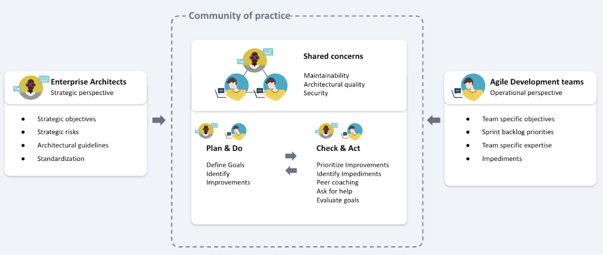

# Sigrid workflow for (enterprise) architects

There are many different organizational IT architect roles. They differ in their width and depth of technical- or business concerns, but they share common features 
([also see our page on organizational roles within an agile development process](agile-development-process.md#in-an-agile-process-different-roles-still-have-different-needs)). As an architect, a large part of your role is understanding the implemented architecture of systems in the application landscape. 

The video below introduces the IT enterprise architect's role for using Sigrid.  

<iframe width="560" height="315" src="https://www.youtube.com/embed/nCW855MBNSE" title="YouTube video player" frameborder="0" allow="accelerometer; autoplay; clipboard-write; encrypted-media; gyroscope; picture-in-picture; web-share" allowfullscreen></iframe>

## Setting and following objectives

By comparing a system's- or landscape's situation to its desired path [(see our page on system/portfolio objectives](../capabilities/objectives.md)), you will have a feeling of direction, of how to follow code quality trends over time, such that they need their business purpose ([see our page on setting metadata](../organization-integration/metadata.md)). While code quality objectives have clear business benefits, objectives in Sigrid's context are understood as being *non-functional requirements*. Setting objectives in Sigrid puts application code quality into business perspective. Such workflow in simplified form including the PDCA cycle is shown below. An EA is involved in abiding by, or setting, these objectives, their business effects (ROI) and following controls (mattars of standardization such as guidelines).

Following the progress of objectives generally can be done on the Overview pages for either Portfolio level (see our portfolio pages, [e.g. the portfolio overview page](../capabilities/portfolio-overview.md)) or system level ([see our system-level overview page](../capabilities/system-overview.md)). The overview pages offer the widest view, where typically you would be looking for the "anomalies" in systems that appear "out of place" in the portfolio. 

In terms of system security, one of the non-functionals that bear importance in most development, see [our system security page](../capabilities/system-security.md) and [our Open Source Health page)](../capabilities/system-open-source-health.md).