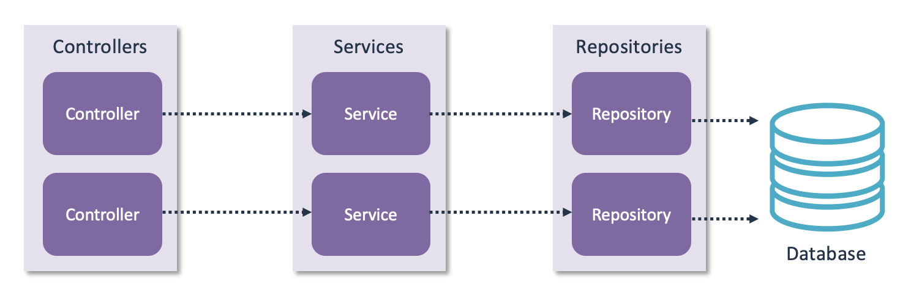
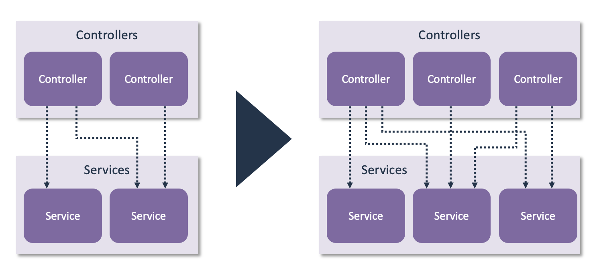
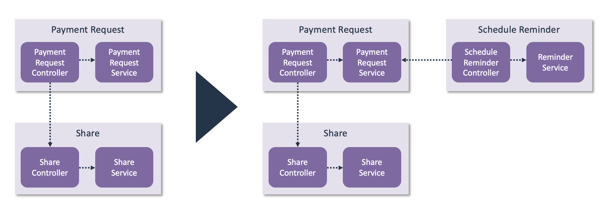
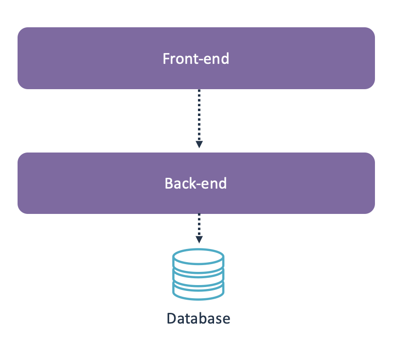
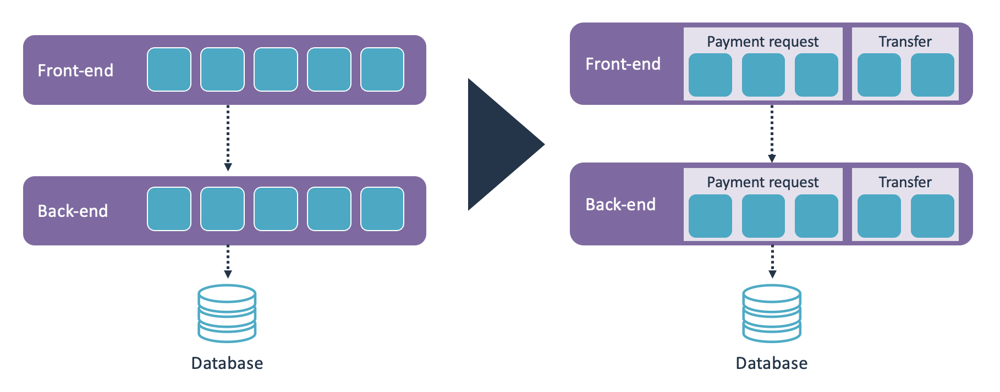

# Guidelines for designing a component architecture

Software architecture has a central position when it comes to managing the life cycle of large-scale software landscapes. A key part of a healthy software architecture is designing a healthy and future-proof component architecture. By incorporating functional and technical aspects in blocks that can be understood, evolve and reused independently, component architectures allow for higher-level understanding of the software landscape as a whole. This has many benefits, but is in particular useful when considering system-wide concerns such as system evolution. However, with the ever-growing complexity and the move towards distributed and service-oriented software systems, this is becoming an increasingly challenging task to achieve.

Having an up-to-date view of the actual/implemented architecture at all times is therefore key to ensuring your software landscape and its systems remain future-proof. Every architecture is bound to change over time, due to a changing environment in which it operates. This process is referred to as architecture evolution. These guidelines are meant to help architects and development teams with their component architecture, especially when it comes to architecture evolution, based on best practices.

<sig-toc></sig-toc>

## Why modularize your codebase?

Every non-trivial system is split into components. There are multiple reasons for modularizing your software system: Some relate to technical benefits, some to improve the way of working and co-operation of the developers.

- **Dividing your codebase into logical "parts" makes it easier for people to locate functionality.** This is the most common reason to modularize systems and is done purely for the benefit of the people working on the system. Dividing a system into components helps to manage the cognitive load: People can first think about the system in terms of its high-level architecture, without being confronted with the full implementation details for every single part. The component structure is also helpful to communicate where certain functionality is implemented. 
- **Deploying components independently increases development flexibility.** If components are deployed separately, teams can work on those components independently and deploy 'their' component without having to simultaneously deploy the other components. However, it is quite rare for components within a system to operate in complete isolation from each other. Components tend to have various dependencies to other components. This can take the form of an interface dependency, but something like a shared database also acts as a dependency between components. The decision to deploy components separately tends to make those components a bit more independent, but not fully independent. 
- **Deploying components separately gives more runtime flexibility.** Runtime load is rarely spread equally across all components in the system. Deploying components separately allows for more flexibility in the deployment architecture, which is generally beneficial when it comes to managing performance behavior, scalability, and resilience. 

People generally use a *combination* of these reasons when designing their component architecture. For example, it is quite common to define the top-level architecture as a number of microservices that are deployed separately. But every microservice also has an internal architecture, which is mainly based on dividing the codebase into logical areas, which are still deployed together as one microservice. Such a combination is not "wrong". It is a perfectly reasonable choice which indicates that modularizing a system needs to consider both technical and human aspects.

These considerations will change over time. That is perfectly normal and healthy. One of your component architecture's goals is to facilitate architecture evolution. It is not humanly possible to foresee all possible future changes, so it's normal for your architecture to change over time in order to meet those changing needs. That means designing your component architecture is not a one-off activity, like many other software engineering activities it's an iterative process.
{: .attention }

## What is the best way to modularize your codebase?

This is where the dreaded "it depends" answer comes into play. The goal of your component structure is to communicate the intended structure of your system to people. Such a goal makes it very hard to give generic best practices on what your components should be, since this depends on the functionality of your system. 

People therefore generally find it easier to define a component structure based on technical layers. This provides a generic structure that can be used for any type of system regardless of its functionality. 

A commonly used example of such a reference architecture is the controller-service-repository pattern. As the name implies, this pattern defines three layers:

- **Repositories** act as the data access layer. The other layers are not allowed to access the database directly. 
- **Services** contain all business logic. They access the repositories whenever they require data access.
- **Controllers** act as input/output for accessing the business logic. Controllers can only access the service layer, they cannot directly access the repository layer.

Again, note these definitions are purely technical and do not depend on the functionality of the system. Systems that are using this pattern always use the following modularization:

Using a reference modularization pattern also has a major benefit: Anyone who knows the pattern will immediately understand the modularization of your system. People will understand where new functionality should be implemented, since every layer has clearly defined boundaries. 

Defining components based on technical layers does have limitations when the system continues to evolve and grow. One of the limitations is that the number of layers is fixed. If the amount of functionality keeps growing without revisiting the architecture, you can easily end up with a situation where you have 100+ controllers, 100+ services, and 100+ repositories. 

That brings us to a more serious limitation: The component structure does not introduce any restrictions on dependencies beyond the layer restrictions. Sure, controllers should only call services, and services should only call repositories. But any controller can call any service, and that is going to be an issue once you have 100+ controllers and 100+ services. At some point you will also need to introduce functional restrictions in terms of which controllers can access which services. Otherwise, you’re going to end up with uncontrolled dependencies between the layers. 

Another, though less severe, issue is that nearly every change is going to touch multiple components. You will get the occasional bugfix that only affects a service, but most changes will touch the controller, service, and repository within a certain functional area. 

This can be addressed by introducing functional components, and then retaining the controller-service-repository structure within those functional components. 

This effectively adds a level of abstraction. You still get the clearly defined roles of the controllers, services, and repositories. But this adds a functional structure on top of that technical structure. Since most changes relate to one functional area, this means that changes have a more clearly defined scope. 

Using functional components does not mean that every component needs to be self-contained. In fact, a functional component structure easily allows for *shared* functional components. This allows you to track and manage dependencies between functional components.

When it comes to defining components, consistency can be a double-edged sword. You cannot *only* rely on a functional component structure. You will inevitably need shared components for non-functional aspects, which often takes the form of a `common` or `shared` or `utility` component that contains cross-cutting concerns used by all functional components.

The outcome is a mixed structure, where most of your components are defined based on functional boundaries but you also have these components for cross-cutting concerns. This is fine, having 100% consistency across all components is not a goal in itself.

## When is a component too big?

As we’ve seen in the previous section, the most common reason for needing to revisit your modularization is one of your components becoming too big. 

For example, consider the following component structure:

Is this a logical top-level component structure? Definitely. Is this a suitable modularization? That depends on the size of the components. If both components are 5,000 lines of code, this is perfectly suitable. But if both components contain 20 million lines of code, this component structure is no longer suitable. 

If the original modularization is never revisited, you might end up in a situation where components become excessively large. In such a situation, introducing an additional layer of sub-components helps to guide the components’ evolution. It preserves the original structure, without making components overwhelming due to lack of internal structure.

Introducing sub-components also helps to manage dependencies between the sub-components. Again, this is not really an issue if the component is small, but it can become problematic if the amount of code in the component continues to grow.

## How should you manage evolving components?

The initial component structure is usually designed at the beginning of the project, often before the first line of code has been written. A common pitfall is to basically retain this initial structure forever, and never revisit it. Over the years, systems tend to evolve, and the original component structure is not necessarily designed to handle those changes. 

A suitable component structure tends to look somewhat like a tree, though it's usually not a "strict" tree due to having shared (sub-)components. Defining 100 top-level components is not particularly helpful for locating functionality, so even very large systems should strive towards a manageable number of top-level components. However, larger systems tend to have more levels of sub-components. Every component has its own internal structure, and as components continue to grow, they tend to spawn additional levels of sub-components to manage their internal structure. 
