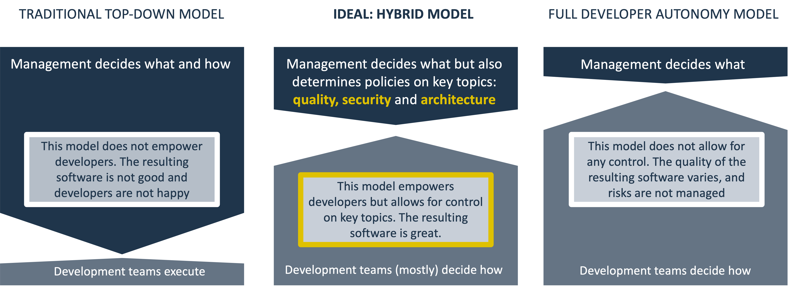
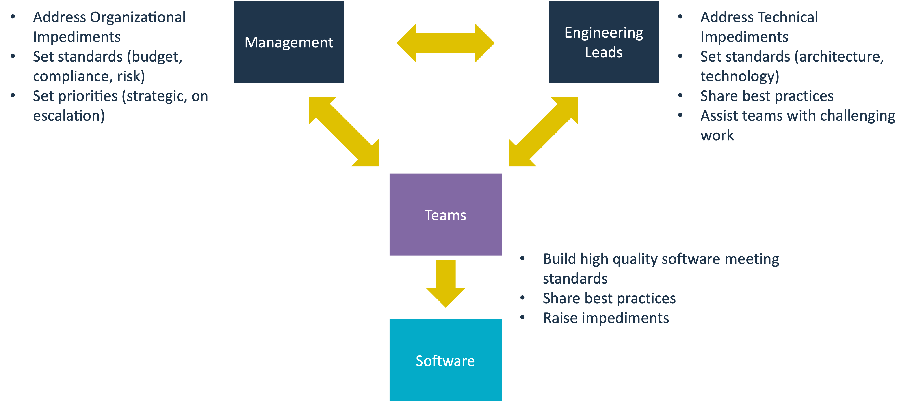

# Guidelines on how to organize for quality software

The purpose of this document is to provide concrete and actionable guidelines on how organizations should set themselves up to achieve high-quality software. While a lot of material is available on how to organize software development, most of it focusses on speed and alignment and mentions quality only in passing. Rather than adding yet another process framework, we identify four different stakeholder groups that are present in almost all organizations and describe what they are expected to do and what they should expect from each other in the quest for quality software. Our aim is for this to be complementary to existing process frameworks and we illustrate this for a couple of well-known ones.

## Four stakeholder groups in a hybrid model

Typically, nobody in an organization is opposed to building quality software. Rather, investing in software quality often loses out to other topics, typically adding features and fixing bugs. The shift that needs to take place is that organizations arrive at a way of working that allows for a fair competition to take place between feature work and technical improvements. 

Having consulted with many organizations, we have identified four stakeholder groups that need to be involved to make this shift and achieve high quality software, structurally. These are:
- Teams
- Engineering leads
- User representatives
- Management

Making the shift is not just a matter of 'the business should allow us to work on improvements instead of pushing for features'. There is a responsibility from teams and engineering leads to properly shape and quantify the work they think needs to be done so a fair assessment can be made. Also, teams need to accept the need for standards. In areas like security and legal, it is not practical or desirable for individual teams to assume full responsibility for these aspects. 

The picture below depicts the hybrid model that enables this shift. It aims to strike a middle ground between a top-down model that leaves teams with very little autonomy to address problems as they see fit, and the fully autonomous model where management has very little control even if that would benefit the teams.

### Who is in each group?

While our terminology is pretty generic, each organization is different and some mapping will need to be done to map the different groups to existing roles in an organization.

Of these groups, **teams** are typically the easiest to identify, because they exist as such. Note that in this model, we assume that operational concerns are covered in the teams (in other words, the teams are devops teams). If not, the operational concerns should be represented by the user representatives, such as a product owner.

The **User Representatives** consists of everyone who is in some way affected by what the software does, ranging from actual users to managers who are responsible for a process supported by the software and, not unimportantly, have to pay for it. Often, this group is referred to as 'the business' but we are not a fan of that term because especially in commercial organizations (often referred to as 'businesses') it suggests a certain hierarchy between the users and the technology organization that historically has not been helpful in achieving successful outcomes in general and high-quality software in particular.
Obviously it is not practical or desirable to involve the entire user organization in this process. Often, the user interests are represented by a product owner or project manager. 

**Engineering leads** are typically the hardest one to identify because it is the least established of the groups and exists in various forms and to varying degrees. Engineering leads are typically involved in (higher-level) solution design, technology choices or security analyses and policies. Job titles may include tech lead, team lead or architect. Engineering leads may exist within teams and organize virtually through Communities of Practice, Guilds or Chapters. In other cases, separate engineering lead roles or teams exist, such as enterprise architects, security specialists or Centers of Excellence. Elsewhere in the documentation we refer to engineering leads as architects. 

**Management** are the people whose main interest is that 'the whole thing works'. They facilitate the interaction between the different stakeholder groups and ensure that decisions are made and ties are broken. As such, they are found higher up in the hierarchy and since software quality is typically a technology concern, we primarily see technology managers in this role, like engineering managers, head of software development or sometimes a C-level role like a CTO. 

### The role of each group

The role of **teams** in the creation of high quality software is obvious: they actually create it. They have three main instruments to leverage their craftsmanship when it comes to creating quality software: peer reviews, tests that run in the pipeline (both functional and non-functional such as Sigrid CI) and hygiene features present in the IDE. The main inputs are quality requirements set by the team themselves, engineering leads and management, including objectives set in Sigrid. In reaching their quality goals, teams may identify impediments that they cannot address themselves (or that are not effectively/efficiently addressed by the team, such as a change to a shared repository that affects other teams as well). These are communicated to engineering leads or management for resolution. 

**Engineering leads** address engineering challenges that are bigger than a single ticket, may transcend teams and have the ability to significantly improve the quality of the software (or ensure that software-to-be-built is of high quality) but are not directly related to feature work. Examples include threat modelling and subsequent mitigations, major refactoring/rearchitecting, but also agreeing on standards for non-functional requirements and how to implement them. Inputs for this group can be concerns raised by teams that they cannot address themselves, standards that need to be met, operational problems (e.g. poor performance) or antipatterns spotted by engineering leads (team leads, tech leads, architects) themselves.

The **User Organization** often has a black-box view of technology: user needs go in, value-adding tech comes out while cost and risk need to be controlled. They want quality software as much as anyone else as long as it can be balanced against cost and organizational needs. They should be open to technical improvement ideas put forward by teams and engineering leads but also challenge them to articulate the cost/risk/benefits of their proposals.

**Management** facilitates all this, ensuring a structure exists in which stakeholder groups meet and can put forward their needs and concerns. They should also keep an eye out for concerns that may fall through the cracks, such as open source license risk, and involve relevant people such as a Head of Legal. They provide the escalation path for all stakeholder groups and remove impediments. 

### Towards a healthy engineering culture
There is no ISO standard that defines what a healthy engineering culture looks like, but from the perspective of software quality we find that a healthy engineering culture recognizes the importance of high-quality software and is able to strike a balance between feature work and technical improvements that is in line with the goals of the organization. In such a culture, the following can be observed:
- The User representatives and engineering leads remove impediments for teams, with Management providing an escalation path.
- The User representatives recognize the need for technical improvements in general and takes proposals into consideration.
- Teams and Engineering leads shape and quantify technical improvements so they can be taken in consideration.
- Management and engineering leads set (well-motivated) standards for teams but give them autonomy otherwise.
- Teams accept the need for standards and build software accordingly.

This picture shows the interactions and responsibilities of the different groups:

## Strategies to ensure technical improvements

For the different groups to understand their responsibilities in producing quality software is one thing, to ensure that technical improvements are indeed happening is another. In this section, we present some strategies that make technical improvements part of the regular workflow. These strategies are generically applicable in the sense that they can be applied in an existing development process, whatever that process might be. We have seen these strategies work for customers and/or used them ourselves. Also, you can mix-and-match strategies and switch strategies over time as you learn more or circumstances change.

In [another section](#embedding-technical-improvements-in-existing-process-frameworks), we discuss how to embed technical improvements in existing frameworks such as SAFe or SCRUM.

### Set objectives in Sigrid
Objectives can be considered a contract between the different groups. They express mutual expectations and allow groups to hold each other to account. A security lead can refer to them when teams do not upgrade vulnerable dependencies, but a team can do the same towards management to defend a refactoring proposal. [This page](best-practices-objectives.md) describes how to go about this.

### Team champions
Ideally, all team members would have a bias towards writing quality code. However, when quality hasn't been top of mind in the past and an organization is looking to turn that around, it helps to have a 'champion' in a team that has a certain level of seniority and can promote the cause of software quality in the team. Being part of the team gives them a credibility that is harder to obtain for people outside the team who may not understand team dynamics and appreciation for the other topics that are on the team's plate. Champions from different teams can form a virtual Software Quality team (as opposed to [a dedicated one](#a-dedicated-software-quality-team)), exchange experiences and help 'spread the word' in other parts of the organization. Champions are part of both 'teams' and 'engineering leads' groups, which can make them very effective in bridging any gaps. The downside of this is that the champions have to strike the right balance. If they get sucked into 'regular' team work too much, they may not be able to focus on quality enough. If they focus on quality too much, they may find themselves standing alone in the team, not pulling their weight to get things done.

### A hands-on tech lead
A hands-on tech lead is a person that oversees the technical state of a certain codebase and makes improvements themselves (the hands-on part). This person can be part of a team but can also work for multiple teams that share the same codebase. In the latter case, they might be part of a platform team.

The obvious advantage of this approach is that quality improvements will actually get done, as this person is by design relatively immune to feature pressure. In the case of a shared codebase, they mitigate the risk that no single team feels responsible for the technical state of the code. 

There are also disadvantages. Not all codebases are big or important enough to dedicate a person to the job of keeping them healthy. The person should operate in such a way that they are seen as enabling the team(s), as opposed to being seen as an impediment. To make this happen, they cannot fly solo but need to identify a technical improvement backlog with the team(s) and work with them from time to time. This requires a certain level of people skills in addition to technical skills which makes it a very senior role.

### A platform team
Platform teams *enable* non-platform teams (aka delivery/feature/stream-aligned teams) to deliver value. They do not typically work on the same codebase as non-platform teams, although they could, especially if multiple non-platform teams share a codebase (the [tech lead](#a-hands-on-tech-lead) could be in that platform team in that case). They can however help teams identify and make technical improvements by providing tooling, e.g. performance or code quality measurement tooling. Next, platform teams can play a big role in improving the developer experience (DevEx), e.g. by speeding up pipelines. Also, they can provide expertise in areas like databases, development pipelines and container orchestration.

### A dedicated software quality team
A dedicated software quality team enables development teams to build high-quality software. They have knowledge of all aspects of software quality, assist teams with improving the quality of their software and share best practices across teams. They can help set standards and report on compliance.
Advantages are clarity and centralization. Teams know where to go to get assistance or advice on the topic. Management knows where to get insights in organizational performance in this area. The flip side of these advantages is that having a dedicated team may cause people outside the team to feel less responsibility to pick up the topic of software quality and look at the team to 'fix things'. Since the team has no direct influence on software and is enabling in nature, that will not happen. Also in large organizations, the quality teams risk becoming too distant from the practice, and cannot provide enough practical guidance, resorting to general/theoretical advice and rules. Successful software quality teams often work with hands-on tech leads to instil a sense of ownership within the teams for quality standards.

### Set a target percentage
Teams can agree on a target percentage of their capacity that should be spent on technical improvements. This is an effective way to make sure technical work happens. The downside is that it does require some discipline in the team. A product owner (or whoever sets functional priorities) should respect an agreement even when under functional pressure. Team members should clearly articulate the work they want to do as part of that percentage as tickets on a backlog and not treat it as a 'do whatever' category.

### Applying the [boy scout rule](https://www.oreilly.com/library/view/97-things-every/9780596809515/ch08.html)
This is something you can (and should) always do. The main downside is that boy scouting only works for small, localized improvements. Bigger, more structural improvements need to be planned explicitly. If not, small functional changes may take a disproportional amount of time which can cause a team to unnecessarily be perceived as slow.

### Piggyback on features
Generally speaking, technical improvements, at some level, enable feature work to happen, or happen more quickly. In some cases, a clear connection can be made between a technical improvement and a desired feature: if we do technical improvement X first, developing feature Y will go faster. This can help 'sell' bigger technical improvements of which there is agreement that they need to be done at some point, but no agreement at which point exactly. 

The downside is that this may require careful stakeholder management, especially if the feature being piggybacked on is highly anticipated.

### Quality sprints
In a way, this is a version of the [target percentage](#set-a-target-percentage) strategy. But instead of setting a percentage and managing that as a going concern, a sprint (or another flavor of iteration) is used as a way to dedicate time to technical work. The advantage is that the whole team can focus on technical improvements and pick up bigger items.

The main disadvantage of this method is that it may create a 'moral hazard' in regular sprints, teams might focus exclusively on features (or feel forced to do so) under the assumption that any technical debt they may introduce is taken care of during the quality sprint.

A way to mitigate this is to not have a regular '1 out of X' cadence for quality sprints, but have the team decide on the need to have one based on the technical improvement backlog. This obviously requires a fair amount of team discipline and maturity.

## Embedding technical improvements in existing process frameworks
Organizations may have implemented a framework to organize their software development. While the [strategies presented](#strategies-to-ensure-technical-improvements) are universally applicable, it may help to explain how to organize for quality software within these process frameworks, using its concepts and jargon.

- [Agile/Scrum](../workflows/agile-development-process.md)
- Scaled Agile Framework (SAFe)
- Team Topologies
