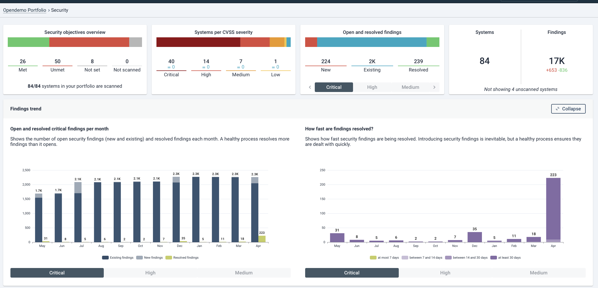
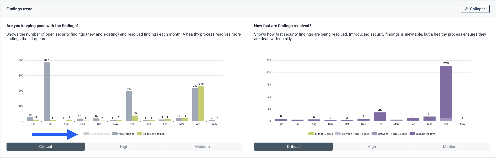

# Guidelines for managing Security across your portfolio

Effective security portfolio management is not just about identifying risks, it’s about taking strategic, coordinated 
action. By using Sigrid's dashboards, objectives, benchmarks, and process metrics, organizations can transform raw 
findings into meaningful insights. When teams are aligned, objectives are clear, and insights are shared through 
real-time communication. This makes security becomes a proactive, structured practice that supports both operational 
excellence and strategic goals.

## Key questions for managing software security

1. Am I in control of our security?
2. Are we moving in the right direction?
3. Are we working on the right things, and is it transparent to others?

This means governance is not just about identifying issues, it's about what you do with that knowledge, how you 
prioritize, and how you bring everyone along. That’s where Sigrid comes in.

> "Organizations often struggle to develop a cyber-risk management program that not only aligns with organizational 
> goals, but also provides stakeholders with practical tools, methodologies and mechanisms that can be seamlessly 
> integrated into their daily operations.” - Gartner

## Balancing new findings and security debt

Organizations often face the dual challenge of managing security debt and handling new security findings. Tools
often focus on *identifying* findings. This approach leads to high volume of issues, making it difficult to maintain
control. Therefore, managing findings requires a clear governance process.

- **Control over current security practices:** You need to establish a clear governance framework to steer and
  empower teams by setting clear expectations.
- **Control over security debt:** You need to continuously conduct a gap analysis between your current state and
  where you want to go, then translate this gap into improvement areas and a clear action plan. In contrast to 
  managing incoming *new* security findings, addressing *existing* security debt requires a more nuanced
  approach. Benchmarking security debt against industry standards is helpful to priortize remediation efforts.
  
Your responsibility is to show that you are not only aware of the problem, but that you’re actively managing it.
Knowing your security risks is one thing, but real improvement requires a plan to eventually mitigigate those risks.
In concrete terms, this means you'll need the following:

- You have specific, measurable **objectives** tied to your security strategy.
- Progress against these objectives is **tracked** and reported.
- Stakeholders (from developers to CISOs) are aligned and actively **engaged**.
- There's **transparency** into successes, delays, and decisions along the way.

## How does Sigrid help

- **Security Process Metrics:** Establish processes and enable teams to effectively manage and respond to new 
  security findings. Security process metrics assess the degree of compliance among teams with established standards, 
  providing insights into their adherence to security practices. By monitoring these metrics, organizations can 
  identify areas for improvement, enhance accountability, and foster a culture of security awareness within teams.
- **Security Benchmark:** Illustrate how the portfolio's security compares to the market. Understand that SAST 
  tools findings are incomplete by definition, and ratings are not evaluating risks. The goal is to get going: use 
  ratings as a thermometer measuring how mature is your refinement process, and how you compare to the market. Once 
  refinement is performed, quantify the severity of Security Debt.
- **Objectives:** Establishing clear objectives is crucial for effectively communicating policies and project goals to 
  teams. These objectives serve as guiding principles that align team efforts with organizational priorities, ensuring 
  everyone is working toward common goals. Additionally, well-defined objectives facilitate progress tracking, 
  enabling teams to measure their achievements and make necessary adjustments along the way.

You want to make sure people continuously think about security. You can use Sigrid integrations like
[Slack notifications](https://github.com/Software-Improvement-Group/sigrid-integrations/tree/main/slack-security-findings)
so that people are automatically notified of new findings. 
{: .attention }

### Security portfolio overview

The [portfolio overview page](../capabilities/portfolio-overview.md) offers a broad overview of your portfolio,
showing how your systems perform compared to the market. But to draw meaningful conclusions from this data, 
you need context. That context is defined by your [system metadata](../organization-integration/metadata.md).
Filtering and grouping your systems according to deployment type, business value, or teams, helps you to prioritize
the right actions:

- Are your most critical systems under control?
- Where do the highest risks or gaps exist?
- Where should improvement efforts be focused first?

### Security process metrics

The portfolio overview is powerful for quick assessments and spotting gaps in your security technical debt,
but it doesn’t tell the full story.

- How are these systems progressing over time?
- Are teams actively working toward objectives?
- How aligned are we with our goals?

To answer those questions, you need to go beyond surface-level scores—into objectives, trends, and actionable metrics.

The [security dashboard](../capabilities/portfolio-security.md) provides a more detailed portfolio-level view of 
your security posture, helping you understand where your systems stand in relation to defined objectives and 
industry best practices. It offers a structured way to move beyond raw findings and understanding what your teams 
are doing with these findings, and how good your processes around these findings are.

At a glance, you can see that all systems are being scanned, giving you full visibility across your portfolio. 
This is the foundation for meaningful governance. From there, the security objectives overview allows you to evaluate 
how many systems are currently meeting your defined standards, how many are falling short, and where no objectives 
have been set. This helps highlight gaps in your Vulnerability management governance coverage—whether due to 
non-compliance or simply missing expectations.

To support continuous improvement, the dashboard tracks open and resolved critical findings over time. It gives 
insight into whether your teams are resolving issues at a healthy rate, or whether problems are accumulating. 
A healthy trend will show more issues being resolved than introduced, signalling a mature and well-functioning process.
The resolution time panel allows you to assess how efficiently your teams are acting once issues are identified. 
It provides transparency into how long findings remain open before being addressed, which is a key indicator of 
operational responsiveness and process maturity.

Together, these panels provide not just data, but context. They help you answer critical questions like: 
Are we meeting our goals? Are we focused on the right areas? And are we improving? 
This view supports both high-level oversight and operational decision-making, making it a key component of your 
security governance toolkit.

### Deep dive into security findings

Tracking security objectives and security process are the cornerstones of a healthy security governance process.
But no process will be executed perfectly, so there will always be findings that slip through. The aforementioned
dashboards can help to identify which systems in your portfolio require additional attention. You can then use 
the [system-level security page](../capabilities/system-security.md) to triage the underlying findings, and determine
how to proceed. The consequences of those improvements should then result in improvements towards your security
objectives, closing the feedback loop.
