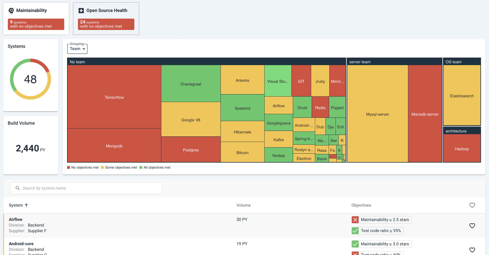

# Sigrid workflow for managers

As a software (portfolio) manager, you constantly need access to timely and accurate information about your software portfolio to be well-equipped to make the right decisions. At an average-size company, the software landscape involves many stakeholders spread over different teams, divisions, departments, and even vendors.

The dynamic portfolio dashboard in Sigrid provides you with insights to stay well informed about trends and changes in your software.

When all the application-related data is in place, Sigrid can help you directly pinpoint areas that need action. For newly onboarded systems you can get an indication of the current quality of the application at hand based on the baseline measurements. The next step is to set quality goals based on the system context, such as web accessibility (referred to as deployment type in Sigrid), business criticality and system life cycle. For existing applications, the trend measurement in Sigrid enables you to define team performance patterns that lead to specific actions to improve quality.

## Make sure the right taxonomy of your software portfolio is in place

The context of your software applications is important to set adequate quality goals and priorities for improvement actions. Make sure all systems’ metadata is added in Sigrid. In order to get to the information you need you should be able to put the quality changes in perspective. 
Track your software quality-objectives progress
Make sure quality objectives are in place for all systems. These should be set based on the quality norms adopted by your organization. Consider adjusting quality goals further, based on the system’s context, such as their business criticality.

## Pinpoint hotspot, areas of attention  

Make sure you are aware of the most important developments of your current software, and use this in your improvement plan. One scenario of doing so is the following:

- View systems with critical and high risk severity. Make sure you take the context of these systems into account. Think of web accessibility, business criticality and system lifecycle.
- Make sure 3rd party code management has your teams’ attention. Check systems with known vulnerabilities, weak version control, and possible license usage violations.
- Investigate unexpected quality changes in the maintainability scores, especially for the new and changed code quality.

## Prioritize improvement actions based on system context

The next step after getting the right insights is taking the right decision. Prioritize areas of improvement based on their urgency. For Security, Sigrid provides you with a dashboard of findings, mapped based on their exploitability and possible impact. For maintainability, the overview dashboard allows you to filter the most important systems, and pinpoint the areas of attention. A recommended approach for prioritizing improvement actions is the following:

- For security findings and known vulnerabilities in 3rd party libraries, prioritize based on systems web accessibility. Give public facing systems priority, then connected systems (communicate with public facing through a network).
- For maintainability findings, give business critical systems priority, for example, give extra attention to the trends and delivered work, and afterwards plan time and budget to resolve technical debt. The technical team should already have insights on possible actions after consulting the refactoring candidates list in Sigrid.
- Consider the system life cycle before planning any major investment. If the system is at the end of life it is not wise to work on its technical debt, but if it is a public-facing system, it is always important to keep it safe. 
