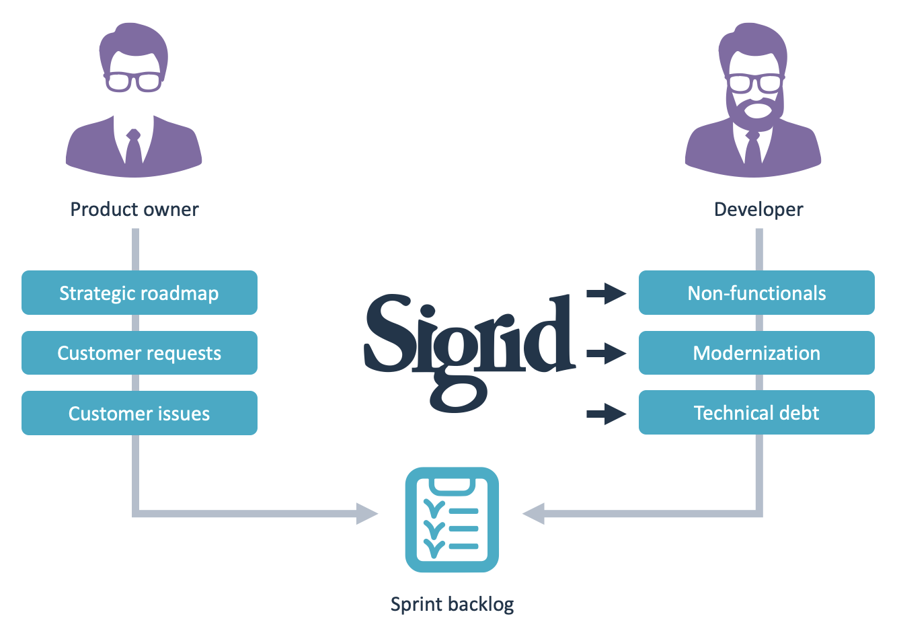

# Sigrid workflow for product owners

As a product owner, you face a constant challenge to prioritize your sprint backlog. On one hand, you represent the voice of the customer and need to delivery as much customer value as possible, every single sprint. But on the other hand, you are also working with your team to ensure the non-functional aspects (at least part of those can be defined as Objectives [see our page on setting Objectives](../capabilities/objectives.md)). If you would focus on adding functionality at the expense of everything else, your productivity would eventually slow to a crawl as developers get increasingly inhibited by technical debt. The forces at work in this process are described in [our page on Sigrid within the Agile development process](agile-development-process.md), and visualized roughly below.

Sigrid can help you balancing these aspects, by allowing you to define objectives for non-functionals (e.g. test code coverage, state of open-source libraries used, etc.), and then providing you with information that will help you to track progress towards those objectives as part of your process. 

## Define shared objectives and make them part of your Definition of Done

[Sigrid's objectives](../capabilities/objectives.md) allow you to define clear quality goals. These goals will help you to keep non-functionals top-of-mind: They reflect whether requirements are met, and allow for constructive feedback during sprint planning, daily stand-ups, and sprint reviews. This allows you to keep your product in great shape, all as part of your regular development process.

## Prioritize the issues that matter most

It is impossible to fix every single non-functional issue, especially if as a team you have been working on a system for years and some degree of technical debt has started to accumulate. The solution for addressing technical debt is twofold. 

First, let's focus on *preventing* introducing new technical debt. After all, it does not make sense to start fixing issues if the very next day you reintroduce a bunch of new ones. It will not be possible to prevent technical debt entirely (nor would it be an optimal efficient state), but at least you can try to control it. Adding [Sigrid CI](../sigridci-integration/development-workflows.md) allows you to use Sigrid's feedback during your code reviews, which makes this process explicit.

Preventing technical debt will help you in the long run, but it will not solve the existing problems. As said, solving them all is not possible, but we can prioritize the issues that have the biggest impact. You can use [Sigrid's *refactoring candidates* which is part of the maintainability overview](../capabilities/system-maintainability.md#refactoring-candidates), (or look specifically at [the section on prioritizing *refactoring candidates*](../capabilities/system-maintainability.md#dealing-with-refactoring-candidates)). [Sigrid's Code Explorer](../capabilities/system-code-explorer.md) to prioritize technical debt during your sprint planning. If you first need to analyze the situation at hand, follow the following [suggested steps described in the system maintainability page](../capabilities/system-maintainability.md#investigating-system-maintainability-rating-state-and--changes).

Such prioritization should help ensure that functional tickets and technical debt are balanced instead of competing with each other. For example, it does not make sense to combine functional changes in component A while only fixing technical debt in component B. Maybe component B has not been touched in years, so fixing technical debt over there is not going to make anyone's life any better. But if you combine work on a component with technical debt in that same component, you improve quality and also immediately create a benefit for the other people working on that component. 

Clearly, security is one of the system non-functionals that tend to have a large weight on system requirements. Context matters and therefore triaging and analyzing raw security findings in Sigrid tends to have both importance and urgency. See [our system security page](../capabilities/system-security.md) and [our Open Source Health page)](../capabilities/system-open-source-health.md).

## Report progress towards your objectives

[Objectives](../capabilities/objectives.md) are not only useful to the team, you can also use them to report progress to stakeholders outside of the team. To thom, concepts like software quality and non-functionals might be abstract wishes without immediate business benefit. That makes it hard to explain *why* you are choosing to prioritize such issues. [Sigrid's dashboards (system level)](../capabilities/system-overview.md) or [portfolio level](../capabilities/portfolio-overview.md) help you to evaluate changes to the overall quality of the system. This way you can tell whether you are on track to meet your objectives, or whether you need to pivot to prevent yourself from further trouble.

## Learn more about using Sigrid in an agile development process

Obviously, as a product owner you never work alone. Learn more about [how you can use Sigrid in your agile development process](agile-development-process.md), including concrete suggestions on how to use Sigrid's capabilities in your sprints and sessions. 
