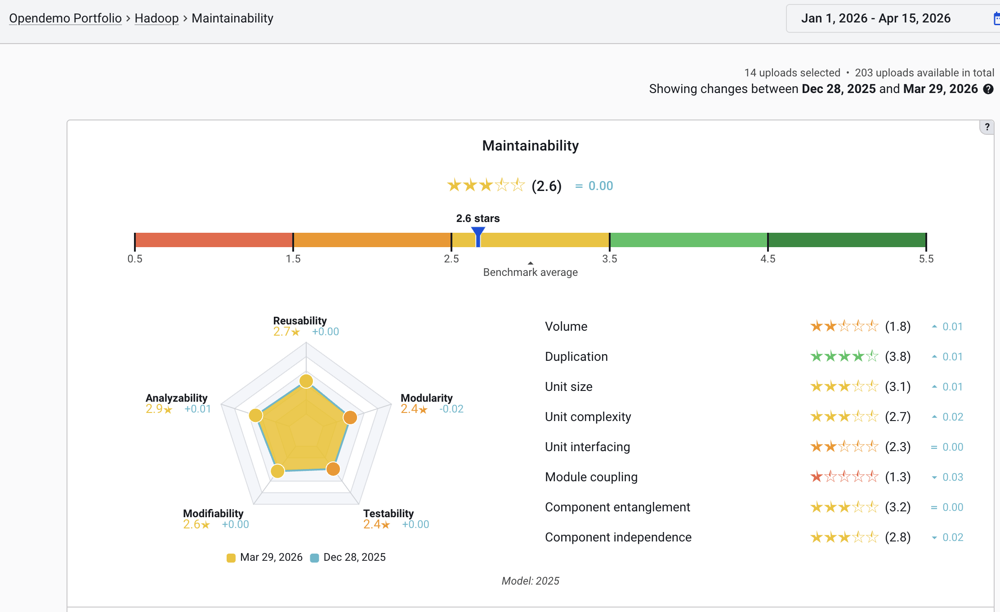

# SIG Guidelines for Tech Due Diligence: Interpreting Sigrid Results in Sigrid

## Introduction

This document serves as a guide to interpreting Software Improvement Group’s Sigrid software assurance platform measurement results, and reporting on findings presented in the platform.

Currently, this guide covers the following topics:

- Maintainability
- Open-Source Health

## ISO/IEC 25010 SIG/TÜV NORD CERT Maintainability

Sigrid measures maintainability using the SIG/TÜV NORD CERT Evaluation Criteria, which are based on the ISO 25010 quality standard. The goal is to assess how easy a system is to understand, change, test, and transfer to new developers.

The overall maintainability rating is expressed as a star rating from 1 to 5.

Below is an example Maintainability overview from the open-source system Hadoop.

### Key points

- The rating is always relative to the SIG benchmark — a database of thousands of real-world systems. A three-star system is not "bad"; it is in line with the market average. Four stars is the typical goal for new, modern systems.
- 5% of systems in the benchmark score one star, and 5% score five stars. Two-, three-, and four-star system categories each make up 30% of the benchmark. As such, five-star systems are rare and may not be desirable as this may indicate "gold-plating" (achieving high ratings with diminishing returns regarding practical benefits).
- Ratings are always truncated and then rounded to whole stars. Example: a system or system property rating of 3.4 stars would be ★★★☆☆. A rating of 2.7 is also ★★★☆☆. In dialogue, the first digit after the comma is often used to discuss trends over time and compare changes with earlier measurements.

### How to read Maintainability measurement results

This section is aimed at understanding the Sigrid measurement results from a technical perspective. It describes the meaning of the various metrics, and how these relate to the overarching ISO 25010 Maintainability model. This guide remains somewhat high-level. More details are referenced in the online [Quality model documentation](../reference/sig-quality-models.md).

#### Key measurement results

When reviewing results, focus on the following aspects mainly:

- **Overall Maintainability rating** – the main result and most aggregated view on the Maintainability assessment.
- **System property breakdown** – shows the breakdown of the overall Maintainability rating into separate System Properties. It shows the key areas of improvement. Note that a system with a fair rating can still have specific issues worth mentioning. A distinction should be made between three types of System Properties, namely:
  - **Duplication**. This is a system level property: operating at the system level. Results translate directly to system-level.
  - **Unit Size, Unit Complexity, and Unit Interfacing**. These are code level properties that apply to small, distinguishable pieces of source code (i.e., units) within the system. Examples are functions in Java or methods in C#. Results are weighted and aggregated in the final property rating.
  - **Module Coupling, Component Entanglement, and Component Independence**. These are architecture-level properties that apply to files (i.e., modules) and high-level components of the system. Again, results are collected at the appropriate level, weighted, and aggregated at system property level.
- Detailed descriptions of System Properties and rationale are available in the [Quality model documentation](../reference/sig-quality-models.md). 
- **Hotspots** – Assess components or files with the lowest scores. These are the most actionable findings. Sigrid makes abundant use of RAG coloring for components, metrics, and more, to indicate relative risk levels.
  - **Note** most measurement results are weighted according to code volume. Next to risk level, take the volume of involved code into account. E.g., a very small component with a red risk level might not be as impactful in practice as a large component with an amber risk level.
- **Technology risk** – At portfolio level, Sigrid has a section on Technology Risk. If technology is older generation, or uncommon, it may indicate lack of developer-, tooling- availability and modern productivity features.
- **Test code ratio** – Automated testing is a basic best practice nowadays but not always applied. Sigrid contains test code volume measurements to indicate the amount of test code compared to production code. These volume measurements are a good proxy for coverage. These metrics assume unit- and integration tests are being measured, as volume ratio measurements make sense at that test level. Higher-level tests (such as system tests, UI tests) do not apply to this metric. Coverage for those should be determined otherwise.
- **Volume** – The size of the system itself is an indicator for how much ongoing maintenance it needs. This can be correlated to team size to understand whether the team is properly staffed. It also indicates the overall severity of lower ratings. For instance, a one-star system of only 100 lines of code is not much harder to maintain than a five-star system of that volume. However, a system of 1 million lines of code will greatly benefit from higher maintainability ratings.

### Understanding System Properties

Maintainability is broken down into System Properties, each with their own star rating. Read the [SIG quality model documentation](../reference/sig-quality-models.md) to learn what these System Properties are and how they work.

An example interpretation and the questions to pose or answer with these System Properties is given below. Do note that for most metrics, Sigrid uses ‘cleaned’ lines of code, meaning that white lines, comments, brackets, etc. are excluded from volume counts.

#### Volume

The overall size of the codebase based on the number of lines of code. Larger systems are harder to maintain because more lines of code – trivially – require more effort to be maintained.

**Questions to ask:**

- Is the system larger than necessary?
- Is there dead code?
- Is there a way to split up functionality?
- Is there code in scope that is not maintained by hand?

#### Duplication

Based on the percentage of code that is copy-pasted or repeated literally. High duplication means changes must be made in multiple places. If that is not intended, the implementation should exist in one place only and be referenced wherever it is needed.

**Questions to ask:**

- Are there opportunities to refactor repeated logic?
- Is there any deliberate duplication (e.g., in microservices systems, some level of duplication is expected between decoupled services)?
- Are there any ongoing migrations causing temporary duplication?

#### Unit Size, Unit Complexity, and Unit Interfacing

Depending on technology, Sigrid determines the smallest possible executable pieces of logic to perform measurements on these bits of functionality. The metrics look at the length, the complexity, and the interface of each unit.

**Questions to ask:**

- Are there ways to split up large or complicated units into smaller bits of logic, to reduce the size of individual units?
- Is there any governance in place to monitor, alert, and/or block problematic units from being added to the system?
- Are there historical reasons for having introduced this kind of technical debt?

#### Unit Size

The length of a unit directly influences its maintainability through readability and other aspects. Larger units are harder to understand and to work with.

#### Unit Complexity

The amount of decision points can further complicate a unit’s understandability. A large unit by itself is not always an issue, but high complexity alongside lengthiness causes extra risk. All three unit metrics are typically correlated. Larger units tend to have more decision points, and bigger interfaces.

#### Unit Interfacing

Units, in most technologies, require certain inputs. These are called "parameters". Units take their input parameters, perform logic with these, and output results. Units with many parameters are harder to understand and use for developers working elsewhere in the system. They are also less reusable because having more parameters means higher specialization of a given unit.

#### Module Coupling

Communication in software systems occurs at various levels, including the file level (called "modules" in the SIG Maintainability model). High amounts of dependencies on a file/module make that module highly responsible for other parts of the system. It is a maintenance risk. There are good reasons to accept many incoming dependencies for certain files (e.g., for common functionality such as logging or authorization checks). However, it can also be a sign of a lack of division of responsibilities and other maintenance issues.

**Questions to ask:**

- Do modules with many incoming dependencies fulfil common functionality?
- Does it make sense that many areas of the system rely on these modules?
- Is there a strategy to keep strongly referenced modules as small as possible (a good rule of thumb is to strive for a maximum of 400 lines of code in such cases)?
- Could certain modules be split up to better divide responsibilities and make these modules more generically applicable?

#### Component Entanglement

When zooming out from the file level, at the level of components (larger chunks of functionality) a certain architectural structure is expected. This structure is based on the dependencies between the components, and it is ideally neatly organized, hierarchical, and in line with architectural documentation. A top-down, tree-like structure is often indicative of a clear, maintainable architecture, whereas a ‘spaghetti’-like structure shows architectural problems.

Component Entanglement assesses the dependencies in a system and punishes having too many dependencies and having certain anti-patterns.

Note that architectural metrics become more important the larger a system is and the more teams work on a system.

**Questions to ask:**

- Are dependencies in line with the designed architecture?
- Are there ways to reorganize the system to be more in line with the intended architecture?
- What design patterns can help reduce the risks shown by this metric?

#### Component Independence

Operating at the same level as Component Entanglement, the Component Independence metric checks how strong each of the dependencies in the architecture diagram is. The metric assesses to what extent components can communicate without spilling over details about each other’s implementation details.

Assume component A has a dependency on component B. Ideally, component A only knows how to ‘call’ component B and get back a result. Component A should not be aware of the implementation details inside B, that are required to obtain the result wanted by A.

Encapsulating - or shielding off - internal workings of a component goes a long way in being able to maintain and evolve that component in isolation without affecting other parts of the system.

**Questions to ask:**

- Do components have clear, thin interfaces to expose their functionality or data to other components?
- Do changes in one component often lead to changes in other components?

### Common Maintainability interpretation pitfalls

| Common pitfall | What you may state instead |
|---|---|
| The system rates 3 stars, so it's mediocre. | The system is at the benchmark average — Average is not necessarily bad. In fact, it may be fine for a system that is toward the end of its lifecycle, requiring less maintenance or innovation. |
| All properties are equally important. | It depends. Focus on the properties that rate the lowest. Take the system context into account. In some cases, certain metrics may score lower for good reasons. It should be possible to make up for this through other metrics to get a satisfactory overall Maintainability score. |
| A low score means the system will fail. | A low score indicates higher maintenance effort and probability of bugs — not immediate failure. |
| The score tells us everything. | The score is a signal. We need context: team size, system age, change frequency, business criticality. Maintainability is a core aspect, but there are other non-functional aspects at play too (e.g., Performance, Security, Reliability). |
| This is a complicated functional domain thus a lower score makes sense here. | The benchmark includes all kinds of domains. The Maintainability assessment is deliberately domain-agnostic. A complicated domain should be translated into maintainability software through careful technical design. We measure quality of software engineering, irrespective of domain. |

## Open-Source Health

Modern software systems often rely heavily on third-party, open-source libraries and frameworks to deliver functionality without reinventing the wheel. While this is a smart and efficient approach, it also introduces risks that need to be actively managed. That is exactly where Open-Source Health (OSH) in Sigrid comes in.

Sigrid's Open-Source Health module scans a system's third-party dependencies and assesses them across six risk categories:

- **Known Vulnerabilities**: Is the library affected by publicly known security vulnerabilities (based on CVE/CVSS data)?
- **Freshness**: How up to date is the library? The longer updates are delayed, the harder they become to apply.
- **License Usage**: Are the licenses of used libraries legally compatible with the system's intended use (e.g., avoiding restrictive licenses like AGPL)?
- **Activity**: Is the open-source community behind the library still active? An inactive project is unlikely to patch future vulnerabilities.
- **Stability**: Is the system relying on beta or alpha versions that may still contain bugs?
- **Dependency Management**: Are dependencies managed through a proper package manager (e.g., Maven, npm, NuGet), rather than manually copied into the codebase?

Sigrid identifies dependencies primarily through the configuration files of common package managers but also tries to identify libraries that are used without package managers, giving it a reliable and structured view of what a system is using.

Sigrid classifies findings in five categories of risks:

1. Critical Risks
2. High Risks
3. Medium Risks
4. unknown risks
5. No risks

In the case of vulnerabilities, for example, this classification is derived from the CVSS Severity that is assigned to the vulnerability.

### Open-Source health results interpretation

In the context of ITDD projects, OSH is a valuable tool for establishing third-party risk. The focus should be on the critical risks that are found, and the advice within an IT DD should center around what this means for the acquisition party:

- How many critical findings are there, and how widespread are they across the system and across the types of risk categories? This indicates whether the target company is in control and manages these risks or whether it is an oversight and there is a lack of maturity.
- What is the expected scope to fix the critical risks found? Most findings in vulnerabilities are easily resolved by updating to the latest version of the open-source library. Effort estimation and costs involved in those cases are low. However, usage of a licensed library that exposes IP might have a larger effect and can possibly not easily be replaced, needing more effort and investment in the future.

More specifically, per category the following guidelines can be provided to analyse the results and provide insights to the acquiring party:

- **Known Vulnerabilities**: Check the number of findings in the ‘critical risk’ category. These represent the vulnerabilities that are found in the open-source libraries that have a CVE score of 9.0-10.0. These represent direct possible threats and known exploits that should be rectified as soon as possible.
- **Freshness**: Check the top list of the freshness risks and compare the ‘outdated since’ and how many versions of a library have been released since. It is not a problem not to be on the latest versions, but being behind multiple versions or a large amount of time signifies a missing structural review of updates.
- **License Usage**: Check critical and high-risk categories for licenses that put restrictions on the source code of the target. This might mean that utilization of an open-source library legally requires the code that is using this library to be open-source as well. This is a risk for the IP and thus the value that an acquisition partner can hold to a target.
- **Activity**: Having many open-source libraries with low activity signifies either outdated technology usage or the lack of keeping up with the current abilities in the market. The context of the system will be important to look at here; if the target is looking to be at the forefront of the market, you will expect usage of new and often used libraries.
- **Stability**: Check this category of risks against the same context of the system and the team working on it. Are new things being tried out all the time? Then having alfa and beta try-outs of open-source libraries can be a good decision. However, this needs to be in balance with the full scope of open-source libraries in use and should not represent an overly large part of the used libraries.
- **Dependency Management**: Large amounts of manually copied and managed libraries in the codebase signify a higher effort and difficulty of identification of risks with these libraries. Best practice is to have modern tools in place to manage open-source libraries, so known problems can be rectified quickly and timely.

For further best practices around Open-Source, see SIG’s [Guidelines for healthy use of Open-Source](./best-practices-osh.md).

## Communicating Sigrid results to clients

When reporting and presenting results, ensure the technical measurements are translated to conclusions that are relevant to the assessment context. This section describes several contexts to consider. In general, keep at least the following in mind:

- **Benchmark context**: Compare to similar-sized systems in the benchmark.
- **Strengths**: Acknowledge what is going well.
- **Key risks**: Focus on two or three actionable findings, not everything at once.
- **Team**: Is the team moving in the right direction? Do team members have the right skillset and knowledge to improve? Do they acknowledge the findings?
- **Next steps** — Tie findings to concrete refactoring or process improvements

### Contexts

To interpret the Maintainability measurements correctly, and to provide sound advice, benchmark results need to be placed into context. Consider multiple angles. Important areas to consider are:

1. System context
2. Team context
3. Business or Domain context

Other aspects may be of importance too, depending on the case at hand. Maintainability measurements alone will not tell the whole story.

### System context

Each software system plays a certain role in an organization, has a history, and is in a certain phase of its lifecycle. Important contextual information about the system, most of which are captured in Sigrid too, is described below. Metadata captured in Sigrid is described in detail [in the metadata docs](../organization-integration/metadata.md).

These aspects are critical when reasoning about Maintainability and are relevant for other non-functional quality aspects too. These need to be considered, especially when providing advice.

### Team context

The team context is essential when interpreting Maintainability results. Maintainability is not only determined by the codebase itself, but also by the people who build, understand, and evolve it. Team composition, available knowledge within the team, and future staffing strongly influence how easily software can be maintained, improved, and governed.

Some things to consider:

#### Historical evolution of the team

Understand how the team has changed over time, as frequent turnover, rapid scaling, or long periods without stable ownership can affect code consistency, knowledge retention, and maintainability outcomes.

#### Parties involved

Consider the parties contributing to or depending on the system, such as external teams, teams in different geolocations, and external vendors, since shared ownership can complicate maintenance responsibilities and decision-making.

#### Knowledge risks

Assess where critical system knowledge resides and whether it is concentrated in a few individuals, because dependency on key experts increases continuity and maintainability risks.

#### Skills and competencies

As part of the Maintainability advice, evaluate whether the team has the technical skills and domain knowledge needed to maintain and improve the system effectively, especially in relation to the technologies, architecture, and quality issues identified.

#### Future team structure

Consider expected changes in team setup, capacity, sourcing, or responsibilities, since upcoming reorganizations or staffing changes can either strengthen or weaken the ability to sustain maintainability improvements.

### Business or domain context

Business and domain context is important when interpreting Maintainability results because the impact of maintainability issues depends heavily on what the system does, which business processes it supports, and how complex the domain is. Maintainability findings should therefore be assessed not only technically, but also in relation to business importance, domain complexity, and the operational reality in which the software is used.

Example: NASA uses software onboard of its spacecrafts, but also to put the cafeteria lunch menu on a screen. Both systems have completely different requirements when it comes to the technical quality of the code.

## Quick references

For deeper guidance, refer to the SIG Evaluation Criteria documentation and the Sigrid user manual:

- Software analysis and evaluation criteria: <https://www.softwareimprovementgroup.com/software-analysis/>
- [Sigrid user manual](../README.md)

## Star rating meanings

| Star rating | Meaning |
|---|---|
| ★★★★★ | Well above market average |
| ★★★★☆ | Above market average |
| ★★★☆☆ | Market average (benchmark median) |
| ★★☆☆☆ | Below market average |
| ★☆☆☆☆ | Well below market average |

---

This document is part of the SIG Partner Guidelines for Tech Due Diligence using Sigrid. For questions or feedback, please contact your SIG partner manager.