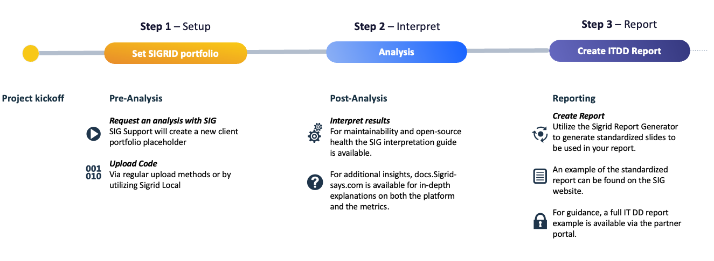

# SIG Guidelines for Tech Due Diligence

## Introduction

Sigrid enables users, usually consultancy partners, to deliver high-quality Tech Due Diligence assessments. This documentation contains guidance on how to run Sigrid, interpret the results, and create a report. At a high level there are three steps:

## 1. Setting up Sigrid (Local) and running an analysis
This guide assumes that you are using Sigrid Local for technical analysis, which means that an employee from the system under analysis will run the Sigrid Local tool, and send analysis results straight to Sigrid. Once the SIG partner/customer  requests a new analysis, a new ~portfolio~ will be set up by SIG support. The designated technical admin of the partner will receive access to the portfolio. 

Further instructions to run Sigrid Local analysis [can be found here](../organization-integration/sigrid-local.md).

Note that Sigrid also supports code uploaded via SFTP or web portal, but that usecase is out of scope of this guide.

## 2. Interpreting results

Once the analysis is done and results are available in Sigrid, you can use the [Sigrid interpretation guide](tech-dd-guide-interpretation.md) to help interpret the Maintainability and Open Source Health results. More in-depth information on the Sigrid platform and the metrics are available throughout this documentation site.

## 3. Reporting

To kickstart reporting, a PowerPoint report can be generated using the [Sigrid report generator](https://github.com/Software-Improvement-Group/sigrid-report-generator). This report generator will generate a standardized report, of which you can find an example on the SIG website. You can augment this to turn it into a full-fledged report in line with your own style and quality. An example of a full IT DD report can be found on the partner portal.

## Support

For technical support, reach out to SIG support. For questions on results interpretation, reach out to your partner contact at SIG.