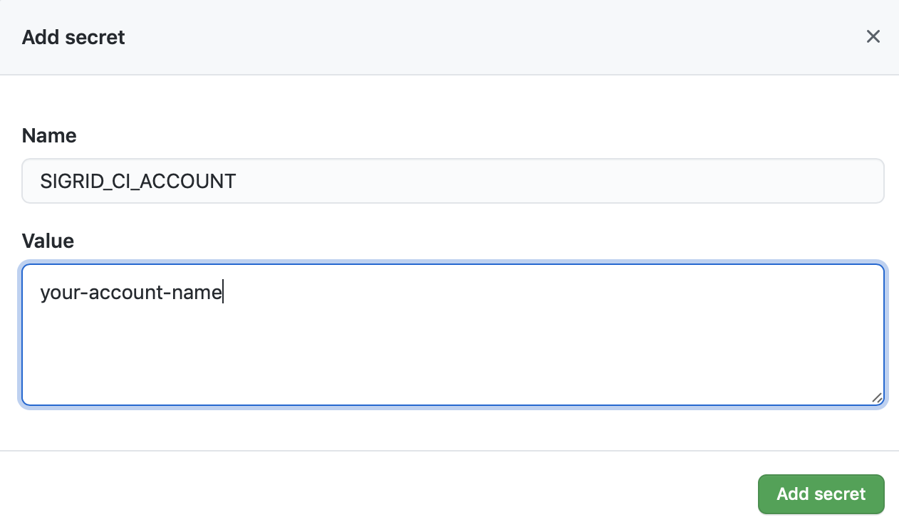
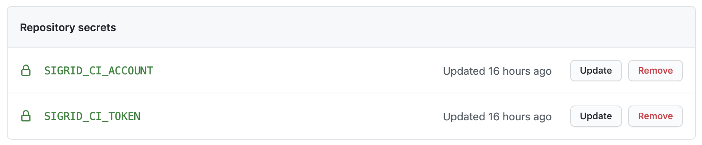
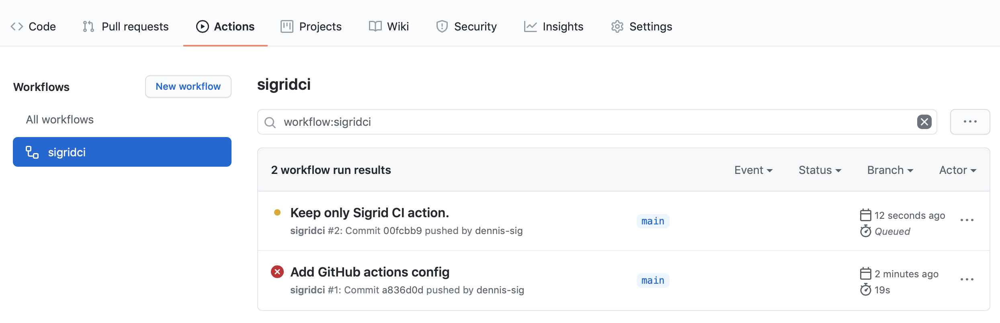
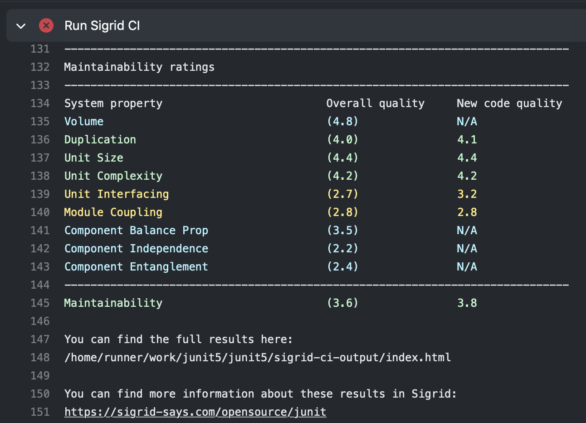
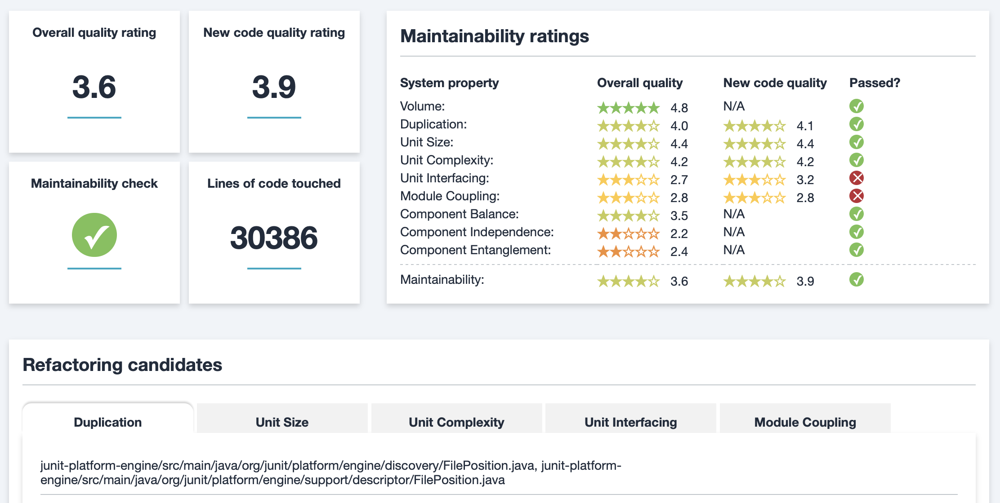
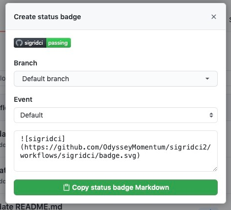
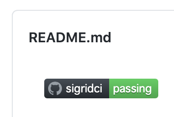

Integrating Sigrid CI with GitHub Actions
=========================================

This guide explains how to integrate Sigrid into your GitHub continuous integration pipeline, using GitHub Actions. Make sure you have also read the [general Sigrid CI documentation](README.md) before starting this guide.

## Prerequisites

- You have a Sigrid user account. Sigrid CI requires Sigrid, it is currently not supported to *only* use the CI integration without using Sigrid itself.
- You have on-boarded your system, i.e. your system is available in Sigrid. [Request your system to be added](mailto:support@softwareimprovementgroup.com) if this is not yet the case.
- [Python 3](https://www.python.org) needs to be available in the CI environment. The client scripts for Sigrid CI are based on Python.

## Request a Sigrid CI account

The account you use to submit code to Sigrid CI is different from your normal Sigrid user account. The account consists of an account name and a token, which you add to your CI environment's configuration in the next step. 

You can obtain a Sigrid CI account by requesting one from [support@softwareimprovementgroup.com](mailto:support@softwareimprovementgroup.com). Support for creating Sigrid CI accounts yourself will be added in a future version.

Once the account has been created, you can use Sigrid's user management feature to control which systems it is allowed to access. Similar to normal Sigrid user accounts, Sigrid CI accounts can either serve a specific system, a group of systems, or all systems in your portfolio.

## Configuration

**Step 1: Configure Sigrid credentials to environment variables**

Sigrid CI reads your Sigrid account credentials from two environment variables, called `SIGRID_CI_ACCOUNT` and `SIGRID_CI_TOKEN`. You can make these environment variables available to GitHub Actions by creating "secrets" in your GitHub repository:

- Open your project settings in GitHub
- Select "Secrets" in the menu on the left
- Use the "New repository secret" button
- Create a secret named `SIGRID_CI_ACCOUNT` with the account name you have received



- Add another secret named `SIGRID_CI_TOKEN` with the token you have received.
- Your repository secrets should now look like this:



This example explained how to add secrets for a single repository. However, if you have a GitHub organization with many repositories it can be cumbersome to repeat these steps for every repository. You can solve this by adding secrets to your GitHub organization. The process is the same as explained above, though you should access the "secrets" menu for your GitHub organization instead of the "secrets" page for the repository.


In this screenshot, the repository-level secrets and the organization-level secrets have been given different names, to make it easier to tell which is which.

**Step 2: Create a GitHub Actions workflow for Sigrid CI**

Sigrid CI consists of a number of Python-based client scripts, that interact with Sigrid in order to analyze your project's source code and provide feedback based on the results. These client scripts need to be available to the CI environment, in order to call the scripts *from* the CI pipeline. You can configure your GitHub Actions to both download the Sigrid CI client scripts and then run Sigrid CI. 

In your GitHub repository, create a file `.github/workflows/sigridci.yml` and give it the following contents:

```
name: sigridci
on: [push, pull_request]
jobs:
  sigridci:
    runs-on: ubuntu-latest
    steps:
      - name: Check out repository
        uses: actions/checkout@v2
      - run: "git clone https://github.com/Software-Improvement-Group/sigridci.git sigridci"
      - name: "Run Sigrid CI" 
        env:
          SIGRID_CI_ACCOUNT: "${{ secrets.SIGRID_CI_ACCOUNT }}"
          SIGRID_CI_TOKEN: "${{ secrets.SIGRID_CI_TOKEN }}"
        run: "./sigridci/sigridci/sigridci.py --customer examplecustomername --system examplesystemname --source . --targetquality 3.5"
      - name: "Save Sigrid CI results"
        uses: actions/upload-artifact@v2
        with:
          path: "sigrid-ci-output/**"
          retention-days: 7
```

This example assumes you're using the repository-level secrets. If you want to use the organization-level secrets instead, you can change the following lines:

```
SIGRID_CI_ACCOUNT: "${{ secrets.SIGRID_CI_ORG_ACCOUNT }}"
SIGRID_CI_TOKEN: "${{ secrets.SIGRID_CI_ORG_TOKEN }}"
```

**Security note:** This example downloads the Sigrid CI client scripts directly from GitHub. That might be acceptable for some projects, and is in fact increasingly common. However, some projects might not allow this as part of their security policy. In those cases, you can simply download the `sigridci` directory in this repository, and make it available to your runners (either by placing the scripts in a known location, or packaging them into a Docker container). 

Refer to the [GitHub Actions documentation](https://docs.github.com/en/actions/learn-github-actions/introduction-to-github-actions) for more information on when and how these actions should be performed.

The relevant command that starts Sigrid CI is the call to the `sigridci.py` script, which will call Sigrid CI. The script takes the following arguments:

| Argument        | Required | Example value | Description                                                                                         |
|-----------------|----------|---------------|-----------------------------------------------------------------------------------------------------|
| --customer      | Yes      | examplecustomername     | Name of your organization's Sigrid account. Contact SIG support if you're not sure on this. Value should be lowercase.         |
| --system        | Yes      | examplesystemname         | Name of your system in Sigrid. Contact SIG support if you're not sure on this. Value should be lowercase.                      |
| --source        | Yes      | .             | Path of your project's source code. Use "." for current directory.                                  |
| --targetquality | No       | 3.5           | Target quality level, not meeting this target will cause the CI step to fail. Default is 3.5 stars. |
| --exclude       | No       | /build/,.png  | Comma-separated list of file and/or directory names that should be excluded from the upload. This is on top of the existing scope file in Sigrid        |

Finally, note that you need to perform this step for every project where you wish to use Sigrid CI. Be aware that you can set a project-specific target quality, you don't necessarily have to use the same target for every project.

## Usage

To view all Sigrid CI results, check the "Actions" tab in your GitHub repository. Select "Sigrid CI" from the available actions in the menu on the left. This will give you a central overview of all Sigrid CI analyses:



The check will succeed if the code quality meets the specified target, and will fail otherwise. In addition to this central overview, you can also find the Sigrid CI indicator next to all commits:


Clicking the small indicator will show a pop-up with some more information:


Select "Details" to see the output from the Sigrid CI check:

Sigrid CI provides multiple levels of feedback. The first and fastest type of feedback is directly produced in the CI output, as shown in the following screenshot:



The output consists of the following:

- A list of refactoring candidates that were introduced in your merge request. This allows you to understand what quality issues you caused, which in turn allows you to fix them quickly. Note that quality is obviously important, but you are not expected to always fix every single issue. As long as you meet the target, it's fine.
- An overview of all ratings, compared against the system as a whole. This allows you to check if your changes improved the system, or accidentally made things worse.
- The final conclusion on whether your changes and merge request meet the quality target.

In addition to the textual output, Sigrid CI also generates a static HTML file that shows the results in a more graphical form. This is similar to test coverage tools, which also tend to produce a HTML report. You can download this HTML report from the "artifacts" section in the GitHub Actions page:


The information in the HTML report is based on the aforementioned list, though it includes slightly more detail.



Finally, if you want to have more information on the system as a whole, you can also access [Sigrid](http://sigrid-says.com/), which gives you more information on the overall quality of the system, its architecture, and more.

### Adding a Sigrid CI badge to your repository

Once you have used Sigrid CI for the first time, GitHub allows you to create a badge showing the current status. You can create the badge using the following steps:

- Click on "Actions" in your repository
- Select Sigrid CI in the menu on the left
- Use the "..." menu on the top right
- Select "Create status badge"


- Copy the Markdown code, and add it to your repository's README file



Your Sigrid CI badge will now appear in your project's home page.



## Contact and support

Feel free to contact [SIG's support department](mailto:support@softwareimprovementgroup.com) for any questions or issues you may have after reading this document, or when using Sigrid or Sigrid CI. Users in Europe can also contact us by phone at +31 20 314 0953.
